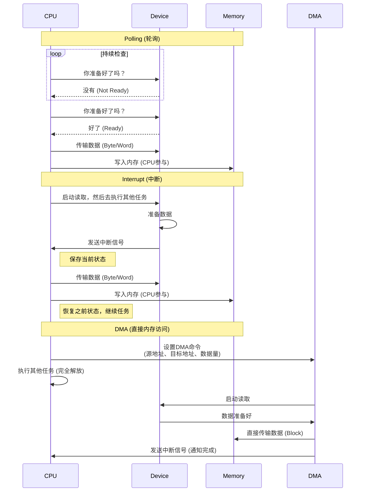

# L01 Intro


# L02 Number Representation

**反码（Ones' Complement）** 确实可以被称为 **“1的补码”**（注意英文中的撇号位置不同），而**补码（Two's Complement）** 则被称为 **“2的补码”**。这两种编码方式都属于**有符号数的机器数表示方法**

数制的表示：原码、1的补码、2的补码、unsigned（无符号）、Bios（偏移）

补码原码转换，加减法


# L03 C Intro - Basics

### 编译与解释

编译语言和解释语言之间存在显著差异。C语言是一种完全编译型语言，这意味着在运行程序之前，源代码必须被编译成机器码。相较之下，Python是一种解释型语言，源代码在运行时被逐行解释执行。Java则介于两者之间，先编译成字节码，再由虚拟机（JVM）解释或即时编译（JIT）执行。选择编译型语言的主要原因之一是为了性能优化，因为编译生成的机器码可以针对特定硬件进行优化，从而提供更高的执行效率。

### 编译过程的深入理解

编译过程通常分为三个主要步骤：编译（Compilation）、汇编（Assembly）和链接（Linking），简称**CAL**。这些步骤是生成可执行程序的关键过程：

0. **预编译preprocessing**

1. **编译**：将源代码转换为汇编代码。
2. **汇编**：将汇编代码转换为机器码（目标文件）。
3. **链接**：将多个目标文件和库文件链接在一起，生成最终的可执行文件。


### 优化编译时间与Make文件的作用

这部分讲解了通过适当的文件管理和使用Make文件来优化编译过程的方法。Make文件可以识别不同文件间的依赖关系，当某个文件被修改时，只重新编译依赖该文件的部分，而不是整个项目。这样做不仅减少了等待编译的时间，也提高了开发效率。例如，如果只修改了food.c文件，而bar.c文件没有变动，那么在编译时只需重新编译food.c相关的部分。


### 运行性能与编程语言的选择

讨论了为何在需要高运行性能的场景下，编译语言通常比解释语言更有优势。编译语言如C可以直接编译成针对特定硬件优化的机器代码，从而提供更高的执行效率。同时，也提到了Python在数据科学和大规模数据处理（如使用Spark）中的应用优势，因为它可以方便地调用分布式计算资源，并且能够通过Cython等工具调用C语言编写的底层库，这样结合了Python的易用性和C的性能优势。


### 编译的优点

1. 合理的编译时间

   ：由于编译过程中的增强功能（如 Makefiles），只需重新编译修改过的文件。

   - **Makefiles**：Makefiles 是一个自动化工具，可以根据文件的变化情况只重新编译那些发生改变的文件，而不是重新编译整个程序。这种方式不仅提高了编译效率，还节省了时间和计算资源。

2. 出色的运行时性能

   ：对于相同的代码，一般来说，C 的运行时性能比 Scheme 或 Java 更快，因为它针对给定的架构进行了优化。

   - **优化优势**：C 编译器在生成机器代码时，会针对具体的硬件架构进行优化，使得生成的代码能更高效地运行。这种优化是 Scheme 和 Java 这样的解释型或半编译型语言所无法比拟的。

   - 库的性能

     ：现代计算中，许多性能提升依赖于高效的库。虽然 Python 等动态语言在某些方面较慢，但它们通过调用高效的 C 库（例如 NumPy、SciPy）来弥补性能不足。

     - **科学计算**：许多科学计算使用 Python，是因为它有强大的库来处理 GPU 资源，以及简化并行计算和分布式计算的库（例如 TensorFlow 和 PyTorch）。
     - **调用低级 C 代码**：Python 可以通过 Cython 或直接调用 C 库来执行低级别的高效操作，从而提升性能。

### 编译的缺点

1. 编译后的文件（包括可执行文件）是架构特定的，依赖于处理器类型（如 MIPS vs. x86 vs. RISC-V）和操作系统（如 Windows vs. Linux vs. MacOS）。

   - 这意味着，编译生成的可执行文件只能在特定的硬件和操作系统上运行，如果更换了硬件或操作系统，就需要重新编译代码以适应新的环境。

2. 可执行文件需要在每个新系统上重建：

   - **移植代码**：当需要在不同的硬件或操作系统上运行程序时，必须重新编译代码，这被称为“移植代码”。这可能需要对代码进行修改以适应新的编译器或系统库。

3. “更改 → 编译 → 运行 [重复]”迭代周期在开发过程中可能很慢：

   - 在开发过程中，每次代码的修改都需要重新编译和运行，这个过程可能会比较耗时，尤其是对于大型项目。

   - **Make 工具**：Make 工具可以通过只编译发生变化的部分来加快编译过程，并且可以通过 `make -j` 选项并行编译多个文件。然而，链接器通常是顺序执行的，这意味着最终的链接过程仍然可能会比较慢。这受到阿姆达尔定律的限制，即在并行处理中的加速受限于必须串行执行的部分。

     > ### 阿姆达尔定律
     >
     > 阿姆达尔定律（Amdahl’s Law）是由计算机科学家吉恩·阿姆达尔（Gene Amdahl）提出的，它描述了并行计算中加速效果的极限。阿姆达尔定律指出，当我们试图通过增加处理器数量来提高程序性能时，程序中的串行部分将限制整体性能的提升。具体来说，假设程序的某部分可以并行化，而另一部分必须串行执行，那么即使无限增加并行处理器的数量，程序的加速比也是有限的。阿姆达尔定律的公式如下：
     >
     > 加速比
     >
     > 其中：
     >
     > - ( P ) 是可以并行化的程序部分的比例，
     > - ( N ) 是并行处理器的数量。
     >
     > 这意味着，即使并行化的部分很大，如果串行部分的时间占比很小，整体加速效果仍然会受到限制。


### C 预处理器（CPP）

1. C 源文件首先通过宏处理器 CPP，然后编译器才会看到代码：
   - **CPP 的功能**：CPP（C Pre-Processor）是一个文本替换工具，它会在编译之前处理源文件中的宏定义和其他预处理指令。
   - **注释替换**：CPP 会用一个空格替换掉代码中的注释，以确保注释不会影响编译过程。
   - 预处理指令：CPP 命令以 `#` 开头，这些命令包括文件包含（`include`）、宏定义（`#define`）、条件编译（`#if/#endif`）等。
     - `#include "file.h"`：将 file.h 文件的内容插入到当前文件中。
     - `#include <stdio.h>`：在标准位置查找并插入 stdio.h 文件。
     - `#define PI (3.14159)`：定义常量 PI，其值为 3.14159。
     - `#if/#endif`：有条件地包含或排除代码段。
   - **查看预处理结果**：使用 `--save-temps` 选项给 gcc 可以查看预处理的结果，这有助于调试和理解预处理过程。

### CPP 宏：警告

1. 你经常会看到 C 预处理器宏被定义为创建小“函数”：

   - 但它们并不是真正的函数，而只是改变了程序的文本。

   - 字符串替换：

     ```plaintext
     #define 
     ```

     **指令只是进行简单的字符串替换**，不进行任何类型检查或语法检查。例如：

     - `#define min(X,Y) ((X)<(Y)?(X):(Y))`：定义一个宏 min，用来求两个值中的较小值。

2. 这可能会产生有趣的错误，例如如果

   ```plaintext
   foo(z)
   ```

   有副作用：

   - 如果宏中包含的表达式具有副作用，例如 `foo(z)` 可能修改某些全局状态，那么使用宏可能会导致意想不到的行为。
   - 例如：
     - `next = min(w, foo(z));`
     - 展开后可能会变成：`next = ((w)<(foo(z))?(w):(foo(z)));`
     - 如果 `foo(z)` 有副作用，那么它可能会被执行多次，导致错误的结果或不可预测的行为。


### ANSI C的更新

C语言虽然是一种较老的编程语言，但通过不断的更新和改进，它仍然保持着与现代编程需求相符合的能力。与Java的比较显示了两种语言各有优势，但都在不断进化中寻求改善和优化。

#### 1. C99 标准

#### 2. C11 标准

1. 使用方式

   - 使用C11标准进行编译，可以使用以下命令：

     ```c
     gcc -std=c11
     ```

   - 检查C标准版本，可以使用以下代码：

     ```c
     printf("%ld\n", __STDC_VERSION__);
     ```

     输出 `201112L` 表示C11标准，`201710L` 表示C18标准（修复了一些C11的问题）。

2. 参考资料

   - 可以在 [维基百科C11](https://en.wikipedia.org/wiki/C11_(C_standard_revision)) 上找到更多关于C11标准的信息。

3. C11 标准的亮点

   - **多线程支持**：C11标准引入了多线程支持，增加了线程操作的标准库函数，例如 `thrd_create`、`mtx_lock` 等。

   - **Unicode 字符串和常量**：C11支持Unicode字符串和常量，增强了对国际化的支持。

   - **移除 `gets()` 函数**：由于 `gets()` 函数存在严重的安全问题，C11标准中移除了这个函数，推荐使用更安全的 `fgets()` 函数。

   - **类型泛型宏**：C11引入了类型泛型宏，根据类型进行分派的宏，例如：

     ```
     #define max(a, b) _Generic((a), \
                               int: max_int, \
                               float: max_float)(a, b)
     ```

     

   - **复数支持**：C11增加了对复数类型的支持，可以直接进行复数运算。

   - **静态断言**：引入静态断言功能，可以在编译时进行条件检查，提高代码的可靠性。

   - **独占创建和打开**：支持独占的文件创建和打开操作，增强了文件操作的安全性和原子性。


### C 语法：main 函数

1. 接受参数的 `main` 函数

   - 要使 `main` 函数能够接受命令行参数，可以使用以下定义方式：

     ```
     int main(int argc, char *argv[])
     ```

     

2. 参数解释

   - **argc**：`argc` 表示命令行参数的数量，包括程序本身的名称。例如，对于命令 `unix% sort myFile`，`argc` 的值为2。

   - **argv**：`argv` 是一个指向字符串数组的指针，每个元素都是一个命令行参数。程序名称通常是 `argv[0]`，后续的参数依次存储在 `argv[1]`, `argv[2]` 等位置。以下示例演示了如何处理命令行参数：

     ```c
     int main(int argc, char *argv[]) {
         for (int i = 0; i < argc; i++) {
             printf("Argument %d: %s\n", i, argv[i]);
         }
         return 0;
     }
     ```

**示例：**

```C
#include <stdio.h>

int main(int argc, char *argv[]) {
    printf("程序名: %s\n", argv[0]);
    printf("参数个数: %d\n", argc - 1);

    for (int i = 1; i < argc; i++) {
        printf("参数 %d: %s\n", i, argv[i]);
    }
    return 0;
}
```

#### **运行与输出**

假设编译后程序名为 `demo`，执行：

```
./demo hello world 123
```

输出：

```
程序名: ./demo
参数个数: 3
参数 1: hello
参数 2: world
参数 3: 123
```


### 整数：Python vs. Java vs. C

1. C 语言中的 int

   - 在C语言中，`int` 类型应该是目标处理器最有效处理的整数类型。

2. 唯一保证

   - **大小比较**：

     ```
     sizeof(long long) >= sizeof(long) >= sizeof(int) >= sizeof(short)
     ```

   - **short** 至少16位，**long** 至少32位，但所有这些类型可能在不同平台上都是64位。

3. 标准库建议

   - 为了便于跨平台开发，推荐使用标准库提供的定长整数类型，如 `int32_t`, `uint64_t` 等。这些类型在 `<stdint.h>` 中定义，确保了在不同平台上的一致性。

4. **不同语言的 int 类型大小**

| 语言   | sizeof(int)                               |
| ------ | ----------------------------------------- |
| Python | >=32 位（普通 `int`），无限制（长 `int`） |
| Java   | 32 位                                     |
| C      | 依赖于具体计算机，可以是16、32或64位      |

- **Python**：在Python中，`int` 类型没有固定大小，普通的`int` 至少32位，而长 `int` 大小是无限制的，取决于可用内存。
- **Java**：在Java中，`int` 类型固定为32位，这确保了代码在不同平台上的一致性。
- **C**：在C语言中，`int` 类型的大小依赖于具体平台，通常是16、32或64位。为了避免平台相关问题，使用定长整数类型（如 `int32_t`）是一个好习惯。


### C语言中的结构体（Structs）

1. Typedef

   - `typedef` 允许你==**定义新的类型名称**==，增加代码的可读性。例如：

     ```
     typedef uint8_t BYTE;
     BYTE b1, b2;
     ```


1. C 语言的编译和链接
   - **优点（速度）**：编译后的C程序直接运行在机器上，无需解释，执行速度快。
   - **缺点（编辑-编译周期缓慢）**：每次修改代码后都需要重新编译，这会增加开发时间，特别是在大型项目中。

1. Bohrbugs（可重复）与 Heisenbugs（随机）

   - **Bohrbugs**：这些错误是可重复的，每次执行时表现一致，通常比较容易调试和修复。

   - Heisenbugs

     ：这些错误是随机的，难以重现，在调试过程中可能消失或改变行为，非常难以调试。

     - **解释**：Heisenbugs 是指那些在调试过程中表现出不同行为的错误，而 Bohrbugs 则是那些始终表现一致的可重复错误。


# L04 C Intro:points, arrays, strings

1. **多个变量声明**

   ```
   int* p, q;
   int *p1, *p2;
   ```

   - `int* p, q;` 这行代码声明了两个变量：`p` 是一个指向 `int` 类型的指针，而 `q` 是一个普通的 `int` 类型变量。这可能会导致误解，因为看起来 `*` 是类型的一部分，但实际上它只是与 `p` 相关联。
- `int *p1, *p2;` 这行代码声明了两个指向 `int` 类型的指针变量 `p1` 和 `p2`。这种写法更清晰，表明了两个变量都是指针。


2. 声明与解引用的双重使用

- 声明：
  - `int *p;` 中的 `*` 表示 `p` 是一个指向 `int` 类型的指针。
- 解引用：
  - `*p = 5;` 中的 `*` 用于访问指针 `p` 指向的地址上的值，并将其修改为 `5`。


在 C/C++ 中，`void* p;` 声明了一个 **`void` 指针**（通用指针），它是一种特殊类型的指针

------

### **1. 基本定义**

- **`void*`** 是“无类型指针”，可以指向**任意类型的数据**（如 `int`、`char`、结构体等）。
- 它不关心指向的数据的具体类型，仅存储内存地址。

| **不能直接解引用** | 必须强制类型转换为具体指针类型后才能访问数据（如 `*(int*)p`）。 |
| ------------------ | ------------------------------------------------------------ |
| **隐式类型转换**   | 其他指针类型可自动转为 `void*`，但反向需显式转换。           |

### **2. 打印变量地址**

```c
int x = 3;     
int *p = &x; 

printf("Address of x: %p\n", (void*)&x);
printf("Pointer p points to address: %p\n", (void*)p);
```

- **`&x`**：获取 `x` 的地址（类型为 `int*`）。
- **`(void*)&x`**：将 `int*` 强制转换为 `void*` 类型。
  - **为什么需要转换？**
    `%p` 格式说明符要求参数是 `void*` 类型，而 `&x` 是 `int*`。虽然大多数系统上不同指针类型的二进制表示相同，但 C 标准要求类型匹配以避免未定义行为。
- **`%p`**：以十六进制格式打印指针地址（如 `0x7ffd42a1a3bc`）。


### 指针在传递参数时有避免复制的作用

### 参数按值传递

1. Java 和 C 都是按值传递参数：
   - 当一个过程/函数/方法获取参数时，它得到的是参数的副本。
   - 改变函数中的副本不会改变原始变量。

### 指针的优点

1. 传递大结构体或数组到函数：

   - 传递指针比复制大量数据更容易/更快。

   - 例如：

     ```
     void processLargeArray(int *array, int size);
     ```

2. 历史背景：

   - 在 C 语言发明时（20世纪70年代初），编译器并不高效。通过指针操作可以提升效率。
   - 现在的计算机速度快了10万倍，编译器也高效得多，但指针仍然用于低级系统代码和实现其他语言中的“传递引用”对象范式。

3. 指针使代码更简洁、更紧凑：

   - 使用指针可以**避免冗余的数据复制**，使得代码更为高效。

### 指针的缺点

1. 指针是 C 语言中最大的问题来源：

   - 动态内存管理时问题尤其严重。
   - 例如：悬挂引用和内存泄漏。

2. **示例：悬挂引用**

   ```
   int *ptr = malloc(sizeof(int));
   *ptr = 5;
   free(ptr);
   *ptr = 10; // 悬挂引用，危险操作
   ```


### 指向不同数据类型的指针

#### 指针可以指向任何数据类型

1. 指针用于指向任何数据类型

   - **示例**：

     ```
     int *xptr;
     char *str;
     struct llist *foo_ptr;
     ```

   - 指针的基本功能是存储某种数据类型的变量的地址，通过指针可以访问或修改该地址上的数据。

2. 通常，一个指针只能指向一种类型

   - 泛型指针 `void *`：

     - `void *` 是一种特殊类型的指针，可以指向任何类型的数据（称为泛型指针）。

     - 使用 `void *` 需要谨慎，因为它容易导致程序错误和安全问题。

     - **示例**：

       ```
       void *ptr;
       int x = 10;
       ptr = &x; // ptr 可以指向 int 类型
       ```

3. 函数指针

   - 指针不仅可以指向数据，还可以指向函数。

   - **示例**：

     ```
     int (*fn) (void *, void *) = &foo;
     // fn 是一个函数指针，指向接受两个 void * 参数并返回 int 的函数 foo
     (*fn)(x, y); // 调用函数 fn
     ```

   - 解释：

     - `int (*fn) (void *, void *)` 声明一个函数指针 `fn`，它指向一个接受两个 `void *` 参数并返回 `int` 的函数。
     - `(*fn)(x, y)` 使用函数指针调用函数。


1. NULL 指针的测试

   - 因为 “0” 被视为假，所以很容易测试指针是否为 NULL。

   - **示例**：

     ```c
     if (!p) {
         // p 是一个 NULL 指针
     }
     if (q) {
         // q 不是 NULL 指针
     }
     ```


### 处理指针（Handling Pointers）

#### 如何让函数改变指针指向的位置？

#### 错误的做法

1. 假设我们希望 `increment_ptr` 函数改变指针 `q` 指向的位置

   - 示例代码：

     ```c
     void increment_ptr(int32_t *p) {
         p = p + 1;
     }
          
     int32_t arr[3] = {50, 60, 70};
     int32_t *q = arr;
     increment_ptr(q);
     printf("*q is %d\n", *q);
     ```

   - 预期结果：`*q` 的值是 60。

2. 为什么这不工作？

   - `C` 语言中**参数传递是按值传递**的。
   - 当我们调用 `increment_ptr(q)` 时，传递的是 `q` 的值（即指向 `arr` 的地址 `0x100`），而不是 `q` 本身。
   - 在 `increment_ptr` 函数内部，改变的是 `p` 的值，这只是 `q` 的副本，并不会影响到 `q` 的实际指向。
   - 因此，`q` 仍然指向 `arr[0]`，所以 `*q` 的值仍然是 50。

#### 正确的做法

1. 记住：C 语言是按值传递的

   - 要让函数改变指针指向的位置，需要传递一个指向指针的指针（”handle”）。
   - 声明为 `data_type **h`。

2. **示例代码**

   ```c
   void increment_ptr(int32_t **h) {
       *h = *h + 1;
   }
      
   int32_t arr[3] = {50, 60, 70};
   int32_t *q = arr;
   increment_ptr(&q);
   printf("*q is %d\n", *q);
   ```

3. 解释

   - `increment_ptr(&q)` 传递的是 `q` 的地址，即指向 `q` 的指针。
   - 在 `increment_ptr` 函数内部，`h` 是一个指向指针的指针，通过 `*h` 访问 `q` 本身。
   - `*h = *h + 1;` 将 `q` 的值（指向 `arr[0]` 的地址）加 1，使其指向 `arr[1]`。
   - 因此，`q` 现在指向 `arr[1]`，所以 `*q` 的值是 60。


- ### 内存对齐的必要性

  1. 什么是内存对齐（Memory Alignment）
     - 内存对齐指的是将数据存储在特定的内存地址上，这个地址是数据大小的整数倍。对齐的目的是提高内存访问的效率。
     - 对齐的好处：
       - 对于对齐的数据，处理器可以一次性读取整个数据，而不需要多次内存访问。
       - 未对齐的数据可能需要处理器进行多次内存访问，从而降低性能。
  2. 内存对齐的规则
     - 不同的数据类型有不同的对齐要求：
       - 4字节（32位）的数据类型（如 `int` 和 `float`）通常对齐到4字节边界。
       - 2字节（16位）的数据类型（如 `short`）通常对齐到2字节边界。
       - 1字节（8位）的数据类型（如 `char`）可以存储在任何地址上。

#### **2. 对齐规则（以典型 32/64 位系统为例）**

- **基本类型对齐**：
  - `char`（1 字节）：任意地址
  - `short`（2 字节）：地址 % 2 == 0
  - `int`/`float`（4 字节）：地址 % 4 == 0
  - `double`/`long long`（8 字节）：地址 % 8 == 0
  - 指针（4/8 字节）：按指针大小对齐
- **结构体对齐**：
  - 成员按自身大小对齐，结构体总大小为最大成员大小的整数倍。
  - 编译器可能插入填充字节（Padding）满足对齐。

**示例**：

```c
struct Example {
    char a;      // 1字节（地址0）
    // 填充3字节（地址1-3）
    int b;       // 4字节（地址4-7）
    double c;    // 8字节（地址8-15）
};               // 总大小=16字节（8的倍数）
```

- **对齐原则**：数据地址 = `N × sizeof(data_type)`（N为整数）。
- **默认行为**：编译器自动对齐，但可通过指令调整。

#### **为什么需要内存对齐？**

- **硬件效率**：CPU 通常以固定字长（如 4/8 字节）访问内存，未对齐的数据可能导致多次内存访问或硬件异常。
- **性能优化**：对齐后减少内存碎片，提高缓存命中率。
- **跨平台兼容性**：不同硬件（如 ARM、x86）对未对齐访问的容忍度不同，对齐确保可移植性。


### 结构体（Structures, Revisited, Again）

#### 结构体的定义和布局

1. 什么是结构体

   - **结构体（struct）实际上只是一个指示C语言如何安排一组字节的指令。**
   - 结构体为数据提供足够的空间，并且C语言会用填充（padding）对数据进行对齐。

2. **示例结构体**

   ```
   struct foo {
       int32_t a;
       char b;
       struct foo *c;
   };
   ```

   

3. 结构体的实际内存布局

   - 在32位架构上，这个结构体的实际布局如下：

     - `int32_t a` 占用4字节。
     - `char b` 占用1字节。
     - 随后有3字节的填充，使得下一个成员对齐到4字节边界。
     - `struct foo *c` 占用4字节。
     - 总大小为12字节。

   - **示例图示**

     ```
     |   a (4 bytes)  | b (1 byte) | padding (3 bytes) |   c (4 bytes)  |
     ```

     

4. 内存对齐的必要性

   - 字对齐确保数据在内存中的高效访问。处理器更倾向于在对齐的地址上读取数据，这样可以减少访问内存的次数，提高性能。

> 在 C++ 中，**类和结构体（class 和 struct）都遵循内存对齐规则**
>
> - **成员对齐**：每个成员变量的起始地址必须满足其自身大小的对齐要求（如 `int` 需 4 字节对齐）。
> - **整体对齐**：类/结构体的总大小必须是其**最宽成员**对齐值的整数倍，编译器会自动插入填充字节（Padding）以满足要求。


### 调试时注意字节序（Endianness）

### **1. 什么是字节序？**

字节序指的是 **数据在内存中存储的字节顺序**。比如一个 4 字节的整数 `0x12345678`，它的存储方式有两种：

#### **(1) 小端序（Little Endian）**

- **规则**：**低字节在前**（低地址存低位数据）。

- **示例**：

  ```
  值：0x12345678
  内存地址：0xFF 0xFE 0xFD 0xFC
  存储内容：0x78 0x56 0x34 0x12  ← 低字节0x78在低地址0xFF
  ```

- **常见机器**：x86/x64（Intel/AMD CPU）、ARM（默认小端）。

#### **(2) 大端序（Big Endian）**

- **规则**：**高字节在前**（低地址存高位数据）。

- **示例**：

  ```
  值：0x12345678
  内存地址：0xFF 0xFE 0xFD 0xFC
  存储内容：0x12 0x34 0x56 0x78  ← 高字节0x12在低地址0xFF
  ```

- **常见机器**：PowerPC、网络协议（如TCP/IP）、某些嵌入式设备。


### 扩展

**函数指针的使用**

- 函数指针是指向函数的指针，可以用于调用函数。函数指针使得我们可以将函数作为参数传递给其他函数，从而实现更加灵活和可复用的代码。
- 在 `mutate_map` 函数中，`int(*fp)(int)` 表示一个接受一个整数并返回一个整数的函数指针。

**函数指针的声明和使用**

- 函数指针的声明方式与普通指针类似，只不过指向的是函数。

  ```
  int (*fp)(int);
  ```

- 使用函数指针调用函数时，可以使用 `(*fp)(参数)` 形式，也可以直接使用 `fp(参数)` 形式。

**函数指针的实际应用**

- 函数指针常用于实现回调函数、事件处理器、以及策略模式等。通过函数指针，可以动态选择不同的函数进行调用，而不需要在编译时决定具体调用哪个函数。


# L05 C Memory Management

### C Program Address Space

### 程序的地址空间包含 4 个区域

1. **栈（Stack）**：函数内部的局部变量，向下增长。栈用于存储函数调用中的临时变量和返回地址。当函数被调用时，会在栈上分配空间，当函数返回时，这些空间会被释放。
2. **堆（Heap）**：通过 `malloc()` 请求的空间，动态增长，向上增长。堆用于动态分配内存，程序员需要显式地分配和释放这些内存。如果忘记释放，会导致内存泄漏。
3. **静态数据（Static Data）**：在 `main` 函数外部声明的变量，不会增长或缩小。这些变量在程序的整个生命周期内存在，并在程序开始时分配空间。
4. **代码（也叫文本）（Code/Text）**：程序启动时加载，不会变化。代码段包含了程序的可执行指令，这部分内存通常是只读的，防止程序意外修改自己的指令。

- **0x00000000** 部分是不可写/不可读的，因此在访问 `NULL` 指针时会崩溃。这种保护机制帮助捕捉对无效指针的访问。


### 变量的分配位置

- **函数外部声明（全局变量）**，分配在**静态存储**中。全局变量在程序启动时分配，并在程序结束时释放。它们在程序的整个生命周期内都存在。

- 函数内部声明（局部变量）

  ，分配在

  栈

  中，函数返回时释放。局部变量的生命周期仅限于函数的执行期间，当函数结束时，栈上的空间会被释放。

  - `main()` 也是一个函数，因此 `main` 中声明的变量也是局部变量，分配在栈上。

对于这两种存储类型，管理是自动的：

- 不需要担心手动释放不再使用的变量。静态存储和栈的内存管理由编译器和运行时环境自动处理。
- 但是，一旦函数结束，变量就不再存在。对于局部变量，函数结束后，它们所占用的栈空间会被释放。

```c
int myGlobal; // 静态存储，全局变量
main() {
    int myTemp; // 栈，局部变量
}
```


### **栈**

每当一个函数被调用时，就会在栈上分配一个新的“栈帧”。

- 栈帧

  包括：

  - 返回“指令”地址（谁调用了我？）
  - 参数
  - 其他局部变量的空间

栈帧是连续的内存块；**栈指针**指示栈帧的起始位置。

- 当函数结束时，栈帧从栈上被移除；释放内存以供将来栈帧使用。栈帧的管理通过栈指针和基址指针（如在 x86 体系结构中）或仅通过栈指针（如在某些 RISC 体系结构中）进行。


### Passing Pointers into the Stack

**将指针传递到栈中**

将指针传递到更深的栈空间是可以的。

- 例如：

```c
#define BUFLEN 256
int main() {
  char buf[BUFLEN];
  load_buf(buf, BUFLEN);  // 将指针buf传递给函数load_buf
}
```


在这个例子中，`buf`是一个长度为256的字符数组，在`main()`函数中定义，并传递给`load_buf()`函数。这样做是安全的，因为`buf`在`main()`的栈帧中有效，直到`main()`函数返回。

**但是，将指针返回到栈中的某个东西是灾难性的！**

内存将在其他函数被调用时被覆盖！

- 例如：

```c
char *make_buf() {
  char buf[50];
  return buf;  // 返回局部变量buf的指针
}
int main() {
  char *stackAddr = make_buf();  // stackAddr指向已被覆盖的内存
  foo();
}
```

在这个例子中，`buf`在`make_buf()`函数结束时会被销毁，因此返回`buf`的指针是无效的，可能导致内存被其他函数调用时覆盖，导致程序崩溃。返回指向局部变量的指针会导致未定义行为，因为局部变量的生命周期在函数返回时结束。


# L06 Floating Point

### “Fixed Point” Binary Representation

### “定点”二进制表示法

**“二进制点”（Binary Point）** 类似于小数点，用于区分整数部分和小数部分。

**6位表示法示例**，仅正数：

- 101010 表示为 1 0 . 1 0 1 0
  - 计算方式：

**使用上述6位“固定二进制点”表示法的范围：**

- 范围：0 到 3.9375
  - 计算方式：\(11.111_2 = 3.9375\)，即 \( 4 - 2^{-4} \)


### Floating Point

### 浮点数

**“浮动二进制点”（floating binary point）** 是一种有效利用有限位数的方法，提高了数字表示的准确性和范围。

**示例：**

- 假设我们要表示 0.164062510。
- 二进制表示：… 000000.001010100000…
  1. 存储这些“有效位”（significant bits）。
  2. 记录最高有效位（MSB）左侧 2 位的二进制小数点（“指数字段”）。

**二进制点** 独立于有效位存储，因此可以表示非常大和非常小的数字。通过分离有效位和指数，我们可以动态调整二进制点的位置，从而扩展表示范围。


**如果数字超出此范围会怎样？**

- **太大：上溢（overflow）**。值的大小太大，无法表示，会被表示为±∞。
- **太小：下溢（underflow）**。值的大小太小，无法表示，接近于零。

### Representation for ±∞

### ± ∞ 的表示

**在浮点数中，除以±0应产生±∞，而不是上溢。**

**为什么？**

- 可以使用∞进行进一步计算。例如，X / 0 > Y 可能是有效的比较。
- 问数学专业的同学，∞在计算中有实际意义。

......


# Lecture 7: Intro to Assembly Language, RISC-V

# Lecture 10: Intro to Assembly Language, RISC-V

在 C 语言中，**堆栈指针（Stack Pointer）在添加数据时递减**，这是由计算机体系结构的设计和内存管理策略决定的。主要原因包括以下几点：

------

### **1. 历史原因与硬件设计**

- **传统内存布局**：
  早期的计算机系统（如 x86、ARM）通常将栈（Stack）放在**高地址**，堆（Heap）放在**低地址**，中间是未分配的内存空间。
  - **栈向下增长**（向低地址扩展），**堆向上增长**（向高地址扩展）。
  - 这样设计可以避免堆和栈的内存冲突（如果两者相向增长，可能会发生覆盖）。
- **栈指针（SP）的初始位置**：
  - 栈的起始位置（栈顶）通常是一个较高的内存地址（如 `0xFFFF0000`）。
  - 每次 **`push` 数据时，栈指针递减**，指向新的可用空间。

------

### **2. 栈的操作方式（PUSH/POP）**

- **`PUSH` 操作**（压栈）：

  - 栈指针 **先递减**，再写入数据（`SP -= sizeof(data)`）。

  - 例如，在 x86 架构中：

    asm

    ```
    push eax   ; 等价于：
    sub esp, 4 ; 栈指针减 4（32位系统）
    mov [esp], eax ; 数据存入栈顶
    ```

- **`POP` 操作**（弹栈）：

  - 先读取数据，再 **递增栈指针**（`SP += sizeof(data)`）。

  - 例如：

    asm

    ```
    pop eax    ; 等价于：
    mov eax, [esp] ; 读取栈顶数据
    add esp, 4 ; 栈指针加 4
    ```


# Lecture 1？

### **1. 先明确核心概念**

- **触发器（Flip-Flop）**：能存储 **1 bit** 数据的电路，是数字电路中最小的存储单元。
  - 例如：D触发器、JK触发器。
- **寄存器（Register）**：由 **多个触发器并列组成**，用于存储 **多位数据**（如8位寄存器=8个D触发器）。

------

### **2. 看似矛盾的表述如何理解？**

#### **(1) “触发器由寄存器构成” ❌ 其实是误解！**

- **正确说法**：触发器是寄存器的**基本组成单元**，而不是反过来。
- **类比**：
  - 触发器 → 砖块
  - 寄存器 → 由砖块砌成的墙

#### **(2) “寄存器由触发器构成” ✅ 这才是正确的！**

- 例如：一个8位寄存器 = 8个独立的D触发器并行工作，共享同一个时钟信号。

- **Verilog代码示例**：

  verilog

  ```
  reg [7:0] my_register; // 8位寄存器，实际综合为8个D触发器
  ```

------

### **3. 为什么会有混淆？**

- **术语滥用**：
  - 有时工程师会模糊地说“寄存器”代指“触发器”（因为寄存器本质是触发器的集合）。
- **层次化设计**：
  - 在高层设计中，我们直接调用“寄存器”（如CPU的通用寄存器），但底层实现仍依赖触发器。


### **D触发器（D Flip-Flop）内部结构详解**

D触发器是最常用的时序逻辑单元，其核心功能是**在时钟边沿（上升沿或下降沿）捕获输入信号D的值，并保持到下一个时钟边沿**。它的内部结构可以分为两类实现方式：

#### **1. 基本D触发器的结构（基于SR锁存器）**

D触发器通常由两个**SR锁存器（交叉耦合的门电路）**级联构成，分为**主锁存器（Master）**和**从锁存器（Slave）**，因此也称为 **主从D触发器（Master-Slave D Flip-Flop）**。

#### **2. 边沿触发的D触发器（更常见的现代实现）**

现代集成电路中，D触发器通常采用更高效的 **传输门（Transmission Gate）** 设计，直接实现边沿触发，无需主从结构。


> 锁存器内部也是门电路吗？也就是说即使是state circuits这种存储功能的电路也是由纯门电路这种最基础的构成的吗

### **锁存器（Latch）和状态电路（State Circuits）的本质：门电路的组合**

你的理解完全正确！**锁存器（Latch）和所有状态电路（如触发器、寄存器）本质上都是由最基础的门电路（如与非门、或非门）构成的**。即使是能存储数据的“状态电路”，其底层仍然是纯组合逻辑门通过特定方式连接实现的。以下是详细解释：

---

#### **1. 锁存器的内部结构（以SR锁存器为例）**
锁存器是最简单的存储单元，能保存1 bit数据，其核心是**反馈结构**（用门电路的输出反哺输入）。  
#### (1) 用与非门（NAND）实现的SR锁存器
#### (2) 用或非门（NOR）实现的SR锁存器
---

### **2. 为什么门电路能实现“存储”功能？**
#### **(1) 反馈环路是关键**
- 普通组合逻辑（如与门、或门）无记忆功能，因为信号单向流动。  
- **锁存器通过将输出反馈到输入**，形成闭环，从而保存状态。  
  - 例如：当 `S=1, R=1` 时，SR锁存器的输出 `Q` 和 `Q'` 的值由之前的输入决定（即“记住”了之前的状态）。


---

### **3. 状态电路的层次化构建**
所有存储单元均可拆解到门电路级别：
```
状态电路（如CPU寄存器）
↓
由多个触发器（Flip-Flop）构成
↓
每个触发器由锁存器（Latch）构成
↓
每个锁存器由门电路（如NAND/NOR）构成
↓
门电路由晶体管（MOSFET）构成
```


这是两个one-bit adder的级联，我问你图上的两个-1相加（即11相加），为什么的出来的110实际上高位溢出是10，为什么这个还能被解释为正确的？不应该是-2（11）吗


### **问题重述**

在两级1-bit加法器级联的电路中，输入两个 `-1`（补码表示为 `11`），计算过程如下：

text

```
  11  (-1)
+ 11  (-1)
-----
 110  （二进制和）
```

- **实际输出**：截断高位进位后得到 `10`（即 `-2` 的补码），结果正确。
- **疑问**：为什么丢弃的进位（`1`）不影响结果？为什么 `110` 的高位溢出后仍能得到正确的 `-2`？

------

### **1. 补码运算的数学本质**

补码的核心特性是 **模运算（Modular Arithmetic）**。对于 n*n*-bit 补码，所有运算结果自动对 2n2*n* 取模：

- **4-bit 补码范围**：−8−8 到 +7+7（模 1616）。

- **数学表达**：

  −1+−1≡−2(mod4)(因为 22=4)−1+−1≡−2(mod4)(因为 22=4)

  因此，`11 + 11 = 110` 截断为 `10` 后，仍等价于 `-2`。

#### 注意：这里的-2（10）是边界值的特殊处理！就如同10000000 = -128 一样。补码只有一个零，“-0”被特殊当作边界值！


### **2. 有符号负数在寄存器中的存储形式**

#### **(1) 存储方式**

- **现代计算机中，有符号负数统一以补码形式存储**。
  - **原因**：补码实现了加减法的硬件统一，无需区分正负运算。
- **寄存器存储示例**：
  - `-6` 的 4 位补码 → `1010`。
  - `-1` 的 8 位补码 → `1111 1111`。

#### **(2) 是否存在显式“符号位”？**

- **补码的最高位是符号位**，但硬件不单独处理它。
  - **符号位 `1`**：表示负数，同时参与数值计算（补码的数学特性）。
  - **符号位 `0`**：表示正数，补码 = 原码。
- **硬件视角**：
  - 加法器直接对所有位（包括符号位）进行二进制加法，进位自动处理。

------

### **3. 补码的数学本质**

补码的本质是 **模运算（Modular Arithmetic）**：

- **n 位补码**：数值范围为 −2n−1−2*n*−1 到 2n−1−12*n*−1−1，运算结果对 2n2*n* 取模。
- **示例（4 位）**：
  - `-6` 的补码 = −6mod  16=10−6mod16=10（即二进制 `1010`）。
  - `-6 + (-1) = -7` → `1010 + 1111 = 1001`（`-7` 的补码）。

------

### **4. 常见误区澄清**

#### **(1) “补码需要手动转换符号位” ❌**

- **硬件自动处理**：补码的符号位和数值位统一运算，无需额外步骤。
  - 例如：`-6 + 3` → `1010 + 0011 = 1101`（`-3` 的补码）。

#### **(2) “符号位单独存储” ❌**

- **补码的符号位是最高位**，但硬件不分离它。存储和运算时所有位一视同仁。


# Lecture30

> 通常，在DRAM和磁盘之间始终移动固定数量的数据块是一个好主意，可变的数据很难处理，简单性是计算机体系结构所追求的，而这种块数据被称为Pages。

Pages（4KB） 和 Page Tables 都很大因此不能放在cache，他们在DRAM中。不常用的Pages甚至在disk中

页表的地址转换等，执行一次访存，需要执行2次访存；2级页表则需要3次......因此出现了TLB（**Translation Lookaside Buffer**）

TLB相当于Pages Tables的一个缓存cache，存放频繁使用的VA-PA映射；Pages Tables（包括多层级的）是包含VA-PA的映射全集和，只是一个数据结构；Pages是**数据的容器**，是内存内容的**实际载体**。


> 之前我看memory access的金字塔并没有TLB这一个结构，在实际计算机的使用中，基本上一定会在CPU和cache之间经过TLB这个阶段吗？

这是一个非常好的问题，它触及了计算机体系结构理论模型和实际工程实现之间的差异。

**简短的回答是：是的，在几乎所有现代通用处理器（CPU、GPU）中，只要使用了虚拟内存和缓存，对内存的访问基本上一定会经过TLB这个阶段。** TLB是虚拟内存子系统不可或缺的组成部分，它的存在对于性能至关重要。

下面我们来详细解释为什么理论和实践会有这个差别，以及TLB是如何无缝地嵌入到整个访问流程中的。

### 1. 记忆金字塔（Memory Hierarchy Pyramid）为何通常不画TLB？

记忆金字塔（寄存器 → 缓存 → 主存 → 磁盘）展示的是**数据存储的容量、速度和成本层级**。它的核心是“**数据**”存放在哪里。

- **TLB不是数据缓存**：TLB（Translation Lookaside Buffer）是一种**专用缓存（Special-Purpose Cache）**，它缓存的不是程序数据本身，而是**虚拟地址到物理地址的映射关系（即页表项）**。
- **它属于“地址翻译”子系统**：因此，更准确地说，TLB是**内存管理单元（MMU）** 的一部分，而不是直接的数据存储层次。金字塔模型关注的是“数据在哪”，而MMU和TLB解决的是“数据地址在哪”的问题。

所以，金字塔模型是一个**逻辑模型**，而TLB是一个**实现细节**，用于高效地支撑这个逻辑模型。这就像网络OSI七层模型不会画出每个路由器的具体硬件芯片一样。


> 好的，简单来说，**分层页表就是一种“多级目录”**，用来解决单一级别页表过于巨大、浪费内存的问题。

---

### 核心问题：为什么需要“分层”？

想象一个公司的电话簿（单页表）：
*   如果公司有10万名员工，这个电话簿就会非常厚，而且很多部门可能根本没几个人，但也在电话簿里占了位置，造成浪费。

**分层页表的思路就是：** 我们不做一个巨厚的总电话簿，而是先做一本**部门目录**，只告诉你某个部门的信息在哪个**分电话簿**里。如果某个部门根本不存在，部门目录里就直接写“无”，我们连分电话簿都不用做。

---

### 它是如何工作的？

我们以最简单的**两级页表**为例：

1.  **第一级：页目录**
    *   虚拟地址被分成三部分：`目录索引 | 页表索引 | 页内偏移`。
    *   CPU用`目录索引`去查找**页目录**。页目录的每个条目指向一个**第二级页表**的起始地址。
    *   如果某个条目显示其对应的第二级页表**不存在**，那么整个这一大块地址空间就是空的，不需要分配任何内存来存储第二级页表。

2.  **第二级：页表**
    *   CPU用`页表索引`去查找刚刚找到的**第二级页表**。
    *   这个页表的每个条目和单级页表一样，包含了最终的**物理页框号**和权限位。

3.  **最终寻址**
    *   将找到的`物理页框号`和`页内偏移`组合，得到最终的物理地址。

---

### 优点与缺点

#### 优点：
1.  **节省大量内存**：这是最大优点。如果一个进程只用了很少的内存（比如1MB），那么只有用到的那些二级页表需要被创建出来。绝大部分未使用的地址空间对应的页目录条目标记为“无效”即可，不需要分配真实的页表内存。
2.  **易于管理**：操作系统可以按需分配页表，内存使用更灵活。

#### 缺点：
1.  **速度稍慢**：一次地址翻译需要**两次内存访问**（先查页目录，再查页表）才能找到物理页框号，然后第三次才是访问数据本身。这比单级页表多一次访问。（现代CPU用**TLB**来极大缓解这个速度问题）

---

### 总结

**分层页表是一种“以时间换空间”的经典设计。**

*   **空间**：它极大地减少了页表自身对内存的消耗，避免了用一个大表格来映射一片稀疏的地址空间。
*   **时间**：它增加了地址翻译的步骤，导致更长的延迟。

但得益于强大的**TLB**，绝大多数翻译请求都被缓存了，无需真正走完两级查询，所以这个时间代价在现实中得到了很好的弥补。因此，分层页表是现代操作系统（如Windows, Linux）处理64位地址空间的标准方法。


### Virtual Memory 更核心的目的

Virtual Memory 技术的诞生，主要是为了解决以下几个更根本的问题：

1. **【核心】简化内存管理，提供巨大的连续地址空间**
   - **没有VM的问题**：在早期系统中，程序需要直接管理物理内存。程序员必须担心他们的程序和数据能不能全部塞进有限的物理内存中，或者要自己处理“覆盖”技术，非常繁琐。
   - **VM的解决方案**：VM为每个进程提供了一个**统一的、巨大的、连续的虚拟地址空间**（比如从0到2^64-1）。程序员编译程序时，无需关心物理内存到底有多大、实际放在哪里。编译器可以假设地址空间从0开始，一切都是连续的。这**极大地简化了软件开发**。
2. **【核心】允许运行比物理内存更大的程序**
   - **没有VM的问题**：程序的大小不能超过物理内存容量。
   - **VM的解决方案**：这就是 **“交换”** 的概念。不是程序的所有部分都需要在物理内存中。可以将暂时用不到的“页”**换出**到磁盘上，从而为当前急需的代码和数据腾出物理内存空间。这使得小内存机器也能运行大程序（虽然会慢一些）。
3. **【核心】更高效地使用物理内存**
   - **没有VM的问题**：内存中可能充满碎片。一个程序结束后，它占用的内存块被释放，形成一些小的空闲区域，可能不足以加载另一个新程序，造成浪费。
   - **VM的解决方案**：通过“页”这个固定大小的单位，物理内存被划分为等大的“页框”。操作系统可以高效地将任何虚拟页映射到任何可用的物理页框上。**物理内存的碎片化对程序来说是完全透明的**，因为程序看到的是连续的虚拟空间。
4. **高效的文件映射**
   - 可以将一个文件直接映射到进程的虚拟地址空间。当你访问文件某个位置时，操作系统会自动将对应的“页”从磁盘加载到内存。这为文件I/O提供了极大的便利和性能提升。

### 总结与类比

把你的说法升级一下，就非常准确了：

> **Virtual Memory 的核心是提供一种【抽象】（即“页”和“地址空间”），它最主要的作用是【让每个进程都仿佛独享一个统一、连续、巨大的内存空间】，并在此基础之上，天然地、【顺便】实现了内存保护和进程隔离。**

**一个很好的比喻：**

- **物理内存**就像一块有限的**真实土地**。
- **每个进程**都想要一块**又大又规整**的地皮来盖房子。
- **没有VM**：开发商（程序员）必须亲自去协调哪块地能用，地块可能很小很分散（碎片化），还要担心邻居会过来搞破坏（无保护）。
- **有VM**：出现了一个**神奇的规划局（Virtual Memory系统）**。
  1. 它给每个开发商发了一张**标准的地块规划图（统一的虚拟地址空间）**，开发商只需按图施工，完全不用关心真实土地在哪。
  2. 规划局有一本**映射手册（页表）**，负责将图纸上的地块映射到**真实土地上任意一块可用的、标准大小的地皮（物理页框）** 上。
  3. 这个映射手册**天然地保证了**每个开发商只能修改自己地块上的东西，无法触及他人的地块（**保护与隔离**）。
  4. 如果真实土地不够用了，规划局会把一些不重要的地块上的建筑暂时“平移”到仓库（磁盘）里，等需要时再移回来（**交换**）。

所以，**保护是VM强大能力的一个必然结果，但简化编程、突破物理内存限制、提高内存利用率才是其更核心的驱动力。**


- 为什么TLB存放的页表之间基本没有空间局部性？A：简单直接的答案是：**TLB本身的工作方式，就是为了弥补页表访问缺乏空间局部性的缺陷。**（通过加强时间局部性）
- VA-PA都发生在TLB中，因为即使TLB miss，也是从 page table 中移到TLB再转换
- cache接受的是PA而非VA


# Lecture31

太好了！这是一个计算机系统I/O领域的核心问题。**轮询、中断、DMA** 是三种CPU与外部设备（如硬盘、键盘、网卡）进行数据交互的方式，它们的效率和复杂度依次增加。

为了更直观地理解三者的工作流程和CPU效率的差异，可以参考下面的序列图：



上图展示了两者最核心的区别：**CPU在数据传输过程中的参与度**。
*   **轮询**：CPU全程参与，从查询到搬运。
*   **中断**：CPU在设备准备数据时不再傻等，但最终的数据搬运工作仍需要CPU亲自处理。
*   **DMA**：CPU只做“宏观调控”（初始化配置），具体的“体力活”（大数据块搬运）完全交给DMA控制器，从而彻底解放。

---

### 三者的对比总结

| 特性               | **Polling (轮询)**          | **Interrupt (中断)**                         | **DMA (直接内存访问)**                 |
| :----------------- | :-------------------------- | :------------------------------------------- | :------------------------------------- |
| **工作机制**       | CPU**主动不断询问**设备状态 | 设备**主动通知**CPU自身状态                  | **专用硬件**控制数据在设备和内存间传输 |
| **CPU参与度**      | **极高**（全程忙等待）      | **中等**（处理中断，搬运数据）               | **极低**（仅初始化配置和收尾中断）     |
| **效率**           | **最低**                    | **中等**                                     | **最高**                               |
| **实现复杂度**     | **最简单**（软件循环）      | **中等**（需要中断控制器硬件和软件处理程序） | **最复杂**（需要DMA控制器硬件）        |
| **数据单位**       | 字节/字                     | 字节/字                                      | **数据块**                             |
| **响应速度**       | 可能很慢（取决于查询频率）  | **快**（即时响应）                           | **快**（用于大数据传输）               |
| **对多设备的支持** | 差                          | 好                                           | 好                                     |

---

### 应用范围

1.  **轮询**
    *   **场景**：适用于设备状态变化非常快，或者CPU实在无事可做的简单系统。
    *   **例子**：
        *   **嵌入式微控制器**：读取一个开关状态。
        *   **简单协议**：在旧式或极简的硬件上实现通信。

2.  **中断**
    *   **场景**：适用于**事件驱动**、**需要及时响应**、且**数据量不大**的设备。
    *   **例子**：
        *   **键盘输入**：每次按键都是一个独立事件，需要CPU及时响应处理。
        *   **鼠标移动**：同上。
        *   **网络数据包到达**：网卡收到一个包后，会触发中断通知CPU来处理。

3.  **DMA**
    *   **场景**：适用于需要进行**大数据块传输**的高性能设备。目标是彻底解放CPU。
    *   **例子**：
        *   **磁盘I/O**：从硬盘读取一个文件到内存。
        *   **视频/音频采集卡**：传输大量的视频流、音频流数据。
        *   **网络数据传输**：千兆/万兆网卡收发大量数据包时。
        *   **内存间拷贝**：在内存中移动大块数据（如显卡的显式和主存之间）。

### 现代计算机中的协同工作

在现代计算机中，这三种方式**不是互相取代，而是协同工作**的，以达到最佳性能：

1.  **CPU** 使用 **DMA** 命令让磁盘控制器将数据从硬盘读取到内存。
2.  在DMA传输的**整个过程**中，CPU可以去处理其他任务。
3.  **DMA控制器** 完成数据传输后，向CPU发送一个**中断**。
4.  CPU**响应中断**，执行一个很短的中断服务程序，知道数据已经就绪，然后可以去处理这些数据。

**总结一下：**
*   处理**小规模、突发性**事件，用**中断**。
*   处理**大规模、持续性**数据搬运，用**DMA**。
*   **轮询**则在某些对实时性要求极高或系统极简单的场景下使用。


LectureT1

logical CPU就是core吗？（线程并行）


这是一个非常常见且重要的问题。答案是：**不完全是，但密切相关。**

简单来说：

- **一个物理核心（Physical Core）** 是硬件上实实在在的一个独立执行单元。
- **一个逻辑CPU（Logical CPU）** 是操作系统识别到的、可以独立执行线程的调度单元。

在现代CPU中，**一个物理核心可以通过一种叫做“超线程”的技术模拟出多个逻辑CPU**。

------

### 详解它们的关系

#### 1. 没有超线程的情况

在早期的多核CPU或禁用了超线程的CPU上，情况非常简单：
**1 个物理核心 = 1 个逻辑CPU**

- 一个四核CPU，操作系统会识别出4个逻辑CPU。
- 操作系统可以同时调度4个线程到4个核心上真正地并行执行。

#### 2. 有超线程的情况

超线程（Hyper-Threading，Intel的技术名称），或更通用的术语**同步多线程（Simultaneous Multithreading, SMT）**，彻底改变了这个等式。

**1 个物理核心 ≈ 2 个逻辑CPU**

**它是如何工作的？**
一个物理核心内部有很多执行资源（如ALU算术单元、FPU浮点单元、寄存器等）。在执行一个线程时，这些资源经常无法被100%充分利用（例如，线程可能在等待数据从内存加载，此时ALU就空闲了）。

超线程技术让**一个物理核心能够同时维护两个线程的执行状态**（有两套独立的架构状态寄存器，如程序计数器、通用寄存器等），并共享大部分核心内部的执行资源。这样，当线程A在等待时，线程B可以立刻使用空闲的执行资源，从而**让一个物理核心在行为上看起来像是两个独立的逻辑CPU**。

**举个例子：**
一颗支持超线程的**4核CPU**：

- **物理核心数**：4
- **逻辑CPU数**：4 cores × 2 threads = 8
  操作系统会看到8个逻辑CPU，并可以同时调度8个线程。

### 关键区别总结

| 特性     | 物理核心 (Physical Core)                                   | 逻辑CPU (Logical CPU)                                        |
| :------- | :--------------------------------------------------------- | :----------------------------------------------------------- |
| **本质** | **硬件实体**：硅芯片上一个独立的、完整的计算单元。         | **软件抽象**：操作系统识别和调度的**执行上下文**。           |
| **资源** | 拥有**几乎所有**硬件执行资源（ALU, FPU, L1 Cache等）。     | **共享**其所在物理核心的执行资源。超线程出的逻辑CPU资源是**部分独占（寄存器等）、部分共享（ALU等）**。 |
| **性能** | 两个物理核心提供**真正**的并行计算能力，性能提升接近100%。 | 一个核心上的两个逻辑CPU提供的是**并发**能力。性能提升通常不是100%，可能只有15-30%，因为它共享核心资源，可能会相互竞争。 |
| **关系** | **是硬件的基础单位**。                                     | **是操作系统看到的“核心”**，其数量 >= 物理核心数。           |

### 这对“线程并行”意味着什么？

1. **更多的并发通道**：逻辑CPU的数量决定了操作系统能够**同时管理**的线程数量。8个逻辑CPU可以同时运行8个线程而不用切换。
2. **并非真正的并行**：对于计算密集型任务，将一个物理核心上的两个逻辑CPU都占满，其性能通常**低于**将两个线程分配到两个独立的物理核心上。因为它们会竞争核心内部的计算资源（如ALU）和缓存。
3. **充分利用闲置资源**：超线程的最佳用途是提高核心的资源利用率。当线程经常因为等待内存访问而停顿时，超线程可以有效地隐藏这些延迟，让核心保持忙碌，从而提升整体吞吐量。

### 如何查看？

- **Windows**：在“任务管理器” -> “性能”选项卡中，右下角可以看到“内核”数（物理核心）和“逻辑处理器”数（逻辑CPU）。
- **Linux/macOS**：在终端输入 `nproc --all` 或 `lscpu` 命令查看。`lscpu` 输出中的 `CPU(s)` 是逻辑CPU数，`Core(s) per socket` 是每个CPU插槽的物理核心数，`Thread(s) per core` 就是每个核心的超线程数（通常是2）。

**结论：**
**逻辑CPU是操作系统看到的、可用来运行线程的单元，它可能直接对应一个物理核心，也可能是通过超线程技术从一个物理核心模拟出来的多个执行上下文。** 在编程时，了解这种区别对于进行性能调优和绑定线程到特定核心（线程亲和性）非常重要。


arclight@DESKTOP-QHRMP6N:~$ lscpu Architecture:             x86_64  CPU op-mode(s):         32-bit, 64-bit  Address sizes:          39 bits physical, 48 bits virtual  Byte Order:             Little Endian CPU(s):                   16  On-line CPU(s) list:    0-15 Vendor ID:                GenuineIntel  Model name:             12th Gen Intel(R) Core(TM) i7-12650H    CPU family:           6    Model:                154    Thread(s) per core:   2    Core(s) per socket:   8    Socket(s):            1    Stepping:             3    BogoMIPS:             5376.00 我的设备怎么这么多cpu，CPU(s):                   16。不是说现在都用一个芯片上多核，单CPU吗？socket是什么


您这个问题问得非常好，触及了现代CPU架构的核心概念。您对`lscpu`命令输出的困惑非常正常，这恰恰是理解现代多核CPU设计的关键。

您的理解——“现在都用一个芯片上多核，单CPU”——是**完全正确**的。而`lscpu`的输出正是对这个“单CPU”内部结构的详细解剖。

我们来逐条解析您的输出，一切就都清楚了：

------

### 1. 核心谜团：为什么有16个CPU？

让我们看最关键的三行：

- `CPU(s): 16` - 这表示操作系统看到了 **16个逻辑CPU**（即可用于执行线程的单元）。
- `Thread(s) per core: 2` - 这表示 **每个物理核心支持2个线程**。这就是Intel的**超线程技术**。
- `Core(s) per socket: 8` - 这表示 **每个CPU插槽（即每个物理CPU芯片）中有8个物理核心**。

现在我们来做个简单的数学：
**逻辑CPU数量 = 物理核心数 × 每个核心的线程数**
**16 = 8 × 2**

**结论：** 您的设备有 **1个** 物理CPU芯片，这个芯片内部集成了 **8个** 物理核心。由于每个核心都支持超线程（2个线程），所以操作系统识别出了 **16个** 逻辑CPU。这16个“CPU”是软件层面的概念，是操作系统用来调度任务的执行单元，它们共享着8个物理核心的执行资源。

### 2. Socket（插槽）是什么？

这是您问题的核心。`Socket(s): 1` 是理解这一切的钥匙。

- **物理定义**：`Socket` 是主板上那个**方形的、带有杠杆和针脚插槽**的物理底座，专门用来安装和固定CPU芯片。
- **逻辑定义**：在操作系统和软件术语中，**一个Socket通常就代表一个独立的物理CPU封装体**（即那个金属盖盖着的小芯片）。

所以，`Socket(s): 1` 明确地告诉您：**您的电脑主板上只有1个物理CPU插槽，并且上面只插了1个物理CPU芯片。**

这完美印证了您“单CPU”的理解。现代消费级电脑（笔记本、台式机）几乎都是单插槽设计。只有服务器和工作站主板才常见双插槽（2 Sockets）或四插槽（4 Sockets）设计，以安装多个物理CPU来获得极致的并行计算能力。

------

### 总结与类比

您可以把您的CPU想象成**一栋8层的办公楼**：

- **1个 Socket**：这**整栋办公楼**本身。它是一个独立的物理建筑。
- **8 Cores**：楼里有**8个标准会议室**（物理核心）。每个会议室都可以独立召开一场会议（执行一个线程）。
- **2 Threads per Core**：每个会议室里**有2块白板**（超线程）。一场会议（一个线程）主要使用一块白板，但当它在等待资料（等待内存数据）时，另一场会议可以迅速使用另一块白板进行一些工作。这样极大地提高了会议室的利用率。**但请注意，两个会议共享同一个会议室的空间和资源，所以效率比不上在两个独立的会议室里开会。**
- **16 Logical CPUs**：大楼的**前台调度系统**看到了 **16个可预订的“会议资源”**（8间会议室 × 2块白板/间）。它可以同时接受16个开会请求，并智能地将它们安排到不同的白板上。

### 为什么设计成这样？

这种“单芯片、多核心、超线程”的设计是权衡以下因素后的最优解：

1. **性能**：通过增加物理核心实现真正的并行计算。
2. **成本与功耗**：将多个核心集成在一个芯片上，比在主板上放多个独立CPU芯片更便宜、更节能、通信延迟更低。
3. **资源利用率**：通过超线程技术“压榨”出物理核心的闲置算力，用很小的硬件成本代价换取可观的性能提升（尤其在多任务环境下）。

所以，您的设备并没有“那么多CPU”，它拥有的是：
**1个物理CPU → 内含8个物理核心 → 借助超线程技术呈现出16个逻辑CPU。**

这个输出恰恰是现代CPU最典型、最标准的架构体现。希望这个解释能彻底消除您的疑惑！


多核  多线程

logical CPU，core，hyper-threads -> 多线程, hardware threads


# Lecture34

race condition

避免并行不确定性的影响

semaphone  信号量


### 1.TLP（Thread-Level Parallelism - 线程级并行）

### 2. OpenMP（Open Multi-Processing）

**OpenMP 是一个具体的API/工具**，用于实现TLP。


# Lecture35

您提出了一个非常深刻且关键的问题！您的怀疑是完全正确的，但答案就隐藏在那条特殊的指令 `amoswap.w.aq` 中。这正是右边代码正确而左边代码错误的核心原因。

您的推理对于左边的代码是100%正确的，但它不适用于右边的代码，因为右边的代码使用了一条**硬件提供的原子操作**指令，它从根本上消除了您所描述的那种竞争条件。

让我们来详细分解：

### 左边代码的问题（您的顾虑完全正确）

左边的代码是典型的“繁忙等待”尝试，但它有三个致命缺陷：
1.  **非原子检查与设置**：`while (lock != 0);` 和 `lock = 1;` 是**两条独立的指令**。线程完全有可能在检查完 `lock != 0`（发现是0）后，在它执行 `lock = 1;` **之前**被操作系统中断调度走。
2.  **Race Condition**：此时另一个线程被调度，它也执行这两条指令。它检查锁（发现是0），然后成功地将锁设置为1并进入临界区。当第一个线程再次被调度回来时，它**会直接从 `lock = 1;` 开始执行**，因为它之前的检查已经通过了。于是它也设置锁（仍然是1）并进入临界区。**两个线程现在同时处于临界区中！**
3.  **编译器/CPU优化**：编译器或CPU可能会重排序指令，或者因为缓存的原因，导致一个线程对锁的修改不能立即被另一个线程看到。

### 右边代码如何解决这个问题（关键：原子操作）

右边的代码使用了一条名为 `amoswap.w.aq` 的RISC-V指令。这条指令是**原子的（Atomic）**，这意味着它执行一个“读-修改-写”操作序列**且在此期间不会被中断，并且对其他所有核心来说，这个操作看起来是瞬间完成的**。

让我们逐行分析右边代码：

```assembly
li    t0, 1          # 将寄存器 t0 的值加载为 1（我们想写入锁的值）
Try: amoswap.w.aq   t1, t0, (a0) # *** 关键指令 ***
     bnez    t1, Try       # 如果 t1 != 0（意味着获取锁失败），跳回Try重试
Locked:
# 临界区开始
```

**`amoswap.w.aq t1, t0, (a0)` 这条指令在硬件层面原子地完成了以下事情：**
1.  **读取**：它读取地址 `(a0)`（即锁变量在内存中的位置）的**当前值**。
2.  **交换**：它**立即**将 `t0` 中的值（也就是1）**写入**到地址 `(a0)`。
3.  **返回**：它将第一步中读到的**旧值**存入寄存器 `t1`。

**这一切发生在一条指令、一个不可分割的硬件操作中。** 线程不可能在执行这条指令的过程中被中断。

### 回答您的具体 scenario

您假设的场景是：”在 `bnez` 结束后本来要向下执行，但是此时跳转到另一个线程上“。

*   **如果 `bnez` 发生了跳转**（即 `t1 != 0`）：这说明在当前线程执行 `amoswap` 指令的**那一刻**，锁的旧值不是0（锁已被其他线程持有）。所以当前线程会继续循环尝试，这是正确的行为。
*   **如果 `bnez` 没有跳转**（即 `t1 == 0`）：这说明在当前线程执行 `amoswap` 指令的**那一刻**，它成功地读到了锁的旧值为0，并**同时**将锁设置为了1。**此时锁已经被它成功获取了！**

**关键点在于：获取锁的成功与否，是由一条原子指令 `amoswap` 的完成来定义的，而不是由两条独立的指令（检查和设置）来定义的。**

即使在 `bnez` 之后、即将进入临界区之前的那一刻线程被切换走，也**完全没有问题**，因为：
*   **锁的状态已经被原子地设置为1了**。这个修改已经对系统中的所有其他线程可见。
*   现在另一个线程被调度运行。当它执行到 `amoswap` 指令时，它会原子地读取锁的当前值（发现是1），然后这个旧值（1）会被存入它的 `t1` 寄存器。
*   接下来执行 `bnez t1, Try`，由于 `t1` 是1（非零），它会跳转回去继续循环等待，**根本无法进入临界区**。
*   当第一个线程再次被调度时，它会从 `Locked:` 标签之后继续执行，安全地进入临界区。

### 总结

| 方面         | 左边代码 (错误)                                              | 右边代码 (正确)                                              |
| :----------- | :----------------------------------------------------------- | :----------------------------------------------------------- |
| **操作性质** | **非原子**：读（检查）和写（上锁）是两条指令，中间可被中断。 | **原子**：读、判断、写是一条指令完成的，不可中断。           |
| **竞争条件** | **存在**：多个线程可能都通过检查，然后都去写锁。             | **不存在**：硬件确保只有一个线程能原子地看到旧值0并成功写入1。 |
| **核心**     | 依赖软件逻辑，但软件逻辑本身就有漏洞。                       | 依赖**硬件提供的原子操作原语**（如`amoswap`），软件只是正确使用了它。 |

因此，右边的代码是正确的，因为它将竞争条件的解决从软件层面转移到了硬件层面，利用一条原子指令保证了“检查-设置”操作的不可分割性。您所担心的中断 scenario 不会破坏这种机制。


- **AMO**：**Atomic Memory Operation**（原子内存操作）


deadlock

SNOOPY协议：S，M，E，O，I

coherency tracked by Cache block


您提出了一个非常棒的、更深层次的问题！您敏锐地发现了一个关键点：**“3C”模型（Compulsory, Capacity, Conflict）是解决缓存 *命中率* 的框架，而缓存一致性（Coherency）是解决多核环境下缓存 *正确性* 的问题。**

它们是不同维度但又相互交织的问题。`coherency tracked by Cache block` 指的是缓存一致性协议（如MESI）的基本管理单位是**缓存块（Cache Block）**。

那么，当我们需要解决由缓存一致性引发的问题时，**增加缓存大小、增加关联度、改进替换策略** 这些手段会如何影响它呢？

---

### 核心思想：一致性问题的根源是“共享”

缓存一致性问题的根本原因是：**多个核心的缓存中都拥有同一内存地址的副本**，并且至少有一个核心在执行**写操作**。

因此，任何能够**减少不必要的共享**或**优化共享通信效率**的方法，都能间接帮助解决一致性问题。

下面我们分析“3C”策略对一致性问题的影响：

### 1. 增加缓存大小

*   **对一致性的影响**：**通常是有益的。**
*   **原理**：
    *   更大的缓存可以容纳更多的工作集（Working Set），**减少容量缺失（Capacity Miss）**。
    *   这意味着每个核心需要的数据更有可能留在自己的私有缓存中，**减少了对共享内存的访问频率**。
    *   更少的内存访问意味着更少的缓存未命中，从而**间接减少了触发缓存一致性协议（如发送“无效化”消息）的频率**。核心之间因为争抢共享数据而产生的通信开销会降低。
*   **比喻**：给每个工人（核心）一个更大的工具箱（缓存），他们需要互相借工具（访问共享数据）的次数就少了，团队的协调（一致性通信）开销自然下降。

### 2. 增加关联度

*   **对一致性的影响**：**复杂，但通常中性偏积极。**
*   **原理**：
    *   更高的关联度主要减少**冲突缺失（Conflict Miss）**，防止不同的数据因为索引冲突而被频繁换出。
    *   这同样有助于将工作集保持在私有缓存中，**稳定了每个核心的缓存内容**。一个稳定的缓存内容意味着，一旦某个缓存块被置为“共享”或“独占”状态，它可能会保持该状态更长时间，而不会因为冲突被替换掉，从而避免了不必要的状态转换和后续的一致性流量。
    *   然而，它并不直接减少真正的“共享”本身。如果多个核心确实需要频繁读写同一变量，高关联度并不能避免由此产生的一致性消息。
*   **比喻**：图书馆（缓存）有更多的书架（路数），一本书（数据）可以被放在更多的地方，不容易被后来还的书挤走。但这并不能阻止很多人（核心）都想读同一本畅销书（共享数据）。

### 3. 改进替换策略

*   **对一致性的影响**：**至关重要，且通常是积极的。**
*   **原理**：
    *   一个好的替换策略（如LRU及其近似算法）能更智能地决定替换哪个缓存块。
    *   **关键点**：一致性协议中的每个缓存块都有**状态**（如MESI中的M、E、S、I）。替换一个缓存块意味着要处理它的状态。
        *   替换一个 **“已修改”（M）** 状态的块，必须将其写回内存。
        *   替换一个 **“独占”（E）** 或 **“共享”（S）** 状态的块，则可以直接丢弃。
    *   一个智能的替换策略可以**优先选择替换那些“无效”（I）或“共享”（S）状态的块**，而尽量保留“已修改”（M）或“独占”（E）状态的块。因为后者包含了唯一的最新数据，替换它们的代价更高（需要写回）。
    *   通过避免替换“脏”数据（M状态），**减少了写回操作的数量**，从而降低了总线/互联网络的流量和延迟。
*   **比喻**：仓库管理员（替换策略）在清空间时，会优先扔掉那些大家都有副本的公共物资（S状态），而谨慎处理那些独一无二、尚未归档的珍贵设计稿（M状态）。

---

### 总结：如何用“3C”思路解决一致性问题？

虽然“3C”本身针对命中率，但其解决方案通过改变缓存系统的行为，间接影响了一致性：

| 策略             | 主要解决             | 对缓存一致性的影响                                           |
| :--------------- | :------------------- | :----------------------------------------------------------- |
| **增加缓存大小** | Capacity Miss        | **积极**：减少访问共享内存的频率，从而降低一致性通信开销。   |
| **增加关联度**   | Conflict Miss        | **中性偏积极**：稳定缓存内容，减少因冲突替换带来的状态变化，但不直接影响真实共享。 |
| **改进替换策略** | (广义上属于Conflict) | **非常积极**：通过智能选择替换 victim（尤其是避免替换“脏”块），可以显著减少由替换操作引发的一致性流量和写回延迟。 |

**最重要的直接手段：**
解决一致性问题的**最直接、最有效**的方法不是“3C”，而是：
1.  **设计高效的一致性协议**（如MESI, MOESI）：这是硬件的职责，定义了状态机和消息传递规则。
2.  **使用更快的核心间互联网络**：降低一致性消息的传输延迟。
3.  **程序员编写高效代码**：减少不必要的共享变量，优化数据布局（如避免伪共享）。

“3C”策略是在这个基础上，通过优化缓存本身的效率，来**间接地、辅助地**缓解一致性问题带来的性能损失。


> 一个核是什么？可以被称为处理器吗？是CPU吗

这是一个非常基础且重要的问题，答案随着技术的发展变得有些复杂。我们来分层次解释：

### 1. 核心答案（现代语境下）

在**现代计算机**（21世纪以来的多核时代）的日常语境中：

*   **一个核（Core）就是一个完整的、独立的中央处理器（CPU）**。
*   因此，**可以被称为一个处理器**。
*   它本身就是**CPU**，是整个CPU芯片的一部分。

所以，对于一颗现代的**英特尔酷睿 i7-12650H**（8核）芯片：
*   它有 **8个CPU**（8个核）。
*   这个物理芯片本身被称为 **一个CPU封装** 或 **一个处理器芯片**。
*   你主板上插着的那个物理芯片，是 **一个CPU芯片**，里面包含了 **多个CPU核心**。

---

### 2. 详细分解与历史演变

要完全理解这一点，我们需要看看这些术语的历史和精确含义。

#### 处理器 (Processor) / 中央处理单元 (CPU - Central Processing Unit)

*   **定义**：计算机中执行程序指令、处理数据的核心部件。它的核心职能是 **取指、解码、执行**。
*   **历史演变**：
    *   **过去（单核时代）**：一个物理芯片（CPU）内部只有一个执行核心。那时，“一个CPU”、“一个处理器”、“一个核”指的是同一个东西。**“多处理器”系统**指的是主板上插着多个物理CPU芯片。
    *   **现在（多核时代）**：制造商将多个完整的执行核心（CPU）集成到**同一个物理芯片**上。所以，**一个物理处理器芯片**内部包含了**多个CPU核心**。

#### 核 (Core)

*   **定义**：一个具有**自己独立的算术逻辑单元(ALU)、控制单元(CU)和寄存器组**的独立处理单元。它可以独立地执行一个线程。
*   **关键**：每个核都具备一个传统CPU的所有基本功能。从软件和操作系统的视角来看，**每个核都是一个独立的逻辑CPU**。

#### 关系比喻

你可以把一个现代的多核CPU想象成：

*   **一栋公寓楼（物理CPU芯片）**
*   **楼里的每个公寓套房（一个核）**
    *   每个套房都有自己独立的**卧室、厨房、卫生间（ALU、寄存器等）**，可以住一户人家（运行一个线程），生活互不干扰。
*   **整栋楼的基础设施（共享资源）**
    *   比如共享的**健身房、花园、外部墙体（共享的L3缓存、内存控制器、I/O控制器等）**，所有住户（核）都可以使用。

---

### 回答你的问题

*   **一个核是什么？**
    它是一个**独立的、完整的中央处理单元**，是现代CPU芯片内部的基本构建块。

*   **可以被称为处理器吗？**
    **可以**。从功能上讲，它就是一个处理器。在技术讨论中，说“每个核心都是一个独立的CPU”是完全准确的。

*   **是CPU吗？**
    **是**。它承担了所有CPU的职能。但更精确的说法是：它是**CPU芯片的一部分**。整个物理芯片是**一个CPU**，它内部包含了**多个CPU核心**。

**最终结论：**
在日常对话中，这些术语经常混用，大家都能理解。但在技术语境下，最精确的描述是：
**一个物理CPU芯片上集成了多个处理器核心（Cores），每个核心都是一个独立的CPU。**


Lecture

Amdahl`s Law

MapReduce

Spark


# Lecture37


这张PPT非常直观地展示了**分布式系统**中的一个核心挑战：**数据访问性能（延迟和带宽）与数据位置密切相关**。它通过对比不同范围下的硬件资源，揭示了为什么大数据框架（如Hadoop、Spark）的设计哲学是“**移动计算比移动数据更划算**”。

---

### 核心观点解读

这张表格回答了一个问题：“当我的程序需要访问一个字节的数据时，如果这个数据不在本地，代价有多大？”

它从三个维度对比了性能：

1.  **Local（本地）**：数据就在当前服务器本身（如在本机内存或磁盘上）。
2.  **Rack（机架）**：数据在同一个机架内的另一台服务器上（需要通过**机架交换机**访问）。
3.  **Array（整个阵列/集群）**：数据在集群中另一个完全不同机架的服务器上（需要通过**核心交换机**访问）。

### 表格数据详解

让我们分析最关键的性能指标：

#### 1. 延迟（Latency）- “找到数据要多久？”
*   **DRAM Latency**：
    *   **Local (0.1 μs)**：访问本机内存，速度极快，纳秒级。
    *   **Rack (100 μs)**：访问另一台服务器的内存。虽然也是内存，但需要经过网络协议栈、交换机等，延迟增加了**1000倍**。
    *   **Array (300 μs)**：跨越整个集群访问，延迟更高，是本地访问的**3000倍**。
*   **Disk Latency**：
    *   访问磁盘本身就很慢（毫秒级，`10,000 μs = 10 ms`）。
    *   网络带来的额外开销（`1,000-2,000 μs`）相对于磁盘本身的巨大延迟来说，**显得不那么重要了**。这就是为什么幻灯片作者说“磁盘就像去仙女座星系一样远”，因为磁盘访问本身就已经是“天文数字”般的慢了。

**结论：访问远程内存的延迟远高于本地内存，但访问任何地方的磁盘都非常慢。**

#### 2. 带宽（Bandwidth）- “搬数据的速度有多快？”
*   **DRAM Bandwidth**：
    *   **Local (20,000 MB/s)**：本机内存带宽非常高（约20 GB/s）。
    *   **Rack (100 MB/s)**：通过网络（例如千兆以太网）访问，带宽骤降为原来的 **1/200**。
    *   **Array (10 MB/s)**：跨越更多网络设备，带宽可能进一步下降。
*   **Disk Bandwidth**：
    *   磁盘本身的带宽就不高（`200 MB/s` 对于机械硬盘是合理的）。
    *   网络带宽成为瓶颈，使得远程磁盘的可用带宽和远程内存的带宽处于**同一水平**（100-10 MB/s）。

**结论：网络带宽远低于内存带宽，因此大规模数据传输时，网络是主要瓶颈。**

#### 3. 容量（Capacity）- “能存多少东西？”
*   表格展示了聚合资源的力量：从单台服务器到整个集群，**DRAM容量**和**磁盘容量**几乎线性增长（` cores * 2GB ` 和 ` servers * 4TB `）。
*   **这就是构建集群的目的**：获得海量的聚合内存和存储空间，以处理单机无法完成的大规模问题。

---

### 对分布式编程的启示

这张PPT解释了为什么分布式系统框架（如Hadoop、Spark）要这样设计：

1.  **数据本地性（Data Locality）是最高准则**：
    *   框架会**尽量将计算任务调度到存有数据的机器上**（“移动计算到数据身边”）。
    *   这样，计算过程就能大量使用本地的、高速的DRAM和磁盘带宽，避免缓慢的网络传输。表格数据清晰地证明了这种优化的巨大收益。

2.  **内存计算（In-Memory Computing）的价值**：
    *   Spark等框架的核心思想就是将数据尽可能保存在**集群的聚合内存**中。
    *   虽然访问远程内存比本地慢，但依然比访问**任何形式的磁盘**（本地或远程）要快好几个数量级。这证明了即使无法实现完美的数据本地性，优先从内存（哪怕是别人的内存）获取数据也比读磁盘好。

3.  **理解性能瓶颈**：
    *   编写分布式程序时，必须意识到**网络通信是昂贵的操作**。
    *   应该尽量减少需要在机器之间 shuffle（混洗）的数据量。优化策略通常围绕着减少网络传输次数和数据量展开。

### 总结

这张PPT的核心教义是：**在分布式系统中，数据的“距离”决定了访问它的“成本”。**

*   **最近**的距离是本地内存（**极快**）。
*   **较远**的距离是同一机架内其他机器的内存（**慢很多**）。
*   **非常远**的距离是其他机架机器的内存或**任何地方的磁盘**（**非常慢**）。

因此，优秀的分布式系统设计和编程实践都围绕着**最大化数据本地性**和**最小化数据移动**来展开。这就是为什么MapReduce、Spark等框架要不遗余力地实现数据本地性调度算法。


# Lecture38

这页幻灯片总结的是计算机体系结构中最核心、最基础的**六个伟大思想**。这些思想不仅是构建计算机的指导原则，也深刻地影响着软件设计和整个计算机科学领域。

下面我为您逐一解释：

---

### 1. Abstraction (抽象 - 层次化的表示/解释)

*   **是什么**：隐藏复杂的实现细节，只暴露简单的接口。高层只需要知道“做什么”，而不需要知道“怎么做”。
*   **例子**：
    *   **指令集架构 (ISA)**：是硬件和软件之间最重要的抽象。程序员和编译器只需要知道指令（如 `ADD`, `LOAD`），而不需要关心这些指令在芯片内部是如何通过晶体管和逻辑门实现的。
    *   **编程语言**：Python/C++ 是对机器代码的抽象。
    *   **操作系统**：文件系统是对磁盘块读写操作的抽象。
*   **为什么伟大**：抽象使得复杂系统的设计、理解和协作成为可能。不同领域的专家可以专注于自己的层次，而无需通晓所有细节。

### 2. Moore’s Law (摩尔定律)

*   **是什么**：由英特尔创始人戈登·摩尔提出的经验性观察，预测集成电路上可容纳的晶体管数量大约每两年增加一倍。
*   **影响**：这一定律在过去半个多世纪里一直是计算机产业发展的“节拍器”和原动力。它意味着：
    *   **性能提升**：更快的处理器。
    *   **成本下降**：更便宜的计算设备。
    *   **体积缩小**：更小、更便携的设备。
*   **现状**：虽然晶体管的物理缩放已接近极限，摩尔定律正在放缓，但其追求“更多、更小、更高效”的精神仍在推动着新架构（如多核、异构计算）的发展。

### 3. Principle of Locality/Memory Hierarchy (局部性原理/内存层次结构)

*   **是什么**：
    *   **局部性原理**：程序倾向于重复访问它们最近使用过的数据和指令（**时间局部性**），也倾向于访问邻近的数据（**空间局部性**）。
    *   **内存层次结构**：利用局部性原理，构建一个由小而快、大而慢的存储设备组成的层次结构（如：寄存器 -> 缓存 -> 主存 -> 磁盘）。
*   **如何工作**：将程序正在使用的数据放在最快（也最贵）的层次（如缓存），而将不常用的数据放在较慢的层次。
*   **为什么伟大**：它以一种经济高效的方式，为处理器提供了“几乎和缓存一样快，但又和磁盘一样大”的存储系统访问体验。**没有它，处理器速度会被内存速度严重拖累。**

### 4. Parallelism (并行)

*   **是什么**：同时执行多个计算任务，以提高整体吞吐量和性能。
*   **层次**：
    *   **指令级并行 (ILP)**：流水线、超标量、乱序执行（在单个CPU核心内）。
    *   **数据级并行 (DLP)**：SIMD（单指令多数据，如AVX指令集）。
    *   **线程级并行 (TLP)**：多核处理器，多个核心同时执行不同线程。
    *   **请求级并行 (RLP)**：分布式系统，多个服务器处理不同用户请求。
*   **为什么伟大**：在单核性能提升乏力（后摩尔定律时代）的背景下，并行是继续提升计算能力的最主要途径。

### 5. Performance Measurement & Improvement (性能测量与改进)

*   **是什么**：计算机架构师必须能够**定量地**测量、分析和改进系统性能，而不是凭直觉。
*   **核心指标**：
    *   **执行时间**：完成任务的实际时间，是衡量性能的黄金标准。
    *   **吞吐率**：单位时间内完成的工作量。
*   **著名定律**：
    *   **Amdahl's Law (阿姆达尔定律)**：指出了对系统某一部分进行优化所带来的最大性能收益，受限于该部分被使用的频率。它强调了优化系统瓶颈的重要性。
*   **为什么伟大**：它使计算机设计从一门艺术转变为一项工程科学，确保设计决策是基于客观数据和严谨模型的。

### 6. Dependability via Redundancy (通过冗余实现可靠性)

*   **是什么**：通过在系统中添加额外的（冗余的）资源，来容忍、检测和纠正错误，从而提高系统的整体可靠性和可用性。
*   **例子**：
    *   **RAID**：使用多个磁盘来冗余存储数据，即使一个磁盘损坏，数据也不会丢失。
    *   **ECC内存**：使用额外的校验位来检测和纠正内存中的单位错误。
    *   **多副本存储**：在分布式系统（如HDFS）中，将数据块在多个节点上备份。
    *   **冗余电源、网络路径**：在服务器中提供备份。
*   **为什么伟大**：它使得我们能够用大量不可靠的、廉价的组件（这些组件迟早会出故障），构建出高度可靠的庞大系统。**没有这个思想，就没有现代云计算和数据中心。**

---

### 总结

这六大思想共同构成了现代计算机体系的基石：

1.  **抽象**让我们能**管理**复杂性。
2.  **摩尔定律**提供了性能**增长**的预期。
3.  **内存层次**通过缓存**弥补**了速度差距。
4.  **并行**通过多核**扩展**了性能。
5.  **性能测量**为我们提供了**评估**和改进的**工具**。
6.  **冗余**用资源**换取**了系统的**可靠性**。

理解这六大思想，就掌握了理解计算机如何工作和为何如此工作的钥匙。


这是一个非常好的问题，它触及了存储设备设计的核心细节。简单来说：

**答案是：用于冗余的空间包含在您购买的1TB容量之内，您无法直接使用这部分空间。这部分空间的大小不固定，通常占标称容量的7%~30%甚至更高，具体取决于厂商的设计和硬盘的使用情况。**

下面我为您详细解释为什么以及有多少。

---

### 1. 为什么需要冗余空间？

固态硬盘（SSD）的冗余空间，通常被称为**预留空间（Over-Provisioning, OP）**。它不是多余的，而是SSD正常工作的**关键保障**，主要服务于以下几个目的：

#### a. 替换坏块（Bad Block Management）
- NAND闪存颗粒有天然的寿命限制，在使用中会逐渐出现无法写入的“坏块”。
- 冗余空间里的备用块会自动替换这些坏块，直到所有备用块耗尽。没有OP，硬盘很快就会因为坏块太多而报废。

#### b. 磨损均衡（Wear Leveling）
- SSD主控需要将写入数据均匀分布到所有存储单元上，避免某些单元被频繁擦写而提前损坏（因为每个NAND单元都有擦写次数限制，如P/E周期）。
- **OP提供了更多可用的空白块**，让主控芯片有更大的操作空间来调动数据，实现更高效的磨损均衡，从而显著延长硬盘寿命。

#### c. 垃圾回收（Garbage Collection）
- SSD写入数据前必须先擦除。但擦除操作是以“块”为单位（很大，比如几MB），而写入是以“页”为单位（很小，比如4KB）。
- 当一个块中包含一些有效数据和一些无效（已被删除）数据时，主控需要：
    1.  将这个块中的**有效数据**读取出来。
    2.  将这个块整个**擦除**。
    3.  将有效数据**写入到OP提供的空白块中**。
- **OP提供的空白块越多，垃圾回收效率就越高**，对性能（尤其是写入性能）的提升就越明显，也能减少对存储单元的额外擦写。

#### d. 性能保持
- 在硬盘快写满时，如果没有OP，主控需要频繁地进行垃圾回收操作，会导致写入速度急剧下降（俗称“用满掉速”）。
- 充足的OP可以保证即使在硬盘显示“快满了”的状态下，主控依然有足够的空白块来接收新数据，从而维持较高的写入性能。

---

### 2. 冗余空间从哪里来？有多大？

冗余空间主要来自两个部分：

#### a. 用户不可见的固有OP（包含在1TB内）
这是最核心的部分。之所以您买到的1TB硬盘在操作系统中显示只有约930GB左右，原因如下：

- **厂商的容量计算方式**：硬盘厂商使用十进制（1TB = 10¹² Bytes），而操作系统使用二进制（1TiB = 2⁴⁰ Bytes ≈ 1.1 TB）。
    - 厂商的 1 TB = 1,000,000,000,000 Bytes
    - 操作系统的 1 TiB = 1,099,511,627,776 Bytes
    - **换算结果**：1,000,000,000,000 / (1024³) ≈ **931 GiB**（这就是您在Windows中看到的容量）。

- **这部分“消失”的约69GB（1TB - 931GB）就是最基础的、强制性的OP**。所有SSD都有这部分空间。

#### b. 用户可配置的额外OP（从1TB里再划）
一些高端用户或企业级应用为了追求极致的耐用性和性能，会主动将硬盘只分区到800GB或900GB，剩下的空间就贡献给了主控作为**额外的OP**。

- **总OP = 固有OP + 额外OP**
- 例如，您买了一块1TB的SSD，但只分区使用了800GB。那么：
    - 固有OP：约 69 GB
    - 额外OP：200 GB - 69 GB = 131 GB（您主动不用的部分）
    - **总OP**：69 GB + 131 GB = **200 GB**（占总容量的20%）

#### 不同OP比例的影响：
| OP比例         | 适用场景                   | 优点                   | 缺点                 |
| :------------- | :------------------------- | :--------------------- | :------------------- |
| **~7% (默认)** | 普通消费级、日常使用       | 容量最大化             | 寿命和性能相对一般   |
| **~20%**       | 重度使用、游戏、内容创作   | 性能更好，寿命显著延长 | 可用容量减少         |
| **≥28%**       | 企业级、服务器、写入密集型 | 极致耐用性、性能最稳定 | 成本极高，可用容量小 |

---

### 总结

- **是的，冗余空间在您购买的1TB之内**，您为此付了钱，但无法直接使用。
- **总冗余空间的大小不固定**。其基础部分是固定的**约7%**（约69GB），用于保证SSD的基本运作。
- 您可以通过**只使用部分容量**（如只分区900G）来手动增加OP比例，从而换取更好的性能和更长的寿命。
- 企业级SSD之所以更贵更耐用，一个重要原因就是**出厂时就配置了非常高的OP比例**（例如25%或以上）。

所以，当您看到1TB的硬盘在电脑上只有931GB时，不要觉得是厂商偷工减料，那正是为了保证您的数据安全和硬盘寿命而设计的**宝贵的冗余空间**。


您这个问题问得非常非常到位，直接触及了SSD设计的核心细节！**您的怀疑是完全正确的，我的上一轮回答不够精确。**

让我来为您提供一个更准确、更深入的解答。

**结论是：您是对的。** 那“消失的”约69GB空间，其首要和根本原因**并不是**直接用于用户数据的冗余（OP），而是**二进制与十进制换算造成的“显示差异”**。而这69GB空间，**既包含了用户不可见的固有OP，也包含了存放ECC校验码等系统数据的开销**。

让我们来彻底算清楚这笔账：

---

### 第一笔账：单位换算的“硬损失”（主要部分）

这是您看到的931GB和1TB之间差异的**最主要原因**，约占69GB。

- **硬盘厂商的算法（十进制）**：
    `1 TB = 1,000,000,000,000 Bytes` （10¹²）
- **操作系统的算法（二进制）**：
    `1 TiB = 1,099,511,627,776 Bytes` （2⁴⁰）
- **换算**：
    `1,000,000,000,000 Bytes / (1024³) ≈ 931.32 GiB`

**所以，您“损失”的这约69GB，首先是因为厂商和操作系统用了不同的数学标准。** 这部分空间是实实在在存在的，但被“重新定义”了。

---

### 第二笔账：系统开销（藏在931GB里的“看不见的空间”）

现在，我们来看这931GiB的“真实”容量。它**并非全部**都能用来存放您的电影和文档。它还必须划出两部分：

#### 1. 固件、映射表、坏块表等系统数据
- SSD需要运行一小段程序（固件）、需要一张巨大的“地图”来记录数据块存在闪存的什么位置（逻辑到物理地址映射表）、还需要记录哪些块是坏的。
- 这部分通常占用很小，比如几百MB。

#### 2. ECC校验码开销（您提到的奇偶校验位！）
- **这是您问题的核心答案。是的，必须要留空间放ECC！**
- 对于现代TLC或QLC闪存，每个**页**（Page，通常4KB或16KB）写入时，主控都会为其生成并写入一段**ECC校验码**。
- ECC校验码的大小取决于闪存的可靠性和纠错能力要求。通常，**每512字节的用户数据需要约50-100字节的ECC开销**。
- **我们来估算一下**：假设每4KB（4096字节）数据需要300字节的ECC（这是一个合理的估计）。
    - ECC开销比例：`300 / (4096 + 300) ≈ 6.8%`
    - 对于1TB的闪存颗粒，这意味着有大约 `1000 GB * 6.8% ≈ 68 GB` 的原始容量被**永久地、固定地**用于存放ECC校验信息，用户永远无法使用。

**所以，在操作系统显示的931GiB中，又有大约6-7%的空间被ECC校验码占用了。**

---

### 第三笔账：真正的冗余空间（Over-Provisioning, OP）

现在，剩下的空间就是用户理论上可以使用的空间了。但SSD厂商还会**故意不让用户用满**，保留一部分作为真正的OP。

- **用户可用容量**：比如，一款1TB的SSD，厂商可能只标称 `1000 GB`（十进制），但实际在系统中允许你使用的可能只有 `950 GB` 左右。
- **真正的OP**：`931 GiB (实际颗粒容量) - 950 GB (用户可用) ≈ XX GB`
- 这**XX GB**的空间，就是纯粹的、为了**垃圾回收、磨损均衡、替换坏块**而预留的**冗余空间（OP）**。

### 总结：1TB SSD的容量去哪了？

一个标称1TB的SSD，其物理闪存总容量确实是 `1,000,000,000,000` 字节。

1.  **首先遭遇“单位换算”**：
    - 在系统中显示为 **~931 GiB**。

2.  **然后扣除“系统开销”**：
    - **ECC校验码**等元数据会占用其中的 **~6-7%**（约60-70 GB）。这是保证每一位数据正确性的代价，**您确实无法用它存数据**。
    - 固件等占用少量空间。

3.  **最后是“真正的冗余OP”**：
    - 厂商通过固件限制，不会让你用到931 GiB，可能只让你用到 **~950 GB**。
    - 这之间的差值（**~20-30 GB**）就是用于维护SSD性能和使用寿命的**纯粹OP**。

**所以，您的直觉非常准确：**

- **那69GB的“显示差异”** 主要是单位换算造成的。
- **在这之后，确实有相当一部分空间（主要是ECC开销）无法用于存放用户数据**，因为它们被用来保护数据本身了。
- **厂商还会额外保留一部分作为OP**。

因此，更准确的说法是：
**您看到的1TB和931GB的差异，主要是单位换算。而在这931GB之内，SSD通过牺牲一部分容量（用于ECC和OP）来换取极高的数据可靠性、性能和寿命。这依然不是偷工减料，而是精妙且必要的工程设计。**

感谢您的追问，让我能提供一个更准确的解释！

（错！！）


> 是不是实际上“所以，当您看到1TB的硬盘在电脑上只有931GB时，不要觉得是厂商偷工减料，那正是为了保证您的数据安全和硬盘寿命而设计的宝贵的冗余空间。“ 这913GB的空间也不能完全存放相应的数据，因为还有些要放置奇偶校验位？


您完全抓住了理解汉明码最困惑的地方！幻灯片上对P2的解释确实非常抽象和绕口。

我们用一种更直观、更容易理解的方式来重新讲解**P2（第二个奇偶校验位）**到底负责什么。

### 首先，忘记那个复杂的定义

忘记“与最低有效位相邻的位为1”这种说法。我们用一个更强大的方法：**位置分组法**。

---

### 汉明码设置校验位的黄金法则

1.  **给所有位（数据和校验位）从1开始编号**。
2.  **校验位放在2的幂次方的位置上**：即第1、2、4、8、16...位。这些位置是`P1, P2, P4, P8...`
3.  **每个校验位负责一组特定的位**：它负责所有**位置编号的二进制表示中，某一位是1**的位。

#### 让我们用一个7位码字的例子（4位数据，3位校验位）：

假设我们有4位数据：`D1, D2, D3, D4`。我们需要3个校验位：`P1, P2, P4`。
我们把它们按位置放好：

| 位位置         | 1      | 2      | 3      | 4      | 5      | 6      | 7      |
| :------------- | :----- | :----- | :----- | :----- | :----- | :----- | :----- |
| **位类型**     | **P1** | **P2** | **D1** | **P4** | **D2** | **D3** | **D4** |
| **位置二进制** | 001    | 010    | 011    | 100    | 101    | 110    | 111    |

现在，我们来看每个校验位负责哪些位置。**关键就是看位置编号的二进制**。

---

### P1（位置1）负责什么？

*   **P1的规则**：负责所有**位置编号的二进制表示中，最低有效位（LSB）为1**的位。
*   **我们来看每个位置**：
    *   位置1 (001): **LSB是1** -> P1负责**它自己**
    *   位置2 (010): LSB是0 -> 不归P1管
    *   位置3 (011): **LSB是1** -> P1负责D1
    *   位置4 (100): LSB是0 -> 不归P1管
    *   位置5 (101): **LSB是1** -> P1负责D2
    *   位置6 (110): LSB是0 -> 不归P1管
    *   位置7 (111): **LSB是1** -> P1负责D4
*   **所以P1负责的位置是：1, 3, 5, 7** (即 P1, D1, D2, D4)

---

### P2（位置2）负责什么？【这是您的核心问题】

*   **P2的规则**：负责所有**位置编号的二进制表示中，第二位（从右往左数第二列）为1**的位。
    *   （幻灯片里说的“next to the least significant bit”指的就是从右往左数第二位）

*   **我们来看每个位置**：
    *   位置1 (001): 第二位是0 -> 不归P2管
    *   位置2 (010): **第二位是1** -> P2负责**它自己**
    *   位置3 (011): **第二位是1** -> P2负责D1
    *   位置4 (100): 第二位是0 -> 不归P2管
    *   位置5 (101): 第二位是0 -> 不归P2管
    *   位置6 (110): **第二位是1** -> P2负责D3
    *   位置7 (111): **第二位是1** -> P2负责D4
*   **所以P2负责的位置是：2, 3, 6, 7** (即 P2, D1, D3, D4)

**看，这样是不是清晰多了？我们根本不需要纠结那句话，只需要看每个位置编号的第二位是不是1就行了。**

---

### P4（位置4）负责什么？（作为巩固）

*   **P4的规则**：负责所有**位置编号的二进制表示中，第三位（从右往左数第三列）为1**的位。

*   **我们来看每个位置**：
    *   位置1 (001): 第三位是0 -> 不归P4管
    *   位置2 (010): 第三位是0 -> 不归P4管
    *   位置3 (011): 第三位是0 -> 不归P4管
    *   位置4 (100): **第三位是1** -> P4负责**它自己**
    *   位置5 (101): **第三位是1** -> P4负责D2
    *   位置6 (110): **第三位是1** -> P4负责D3
    *   位置7 (111): **第三位是1** -> P4负责D4
*   **所以P4负责的位置是：4, 5, 6, 7** (即 P4, D2, D3, D4)

---

### 总结与纠错过程

1.  **写入（编码）**：
    *   计算P1，使得它负责的组（1,3,5,7）的奇偶性为偶（或奇）。
    *   计算P2，使得它负责的组（2,3,6,7）的奇偶性为偶。
    *   计算P4，使得它负责的组（4,5,6,7）的奇偶性为偶。

2.  **读取（解码/纠错）**：
    *   重新计算三个校验和（Syndrome）：
        *   `S1 = P1 XOR D1 XOR D2 XOR D4`
        *   `S2 = P2 XOR D1 XOR D3 XOR D4`
        *   `S3 = P4 XOR D2 XOR D3 XOR D4`
    *   将 `S3 S2 S1` 组成一个三位二进制数。
    *   **这个数的值，直接指向出错位的位置！**
        *   例如 `S3 S2 S1 = 0 1 1`，二进制`011`是十进制`3`，说明第3位（D1）出错。
        *   例如 `S3 S2 S1 = 0 1 0`，二进制`010`是十进制`2`，说明第2位（**P2它自己**）出错。

所以，幻灯片上那句绕口的话，其本质就是：**P2负责所有位置编号中，从右往左数第二位是‘1’的位。**

希望这个用二进制位直接判断的方法能让您彻底明白P2的工作原理！


这是一个非常好的问题，它触及了错误校正编码（ECC）的一个关键区分点。

**答案是：图片中描述的、校验位穿插在数据位中间的方法，是典型的【汉明码（Hamming Code）】方案，而不是简单的奇偶校验法。**

它们之间的核心区别在于**能力和目的**：

---

### 1. 简单的奇偶校验法（Parity Check）

*   **目的**：**只能检测错误**，**不能纠正错误**。
*   **如何工作**：在所有数据位后面添加**1位**奇偶校验位（Parity Bit），使得整个数据块中“1”的个数为偶数（偶校验）或奇数（奇校验）。
    *   例如，数据 `1011`（3个1，是奇数）。如果采用偶校验，则添加一个 `1`，变成 `1011 1`，使“1”的总数变为4（偶数）。
*   **局限性**：
    *   如果传输后有一位出错（例如变成 `1010 1`），接收方计算“1”的个数发现是奇数（3个），就知道出错了。
    *   **但是，它不知道到底是哪一位错了**！可能是任何一个位，它无法纠正。
    *   更糟糕的是，如果有**两位**同时出错，错误的奇偶性可能会被意外“抵消”，导致校验通过，从而**无法检测出错误**。

### 2. 汉明码（Hamming Code）

*   **目的**：**不仅能检测错误，还能自动定位并纠正错误**（通常是1位错误）。
*   **如何工作**：这正是您图片中所描述的方法：
    1.  **交错放置多个校验位**：将校验位（P1, P2, P4, P8...）放在数据位中间**特定的位置**（2的幂次方位，如1, 2, 4, 8...）。
    2.  **每个校验位负责一个重叠的子集**：每个校验位不再是校验所有数据，而是像“侦探”一样，只负责校验**位置编号的二进制表示中某一位为1**的所有位（包括数据位和其他校验位）。这就形成了多个交叉的校验组。
    3.  **生成纠错地址**：当读取数据时，重新计算这些校验位。如果发现错误，每个校验组的校验结果（对或错）会共同组成一个二进制数，**这个数的值直接指向出错位的位置**。系统然后自动翻转该位的值，完成纠错。

---

### 为什么图片中的方法是汉明码？

您图片中的关键描述暴露了它的身份：

1.  **“Interleave data and parity bits”**（交错数据和校验位）：简单的奇偶校验位是附加在末尾的，而汉明码要求校验位**穿插在数据中间**。
2.  **“Place parity bits at binary positions 1, 10, 100, etc”**（将校验位放在二进制位置1, 10, 100...）：这是汉明码的**标志性特征**。它明确要求校验位放在第1、2、4、8...位（`1`是二进制`1`，`10`是二进制`2`，`100`是二进制`4`）。
3.  **覆盖规则**：`p1`覆盖LSB为1的位，`p2`覆盖下一位为1的位。这种**基于位置编号的二进制位来分组**的策略，是汉明码能够**精确定位错误位置**的数学精髓。

### 对比总结

| 特性           | **简单奇偶校验**         | **汉明码**                     |
| :------------- | :----------------------- | :----------------------------- |
| **校验位数量** | **1位**                  | **多位** (如4数据位需3校验位)  |
| **校验位位置** | 附加在**所有数据位之后** | **穿插在数据位之间**的特定位置 |
| **主要功能**   | **只能检测**（1位）错误  | **能检测并能纠正**（1位）错误  |
| **错误定位**   | **无法定位**错误位置     | **可以精确定位**到出错的比特位 |
| **复杂度**     | 非常简单                 | 相对复杂，需要计算和交叉校验   |

**结论：**
您图片中描述的**不是**简单的奇偶校验法，而是一个完整的、功能强大得多的**汉明码（Hamming Code）** 错误**纠正**方案。它是现代ECC内存和早期存储设备可靠性的基石。简单的奇偶校验法在当今复杂的系统中已几乎不再单独使用，但其思想被融入到了更强大的ECC（如BCH码、LDPC码）之中。


> 怎么用距离为3的汉明码纠错

好的，使用**距离为3的汉明码**进行纠错是一个经典且优雅的过程。距离为3意味着这个编码可以**检测2位错误，或者纠正1位错误**。

下面我们通过一个完整的例子，一步步展示如何用距离为3的汉明码来纠错。

---

### 第一步：编码（设置校验位）

假设我们要保护4位数据：`D1, D2, D3, D4 = 1, 0, 1, 1`。

1.  **确定校验位位置**：校验位放在2的幂次方位（1, 2, 4）。数据位放在剩余位置（3, 5, 6, 7）。
2.  **创建码字框架**：我们先摆好位置，校验位先用 `?` 代替。

| 位位置     | 1      | 2      | 3      | 4      | 5      | 6      | 7      |
| :--------- | :----- | :----- | :----- | :----- | :----- | :----- | :----- |
| **位类型** | **P1** | **P2** | **D1** | **P4** | **D2** | **D3** | **D4** |
| **值**     | ?      | ?      | **1**  | ?      | **0**  | **1**  | **1**  |

3.  **计算每个校验位**（使用**偶校验**，即让负责的组中“1”的个数为偶数）：
    *   **P1 (负责位置 1, 3, 5, 7)**：`P1, D1, D2, D4` -> `?, 1, 0, 1`。要使“1”的个数为偶数，现有 `1` 和 `1`（两个“1”，已是偶数），所以 `P1 = 0`。
    *   **P2 (负责位置 2, 3, 6, 7)**：`P2, D1, D3, D4` -> `?, 1, 1, 1`。现有三个“1”（奇数），所以要加一个“1”使其变偶数，所以 `P2 = 1`。
    *   **P4 (负责位置 4, 5, 6, 7)**：`P4, D2, D3, D4` -> `?, 0, 1, 1`。现有两个“1”（偶数），所以 `P4 = 0`。

4.  **得到最终的有效码字**：将计算出的校验位填入。

| 位置   | 1     | 2     | 3     | 4     | 5     | 6     | 7     |
| :----- | :---- | :---- | :---- | :---- | :---- | :---- | :---- |
| **值** | **0** | **1** | **1** | **0** | **0** | **1** | **1** |

这个 `0110011` 就是被保护起来、准备存储或发送的**有效码字**。

---

### 第二步：解码与纠错（核心部分）

现在，假设这个码字在传输或存储过程中**发生了一位错误**。接收方收到了一个错误的码字。纠错过程开始：

**Scenario：第5位（D2）从 `0` 变成了 `1`。**
接收方收到的码字是：`0, 1, 1, 0, **1**, 1, 1`

1.  **重新计算校验和（Syndrome）**：
    接收方像发送方一样，根据收到的**数据位**重新计算校验位应有的值，然后与收到的**校验位**进行比较。

    *   **计算S1**：检查组1 (位置1,3,5,7)。收到的值是 `P1=0, D1=1, D2=1, D4=1` -> `0, 1, 1, 1`。
        *   其中“1”的个数是3（奇数）。而偶校验期望是偶数。
        *   所以 **S1 = 1**（表示校验失败）。

    *   **计算S2**：检查组2 (位置2,3,6,7)。收到的值是 `P2=1, D1=1, D3=1, D4=1` -> `1, 1, 1, 1`。
        *   “1”的个数是4（偶数）。校验通过。
        *   所以 **S2 = 0**。

    *   **计算S4**：检查组4 (位置4,5,6,7)。收到的值是 `P4=0, D2=1, D3=1, D4=1` -> `0, 1, 1, 1`。
        *   “1”的个数是3（奇数）。校验失败。
        *   所以 **S4 = 1**。

2.  **形成Syndrome字**：将 `S4 S2 S1` 组合成一个二进制数。
    *   `S4 = 1`, `S2 = 0`, `S1 = 1`
    *   **Syndrome = 101** (二进制)

3.  **定位错误位**：将Syndrome字 `101` 从二进制转换为十进制。
    *   `1*4 + 0*2 + 1*1 = **5**`
    *   **结论：第5位出错了！**

4.  **纠正错误**：知道是第5位出错后，纠错电路会**自动翻转（Flip）** 第5位的值。
    *   第5位当前是 `1`，翻转后变成 `0`。
    *   至此，错误被纠正，码字恢复为正确的 `0, 1, 1, 0, 0, 1, 1`。

5.  **提取数据**：丢弃掉校验位（位置1,2,4），剩下的数据位（位置3,5,6,7）`1, 0, 1, 1` 就是原始的正确数据。

---

### 如果校验位本身出错？

汉明码的强大之处在于，它能平等地对待所有位。假如出错的是校验位本身，比如 **P2（位置2）** 从 `1` 变成了 `0`。

收到的码字：`0, **0**, 1, 0, 0, 1, 1`

1.  **计算Syndrome**：
    *   **S1**：组1 (1,3,5,7: `0,1,0,1`) -> 偶数个“1”？ (是，2个) -> **S1=0**
    *   **S2**：组2 (2,3,6,7: `0,1,1,1`) -> 奇数个“1”？ (是，3个) -> **S2=1**
    *   **S4**：组4 (4,5,6,7: `0,0,1,1`) -> 偶数个“1”？ (是，2个) -> **S4=0**
2.  **Syndrome** = `S4 S2 S1` = `0 1 0` (二进制) = **2** (十进制)
3.  **结论**：第2位出错了。第2位是校验位P2，系统可以纠正它，或者更简单——**直接忽略这个错误**，因为只要数据位正确就行。

### 总结

使用距离为3的汉明码纠错的流程可以简化为：
**接收码字 -> 计算校验和 (S1, S2, S4...) -> 组合成Syndrome -> 将Syndrome转换为十进制 -> 该值即为错误位的位置 -> 翻转该位的值 -> 完成纠错。**

这个过程完美体现了汉明距离为3的含义：任何有效码字之间至少相差3位，因此当一个有效码字发生1位错误时，它离原始码字（距离=1）仍然比离其他任何有效码字（距离至少为2）更近，从而可以被唯一地纠正回来。


### 以上是软出错（读取时error），下面是硬（件）出错

RAID登场(Redundant arrays of inexpensive disks)

把数据写入多个磁盘


# Lecture40

6 great ideas in computer architecture

好的，计算机体系结构的**六个伟大思想（Six Great Ideas）** 是理解计算机如何工作和为何如此设计的基石。它们贯穿于从底层硬件到上层应用的各个层面。

以下是这六个思想的详细解释：

---

### 1. 抽象（Abstraction）

*   **核心思想**：隐藏复杂的实现细节，只暴露简单的接口。高层只需要知道“做什么”（What），而不需要关心“怎么做”（How）。
*   **为什么伟大**：抽象使得管理极端复杂性成为可能。不同领域的专家可以专注于自己的层次，而无需通晓所有细节。
*   **经典例子**：
    *   **指令集架构（ISA）**：是硬件和软件之间最重要的抽象。程序员和编译器只需要知道指令（如 `ADD`, `LOAD`），而不需要关心这些指令在芯片内部是如何通过晶体管和逻辑门实现的。
    *   **编程语言**：Python/Java/C++ 是对机器代码的抽象。
    *   **操作系统**：文件系统是对磁盘块读写操作的抽象；进程是对CPU、内存和I/O资源的抽象。

### 2. 摩尔定律（Moore‘s Law）

*   **核心思想**：由英特尔创始人戈登·摩尔提出的经验性观察，预测集成电路上可容纳的晶体管数量大约每两年增加一倍。
*   **为什么伟大**：这一定律在过去半个多世纪里为整个行业提供了**可预测的发展节奏**，是计算机性能不断提升、成本不断下降的核心原动力。它驱动着“更快、更小、更便宜”的创新循环。
*   **现状**：虽然晶体管的物理缩放已接近极限，摩尔定律在传统意义上正在放缓，但其精神演化为了在**“更多晶体管”**的基础上追求**“更优架构”**（如多核、异构计算、专用加速器）。

### 3. 内存层次结构（Memory Hierarchy）

*   **核心思想**：基于**局部性原理**（程序倾向于重复使用最近访问过的数据和指令），构建一个由小而快、大而慢的存储设备组成的金字塔式结构。
*   **为什么伟大**：它以一种成本效益极高的方式，巧妙地弥补了处理器高速和存储器低速之间的巨大差距，为处理器提供了“几乎和缓存一样快，但又和磁盘一样大”的存储系统访问体验。
*   **经典例子**：**寄存器 -> 缓存（L1/L2/L3） -> 主存（DRAM） -> 固态硬盘/机械硬盘**。将最常用的数据放在最快但最贵的层次中。

### 4. 并行（Parallelism）

*   **核心思想**：同时执行多个计算任务，以提高整体吞吐量和性能。
*   **为什么伟大**：在单核性能提升乏力（“后摩尔定律时代”）的背景下，并行是继续提升计算能力的**最主要途径**。
*   **层次**：
    *   **指令级并行（ILP）**：流水线、超标量、乱序执行（在单个CPU核心内）。
    *   **数据级并行（DLP）**：SIMD（单指令多数据，如AVX指令集），一条指令处理多个数据。
    *   **线程级并行（TLP）**：多核处理器，多个核心同时执行不同线程。
    *   **请求级并行（RLP）**：分布式系统，多个服务器处理不同用户请求。

### 5. 性能测量与改进（Performance Measurement & Improvement）

*   **核心思想**：计算机设计必须由**客观的、定量的性能分析**来驱动，而不是凭直觉。无法测量，就无法改进。
*   **为什么伟大**：它使计算机体系结构从一门艺术转变为一项工程科学。所有设计决策都必须基于其对最终性能的影响来评估。
*   **核心方法**：
    *   **黄金标准**：**降低任务的执行时间**（Wall-clock time）。
    *   **关键定律**：**阿姆达尔定律（Amdahl‘s Law）**。指出了对系统某一部分进行优化所带来的最大性能收益，受限于该部分被使用的频率。它强调了优化系统瓶颈的重要性。

### 6. 通过冗余实现可靠性（Dependability via Redundancy）

*   **核心思想**：通过在系统中添加额外的（冗余的）资源，来容忍、检测和纠正错误，从而提高系统的整体可靠性和可用性。
*   **为什么伟大**：它使得我们能够用大量**不可靠的、廉价的组件**（这些组件迟早会出故障），构建出**高度可靠的庞大系统**。没有这个思想，就没有现代云计算和数据中心。
*   **经典例子**：
    *   **RAID**：使用多个磁盘冗余存储数据。
    *   **ECC内存**：使用额外的校验位来检测和纠正内存中的单位错误。
    *   **多副本存储**：在分布式系统（如HDFS）中，将数据块在多个节点上备份。
    *   **冗余电源、网络路径**。

---

### 总结与关系

这六大思想共同构成了一个完整的体系：

*   **抽象**让我们能**管理**复杂性。
*   **摩尔定律**提供了性能**增长**的预期和资源。
*   **内存层次**利用局部性**弥补**了速度差距。
*   **并行**在摩尔定律的基础上**扩展**了性能。
*   **性能测量**为我们提供了**评估**和改进的**工具和原则**。
*   **冗余**用资源**换取**了系统的**可靠性**，使大规模系统成为可能。

理解这六大思想，就掌握了理解计算机如何工作和为何如此设计的钥匙。

# Lab0

## Exercise 3: Command Line Essentials

If you took CS61A and CS61B, you likely have some experience with a **command line interface (CLI)** and terminal commands, but we’d like to list some less common commands here that may come in handy during the course. For a review of the basic UNIX commands, [look over the CS61B SP19 guide](https://sp19.datastructur.es/materials/lab/lab1setup/lab1setup#b-learn-to-use-the-terminal). Be sure to read and understand section B of the guide as well as the commands below, since you’ll need them for Exercise 4.

Example commands will be formatted like:

Typing that (without the `$`) in your terminal will run the command. In this case, it just prints `"Hello world"`.

Flags are commonly used to specify program options or alter behavior. They usually begin with one or two dashes, and can optionally take an argument.

```text
$ gcc --help
$ echo -e "Hello\nworld"
```

>  -E                       Preprocess only; do not compile, assemble or link.

这里预处理了 \n


### CLI(**Command-Line Interface**，命令行界面) 快捷方式

作为 CLI 复习，在输入命令或文件路径时：

- `<tab>`将自动完成当前术语
- `<up arrow>`并`<down arrow>`允许您重新填充以前使用过的命令，而无需再次输入它们。
- `<ctrl> + a`将光标移动到当前行的开头（有助于修复错误）
- `<ctrl> + e`将光标移动到当前行的末尾（也有助于修复错误）
- `<ctrl> + r`可以让你搜索最近使用的命令


`touch`将创建一个具有您提供的文件名的空白文件。

```
$ touch example.txt
```

这将创建一个名为的文件，`example.txt`其中没有任何内容。

如果您想创建一个包含已有内容的文件，您可以使用：

```
$ echo "Your contents here, inside double quotes" > example.txt
```

`example.txt`这将在当前目录中创建一个名称为 的文件。如果该文件已存在，它将被覆盖。该文件将包含`Your contents here, inside double quotes`但不包含双引号。该`>`符号接受一个参数，用于重定向打印到标准输出的数据的发送位置。在这里，我们将 的输出重定向`echo`到名为 的文件`example.txt`。

您也可以`echo`单独使用该命令，在这种情况下，它会将字符串打印到终端（在此过程中不创建文件）。

```
$ echo "yubi yubi~"
```

`cat`您可以使用或`less`命令查看文件的内容。

```
$ cat example.txt
$ less example.txt
```

`cat`将内容打印`example.txt`到您的终端。`less`打开一个基本编辑器您可以提供相对或绝对路径来打印出非本地文件。

### `man`- 手册页

手册页（“man pages”）是优秀的 UNIX 资源，但经常被低估；虽然不如谷歌搜索功能丰富，但它们包含了 UNIX 组件的文档，涵盖程序使用、语言标准和约定等等。它们还可以离线使用，所以如果你被困在北阿拉斯加的林间小屋里，在暴风雪中沐浴着一台运行 Arch Linux 的 ThinkPad 的余晖，它们会很方便。

虽然您最喜欢的搜索引擎可能也有您正在寻找的答案，但在本课程中，我们仍然希望您能够熟练使用`man`，尤其是对于与 C 和 UNIX 相关的问题。

如果您想要单个程序/命令的手册页，您可以运行：

```
$ man command_name | less
```

程序的手册页通常包含以下信息：程序的用途、使用某些标志调用程序时的作用，以及在哪里可以找到更多信息。由于我们将手册页导入到 中`less`，因此此页面可以滚动（使用箭头键或空格键）。点击`q`可退出手册页并返回到终端提示符。

```
$ man echo | less
```

上述命令应该会显示该`echo`命令的手册页。

如果您想在手册页中搜索与关键字相关的命令：

```
$ man -k single_keyword | less
```

此命令将在手册页中搜索包含关键字 的命令`single_keyword`。忘记如何在 Vim 中打开文件？您可以搜索`editor`并获取系统上所有与编辑器相关的命令的列表。


### Vim 基础

`vim`是 Hive 机器和许多基于 UNIX 的发行版中包含的文本编辑器。

要从当前目录打开文件，请将文件名传递给 Vim：

```
$ vim filename
```

要从另一个目录打开文件，请使用相对或绝对路径：

```
$ vim ../other_folder/filename
```

一些有用的 Vim 命令：

| 命令              | 解释                                                         |
| ----------------- | ------------------------------------------------------------ |
| `<escape>:q`      | 关闭（退出）Vim 而不保存                                     |
| `<escape>:wq`     | 保存后关闭 Vim                                               |
| `<escape>:w`      | 保存您的文件                                                 |
| `<escape>:q!`     | 强制退出 Vim（当您进行了更改但不想保存时）                   |
| `<escape>i`       | 插入模式，允许您在文件中输入                                 |
| `<escape>/cats`   | 在文件中搜索字符串“cats”的最近出现位置。按`n`转到下一个出现位置，`N`按 转到上一个 |
| `<escape>:set nu` | 显示文件中的行号                                             |

注意：这些命令前面有“ ” `<escape>`，因为你需要按下键盘上的 Esc 键才能退出当前模式。例如，如果我正在向一个文件中插入（输入）内容并想要保存，我必须先按下 Esc 键退出`<escape>`插入模式，然后再输入内容`:w`保存文件。如果你不在当前模式中（例如，你刚刚打开了文件），则无需先按下 Esc 键，不过这样也没什么坏处 :)

有关 Vim 的更多信息，我们的 2020 年夏季导师之一 Yijie 撰写了一本很棒的[Vim for CS61C 指南](https://web.archive.org/web/20220121171255/https://docs.google.com/document/d/1WQF6hQK8CXtlGynSAIX7Rts6q8lykarrqX-zkb9ZDyc/view)！


在 Linux 中，**`~`（波浪符）既不是根目录，也不是当前目录**，而是代表**当前用户的家目录（Home Directory）**


`mv` 是 Linux/Unix 系统（包括 macOS 终端）中的一个**命令行命令**，全称为 **move**（移动），但实际功能更广泛，主要用于以下两种操作：

------

### **1. 移动文件或目录**

将文件或目录从**一个位置移动到另一个位置**（可跨目录）。
**语法**：

```
mv 源路径 目标路径
```

**示例**：

```
mv /home/user/file.txt /tmp/      # 将文件移动到 /tmp 目录
mv old_folder/ new_location/      # 移动整个目录
```

------

### **2. 重命名文件或目录**

通过将文件或目录“移动”到**同一目录下的新名称**实现重命名。
**语法**：

```
mv 旧名称 新名称
```

**示例**：

```
mv oldname.txt newname.txt       # 重命名文件
mv skeleton-sp25 my-project      # 重命名目录（你问的情况）
```


# Lab01

## Ex2

```
$ gcc -g -o hello hello.c
```

以下是使用 **GDB（GNU Debugger）** 在程序中设置断点并逐行单步执行的具体步骤，帮助你精准定位代码错误：

---

### **1. 准备工作**
#### （1）编译程序时加入调试信息
使用 `-g` 选项编译代码，生成包含调试信息的可执行文件：
```bash
gcc -g your_program.c -o your_program
```
- **关键点**：`-g` 会保留变量名、行号等信息，供 GDB 使用。

#### （2）启动 GDB
加载编译好的程序：
```bash
gdb ./your_program
```

---

### **2. 设置断点（Breakpoint）**
#### （1）在指定行设置断点
```bash
(gdb) break 10          # 在第 10 行设置断点（简写为 `b 10`）
(gdb) break main        # 在 main 函数入口设置断点
(gdb) break file.c:20   # 在 file.c 的第 20 行设置断点
```

#### （2）查看已设置的断点
```bash
(gdb) info breakpoints  # 显示所有断点（编号、位置、状态）
```

#### （3）删除断点
```bash
(gdb) delete 1         # 删除编号为 1 的断点（通过 `info breakpoints` 查看编号）
```

---

### **3. 运行程序至断点**
```bash
(gdb) run              # 启动程序，运行到第一个断点暂停
```
- 程序会在断点处停止，显示类似以下信息：
  ```
  Breakpoint 1, main () at your_program.c:10
  10      int x = 5;
  ```

---

### **4. 逐行单步执行**
#### （1）**单步跳过（Step Over）**
（每次走一行）执行当前行，**不进入函数内部**：
```bash
(gdb) next            # 简写为 `n`
```
- 适用于跳过库函数或自定义函数的调用。

#### （2）**单步进入（Step Into）**
（每次走一行）执行当前行，**进入函数内部**：
```bash
(gdb) step            # 简写为 `s`
```
- 适用于调试函数内部的逻辑。

#### （3）**继续运行（Continue）**
恢复程序运行，直到下一个断点或程序结束：
```bash
(gdb) continue        # 简写为 `c`
```

---

### **5. 查看变量和上下文**
#### （1）打印变量值
```bash
(gdb) print x         # 简写为 `p x`，打印变量 x 的值
(gdb) print &x        # 打印变量 x 的地址
```

#### （2）显示当前代码位置
```bash
(gdb) list            # 简写为 `l`，显示当前行附近的代码
(gdb) list 1,20       # 显示第 1 到 20 行代码
```

#### （3）查看函数调用栈
```bash
(gdb) backtrace       # 简写为 `bt`，显示调用链
```

---

### **6. 示例调试流程**
假设调试以下程序（`example.c`）：
```c
#include <stdio.h>

void foo() {
    int y = 10;
    printf("Inside foo: y = %d\n", y);
}

int main() {
    int x = 5;
    foo();
    printf("In main: x = %d\n", x);
    return 0;
}
```

#### **调试步骤**：
```bash
# 编译
gcc -g example.c -o example

# 启动 GDB
gdb ./example

# 在 main 函数设置断点
(gdb) break main

# 运行程序
(gdb) run

# 单步执行
(gdb) next      # 执行 int x = 5;
(gdb) step      # 进入 foo() 函数
(gdb) next      # 执行 int y = 10;
(gdb) print y   # 查看 y 的值
(gdb) continue  # 继续运行至结束
```

---

### **7. 高级技巧**
- **条件断点**：仅在满足条件时暂停：
  ```bash
  (gdb) break 10 if x == 5   # 当 x 等于 5 时在第 10 行暂停
  ```
- **监视点（Watchpoint）**：监控变量变化：
  ```bash
  (gdb) watch x              # 当 x 被修改时暂停
  ```
- **反汇编**：查看机器指令：
  ```bash
  (gdb) disassemble main     # 显示 main 函数的汇编代码
  ```

---

### **8. 退出 GDB**
```bash
(gdb) quit      # 退出调试器
```

---

### **总结**
1. **编译加 `-g`** → 2. **启动 GDB** → 3. **设置断点** → 4. **`run` 运行** → 5. **`next`/`step` 单步** → 6. **`print` 查变量**  
通过结合断点和单步执行，可以精准定位代码中的逻辑错误或异常行为。


所以，回到您的问题“在断点处停止后如何继续执行程序？这个不能用 run 吗？”，答案是：**不能直接用 `run` 来“继续”执行程序。** `run` 会让程序从头再来，而不是从您暂停的地方恢复。在断点处停止后，要继续执行，您应该使用 `continue`。


### CGDB

> 在本练习中，我们使用 cgdb 来调试程序。cgdb 与 gdb 完全相同，但它提供了一些额外的特性，使其在实际使用中更加便捷。参考手册中的所有命令都可以在 gdb 中使用。
>
> 在 cgdb 中，你可以按下 键`ESC`进入代码窗口（顶部），`i`按下 键返回命令窗口（底部）——类似于 vim。底部的命令窗口是你输入 gdb 命令的地方。

**3. 关键操作快捷键**

| **操作**     | **快捷键**        | **说明**                |
| :----------- | :---------------- | :---------------------- |
| 切换源码窗口 | `Esc`             | 聚焦到顶部源码浏览区域  |
| 返回命令行   | `i`               | 回到底部 GDB 命令输入区 |
| 退出 CGDB    | `:q` + `Enter`    | 在命令行输入 `:q` 退出  |
| 设置断点     | 源码窗口按 `空格` | 在当前行设置/取消断点   |


### Answers：GDB 调试命令

1. 当您处于 gdb 会话中时，如何设置运行时传递给程序的参数？

   您可以使用 set args 命令来设置运行时传递给程序的参数。

   命令示例：

   Code snippet

   ```
   set args arg1 arg2 "这是一个参数"
   ```

2. 如何创建断点？

   您可以使用 break 或 b 命令来创建断点。可以指定行号、函数名或文件和行号。

   命令示例：

   Code snippet

   ```
   break main.c:10   # 在 main.c 文件的第 10 行设置断点
   break my_function # 在 my_function 函数的入口设置断点
   ```

3. 如何在断点处停止后执行程序中的下一行 C 代码？

   您可以使用 next 或 n 命令来执行程序中的下一行 C 代码。如果下一行是函数调用，next 会直接执行完整个函数。

   命令示例：

   Code snippet

   ```
   next
   ```

4. 如果下一行代码是函数调用，那么使用问题 3 的答案会立即执行整个函数调用。（如果不是，请考虑使用其他命令来执行问题 3！）如何告诉 GDB 你想调试函数内部的代码（即单步执行函数）？

   您可以使用 step 或 s 命令来单步执行函数调用，进入函数内部进行调试。

   命令示例：

   Code snippet

   ```
   step
   ```

5. 在断点处停止后如何继续执行程序？

   您可以使用 continue 或 c 命令来在断点处停止后继续执行程序，直到遇到下一个断点或程序结束。

   命令示例：

   Code snippet

   ```
   continue
   ```

6. 如何在 gdb 中打印变量的值（甚至是像 1+2 这样的表达式）？

   您可以使用 print 或 p 命令来打印变量的值或表达式的结果。

   命令示例：

   Code snippet

   ```
   print my_variable
   print 1 + 2 * (x - y)
   ```

7. 如何配置 gdb 以便它在每一步之后显示变量的值？

   您可以使用 display 命令来设置在每次程序停止（例如，执行 next 或 step 后）时自动显示指定变量的值。

   命令示例：

   Code snippet

   ```
   display my_variable
   display another_variable
   ```

8. 如何显示当前函数中所有变量及其值的列表？

   您可以使用 info locals 命令来显示当前函数（堆栈帧）中所有局部变量及其值。

   命令示例：

   Code snippet

   ```
   info locals
   ```

9. 如何退出gdb？

   您可以使用 quit 或 q 命令来退出 GDB 会话。

   命令示例：

   Code snippet

   ```
   quit
   ```


## Ex3

这个练习的目的是让你学会 **在 GDB 中调试需要用户输入（stdin）的程序**，并掌握如何通过 **输入重定向** 避免手动输入导致的调试卡顿问题。以下是逐步解析：

---

### **1. 练习背景**
- **程序示例**：`interactive_hello.c` 是一个需要用户输入的程序（比如用 `fgets` 或 `scanf` 读取键盘输入）。
- **直接运行**：
  ```bash
  $ ./int_hello
  What's your name? [等待用户输入]  # 调试时手动输入会阻塞流程
  ```
- **问题**：在 GDB 中运行时，程序会暂停等待输入，导致调试效率低下。

---

### **2. 练习要求**
- **目标**：在不手动输入的情况下，通过 **文件重定向** 或 **命令行参数** 向程序传递输入。
- **关键技能**：
  - 理解 Linux 输入重定向（`<` 符号）。
  - 在 GDB 中模拟用户输入。

---

### **3. 具体操作步骤**

#### **(1) 创建输入文件**
新建一个文本文件（如 `input.txt`），写入程序需要的输入内容：
```bash
echo "John" > input.txt  # 假设程序要求输入名字
```

#### **(2) 通过重定向运行程序（非调试模式）**
```bash
$ ./int_hello < input.txt  # 程序自动从文件读取输入，无需键盘交互
```

#### **(3) 在 GDB 中使用重定向**
```bash
$ gdb ./int_hello
(gdb) run < input.txt     # 启动调试并自动传递输入
```
- **效果**：程序会直接读取 `input.txt` 的内容作为输入，无需手动键入。

#### **(4) 替代方案：直接传递输入**
如果输入较短，可以用 `echo` 管道传递：
```bash
$ echo "John" | ./int_hello
# 或在 GDB 中：
(gdb) run <<< "John"      # Bash here-string 语法
```

---

### **4. 为什么这有用？**
| **场景**               | **传统方式**         | **重定向方式**             |
| ---------------------- | -------------------- | -------------------------- |
| 调试需要多次输入的程序 | 每次暂停需手动输入   | 自动从文件读取，无需干预   |
| 测试边界条件           | 难以精确输入特殊字符 | 文件可包含换行符、空输入等 |
| 自动化测试             | 无法集成到脚本中     | 可与 CI/CD 工具结合        |

---

### **5. 扩展技巧**
#### **(1) 结合断点调试**
```bash
(gdb) break main          # 在 main 函数设断点
(gdb) run < input.txt     # 启动并重定向输入
(gdb) next                # 逐步执行
```

#### **(2) 动态输入生成**
用 Python 生成复杂输入：
```bash
python3 -c 'print("A"*1000)' > input.txt  # 生成 1000 个'A'
(gdb) run < input.txt
```

#### **(3) 多行输入文件**
```bash
cat << EOF > input.txt
John
25
yes
EOF
(gdb) run < input.txt
```

---

### **6. 常见问题解决**
- **问题 1**：输入文件格式错误  
  **方案**：用 `hexdump -C input.txt` 检查隐藏字符（如 Windows 换行符 `\r\n`）。

- **问题 2**：GDB 不识别重定向  
  **方案**：确保命令在 `(gdb) run` 之后，而非 `gdb` 启动时。

---

### **总结**
这个练习教你：
1. **避免调试时手动输入**：用文件或管道传递输入。
2. **提高调试效率**：自动化测试用例的验证。
3. **掌握 Linux 基础技能**：重定向（`<` / `<<<`）和管道（`|`）。

最终目标是让你能 **无惧调试任何交互式程序**！


在 Linux 中，**重定向**和**管道**是两种强大的命令行工具，用于控制数据的流动方向。它们通过操作文件描述符（File Descriptor）实现进程间或进程与文件的数据传递。以下是详细解析：

---

### **1. 重定向（Redirection）**
**作用**：改变命令的输入/输出来源（默认是键盘和屏幕）。  
**核心操作符**：`>`、`>>`、`<`、`<<`

#### **(1) 输出重定向**
| 命令示例                | 作用                                                         |
| ----------------------- | ------------------------------------------------------------ |
| `ls > file.txt`         | 将 `ls` 的输出**覆盖**写入 `file.txt`（文件不存在则创建）    |
| `echo "hi" >> file.txt` | 将输出**追加**到 `file.txt` 末尾                             |
| `command 2> error.log`  | 将标准错误（stderr, 文件描述符2）重定向到 `error.log`        |
| `cmd &> output.log`     | 将标准输出（stdout）和标准错误（stderr）**同时**重定向到文件 |

#### **(2) 输入重定向**
| 命令示例            | 作用                                                         |
| ------------------- | ------------------------------------------------------------ |
| `sort < data.txt`   | 从 `data.txt` 读取内容作为 `sort` 的输入                     |
| `grep "key" << EOF` | **Here Document**：从命令行直接输入多行内容，直到遇到 `EOF` 标记 |

#### **(3) 特殊用法**
```bash
# 将文件描述符 3 绑定到文件，供后续命令使用
exec 3<> file.txt  
# 从描述符 3 读取
read line <&3      
# 写入描述符 3
echo "new" >&3     
```

---

### **2. 管道（Pipeline）**
**作用**：将一个命令的输出作为另一个命令的输入，形成处理链。  
**操作符**：`|`

#### **(1) 基础用法**
| 命令示例                | 作用                                  |
| ----------------------- | ------------------------------------- |
| `ls -l | grep ".txt"`   | 列出文件后，筛选出包含 `.txt` 的行    |
| `ps aux | sort -k4 -nr` | 显示进程并按内存占用（第4列）降序排序 |

#### **(2) 多级管道**
```bash
cat access.log | awk '{print $1}' | sort | uniq -c | sort -nr
```
**解析**：  
1. 读取日志 → 2. 提取IP → 3. 排序 → 4. 统计重复 → 5. 按频率降序

#### **(3) 管道与重定向结合**
```bash
# 将管道结果保存到文件的同时显示在屏幕
command1 | tee output.txt | command2  
```

---

### **3. 核心区别**
| **特性**     | 重定向                               | 管道                   |
| ------------ | ------------------------------------ | ---------------------- |
| **数据方向** | 命令 ↔ 文件                          | 命令 ↔ 命令            |
| **操作对象** | 文件描述符（如 stdin/stdout/stderr） | 进程间通信（匿名管道） |
| **典型场景** | 保存输出到文件/从文件读取输入        | 多命令协作处理数据流   |

---

### **4. 底层原理**
- **重定向**：通过修改进程的文件描述符表实现（如 `open()` + `dup2()` 系统调用）。  
- **管道**：内核创建一个缓冲区（默认64KB），一端写一端读（`pipe()` 系统调用）。

---

### **5. 实用技巧**
#### **(1) 错误流重定向**
```bash
# 将 stderr 合并到 stdout 再管道传递
command 2>&1 | grep "error"  
```

#### **(2) 避免覆盖文件**
```bash
set -o noclobber  # 禁止 `>` 覆盖已有文件
echo "hi" > file  # 若 file 存在则报错
```

#### **(3) 命名管道（FIFO）**
```bash
mkfifo my_pipe    # 创建命名管道
cat my_pipe &     # 后台读取
echo "data" > my_pipe  # 写入数据（会阻塞直到读取端就绪）
```

---

### **6. 应用场景**
- **日志分析**：  
  `grep "ERROR" /var/log/syslog | awk '{print $6}' | sort | uniq`
- **数据清洗**：  
  `csvtool < raw.csv | sed 's/,/\t/g' > clean.tsv`
- **实时监控**：  
  `tail -f access.log | grep "404"`

---

掌握重定向和管道，可以让你在命令行中高效地组合工具，完成复杂的数据处理任务！


### **1. 问题原因**

- **GDB/CGDB 的终端限制**：默认情况下，GDB 的命令窗口（下部窗口）不会保存大量历史输出，滚动查看范围有限。
- **CGDB 的源码窗口**（上部窗口）仅显示代码，不记录调试输出。

### **3. CGDB 内置的有限回看**

如果只是临时查看**最近的输出**：

- 在 **CGDB 命令窗口**（按 `i`）中，输入：

  bash

  ```
  info terminal     # 显示当前终端缓冲区内容（部分支持）
  ```

- 或尝试用 **终端自身的滚动条**：

  - 在终端模拟器（如 GNOME Terminal、iTerm2）中，用鼠标滚轮或快捷键（如 `Shift+PageUp`）向上滚动。


## Ex4

学习valgrind 在c语言debug中的使用（尤其是内存泄漏）

```
valgrind ./segfault_ex
```


## Ex5

```
$ gcc -g -o test_ll_cycle test_ll_cycle.c ll_cycle.c
$ ./test_ll_cycle
```

> “龟兔法” 检测链表是否有循环，注意检查特殊情况 ： 是否为空链表

注意检查头链表


# Lab02

## Ex0

makefile  学习  : target  rule  all &{Bit_wise}

## Ex1 Bit Operations

### 位运算基础知识

**ONLY** use bitwise operations such as **and (&), or (|), xor (^), not (~), left shifts («), and right shifts (»).**may not use modulo (%), division, addition subtraction, or multiplication for this question.

1. `|0  &1  ^0` 均不会改变原数字。例： `*x &= ~(1 << n);`
2. 

> 我记得位运算是：左移低位用0补，高位用1补。对吗

你的记忆有一点偏差，实际上：

- **左移（<<）**：低位用0补，高位移出的部分会被丢弃。例如：  
  ```
  0b1011 << 2 = 0b101100
  ```
  新增加的低位都是0。

- **右移（>>）**：高位用0补，低位移出的部分会被丢弃（对于无符号数）。  
  ```
  0b1011 >> 2 = 0b10
  ```
  新增加的高位都是0。

- 对于有符号数（如 int），右移分为**算术右移**和**逻辑右移**：
  - **算术右移（有符号数）**：高位用符号位补（即原来的最高位是什么就补什么）。
  - **逻辑右移（无符号数）**：高位永远补0。

**结论：无论左移还是右移，补的都是0（除了有符号数的算术右移，高位补符号位）。**


3. **理解 “左移右移”运算**

2 << 2  (2 * 4 = 8)	2 << 1 (10 左移 = 100 = 4)

12 >> 1 (1100  ->  0110 = 6) 相当于 12÷2

也就是说，**每左移一位相当于 ×一个2，每右移一位相当于 ÷一个2**

>  因为 2进制 的2相当于 10进制的10，也就是说“every base is 10”
>
> 二进制左移右移相当于10进制的*10÷10的操作

**因此，在2进制计算中迷惑时，可以把他想象成”10“进制的时候怎么做，然后用同样的方法带入。比如 "*10" =  "<<1"**


4.按位取反

`not t0, t1    equals    xori t0, t1, -1` 

和-1异或（111...111）


你的疑问非常合理，但原代码 **`(x >> n) & 1`** 是正确的。

------

### **1. 关键概念：比特位编号**

- **最低位（LSB）是第0位**：
  在计算机中，比特位的编号通常从 **0** 开始。例如，一个32位无符号整数的比特位如下：

  text

  ```
  位编号:  31 30 ...  2  1  0
  值:      ?  ? ... ? ? ? 
  ```

  - ==第 `n` 位 = 从右向左数的第 `n` 位（第0位是最右边的一位）==。

#### **4. 比特位编号的行业标准**

- **第0位是最低位**：
  这是计算机领域的通用约定（如C/C++、硬件描述语言、网络协议等）。
- **类比数组下标**：
  就像数组 `arr[0]` 是第一个元素，`x` 的第 `0` 位是最右边的比特。


## Ex2  Linear Feedback Shift Register

#### [] 索引运算符，其实是个语法糖

``` 
a[3] = 9;	equals	   *(a + 3) = 9;
```


### typedef struct

```c
//1.
typedef struct vector_t{} vector_t;
//2.常规写法
typedef struct vector_t{
	......
} vector_t;

//3.类比等效
typedef long long ll;
```


## Ex3 Memory Management

我将解释 `valgrind` 命令中每个标志的含义，同时考虑到您在 Makefile 中定义的 `MEMCHECK` 变量以及不同操作系统下的特定参数。

```
valgrind --tool=memcheck --leak-check=full --track-origins=yes [OS SPECIFIC ARGS] ./<executable>
```

这是 `valgrind` 命令的通用形式，其中：

1. **`valgrind`**:
   - 这是 Valgrind 工具套件的主程序。Valgrind 是一个动态二进制分析工具，它通过在模拟 CPU 上运行程序来检测各种运行时错误，如内存错误、线程错误等。
2. **`--tool=memcheck`**:
   - 这个标志指定要使用的 Valgrind 工具。
   - **`memcheck`**: 是 Valgrind 最常用的工具，它专门用于**检测内存管理和内存安全错误**。它能检测以下几类问题：
     - **非法读/写**：访问未分配、已释放的内存，或越界访问数组等。
     - **使用未初始化内存**：使用未经初始化的变量值。
     - **内存泄漏**：程序结束时未释放动态分配的内存。
     - **`free/delete` 参数错误**：尝试 `free` 非 `malloc` 分配的内存，或重复 `free` 同一块内存。
     - **栈溢出**：程序使用过多的栈空间。
3. **`--leak-check=full`**:
   - 这个标志是 `memcheck` 工具的一个选项，用于**进行全面的内存泄漏检查**。
   - 当程序退出时，`memcheck` 会报告所有仍未释放的动态分配内存。
   - `full` 选项意味着它会提供详细的报告，包括泄漏的内存块的大小、数量，以及导致这些内存分配的代码路径（backtrace）。这有助于你追踪内存泄漏发生的位置。
   - 除了 `full`，还有 `summary` (只报告泄漏的总量) 和 `no` (不检查泄漏)。
4. **`--track-origins=yes`**:
   - 这个标志指示 `memcheck` 工具**跟踪未初始化值的来源**。
   - 当程序尝试使用一个未初始化的值（例如，一个刚分配但未写入任何数据的变量），`memcheck` 不仅会报告这个未初始化使用错误，还会尝试回溯并指出这个未初始化值最初是从哪里产生的。
   - 这对于调试非常有用，因为它可以帮助你找出哪个函数或哪行代码导致了变量的未初始化状态。
5. **`[OS SPECIFIC ARGS]`**:
   - 这部分代表针对不同操作系统的特定参数，在您的 Makefile 中表现为 `ifeq ($(UNAME_S), Darwin)` 和 `ifeq ($(UNAME_S), Linux)` 分支。
   - **在 Linux 系统中**，这个部分通常是空的，或者不需要额外的参数。
   - **在 Darwin (macOS) 系统中**，如您的 Makefile 所示，它会包含 `--dsymutil=yes`。
     - **`--dsymutil=yes`**: 这是 macOS 特有的一个标志。在 macOS 上，调试符号（debugging symbols）通常存储在独立的 `.dSYM` 捆绑包中，而不是直接嵌入到可执行文件中。`--dsymutil=yes` 告诉 Valgrind 在运行程序时尝试查找并使用这些 `.dSYM` 文件来解析符号信息（例如函数名、行号），从而使错误报告更加清晰和可读。如果没有这个标志，报告中可能会出现大量的十六进制地址而不是有意义的函数名，这会大大增加调试难度。
6. **`./<executable>`**:
   - 这表示要使用 Valgrind 运行的**可执行文件的路径和名称**。
   - 在您的 Makefile 规则 `vector-memcheck` 中，它被具体替换为 `./$(VECTOR_PROG)`，即 `./vector-test`。

综上所述，valgrind --tool=memcheck --leak-check=full --track-origins=yes [OS SPECIFIC ARGS] ./<executable> 这条命令的作用是：

使用 Valgrind 的 memcheck 工具对指定的可执行文件进行全面的内存错误检查，包括检测非法内存访问、使用未初始化内存以及彻底的内存泄漏分析，并会尝试追溯错误的来源，同时根据操作系统的不同，进行相应的调试符号处理，以提供详尽且易于理解的错误报告。


#### 🔴 错误 3（根本原因）：你 `malloc` 的新数组时用了 `int` 类型的索引 `for (int i = 0; i < v->size; i++)`，但 `v->size` 是 `size_t` 类型。

`int` 是有符号的，`size_t` 是无符号的。在某些情况下（尤其是大于 2^31 的分配）会出现隐式类型转换错误或警告。建议把这些循环变量改为 `size_t`。


这两个函数的问题均与 **变量的生命周期** 和 **内存管理** 有关，会导致未定义行为或内存泄漏。以下是具体分析：

---

### **1. `bad_vector_new()` 的问题**
#### **问题：返回栈内存地址**
```c
vector_t *bad_vector_new() {
    vector_t *retval, v;  // v 是栈上的局部变量
    retval = &v;          // retval 指向栈内存
    // ...初始化...
    return retval;        // 返回栈地址！函数结束后v被销毁
}
```
- **致命错误**：  
  变量 `v` 在栈上分配，函数返回后其内存被自动回收，此时 `retval` 成为 **悬垂指针**（Dangling Pointer）。后续访问 `retval->data` 会导致未定义行为（崩溃或数据污染）。
- **图解**：
  ```
  函数执行期间：
  retval → [栈内存 v]
  
  函数返回后：
  retval → [已释放的栈内存]  // 危险！
  ```

#### **额外问题**：
- 即使忽略栈问题，`malloc` 分配的内存也未被释放（内存泄漏）。

---

### **2. `also_bad_vector_new()` 的问题**
#### **问题：浅拷贝导致内存泄漏**
```c
vector_t also_bad_vector_new() {
    vector_t v;           // v 是栈上的结构体
    v.data = malloc(sizeof(int));  // 堆分配内存
    // ...初始化...
    return v;            // 返回结构体的副本（浅拷贝）
}
```
- **内存泄漏**：  
  函数返回时，结构体 `v` 被 **按值拷贝** 到调用方，但 `v.data` 指向的堆内存未被复制。当栈上的 `v` 被销毁时，`malloc` 分配的地址丢失，无法释放。
- **调用方风险**：  
  调用方获得的结构体副本中的 `data` 指针有效，但若再次拷贝该结构体或未手动释放内存，仍会导致泄漏。

#### **图解**：
```
函数内：
v = { size: 1, data: 0x1234 }  // data指向堆内存

返回后：
调用方获得副本：{ size: 1, data: 0x1234 }
但原v被销毁，无记录指向0x1234 → 无法释放
```

### **5. 总结**
- **永远不要返回栈内存地址**（局部变量指针）。  
- **结构体包含指针时，慎用按值返回**（需深拷贝或动态分配）。  


### `realloc` 的用法与特点

#### 用法：

`realloc` 函数用于**重新调整**一个已经分配的内存块的大小。它可以扩大或缩小内存块。

**原型：**

```
void *realloc(void *ptr, size_t size);
```

**参数：**

- `ptr`: 指**向之前由 `malloc`、`calloc` 或 `realloc` 返回的内存块的指针。**
  - 如果 `ptr` 为 `NULL`，`realloc` 的行为类似于 `malloc(size)`，分配一块新的内存。
- `size`: 新的内存块所需的大小，以字节为单位。
  - 如果 `size` 为 `0` 且 `ptr` 非 `NULL`，`realloc` 的行为类似于 `free(ptr)`，释放内存并返回 `NULL`。

**返回值：**

- 成功：返回一个指向新分配（或重新调整大小后）内存起始地址的 `void*` 指针。这个地址**可能与原来的 `ptr` 相同，也可能不同**。
- 失败：返回 `NULL`。在这种情况下，**原来的内存块 `ptr` 保持不变，没有被释放，你仍然可以访问它。** 这一点非常重要，需要妥善处理。


#### 特点：

- **调整现有内存：** `realloc` 的核心功能是改变一个**已存在**的堆内存块的大小。
- **保留内容：** `realloc` 会尽力保留原有内存块中的内容。
  - 如果新的大小比旧的大小小，内容会被截断。
  - 如果新的大小比旧的大小大，新增加的部分内容是**未初始化**的（包含垃圾值）。
- **可能移动内存：** `realloc` 会尝试在原地扩展内存。如果原地空间不足，它会分配一块新的足够大的内存区域，将旧内存块的内容复制到新区域，然后**自动释放旧的内存块**。
- **返回地址可能改变：** 由于内存可能被移动，所以 `realloc` 返回的指针**必须**被用来更新原来的指针变量。


### C语言动态数组（Vector）内存管理总结

**学到的知识点：**

1. **C语言内存模型与生命周期：**
   - **栈内存：** 局部变量（包括结构体本身）在栈上分配，函数返回后自动销毁。理解这一点是避免“悬空指针”和“使用已释放内存”错误的关键。
   - **堆内存：** 通过 `malloc/calloc/realloc` 动态分配，由程序员显式管理生命周期（`free`）。不释放会导致内存泄漏。
   - **数据段/BSS段：** 全局和静态变量的存储位置，程序结束后自动释放。
2. **动态内存分配函数（`malloc` vs `realloc`）：**
   - **`malloc`：** 用于首次分配指定大小的内存块，返回一个未初始化的新地址。
   - **`realloc`：** 用于调整已分配内存块的大小。能原地扩展则原地扩展，否则分配新内存、复制旧内容、并**自动释放旧内存**。失败时返回 `NULL`，**原内存块不变且未释放**。
3. **指针和结构体：**
   - 结构体内部的指针 (`v->data`) 指向堆内存，而结构体本身 (`vector_t *v`) 可以是栈上或堆上的。
   - 理解指针传递（地址传递）如何允许函数修改调用者传入的数据（例如更新 `v->data`）。
4. **错误处理与健壮性：**
   - **空指针检查：** 对 `malloc` 或 `realloc` 的返回值（`NULL`）进行检查，以及对传入函数参数（如 `vector_t *v`）的 `NULL` 检查，是防止程序崩溃的关键。
   - **内存释放：** 及时、正确地使用 `free` 释放不再使用的堆内存，避免内存泄漏。同时，避免重复释放和释放未分配的内存。
5. **`size_t` 的正确使用：**
   - `size_t` 是用于表示内存大小或对象数量的无符号整数类型。在涉及 `malloc`、`realloc`、`sizeof` 或数组索引时，应始终使用 `size_t` 类型，以避免潜在的符号/无符号类型转换问题和溢出（特别是当处理大尺寸数据时）。

**遇到的主要困难与解决：**

1. **误解 `realloc` 机制：**
   - **困难：** 最初可能尝试用 `malloc` 新内存、手动复制、再 `free` 旧内存的方式来替代 `realloc`，导致代码冗余、效率低下，甚至忘记 `free` 旧内存。
   - **解决：** 深入学习 `realloc` 的工作原理，理解它在原地扩展或移动数据并自动释放旧内存的机制。认识到它在动态调整数组大小时的优势。
2. **局部变量与指针生命周期混淆：**
   - **困难：** 尝试返回指向函数内部局部（栈上）结构体的指针，导致“悬空指针”错误，访问这些指针会引发未定义行为。
   - **解决：** 明确区分栈内存和堆内存的生命周期。确保当函数需要返回一个新创建的数据结构时，该结构体本身是在堆上分配的，并返回其堆地址。
3. **类型不匹配导致的潜在问题（`int` vs `size_t`）：**
   - **困难：** 在循环中使用 `int` 类型的索引变量来迭代 `size_t` 类型的数组大小，可能导致隐式类型转换问题，尤其是在大数组或某些编译器/平台环境下引发意想不到的行为。
   - **解决：** 意识到 `size_t` 的重要性，将其作为所有涉及内存大小、数量和数组索引的变量和循环控制的最佳实践类型，以提高代码的健壮性和可移植性。

**总之，这个练习的核心在于掌握 C 语言中手动内存管理的艺术，特别是正确地分配、使用和释放堆内存，理解指针与数据结构之间的关系，并避免常见的内存陷阱。**

> 行，总结一下我在这个练习中学到的知识，遇到的困难以及怎么解决的。写的要精炼，只是个总结，方便以后面试用到


# Lab03

## Ex0

> 到目前为止，在本课程中，我们主要讨论了 C 程序（带有`.c`文件扩展名），并使用`gcc`程序将其编译为机器码，然后直接在 Hive 机器上执行。现在，我们将重点转向 RISC-V 汇编语言，这是一种更接近机器码的低级语言。我们无法直接执行 RISC-V 代码，因为您的计算机和 Hive 是为运行其他汇编语言（很可能是 x86 或 ARM）的机器码而设计的。
>
> 在本次实验和下次实验中，我们将使用多个 RISC-V 汇编文件，每个文件都有一个`.s`文件扩展名。为了运行这些文件，我们将使用[Venus](https://venus.cs61c.org/)，这是一款教育级 RISC-V 汇编器和模拟器。您可以从自己的终端本地运行 Venus，也可以在 Venus 网站上运行

- 在 Web 浏览器中打开[https://venus.cs61c.org](https://venus.cs61c.org/)。在 Venus 终端中运行`mount local vmfs`（如果您选择了其他端口，请将“local”替换为完整的 URL，例如`http://localhost:6162`）。这会将 Venus 连接到您的文件系统。


## Ex1

当然，我们来逐一分析这个 RISC-V 汇编代码，并回答你的问题。


### **1. `.data`、`.word`、`.text` 指令是什么意思？它们有什么用途？**

这些是RISC-V **伪指令 (Pseudo-instructions)**，它们不是真正的机器指令，而是汇编器用来组织代码和数据在内存中的布局的指令。

> 具体可查看ex2.s  ex2.c

- **`.data`**:
  - **含义：** 这是一个**汇编器指令**，告诉汇编器接下来的代码段将定义程序的数据（Data Segment）。
  - **用途：** 程序的数据通常存储在内存的**全局/静态区 (Data Segment)**。这个区域用于存放已初始化或未初始化的全局变量和静态
- **`.word`**:
  - **含义：** 这是一个**数据定义伪指令**，用于在内存中分配一个或多个**字 (word)** 的空间，并用指定的值进行初始化。在 RISC-V 中，一个字通常是 4 字节（32 位）。
  - **用途：** 用来定义程序中使用的常量数据或变量的初始值。例如：
    - `.word 2, 4, 6, 8` 会在 `.data` 段中连续分配 4 个字（共 16 字节）的空间，并分别用 2、4、6、8 初始化。
    - `n: .word 9` 会定义一个标签 `n`，并在其位置分配一个字的空间，用 9 初始化。
  - **对应内存分区：** 紧跟在 `.data` 之后时，对应全局/静态区 (Data Segment)。
- **`.text`**:
  - **含义：** 这是一个**汇编器指令**，告诉汇编器接下来的代码段将定义程序的指令（Text Segment）。
  - **用途：** 程序的可执行机器指令存储在内存的**代码区 (Code Segment)**。`.text` 指令会指示汇编器将后续定义的汇编指令放到这个内存区域中，使其成为程序可执行的部分。
  - **对应内存分区：** 代码区 (Code Segment / Text Segment)。


### **4. 无需实际编辑代码，让程序通过手动修改寄存器的值来计算第 13 个 fib 数。**

1. **在 Venus 中加载并运行程序**：
   - 打开 `ex1.s` 文件。
   - 切换到“模拟器”选项卡。
2. **设置断点或单步执行到 `lw t3, 0(t3)` 之后**：
   - 你可以单步执行代码，直到 `t3` 寄存器加载了 `n` 的值（9）。
   - 或者，在 `fib:` 标签之前设置一个断点。
3. **手动修改 `t3` 寄存器的值**：
   - 在 Venus 模拟器的“寄存器”面板中，找到 `t3` 寄存器。
   - **将 `t3` 的当前值 (9) 修改为 13。** （可以直接点击值进行编辑，或者在下方的输入框中修改并应用）。
   - 提示：你可以把底部“显示设置”中的“显示值”改为“十进制”来方便观察。
4. **继续运行程序**：
   - 点击“运行”按钮，让程序继续执行。
5. **查看输出**：

这个练习旨在让你熟悉 Venus 的调试和模拟功能，了解如何通过修改寄存器值来控制程序行为，而无需修改源代码。


## Ex2


这张幻灯片slide总结了 RISC-V (RV32) 汇编语言中一些核心的指令类型和语法。我来逐个简单清晰地解释一下：

## **RISC-V通用语法规则以及Convention：**

- `rd`：目标寄存器（destination register），运算结果通常存入这个寄存器。
- `rs1`：第一个源寄存器（source register 1），运算的第一个操作数。
- `rs2`：第二个源寄存器（source register 2），运算的第二个操作数。
- `imm`：立即数（immediate），直接包含在指令中的常量值。
- `Label`：标签，表示程序中某个指令的内存地址，通常用于分支和跳转指令。
- 寄存器通常以 `x` 开头（如 `x0`, `x1`, ... `x31`），或者使用 ABI 名称（如 `zero`, `ra`, `sp`, `gp`, `t0`, `s0`, `a0` 等）。这里为了简洁，直接用 `rd`, `rs1`, `rs2` 表示。

------


### **1. Arithmetic/logic (算术/逻辑指令)**


这些指令执行基本的算术和位逻辑运算。它们通常有三个操作数：两个源寄存器，一个目标寄存器。

- `add rd, rs1, rs2`：**加法**。将 `rs1` 和 `rs2` 的值相加，结果存入 `rd`。
  - `rd = rs1 + rs2`
- `sub rd, rs1, rs2`：**减法**。将 `rs1` 的值减去 `rs2` 的值，结果存入 `rd`。
  - `rd = rs1 - rs2`
- `and rd, rs1, rs2`：**按位与**。对 `rs1` 和 `rs2` 的值进行按位与操作，结果存入 `rd`。
  - `rd = rs1 & rs2`
- `or rd, rs1, rs2`：**按位或**。对 `rs1` 和 `rs2` 的值进行按位或操作，结果存入 `rd`。
  - `rd = rs1 | rs2`
- `xor rd, rs1, rs2`：**按位异或**。对 `rs1` 和 `rs2` 的值进行按位异或操作，结果存入 `rd`。
  - `rd = rs1 ^ rs2`
- `sll rd, rs1, rs2`：**逻辑左移**。将 `rs1` 的值逻辑左移 `rs2` 中指定的位数，结果存入 `rd`。
  - `rd = rs1 << rs2` (低位补零)
- `srl rd, rs1, rs2`：**逻辑右移**。将 `rs1` 的值逻辑右移 `rs2` 中指定的位数，结果存入 `rd`。
  - `rd = rs1 >> rs2` (高位补零)
- `sra rd, rs1, rs2`：**算术右移**。将 `rs1` 的值算术右移 `rs2` 中指定的位数，结果存入 `rd`。
  - `rd = rs1 >> rs2` (高位补符号位)

------


### **2. Immediate (立即数指令)**

> RISC-V ISA 设计时，为了简化硬件实现（特别是立即数的符号扩展和与寄存器的组合逻辑），将立即数的位置固定下来。
> 所以，你不能写出像 `addi rd, imm, rs1` 这样的指令来让立即数作为第一个操作数直接参与运算。

这些指令执行算术或逻辑运算，但其中一个操作数是立即数（直接写在指令中的常量）。通常是 `rs1` 和 `imm` 参与运算，结果存入 `rd`。

- `addi rd, rs1, imm`：**立即数加法**。将 `rs1` 的值加上立即数 `imm`，结果存入 `rd`。
  - `rd = rs1 + imm`
- `subi rd, rs1, imm`：**立即数减法**。将 `rs1` 的值减去立即数 `imm`，结果存入 `rd`。
  - `rd = rs1 - imm` (注意：RISC-V 实际没有 `subi`，`subi` 是伪指令，通常被翻译成 `addi rd, rs1, -imm`)
- `andi rd, rs1, imm`：**立即数按位与**。将 `rs1` 的值与立即数 `imm` 进行按位与操作，结果存入 `rd`。
  - `rd = rs1 & imm`
- `ori rd, rs1, imm`：**立即数按位或**。将 `rs1` 的值与立即数 `imm` 进行按位或操作，结果存入 `rd`。
  - `rd = rs1 | imm`
- `xori rd, rs1, imm`：**立即数按位异或**。将 `rs1` 的值与立即数 `imm` 进行按位异或操作，结果存入 `rd`。
  - `rd = rs1 ^ imm`
- `slli rd, rs1, imm`：**立即数逻辑左移**。将 `rs1` 的值逻辑左移立即数 `imm` 中指定的位数，结果存入 `rd`。
  - `rd = rs1 << imm`
- `srli rd, rs1, imm`：**立即数逻辑右移**。将 `rs1` 的值逻辑右移立即数 `imm` 中指定的位数，结果存入 `rd`。
  - `rd = rs1 >> imm` (高位补零)
- `srai rd, rs1, imm`：**立即数算术右移**。将 `rs1` 的值算术右移立即数 `imm` 中指定的位数，结果存入 `rd`。
  - `rd = rs1 >> imm` (高位补符号位)

------


### **3. Load/store (加载/存储指令)**


这些指令用于在寄存器和内存之间移动数据。

- `lw rd, rs1, imm`：**加载字 (Load Word)**。从内存地址 `(rs1 + imm)` 处加载一个字（4 字节）到 `rd` 寄存器。
  - `rd = Memory[rs1 + imm]`
- `lb rd, rs1, imm`：**加载字节 (Load Byte)**。从内存地址 `(rs1 + imm)` 处加载一个字节到 `rd` 寄存器的低 8 位，并进行符号扩展。
  - `rd = Signed_Memory[rs1 + imm]` (1 字节)
- `lbu rd, rs1, imm`：**加载无符号字节 (Load Byte Unsigned)**。从内存地址 `(rs1 + imm)` 处加载一个字节到 `rd` 寄存器的低 8 位，并进行零扩展。
  - `rd = Unsigned_Memory[rs1 + imm]` (1 字节)
- `sw rs2, rs1, imm`：**存储字 (Store Word)**。将 `rs2` 寄存器中的一个字（4 字节）存储到内存地址 `(rs1 + imm)` 处。
  - `Memory[rs1 + imm] = rs2`
- `sb rs2, rs1, imm`：**存储字节 (Store Byte)**。将 `rs2` 寄存器中的低 8 位（一个字节）存储到内存地址 `(rs1 + imm)` 处。
  - `Memory[rs1 + imm] = rs2[7:0]`

------


### **4. Branching/jumps (分支/跳转指令)**


这些指令改变程序的控制流（即下一条要执行的指令地址）。

- `beq rs1, rs2, Label`：**相等则分支 (Branch if Equal)**。如果 `rs1` 的值等于 `rs2` 的值，则跳转到 `Label` 处执行。
  - `if (rs1 == rs2) goto Label`
- `bne rs1, rs2, Label`：**不等则分支 (Branch if Not Equal)**。如果 `rs1` 的值不等于 `rs2` 的值，则跳转到 `Label` 处执行。
  - `if (rs1 != rs2) goto Label`
- `bge rs1, rs2, Label`：**大于或等于则分支 (Branch if Greater than or Equal)**。如果 `rs1` 的值大于或等于 `rs2` 的值，则跳转到 `Label` 处执行。
  - `if (rs1 >= rs2) goto Label` (有符号比较)
- `blt rs1, rs2, Label`：**小于则分支 (Branch if Less Than)**。如果 `rs1` 的值小于 `rs2` 的值，则跳转到 `Label` 处执行。
  - `if (rs1 < rs2) goto Label` (有符号比较)
- `bgeu rs1, rs2, Label`：**无符号大于或等于则分支 (Branch if Greater than or Equal Unsigned)**。如果 `rs1` 的值大于或等于 `rs2` 的值（作为无符号数），则跳转到 `Label` 处执行。
  - `if (rs1 >= rs2) goto Label` (无符号比较)
- `bltu rs1, rs2, Label`：**无符号小于则分支 (Branch if Less Than Unsigned)**。如果 `rs1` 的值小于 `rs2` 的值（作为无符号数），则跳转到 `Label` 处执行。
  - `if (rs1 < rs2) goto Label` (无符号比较)
- `jal rd, Label`：**跳转和链接 (Jump And Link)**。跳转到 `Label` 处执行，并将下一条指令的地址（即 `jal` 指令的下一条指令地址）存入 `rd` 寄存器。通常用于函数调用。
  - `rd = PC + 4; PC = Label`
- `jalr rd, rs, imm`：**跳转和链接寄存器 (Jump And Link Register)**。跳转到内存地址 `(rs + imm)` 处执行，并将下一条指令的地址存入 `rd` 寄存器。通常用于函数返回或通过函数指针调用。
  - `rd = PC + 4; PC = (rs + imm)` (PC 是程序计数器，指向当前指令)

------

这些是 RISC-V 32位指令集架构 (RV32I) 中最常用和基础的指令。掌握这些就能编写很多基本的程序了。

除了图中的 RISC-V 指令，确实还有一些非常基本和常用的指令没有在图中列出，但它们在实际编程中非常普遍。这些指令补充了算术、加载/存储、分支/跳转的核心功能。

### **1. 算术和逻辑运算指令 (继续)**

- **`mul rd, rs1, rs2` (乘法)**
  - **用途：** 将 `rs1` 和 `rs2` 的值相乘，结果的低 32 位存入 `rd`。
  - **示例：** `mul t0, t1, t2` (`t0 = t1 * t2`)
- `div rd, rs1, rs2` (有符号除法)
  - **用途：** 将 `rs1` 除以 `rs2` 的商存入 `rd`。
  - **示例：** `div t0, t1, t2` (`t0 = t1 / t2`)
- `divu rd, rs1, rs2` (无符号除法)
  - **用途：** 将 `rs1` 除以 `rs2` 的商（作为无符号数）存入 `rd`。
- `rem rd, rs1, rs2` (有符号取余/模数)
  - **用途：** 将 `rs1` 除以 `rs2` 的余数存入 `rd`。
- `remu rd, rs1, rs2` (无符号取余/模数)
  - **用途：** 将 `rs1` 除以 `rs2` 的余数（作为无符号数）存入 `rd`。
- `slt rd, rs1, rs2` (Set Less Than - 有符号比较)
  - **用途：** 如果 `rs1 < rs2`（有符号），则 `rd` 设为 1；否则 `rd` 设为 0。
- `sltu rd, rs1, rs2` (Set Less Than Unsigned - 无符号比较)
  - **用途：** 如果 `rs1 < rs2`（无符号），则 `rd` 设为 1；否则 `rd` 设为 0。


### **2. 立即数指令 (继续)**


- `slti rd, rs1, imm` (Set Less Than Immediate - 有符号比较)
  - **用途：** 如果 `rs1 < imm`（有符号），则 `rd` 设为 1；否则 `rd` 设为 0。
- `sltiu rd, rs1, imm` (Set Less Than Immediate Unsigned - 无符号比较)
  - **用途：** 如果 `rs1 < imm`（无符号），则 `rd` 设为 1；否则 `rd` 设为 0。
- `lui rd, imm` (Load Upper Immediate - 加载高位立即数)
  - **用途：** 将 20 位立即数 `imm` 加载到 `rd` 的高 20 位，低 12 位补零。常用于构造 32 位地址或大常数（与 `addi` 或 `auipc` 配合）。
  - **示例：** `lui t0, 0x12345` (`t0 = 0x12345000`)
- `auipc rd, imm` (Add Upper Immediate to PC - 将高位立即数加到PC)
  - **用途：** 将 20 位立即数 `imm` 左移 12 位后，加上程序计数器 `PC` 的值，结果存入 `rd`。主要用于与 PC 相关的地址计算。
  - **示例：** `auipc t0, 0x10000` (`t0 = PC + 0x10000000`)


### **3. 跳转指令 (继续)**


- **`jr ra` (Jump Register - 返回)**
  - **用途：** **无条件跳转**到 `ra` 寄存器中存储的地址。这是**函数返回**的标准方式，因为 `ra` 存储了函数被调用时的返回地址。
  - **示例：** `jr ra`
- `j Label` (Jump - 无条件跳转)
  - **用途：** 无条件跳转到 `Label` 处执行。这是一个**伪指令**，通常被汇编器翻译成 `jal x0, Label`。
  - **示例：** `j loop`


### **4. 伪指令 (Pseudo-instructions)**

除了上面提到的 `j` 和 `subi`，RISC-V 汇编器还提供了许多方便的伪指令，它们不是真正的硬件指令，而是汇编器将它们翻译成一条或多条基本指令。这使得汇编代码更易读和编写。

- `mv rd, rs` (Move - 移动)
  - **用途：** 将 `rs` 的值复制到 `rd`。
  - **翻译：** `addi rd, rs, 0`
  - **示例：** `mv t0, t1` (`t0 = t1`)
- `not rd, rs` (Not - 按位非)
  - **用途：** 对 `rs` 的值进行按位非操作（位反转），结果存入 `rd`。
  - **翻译：** `xori rd, rs, -1` (或 `xori rd, rs, 0xFFFFFFFF`)
- `neg rd, rs` (Negate - 取负)
  - **用途：** 对 `rs` 的值取负，结果存入 `rd`。
  - **翻译：** `sub rd, x0, rs`
- `li rd, imm` (Load Immediate - 加载立即数)
  - **用途：** 将一个大立即数 `imm` 加载到 `rd`。这个 `imm` 可以是 32 位。
  - **翻译：** 可能翻译成一条 `addi` (如果 `imm` 适合 12 位) 或 `lui` + `addi` 组合 (如果 `imm` 较大)。
  - **示例：** `li t0, 100000`
- `la rd, symbol` (Load Address - 加载地址)
  - **用途：** 将 `symbol` (标签或变量) 的内存地址加载到 `rd`。
  - **翻译：** 可能翻译成 `auipc` + `addi` 组合，具体取决于 `symbol` 相对于当前 `PC` 的位置。
  - **示例：** `la t0, my_data`
- `nop` (No Operation - 空操作)
  - **用途：** 什么都不做。用于填充指令槽或延迟。
  - **翻译：** `addi x0, x0, 0`

这些指令和伪指令构成了 RISC-V 汇编编程的基础。在编写汇编代码时，经常会组合使用它们来实现更复杂的功能。

---

简单来说：

- **`la` 获取的是“地址” (Address)**：它把一个标签（变量名或代码段的标记）在内存中的**位置（地址）**放到寄存器里。
- **`lw` 获取的是“内容” (Content)**：它根据一个**内存地址**，把该地址处**存放的实际数据**加载到寄存器里。


这张幻灯片非常清晰地总结了 RISC-V 架构中常用的**符号化寄存器名称（ABI 名称）**及其用途，并指明了它们在函数调用约定中是由调用者（Caller）保存还是被调用者（Callee）保存。

以下是每个寄存器的简单总结解释：

| Register (硬件编号) | ABI Name (符号名称) | Description (描述)                                           | Saver (保存者) | 解释                                                         |
| ------------------- | ------------------- | ------------------------------------------------------------ | -------------- | ------------------------------------------------------------ |
| `x0`                | `zero`              | Hard-wired zero (硬连接的零)                                 | -              | **永远是 0**。写入它不会改变其值。常用于提供 0 值或作为占位符。 |
| `x1`                | `ra`                | Return address (返回地址)                                    | Caller         | **调用函数时，`jal` 或 `jalr` 指令将返回地址（调用后的下一条指令地址）存入此寄存器。** 函数返回时，`jr ra` 会跳回此地址。 |
| `x2`                | `sp`                | Stack pointer (栈指针)                                       | Callee         | **指向当前栈帧的顶部/底部**（取决于栈的增长方向，RISC-V 栈通常向下增长）。用于管理函数局部变量、参数和保存寄存器。 |
| `x3`                | `gp`                | Global pointer (全局指针)                                    | -              | **指向静态数据区的中间**，用于方便访问全局数据（通过较小的偏移量）。 |
| `x4`                | `tp`                | Thread pointer (线程指针)                                    | -              | **指向当前线程的本地存储**。在多线程环境中用于快速访问线程特定数据。 |
| `x5`                | `t0`                | Temporary/Alternate link register (临时寄存器/备用链接寄存器) | Caller         | **临时寄存器**，用于临时存储计算结果。在函数调用中，**调用者负责保存它的值**，如果调用后需要继续使用。 |
| `x6-7`              | `t1-2`              | Temporaries (临时寄存器)                                     | Caller         | 同 `t0`，也是**临时寄存器**。在函数调用中，**调用者负责保存它的值**。 |
| `x8`                | `s0`/`fp`           | Saved register/Frame pointer (保存寄存器/栈帧指针)           | Callee         | **保存寄存器**。`s0` 可用作通用保存寄存器。有时用作 `fp` (栈帧指针)，指向当前栈帧的固定位置，方便访问局部变量。**被调用者负责保存它的值**，并在函数返回前恢复。 |
| `x9`                | `s1`                | Saved register (保存寄存器)                                  | Callee         | **保存寄存器**。同 `s0`。**被调用者负责保存它的值**，并在函数返回前恢复。 |
| `x10-11`            | `a0-1`              | Function arguments/Return values (函数参数/返回值)           | Caller         | `a0` 用于**传递第一个函数参数**和**存储函数返回值**。`a1` 用于传递第二个函数参数。在函数调用中，**调用者不保证其值不变**（因为可能被被调用者覆盖）。 |
| `x12-17`            | `a2-7`              | Function arguments (函数参数)                                | Caller         | **用于传递函数参数**。`a2` 到 `a7` 分别用于传递第 3 到第 8 个参数。在函数调用中，**调用者不保证其值不变**。 |
| `x18-27`            | `s2-11`             | Saved registers (保存寄存器)                                 | Callee         | **保存寄存器**。同 `s0`, `s1`。这些寄存器的值在函数调用中必须由**被调用者负责保存和恢复**，以确保调用者可以继续使用这些值。 |
| `x28-31`            | `t3-6`              | Temporaries (临时寄存器)                                     | Caller         | 同 `t0-2`。也是**临时寄存器**。在函数调用中，**调用者负责保存它的值**。 |

------

**关于“Saver”列（保存者）：**

这涉及到**函数调用约定 (Calling Convention)**，它定义了函数之间如何传递参数、返回值以及如何管理寄存器。

- **Caller-Saved (调用者保存):**
  - 如果一个寄存器是 Caller-Saved，这意味着**调用函数**（Caller）在调用另一个函数之前，如果它需要保留该寄存器中的当前值，就必须**负责将该值保存到内存中（通常是栈上）**，并在被调用函数返回后再从内存中恢复。
  - 例如，`t0-t6` (临时寄存器) 和 `a0-a7` (参数/返回值寄存器)。被调用函数可以随意使用这些寄存器，而不必担心破坏调用者的状态。
- **Callee-Saved (被调用者保存):**
  - 如果一个寄存器是 Callee-Saved，这意味着**被调用函数**（Callee）在使用这些寄存器之前，如果需要修改它们的值，就必须**负责将这些寄存器的原始值保存到内存中（通常是栈上）**，并在函数返回前将它们恢复到原始值。
  - 例如，`s0-s11` (保存寄存器) 和 `sp` (栈指针)。这样，调用函数就可以放心地使用这些寄存器，知道它们的值在函数调用前后不会被改变。

- **a：arguments，t：temporaries，s：saved**


## Ex3

### 1. **栈帧序言 (Prologue):** 

#### 这是每个非叶子函数（即会调用其他函数的函数）的标准开头，用于设置其栈帧。

**栈帧序言**就是**一个函数在开始执行它的真正任务之前，为了“自保”和遵守“工作规章”（ABI 约定），在自己专属的记事本页面上，提前把一些重要的“工具”和“路条”暂时存放起来的过程。** 这样，它就可以放心地使用这些寄存器，或者调用别的“同事”函数，而不用担心把自己的“工具”弄丢或把“路条”搞乱。EPILOGUE


### 2. 当执行 `main` 函数时 `ra` 中放的是 `main` 的起始地址吗？当 `main` 调用 `fun` 函数之后，`ra` 装的是不是调用 `fun` 的 `main` 的位置地址？


这是两个非常好的问题，涉及到程序启动和函数调用的核心机制。

1. **当执行 `main` 函数时，`ra` 中放的是 `main` 的起始地址吗？**
   - **不是。** 当程序开始执行 `main` 函数时，`ra` 寄存器中存放的**不是 `main` 函数自身的起始地址**。
   - `ra` 寄存器（`x1`）是**返回地址寄存器**，它的作用是保存**调用者希望在当前函数执行完毕后返回的地址**。
   - 当操作系统（或更底层的运行时环境）启动你的程序并调用 `main` 函数时，它会执行一个类似于 `jal ra, main` 的操作。这意味着：
     - 它会跳转到 `main` 函数的起始地址执行。
     - 同时，它会将**它自己（操作系统或运行时环境）在调用 `main` 之后的下一条指令的地址**存入 `ra` 寄存器。
   - 所以，在 `main` 函数刚开始执行时，`ra` 中存放的是**操作系统（或程序启动代码）希望 `main` 函数返回到的地址**。这个地址通常是程序结束清理或退出点。
2. **当 `main` 调用 `fun` 函数之后，`ra` 装的是不是调用 `fun` 的 `main` 的位置地址？**
   - **是的，这是正确的。**
   - 在 `main` 函数内部，当执行到 `jal fun` 这条指令时：
     - `jal` 指令的含义是 **"Jump And Link" (跳转并链接)**。
     - 它会做两件事：
       1. 将 `jal fun` **下一条指令的地址**（即 `lw t0, 0(sp)` 的地址）保存到 `ra` 寄存器中。
       2. 无条件地跳转到 `fun` 标签所指向的内存地址（即 `fun` 函数的起始地址）开始执行。
   - 所以，当 `fun` 函数被调用时，`ra` 寄存器里确实装的是 **`main` 函数中调用 `fun` 之后的那个位置的地址**。当 `fun` 函数执行完毕并通过 `jr ra` 返回时，它会跳回到 `main` 中保存的这个地址，使 `main` 函数可以继续从那里执行。

### **总结：**

- `ra` 寄存器总是存储**当前函数应该返回到的地址**。


你问的这两个问题都非常好，它们触及了 RISC-V 汇编编程中函数调用约定和跳转指令的核心概念。


### 3. `fun` 实际上没有用到 `t2`，为什么要把 `t2` 也放到栈中？


这个问题的核心在于理解 **"调用者保存" (Caller-Saved)** 寄存器的概念，以及编译器（或手动编写汇编代码的程序员）的**保守性**。

- **`t0` 到 `t6` (以及 `a0` 到 `a7`) 都是 "调用者保存" (Caller-Saved) 寄存器。**

  - 这意味着，**如果调用方（`main` 函数）在调用子函数（`fun` 函数）之后，还需要用到这些寄存器中的值，那么调用方必须负责在调用子函数之前，把这些寄存器的值保存起来（通常是压入栈中），并在子函数返回后恢复它们。**
  - 被调用方（`fun` 函数）可以随意使用这些寄存器，不必担心破坏调用方的状态，因为它知道如果调用方需要这些值，调用方自己会处理保存和恢复。

- **为什么 `main` 要保存 `t2` (即使 `fun` 看起来没用)？**

  1. **ABI 约定 (Convention) 的遵守：** 编译器（或手动编写汇编的程序员）通常会严格遵循 ABI 约定。根据 ABI，`t` 寄存器是 Caller-Saved。这意味着，`main` 函数在调用任何其他函数（如 `fun`）之前，如果它自己当前正在使用某个 `t` 寄存器，并且在 `fun` 返回后仍然需要该寄存器中的值，那么它就必须保存该寄存器。
  2. **不关心被调用函数的内部实现：** 编写 `main` 函数的人（或编译器）通常**不会去分析 `fun` 函数的内部代码**，以判断 `fun` 是否真的会使用 `t0` 或 `t2`。它只知道 `t0` 和 `t2` 是 Caller-Saved 寄存器。因此，为了确保正确性，只要 `main` 在调用 `fun` 之后还会用到 `t0` 和 `t2` 的值，它就必须保守地将它们保存起来。
  3. **未来的修改兼容性：** 即使当前 `fun` 没有用到 `t2`，如果将来 `fun` 的实现发生了变化，开始使用 `t2`，那么 `main` 函数的代码也无需修改，因为它已经按照约定进行了保存和恢复。这提高了代码的模块化和健壮性。

  -  在某些优化级别下，一个智能的编译器可能会省略对 `t2` 的保存和恢复，因为它发现 `t2` 的值在调用 `fun` 之后不再被使用。但在你给出的代码中，它被保存了。


### 4. `jal` 到底和 `jr ra`，`j` 这些跳转之类的指令有什么区别？

你被搞晕是很正常的，因为它们都是跳转，但用途和机制有细微差别。我们来拆解一下：


#### **核心区别：**

- **`j` (Jump)**：无条件**跳转**到指定标签（地址），**不保存返回地址**。
- **`jal` (Jump And Link)**：无条件**跳转**到指定标签（地址），**并保存返回地址**。
- **`jr` (Jump Register)**：无条件**跳转**到指定寄存器中保存的地址，**不保存返回地址**。
- **`jalr` (Jump And Link Register)**：无条件**跳转**到指定寄存器中计算出的地址，**并保存返回地址**。


#### **逐一解释：**

1. **`j Label` (Jump)**
   - **语法：** `j Label`
   - **作用：** **无条件地**将程序执行流转移到 `Label` 处。
   - **特点：** 它**不会保存任何返回地址**。一旦跳过去，就回不来了（除非 `Label` 处的代码又跳回来）。
   - **典型用途：**
     - 实现循环（例如 `j loop`）。
     - 实现条件分支的“else”部分（跳过 if 块）。
     - 实现简单的无条件代码块跳转。
   - **本质：** 这是一个**伪指令**。汇编器通常会把它翻译成 `jal x0, Label`。因为 `x0` 是零寄存器，写入它没有任何效果，所以实际上就是跳转而不保存返回地址。
2. **`jal rd, Label` (Jump And Link)**
   - **语法：** `jal rd, Label`
   - **作用：**
     1. 将当前指令的**下一条指令的地址**（`PC + 4`）保存到 `rd` 寄存器中。
     2. 无条件地将程序执行流转移到 `Label` 处。
   - **特点：** **专门用于函数调用。** `rd` 通常是 `ra` (返回地址寄存器 `x1`)。
   - **典型用途：** 调用函数。当一个函数被 `jal ra, my_function` 调用时，`my_function` 知道在它执行完后，可以通过 `jr ra` 返回到 `jal` 指令的下一条指令处。
   - **示例：** `jal fun` (这实际上是 `jal ra, fun` 的伪指令形式，汇编器默认使用 `ra`)。
3. **`jr rs` (Jump Register)**
   - **语法：** `jr rs` (等同于 `jalr x0, rs, 0`)
   - **作用：** **无条件地**将程序执行流转移到 `rs` 寄存器中保存的地址。
   - **特点：** 它**不会保存任何返回地址**。它的跳转目标地址是从寄存器中获取的。
   - **典型用途：**
     - **函数返回：** 当函数完成执行后，它会使用 `jr ra` 跳回到 `ra` 中保存的返回地址（通常是调用它的 `jal` 指令的下一条指令）。
     - 跳转到存储在寄存器中的动态地址。
4. **`jalr rd, rs, imm` (Jump And Link Register)**
   - **语法：** `jalr rd, rs, imm`
   - **作用：**
     1. 将当前指令的**下一条指令的地址**（`PC + 4`）保存到 `rd` 寄存器中。
     2. 无条件地将程序执行流转移到 `(rs + imm)` 计算出的内存地址。
   - **特点：** 这是一个更通用的跳转和链接指令，其跳转目标地址是通过寄存器 `rs` 加上立即数 `imm` 计算得出的。
   - **典型用途：**
     - **函数返回 (作为 `jr ra` 的底层实现)：** `jr ra` 是 `jalr x0, ra, 0` 的伪指令形式。
     - **通过函数指针调用函数：** 当函数地址存储在一个寄存器中时。
     - 实现跳转表 (jump table)。


#### **总结表格：**

| 指令               | 作用                          | 返回地址保存  | 跳转目标来源     | 典型用途                           | 备注                              |
| ------------------ | ----------------------------- | ------------- | ---------------- | ---------------------------------- | --------------------------------- |
| `j Label`          | 无条件跳转                    | 否            | 标签（直接地址） | 循环、跳过代码                     | 伪指令，通常转为 `jal x0, Label`  |
| `jal rd, Label`    | 跳转并链接                    | 是（到 `rd`） | 标签（直接地址） | **函数调用**                       | `rd` 默认为 `ra`                  |
| `jr rs`            | 跳转到寄存器地址              | 否            | 寄存器 `rs` 的值 | **函数返回**、动态跳转             | 伪指令，通常转为 `jalr x0, rs, 0` |
| `jalr rd, rs, imm` | 跳转到寄存器+立即数地址并链接 | 是（到 `rd`） | `(rs + imm)`     | **函数返回**、函数指针调用、跳转表 | `rd` 默认为 `ra`，`imm` 默认为 0  |

记住它们的核心功能：**是否保存返回地址**以及**跳转目标的来源**。


## Ex4 Calling Convention Checker

中文 (Chinese): 调用约定

    # BEGIN PROLOGUE
    subi sp, sp, 4
    sw s0, 0(sp)
    # END PROLOGUE
    ---
        # BEGIN EPILOGUE
        # END EPILOGUE

[pro翻译的convention](https://www.learncs.site/assets/files/RISCV_Calling_Convention-fb38c62ecbe1cc07ab5b25522d6192e4.pdf)

### 一些常见Convention以及心得：

- **a0，t0系列都是caller**，要在调用函数前压入栈；**sp，s0则是callee-saver**，在被调用函数中（Prologue）压入栈，Epilogue弹出
- 一些寄存器可能并未接下来使用，但**还是在调用时被压入栈`sw` 保护**，这是被推荐的Calling Convention（比如sp），只要遵循saver即可
- `add x0`，`li`，`lw` 这些赋值都可以初始化，
- **RISC-V伪指令的识别在不同平台不一样**。比如Venus无法识别`“jal fun”` ,其实等同于`jal ra fun`。还有的不能用`subi` , 只能用`addi sp, sp, -20`

 

### 1.jal会把调用的main地址存到ra，但是原先main函数中的ra不就会丢失吗？

### **问题核心**

在 RISC-V 中，当 `main` 函数调用子函数（如 `fun`）时：

1. **`jal ra, fun` 会将 `main` 的返回地址（即 `PC + 4`）存入 `ra`**。
2. 如果 `main` 本身也是被其他函数（如 `_start`）调用的，**它的原始 `ra` 会被覆盖**，导致无法返回到调用者。

------

### **解决方案**

#### **1. 如果 `main` 是程序入口（无调用者）**

- **无需保存 `ra`**：
  因为 `main` 是顶层函数（如由操作系统或启动代码直接跳转进入），没有调用者需要返回，此时 `ra` 的初始值无关紧要。
  **示例**：

  asm

  ```
  # 程序入口（如 _start 直接跳转到 main）
  main:
      jal ra, fun   # 无需保存 ra，因为 main 无需返回
      # ...
  ```

#### **2. 如果 `main` 是被调用的（如由 `_start` 调用）**

- **必须在调用子函数前保存 `ra`**：
  通过栈（`sp`）保存 `ra` 的原始值，调用结束后恢复。
  **示例**：

  asm

  ```
  main:
      addi sp, sp, -16   # 分配栈空间
      sw ra, 12(sp)      # 保存 main 的返回地址到栈
      jal ra, fun        # 调用 fun（此时 ra 被覆盖为 fun 的返回地址）
      lw ra, 12(sp)      # 恢复 main 的返回地址
      addi sp, sp, 16    # 释放栈空间
      ret                # 正确返回到调用者（如 _start）
  ```


## Ex5 RISC-V function calling with `map`

综合  写爽

> 访问结构体的方式、不用label跳转函数方式
>
> 1. 访问结构体
>
>     # Load the address of the next node into a0
>     # The Address of the next node is an attribute of the current node.
>     # Think about how structs are organized in memory.
>     ### YOUR CODE HERE ###
>     
>     lw a0, 4(s0)    # add s0, x0, 4(s0)
>
> 
>
> 2. `jarl ra, r1, 0`  （不使用函数标签，而是函数地址-指针）
>
> **假设 `fun` 的起始地址是 `0x10020`。** 那么汇编器会计算出一个 `imm`，使得 `PC + {imm, 1b'0}` 等于 `0x10020`。

## 心得2

- 在有参数函数被调用前，a寄存器（存放的参数）必须通过其他寄存器，再被赋值一次，这样才能触发ecall等系统调用，纳入函数参数
- RISC-V严格遵守ABI，因此不遵守Convention的行为都会被识别错误
- **a装函数参数，a0装函数返回值（返回前给a0赋值）；**
- **s是一般要存储的数，比如sum；t就是最不重要的局部变量，比如存储offset**
- malloc ecall


### 1.关于函数参数a0传入的讨论

```
	add s0, a0, x0      # a0 = s0 is head of node list
    # 这一步：将 create_default_list 返回到 a0 中的值 (链表头节点地址) 复制到 s0 寄存器。
    # 1. 保存返回值：a0 是一个“临时”的寄存器，它在后续的函数调用中可能会被覆盖。
    # 2. s0 的特性：s0 是一个“保存寄存器” (Saved Register)，它是 Callee-Saved (被调用者保存) 的。
    #    所以，把 a0 的值复制到 s0，是为了安全地“长期”保存这个链表头地址。

    #print the list
    add a0, s0, x0
    # 这一步：将 s0 中保存的链表头地址复制回 a0 寄存器。
    # 为什么这样做？
    # 1. 准备函数参数：main 函数接下来要调用 print_list。
```

> s0 的值再次传回 a0 作为 print_list 的参数： a0 也是参数寄存器。在调用 print_list 之前，需要将链表头地址再次放入 a0 以传递给 print_list。 
>
>  也即是说这一步是约定俗成的写法，实际上没有传回去也对？

**不，不是约定俗成的写法，也不是“实际上没有传回去也对”。**

**将 `s0` 的值再次传回 `a0` (即 `add a0, s0, x0`) 这一步是**非常必要且强制的**，因为它严格遵循了 RISC-V 函数调用约定 (ABI)。**

1. **ABI (Application Binary Interface) 是铁律：**
   - 当一个函数（比如 `print_list`）被设计和编译时，它就期望它的**第一个参数**通过特定的寄存器 (`a0`) 来接收。这是**硬性规定**，是调用者和被调用者之间必须遵守的“通信协议”。
   - `print_list` 函数的编写者会假设：当 `print_list` 被调用时，`a0` 里面就是它需要的第一个参数（链表头地址）。它不会去 `s0`、`s1` 或其他任何寄存器里找这个参数。

**所以，答案是：**

`add a0, s0, x0` 这一步**不是**约定俗成的写法，也不是“没有传回去也对”。它是一个**必需的步骤**，用于将 `s0` 中保存的、需要作为参数传递给 `print_list` 的值，**明确地移动到 ABI 规定的参数寄存器 `a0` 中**


> 关于之前讨论的这个，我想问： 
>
>  能不能用add a0，x0，a0的方式刷新一下a0让他满足ABI，而不是中间借助s0传递？

**答案是：不能**

1. 
2. **`add s0, a0, x0`**
   - **这是关键的一步！** 这一步把 `a0` 中的返回值安全地复制到了 `s0`。
   - 为什么要安全地复制？因为接下来的代码（包括可能存在的 `ecall` 和将要调用的 `print_list`）都可能会**修改 `a0` 的内容**。
3. **中间的 `ecall` (系统调用)**
   - 在你提供的完整 `main` 函数代码中，`add s0, a0, x0` 之后，有一系列 `ecall` 指令用于打印和退出。
   - **非常重要的一点是：系统调用 (`ecall`) 也会使用 `a` 寄存器。** `a0` 通常用于传递系统调用号，`a1` 用于传递系统调用参数，并且 **`a0` 也用于接收系统调用的返回值。**
   - 当 `ecall` 执行时，它会**覆盖 `a0` 寄存器**。在你的代码中，首先是 `ecall` 打印整数（`a0=1`），然后 `ecall` 打印换行符（`a0=11`），最后 `ecall` 终止程序（`a0=10`）。
   - **这意味着，如果没有将 `create_default_list` 的返回值先保存到 `s0`，那么在第一次 `ecall` 执行之后，`a0` 中的链表头地址就已经被覆盖掉了。**


### **为什么 `add a0, x0, a0` 不行？**

`add a0, x0, a0` 等于 `mv a0, a0` (伪指令)。这条指令只是将 `a0` 寄存器中的当前值复制回 `a0` 寄存器本身。它**不会改变 `a0` 的内容**，也**无法恢复**一个已经被 `ecall` 或其他操作覆盖掉的值。


> 我来确认一下，其实没有所谓的在调用函数前要“刷新”一下参数这回事，只是很多时候为了确保a0在调用时是想要的值，比如把a0放在s0保险箱中。
>
> 假设我可以保证a0不会被系统调用等影响，a0在整个期间都不会被任何数字改变，那么就不需要所谓的“用s0刷新a0，来告诉函数a0参数已经被储备好”这样的ABI约束了吗

------

是的，你的理解完全正确！**没有所谓的在调用函数前要“刷新”参数这回事**。这个概念其实是对**保护和准备寄存器**的一种误解。

你现在抓住了核心：

1. **ABI 约束的是：** 当函数被调用时，它的参数必须位于特定的寄存器（如 `a0`, `a1` 等）中。被调用方（`callee`）会默认从这些寄存器里取参数。
2. **没有强制刷新：** ABI **没有**强制要求你必须“刷新”这些参数寄存器。它只关心**在你执行 `jal` 或 `jalr` 指令的那一刻**，这些参数寄存器里的值是正确的。
3. **核心是保护和准备：**
   - **保护：** 如果你在某个函数调用（比如 `create_default_list`）返回后，`a0` 里有你需要的返回值，但你接下来又要执行会修改 `a0` 的操作（比如 `ecall` 系统调用），那么你就**必须**把 `a0` 里的这个值**转移**到一个更安全的寄存器（如 `s0`）中。这个过程就像是把宝贵的东西从一个临时桌子搬进保险箱。
   - **准备：** 等到你需要用这个值作为另一个函数的参数时，你再把它从保险箱（`s0`）里**取出来**放到参数寄存器（`a0`）中。


### 你的假设和结论

在这种极端简化的情况下，`mv s0, a0` 和 `add a0, s0, x0` 都是多余的。

---

所以，你的理解完全到位了：**关键在于寄存器中的数据是否一直有效且是我们想要的。`s` 寄存器就像一个“保险箱”，用来在 `a` 寄存器可能被修改的情况下，保护我们的重要数据。**

#### **总结：**

**因为a0会被其他很多东西（不只是表面的代码，还有系统调用等）的使用，所以需要一个干净安全的保险箱 s0 来存放并且在调用前给他传回去。**

最开头的那种匪夷所思的传递方式，**其实是一种保守地严格遵守ABI的写法。**


### 2.Caller/ee-saver  “谁负责谁保护”

确实，`s` 开头的寄存器（Saved Registers）是由 **Callee（被调用函数）** 通过 Prologue（序言）和 Epilogue（尾声）来保护的。

那么，`t` 开头的寄存器（Temporary Registers）作为 **Caller-Saved（调用者保存）**，是如何在 Caller（调用函数）中保护的呢？

简单来说：

**对于 `t` 寄存器（Caller-Saved）：**

- **如果 Caller（调用函数）在调用 `Callee` 之前，需要确保某个 `t` 寄存器中的值在 `Callee` 返回后仍然有效，那么 `Caller` 就必须自己负责在调用 `Callee` 之前，将该 `t` 寄存器的值保存到栈上。**
- **在 `Callee` 返回后，`Caller` 再将该值从栈上恢复。**

**我们用你提供的 `main` 函数中的例子来具体说明：**

Code snippet

```
main:
    # ... 其他代码 ...
    addi t0, x0, 0      # t0 = 0 (k 的值，k 是 main 的局部变量，且在整个循环中会变化，main 是它的“调用者”)
    # ... 其他代码 ...

loop:
    # ... 循环体 ...
    # 在这里，t0 寄存器（代表 k）的值是 main 函数在循环中非常重要的局部状态。

    add a0, x0, t2      # 准备 fun 的参数
    addi sp, sp, -8     # 为 t0 和 t2 在栈上分配空间 (Caller 的序言片段)
    sw t0, 0(sp)        # Caller (main) 保存 t0 (k 的值)，因为 t0 是 Caller-Saved，且 main 在 fun 返回后还需要 t0
    sw t2, 4(sp)        # Caller (main) 保存 t2 (source[k] 的值)，原因同上
    jal fun             # Caller (main) 调用 Callee (fun)
    lw t0, 0(sp)        # Caller (main) 恢复 t0 (k 的值)，因为 fun 返回后 main 还要用它
    lw t2, 4(sp)        # Caller (main) 恢复 t2 (source[k] 的值)
    addi sp, sp, 8      # 释放为 t0 和 t2 分配的栈空间 (Caller 的尾声片段)
    # ... 循环体继续使用 t0 ...
```

**分步解释 `main` 函数如何保护 `t0` (Caller-Saved 寄存器)：**

1. Caller (main) 决定调用另一个函数 (fun)：

   main 函数接下来会执行 jal fun。

2. **Caller (`main`) 评估 `t0` 的重要性：**

   - `main` 知道 `t0` 是一个 **Caller-Saved** 寄存器。
   - `main` 知道它在调用 `fun` **之后**，还需要继续使用 `t0` 来更新 `k` (`addi t0, t0, 1`) 和进行循环条件判断。
   - `main` 同时也知道 `fun` 函数可以随意使用 `t0` 寄存器，而**不必**负责保存和恢复 `t0`。

3. Caller (main) 进行保存：

   由于上述原因，在 jal fun 之前，main 函数主动执行了以下操作：

   ```
   addi sp, sp, -8   # 为保存 t0 和 t2 分配栈空间
   sw t0, 0(sp)      # 将 t0 的当前值保存到栈上
   sw t2, 4(sp)      # 将 t2 的当前值保存到栈上
   ```

   这就像 `main` 自己在**调用 `fun` 之前**，把自己的“工具” (`t0`, `t2`) 暂时放到**自己的小抽屉**（栈帧）里。

4. Caller (main) 恢复：

   fun 函数通过 jr ra 返回后，main 函数会继续执行。在它继续使用 t0 之前，main 会将之前保存的 t0 的值从栈上恢复：

   ```Code snippet
   lw t0, 0(sp)      # 从栈上恢复 t0 的原始值
   lw t2, 4(sp)      # 从栈上恢复 t2 的原始值
   addi sp, sp, 8    # 释放栈空间
   ```

   

**总结一下 `t` 寄存器（Caller-Saved）的保护机制：**

**谁使用，谁负责保存（如果该值在函数调用后仍需使用）**。

- 如果调用函数在调用被调用函数后，**不需要**某个 `t` 寄存器中的值，那么它就**不需要**保存该寄存器。被调用函数可以随意覆盖。
- 如果调用函数在调用被调用函数后，**需要**某个 `t` 寄存器中的值，那么它就**必须**在调用前保存，并在返回后恢复。

这就是 "Caller-Saved" 的含义：**由调用者负责保存。** 这是 ABI 规范的一部分，确保了不同函数之间寄存器使用的协调性。


### 3.**问题分析：在 `main` 函数中调用其他函数时，能否不调整栈指针（`sp`）直接使用 `jal`？**

#### **简短回答：**
**可以，但有前提条件**：
1. **如果被调用的函数 (`fun`) 满足以下所有条件**：
   - 不修改任何**被调用者保存寄存器**（Callee-saved registers，如 `s0`-`s11`）。
   - 不调用其他函数（即没有嵌套调用）。
   - 不需要栈空间存储局部变量或临时数据。
2. **如果 `fun` 需要栈空间或调用其他函数**：
   - **必须手动调整 `sp`**（分配栈空间），否则会导致栈数据损坏或返回地址丢失。

---

**最佳实践**：  

- **即使 `fun` 当前简单，也建议在 `main` 中预留栈空间**（如 `addi sp, sp, -16`），以提高代码可扩展性和安全性。  
- **嵌套调用时，必须保存 `ra` 到栈**，否则无法正确返回。


#### 4.ret与jr ra

- **`ret` == `jr ra`**：功能完全相同，均转换为 `jalr x0, ra, 0`。
- **区别在于语义**：
  - `ret` 专用于函数返回，更直观。
  - `jr ra` 更通用，适合所有跳转到 `ra` 的场景。

在 RISC-V 编程中，**`ret` 是首选**，除非有特殊需求需显式操作 `ra`！


# Lab04

```
    jalr s1             #等同于  
    jarl ra, s1, 0		#前者是后者的伪指令
```


用t0计算数组的偏移量（个数）和总数t2比较时，不要忘了给 t2 * 2

在不多用一个寄存器的前提下，可以用 `slli t2, t2, 2`  左移运算

```
mapLoop:
    lw t1, 0(s0)    #add t1, s0, x0      # load the address of the array of current node into t1
    lw t2, 4(s0)        # load the size of the node's array into t2
    slli t2, t2, 2 

    add t1, t1, t0      # offset the array address by the count
    lw a0, 0(t1)        # load the value at that address into a0
```

将`lw` 纳入循环，便可以用 `0(t1)` 看似静态实则动态地访问


没有调参“刷新的”说法，只有ABI的保护Convention


## Ex2 Write a function without branches

>  彻底理解了EX1的“便可以用 `0(t1)` 看似静态实则动态地访问”这种 0(t0) 操作

当你想在RISC-V中调用数组，**指令规定索引的数字必须立即数（immediate），而不能是一个寄存器**

因此前面的数字基本无法改变，**基本都是0，通过改变后面的寄存器值**，比如 address = base + offset,这种方式访问数组


#### 版本 2 (直接使用 `a0` 和 `a1` 寄存器)

```
f:
    addi a0, a0, 3   # a0 = a0 + 3
                     # 同样地，将输入值从 [-3, 3] 映射到 [0, 6] 的索引
    slli a0, a0, 2   # a0 = a0 * 4 (左移 2 位等同于乘以 4)
                     # 计算数组的字节偏移量
    add a1, a1, a0   # a1 = a1 + a0
                     # a1 现在指向 output 数组中对应元素的内存地址
    lw a0, 0(a1)     # 从 a1 指向的内存地址加载一个字到 a0 (作为返回值)
    jr ra            # 正确地返回
```

这个版本更简洁，它直接在参数寄存器 `a0` 和 `a1` 上进行操作。由于 `f` 是一个**叶子函数**（它不调用其他函数），`a0` 和 `a1` 作为 Caller-Saved 寄存器在函数返回时无需保留其原始值，因此直接修改它们是允许的。

------

### 为什么 `a1` 作为参数有用？

题目中问到：“为什么 `a1` (output 数组的地址) 作为参数会很有用？”

`a1` 作为参数的好处在于它使得函数 `f` 更加**通用和模块化**：

1. **解耦：** `f` 函数不再硬编码依赖于一个特定的全局数组（例如叫做 `output` 的数组）。它可以对任何给定的整数数组进行操作，只要你把那个数组的地址传递给 `a1`。
2. **可重用性：** 如果你的程序中有多个类似的查找表，你可以重复使用同一个 `f` 函数，每次调用时传入不同表的地址。
3. **测试：** 方便进行单元测试。你可以传入不同的“output”数组来测试 `f` 函数在不同数据下是否表现正确，而不需要修改全局数据段。

如果没有 `a1` 参数，`f` 函数就必须通过 `la` 指令硬编码 `output` 数组的地址，例如 `la t0, output`。这样，`f` 就只能处理这一个特定的数组，降低了其通用性。


# Lab05

> 不知道怎么实现一个简单元件/模型，先去写真值表，然后根据函数逻辑表达式硬写，就可能突然会有新的灵感和理解出来

## Part 3 FSMs to Digital Logic（FSM到数字逻辑）

#### 思考了怎么用CL和SC构建一个简单的SFM（有限状态机）。是整个实现的过程！

### **part3 练习的目标**

这个练习的核心目标是让你**理解并实现 FSM 的组合逻辑部分**。具体来说，你需要完成 `StateBitOne` 和 `StateBitZero` 这两个子电路，以便根据 FSM 的当前状态和输入，计算出下一个状态。


怎么去组织input，st0，st1，current&next state。。。

让我想起了那张slide，**真值表不能直接转化为电路diagram，要通过函数逻辑表达式转化。但换句话说，要想构建出一个（简单？）系统电路图，只要求出真值表就行了。**


## Part 4: Practice with Splitters（分离器）

### 1. 默认 0-bit 是最低有效位吗？

是的，在计算机科学和数字逻辑中，约定俗成地，**0-bit 通常被视为最低有效位（Least Significant Bit, LSB）**。

- **最低有效位 (LSB)**：代表数值中最小的权重。例如，在一个二进制数 `1011` 中，最右边的 `1` 是最低有效位，它的权重是 20=1。
- **最高有效位 (MSB)**：代表数值中最大的权重。在 `1011` 中，最左边的 `1` 是最高有效位，它的权重是 23=8。

这种约定使得位操作和内存寻址更加直观，也与我们日常书写十进制数时，个位在最右边的习惯相吻合。

------


### 2. 为什么 `Out2` 变负值只换符号位不进行补码操作？

这是两种完全不同的负数表示方法：（“sign and magnitude” ）

- **符号-幅度表示法（非常简单的一种）**：
  - 最高位是**符号位**（0 为正，1 为负）。
  - 其余位是**幅度位**，表示数值的大小。
  - 要获得一个数的负值，你**只需要翻转符号位**即可。
- **二补数表示法**：
  - 这是计算机中表示有符号整数的**标准方法**。

---

### 3. 最后的问题答案是什么？

最后的问题是：

> If we decide to take the input and interpret it as a 2’s Complement number, what inputs will produce `Out1 = 1`?

这个问题要求你用**二补数**的视角来分析 `Out1` 的逻辑。

- `Out1` 的逻辑是：**输入总线的第 0 位和第 7 位都为 `1` 时，`Out1` 的输出才为 `1`**。

因此，能够使 `Out1 = 1` 的输入，必须同时满足这两个条件：

1. 它是一个**负数**。
2. 它是一个**奇数**。


## Part 5: Rotate Right

**我的想法：关键是没有办法实现“循环”**，虽然也没有什么妙法解决移位，但是通过&|1/0等位运算加法器等等总能解决。我觉得我不会的核心就是无法实现识别B和实现循环

移位的运算我想着完全可以用分离器简单实现（上面是我想限制自己不用分离器splitter）

---

现在理解了为什么之前说有 Bit Width In 的错误，

**实际上如果用不同位代表移动多少 “下”，就能避免这个循环问题。再加上用了分而治之的思想，让他更加健壮符合工程，易调试**

**最后是MUXer 多路选择器的巧妙运用**


- **你应该始终在 WSL2 终端中运行 `test.sh`**。这是最符合该课程设计和测试框架意图的方式。
- 如果你在 Windows 上已经安装了 **Git Bash** 或 Cygwin 等模拟 Linux 环境的工具，理论上可以运行，但可能会有兼容性问题，不如直接使用 WSL2 方便和稳定。

```
arclight@DESKTOP-QHRMP6N:~/study/fa20-lab-starter/lab05$ ./test.sh
Testing files...
        PASSED test: Exercise 1 (Sub-Circuits) test
        PASSED test: Exercise 2 (Add Machine) test
        PASSED test: Exercise 3 (FSM) test
        PASSED test: Exercise 4 (Split) test
        PASSED test: Exercise 5 (Rotate Right) test
Passed 5/5 tests
arclight@DESKTOP-QHRMP6N:~/study/fa20-lab-starter/lab05$ 
```

帅


# Lab06

这个练习是让你 **通过理论计算** 来找到最大时钟频率。

这是一种经典的计算机组成原理题目，你需要：

1. **找到“关键路径”（Critical Path）：** 关键路径是指在一个时钟周期内，信号从一个寄存器的时钟触发端（CLK）出发，经过组合逻辑（如乘法器和加法器），到达下一个寄存器的输入端（D）所需的最长路径。
2. **计算关键路径的延迟：** 这个延迟是由以下几部分组成的：
   - 一个寄存器的 **CLK-to-Q 延迟**。
   - 组合逻辑（乘法器、加法器等）的 **传播延迟**。
   - 下一个寄存器的 **建立时间（Setup time）**。
3. **计算最小周期（T_min）：**
   - 最小周期 $T_{min}$ 必须大于或等于关键路径上的总延迟。
   - 公式通常是： $T_{min} = T_{clk-to-q} + T_{logic} + T_{setup}$
   - 在这个练习中，$T_{logic}$ 就是乘法器和加法器的传播延迟之和。
4. **计算最大时钟频率（Clock Rate）：**
   - 最大时钟频率 `$f_{max}$` 是最小周期的倒数。
   - 公式是：$f_{max} = 1 / T_{min}$


需要基于**组合逻辑路径的传播延迟（propagation delay）**和**寄存器的时序约束（setup time, clk-to-q delay）**来计算。你的猜测是：

> 1 / (45 + 60 + 10 + 10) → 即 1 / 125ns

这个接近正确了，但我们需要更严谨地分析这个电路的 **critical path（关键路径）**，也就是一个**从寄存器到下一个寄存器的最长延迟路径**。

------

## 🔍 已知信息

- **乘法器延迟**：60ns
- **加法器延迟**：45ns
- **寄存器 CLK-to-Q 延迟**：10ns
- **寄存器 setup time**：10ns
- **寄存器 hold time**：5ns（⚠️在这个计算中我们一般不用它）
- **目标**：计算最大时钟频率（最小时钟周期）

------

## ✅ 正确计算顺序

我们使用以下公式来计算**最小时钟周期（Tclk）**：

$T_{clk} \geq T_{clk\text{-}to\text{-}Q} + T_{logic} + T_{setup}$

其中：

- `T_clk-to-Q = 10ns`（从寄存器输出到组合逻辑输入）
- `T_logic = 乘法器延迟 + 加法器延迟 = 60ns + 45ns = 105ns`
- `T_setup = 10ns`（下一个寄存器采样前需要的稳定时间）

所以：

$T_{clk} \geq 10 + 105 + 10 = 125ns$

最大频率为：

$f_{max} = \frac{1}{T_{clk}} = \frac{1}{125 \text{ns}} = 8 \text{ MHz}$

------

## ⚠️ 为什么不加 hold time？

Hold time 是指在**时钟边沿之后，输入信号仍然需要保持稳定的时间**，它只在 **避免数据被提前覆盖** 的时序分析中考虑（例如 hold violation），但在最大时钟频率的计算（也就是 setup time path 分析）中不考虑。

------

## ✅ 总结

- ✅ 你的写法 `1 / (45 + 60 + 10 + 10)` 是对的思路。
- ✅ **正确最大时钟频率为：8 MHz**
- ⚠️ 不需要加 hold time。

------

如果你在准备展示给助教或写在 lab report 上，建议写成这样：

------

### ✔️ Maximum Clock Rate Calculation (non_pipelined)

- CLK-to-Q delay = 10ns
- Multiplier delay = 60ns
- Adder delay = 45ns
- Setup time = 10ns
- Critical path delay = 10 + 60 + 45 + 10 = **125ns**
- Maximum clock rate = 1 / 125ns = **8 MHz**


### 1. CLK-to-Q 延迟：发生在时钟变化之后

**CLK-to-Q 延迟**（Clock-to-Q Delay），也叫传播延迟，发生在 **时钟信号（`clk`）的有效边沿（通常是上升沿）之后**。

- 它是什么阶段发生的什么事？

  在一个同步寄存器（如D触发器）中，时钟信号的上升沿就像一个快门。当这个快门打开（时钟上升沿到来）时，寄存器会采样其输入端 D 的数据。

  - `D` 输入端的值被锁定。
  - 但是，这个锁定的值并不会立即出现在寄存器的输出端 `Q` 上。
  - `CLK-to-Q` 延迟就是指从时钟上升沿到来那一刻，到输出端 `Q` 的值稳定地反映出新采样的数据所需的这段时间。


### 2. 保持时间（Hold Time）：主要执行什么操作？为什么它不加入计算？

### ✳️ Hold time 是什么？

- **Hold time（保持时间）**指的是：**在时钟边沿到来之后，输入 D 需要继续保持稳定的时间，不能立即变化。**
- 如果 D 在边沿之后太快变化了，触发器可能无法可靠地采样，造成时序错误（称为“hold violation”）。

### ⚠️ 为什么我们**不把 Hold time 加入最大时钟周期计算**？

而 hold time 是反过来的 —— 它决定了数据 **不能来得太快**，否则会干扰当前时钟周期内的采样。它通常用于分析**最短路径（最小延迟）**，不是最长路径。

**总结：**

- **建立时间（Setup Time）** 和 **最长路径** 共同决定了**时钟周期可以多短**（即频率可以多高）。
- **保持时间（Hold Time）** 和 **最短路径** 决定了数据在时钟沿前后必须保持**多久稳定**，这是一个与时钟周期大小相对独立的约束。


> 是的，你的理解非常准确！**CLK-to-Q 延迟和保持时间（Hold time）的起始点都是时钟的有效边沿，但它们的关注点（结束点）和方向是完全不同的。**


## Ex2


> 我的疑问： 
>
>  1.如果第一个寄存器的Q只链接了adder的一个输入，没有feedback或者其他的连接，那他是怎么保存结果同时不被下一个指令的乘法结果覆盖呢？（我怀疑连错了）
>
> 2.CLK无法自动：因为图中的“CLK”本身是手动的（注：此lab没要求模拟只要求理论计算，因此最大频率超出也是正常的）


### 你的电路中的两个寄存器

> The formula for the input of a D-type flip-flop is its [characteristic equation](https://www.google.com/search?sca_esv=733e742818f46c91&cs=1&sxsrf=AE3TifP3WyKQgefoBoWnZxjx_tEMlPghrw%3A1754389777864&q=characteristic+equation&sa=X&ved=2ahUKEwiG4uabu_OOAxUsma8BHWhnF0gQxccNegQIAhAB&mstk=AUtExfD084J4leghGTHgqMe8I9UPKiRI4HUP4xJmxwtEIC0hVp1E6YZNTeXZfIpnt-G_0BO2D5zO9qxx4BN_b9bAL8B0B78K9A9gWiaFaz4XQxZFir9qlynrKgLUAXjPN0Gr27CnUI0R9LFWEPVQ3P36fAa6EC5z_jRUKeua00Tqb4SXrNSTBuqy99yiYxh6TCzjW9GBgPYrAByyx31nVdtyZh2L-2Gf28PSxGXYtLP8b4c9E3pXS8VIYlyg_oQJtcNbxYVD7EDGXmm4GmO4-ofK6nE2&csui=3), which states that the output of the next clock cycle, Q(n+1), is equal to the input value at the current clock cycle, D(n), or **$Q(n+1) = D(n)$**

你画的电路图里有两个寄存器，它们的作用是不同的：

1. **上方那个寄存器：** 这是标准的 **流水线寄存器** (Pipeline Register)。
   - **作用：** 它的唯一作用是**隔离**流水线中的不同阶段。它负责在 `CLK` 的上升沿到来时，**锁存（Latch）** 乘法器的输出结果。
   - **你的疑问解答：**
     - **答案就是：** 它**就是会被覆盖**。这个寄存器不需要“保存”上一个结果，因为它作为一个流水线寄存器，其职责就是**在每个时钟周期保存并传递最新的中间结果**。它就像一个接力棒，每个时钟周期都会被新的接力棒（新的乘法结果）所替代。它不需要“保存”之前的任何结果，因为“之前”的结果已经通过它的 `Q` 输出端传递给了下一个阶段（加法器）。
2. **下方那个寄存器：** 这实际上是一个 **累加器寄存器** (Accumulator Register)。
   - **作用：** 它的作用是**保存**整个电路的**当前状态**（即累加和），并将其作为加法器的输入，用于与最新的乘法结果相加。

所以，你的连接是完全正确的，它正是**流水线**和**累加**两种不同功能的正确实现方式。


**总结：**

- **答案（数值上）：** $1 / (80ns)$ 或 12.5 MHz 是正确的。
- **计算过程（严谨性上）：** 你需要展示你同时计算了两个阶段的延迟，并选择了较大的那个作为最终的周期。

所以，回答助教时，你应该说： “最大频率是12.5 MHz。因为乘法阶段的延迟是 $10 + 60 + 10 = 80ns$，而加法阶段的延迟是 $10 + 45 + 10 = 65ns$。两个阶段中最长的延迟是80ns，所以最小的时钟周期是80ns，最大频率就是 $1 / 80ns$。”


> **为什么该电路不需要任何“气泡”**

这是一个非常好的追问，你的直觉是对的，**“只有两个阶段”并不是不需要“气泡”的根本原因**。

根本原因在于这个电路中**数据依赖的特殊性质**。


### 1. 什么是“气泡”？

“气泡”（Bubble）是为了解决**数据冒险（Data Hazard）\*而引入的一种机制。数据冒险发生在当一条指令需要使用前一条\**尚未完成**的指令的计算结果时。

- **例子：**
  - 指令1：`ADD R1, R2, R3` （将R2和R3相加，结果存入R1）
  - 指令2：`SUB R4, R1, R5` （将R1和R5相减，结果存入R4）
  - 在流水线中，当指令1还在**执行阶段（EX）\**时，指令2可能已经进入了\**译码/读寄存器阶段（ID）**。此时，指令2需要读取R1的值，但R1的值还没有被指令1计算出来并写回。
  - 如果不处理，指令2就会读取到错误（旧）的R1值。
  - 为了解决这个问题，流水线需要暂停指令2，插入一个或多个“气泡”（空操作），直到指令1的计算结果准备好。


### 2. 为什么你的电路不需要“气泡”？


我们来跟踪一下数据流：

1. 在时钟周期 `$T_0$`，乘法器将 `in1` 和 `in2` 相乘，结果准备好。同时，累加器寄存器输出上一个周期的最终结果 `$S_{-1}$`。加法器将二者相加。
2. 当下一个时钟上升沿到来（时钟周期 `$T_1$` 的开始），
   - 乘法器的结果（`in1 * in2`）被锁存在**流水线寄存器**中。
   - 加法器的结果（`in1 * in2 + S_{-1}`）被锁存在**累加器寄存器**中。
3. 在时钟周期 `$T_1$` 期间，
   - 乘法器开始处理**下一条指令**的 `in1'` 和 `in2'`。
   - 加法器开始处理**流水线寄存器中保存的**（上一个周期的）乘法结果，并与**累加器寄存器中保存的**（上一个周期的）加法结果相加。

**核心点在于：**

- 加法器所依赖的两个数据：
  - `in1 * in2`：这个结果是在前一个**完整的时钟周期**（`$T_0$`）中完成的，并且在 `$T_1$` 开始时已经稳定地保存在流水线寄存器中了。
  - 累加和 `$S_{-1}$`：这个结果是在前一个**完整的时钟周期**（`$T_0$`）中完成的，并且在 `$T_1$` 开始时也已经稳定地保存在累加器寄存器中了。

因此，当加法器在 `$T_1$` 开始工作时，它所需要的所有数据都**已经准备好并且是有效的**。它不需要等待流水线中**同一时刻**正在进行的乘法运算结果。

**结论：**

该电路不需要“气泡”，**不是因为只有两个阶段**，而是因为它的**数据依赖关系是在跨时钟周期之间完成的**。每个阶段都依赖于**前一个时钟周期末尾**锁存的结果，而不是依赖于流水线中**正在进行但尚未完成**的中间结果。这种设计天然地避免了数据冒险，使得流水线可以以最高频率连续地、无气泡地运行。

如果你的电路是这样的：

- 指令1：`A = B * C`
- 指令2：`D = A + E`
- 在这种情况下，指令2需要等待指令1的乘法结果`A`。在流水线中，如果指令2进入执行阶段时`A`还没有准备好，就需要插入气泡。但你的累加器电路并非如此。

---

理解点：

- **（流水线）寄存器就是天然的周期分隔屏障**，因为每一个时钟周期结束都需要一个寄存器来保存一个stage的值。因此模拟周期时候只要看每一步这些寄存器做的什么事，就是每个周期干的事的一个symbol。根据这一点，我们就可以自然融入一些运算，比如本流水线，天然地避免了数据冒险，无气泡地运行


# Lab07

## Ex1

深入地理解了cache。。。

用RISC-V写的cache.s 在 Venus 中模拟cache，通过调配L1，L2cache的不同 attribute，比如blocksize，**Number of Blocks**，等等。还有调整**Step Size** 等

自己预测的 hit rate 和Venus大多相同但也有不同，从这中更好地理解了cache

## EX2

要实现最优性能，核心在于最大化缓存的**空间局部性**，这意味着最内层循环的访问步幅应尽可能为1。当矩阵按**行主序（row-major）**存储时，同一行中的元素是连续存储的。

因此，为了实现最佳性能，最内层循环应遍历那些按行连续存储的矩阵元素。


**着重关注**的一个入手点是最内层的遍历变量（比如k，在C[i*n+j] += A[i*n+k]*B[k*n+j]  这个式子中的**数组遍历步长**）

原文：

> In the above code, note that the loops are ordered `i`, `j`, `k`. If we examine the innermost loop (the one that increments `k`), we see that it…
>
> - moves through B with stride 1
> - moves through A with stride n
> - moves through C with stride 0
>
> Remember: To compute the matrix multiplication correctly, **the loop order doesn’t matter**.


### 最优的循环顺序


对于按行主序存储的矩阵，最优的循环顺序是 **ikj** 和 **kij**。

------

### 为什么 **ikj** 和 **kij** 是最优的？

我们来看矩阵乘法 C_ij=sum_kA_ikcdotB_kj 的循环访问模式。

- **ikj 循环 (`for(k), for(j)`)：**

  ```c
// C 语言行主序寻址：[i*n + j]
  for( i = 0; i < n; i++ )
      for( k = 0; k < n; k++ )
          for( j = 0; j < n; j++ )
              C[i*n+j] += A[i*n+k]*B[k*n+j];
  ```
  
  - **最内层循环变量：** `j`

  - **访问 C[i\*n+j]：** 随着 `j` 增加，地址步幅为 1。**连续访问**。

  - **访问 A[i\*n+k]：** `i` 和 `k` 固定，地址步幅为 0。**重复访问**。

  - 访问 B[k*n+j]： 随着 j 增加，地址步幅为 1。连续访问。

    这个循环顺序实现了对 B 矩阵的行和 C 矩阵的行的连续访问，完美地利用了缓存的空间局部性。

- **kij 循环 (`for(i), for(j)`)：**

  

  ```c
  // C 语言行主序寻址：[i*n + j]
  for( k = 0; k < n; k++ )
      for( i = 0; i < n; i++ )
          for( j = 0; j < n; j++ )
              C[i*n+j] += A[i*n+k]*B[k*n+j];
  ```

  - **最内层循环变量：** `j`

  - **访问 C[i\*n+j]：** 随着 `j` 增加，地址步幅为 1。**连续访问**。

  - **访问 A[i\*n+k]：** `i` 和 `k` 固定，地址步幅为 0。**重复访问**。

  - 访问 B[k*n+j]： 随着 j 增加，地址步幅为 1。连续访问。

    这个循环与 ikj 类似，只是交换了外面的两个循环。它同样实现了对 B 矩阵和 C 矩阵的连续访问，所以性能也非常出色。


### 对比和结论


| 循环顺序 | 最内层访问模式（行主序）                     | 性能     |
| -------- | -------------------------------------------- | -------- |
| **ikj**  | **A (stride-0), B (stride-1), C (stride-1)** | **最优** |
| **kij**  | **A (stride-0), B (stride-1), C (stride-1)** | **最优** |
| ijk      | A (stride-0), B (stride-n), C (stride-1)     | 较差     |
| jik      | A (stride-n), B (stride-0), C (stride-1)     | 较差     |
| jki      | A (stride-n), B (stride-0), C (stride-1)     | 较差     |
| kji      | A (stride-n), B (stride-n), C (stride-1)     | 最差     |

在行主序下，**A 的行和 B 的列**是我们需要关注的。由于 B 的列是跨步存储的，`ikj` 和 `kij` 这两种循环顺序通过将 `j` 放在最内层，使得 B 的访问也变得连续，同时 C 也得到连续访问。这是性能优化的核心。


### 注意！

C[i*n+j] += A[i*n+k]*B[k*n+j];

这里用的是 += 而非 =，这意味着可以更精细的拆分矩阵乘法，这也就是这两种最优区别于其他的本质体现之一


## Ex3

> 随机矩阵（包括正方形矩阵）乘法的最优化能不能写成2层循环？一般优化矩阵乘法主要从那些方面进行优化?

很抱歉，矩阵乘法**不能**被写成两层循环。矩阵乘法的数学定义是**三重求和**，即 Cij=∑kAik⋅Bkj。为了计算结果矩阵 C 的每一个元素 Cij，都必须遍历 A 矩阵的第 i 行和 B 矩阵的第 j 列，这个遍历过程（由 k 循环控制）是不可或缺的。因此，从数学和算法的根本上讲，它需要至少三层循环来完成。

------


### 矩阵乘法的主要优化方向

虽然不能减少循环的层数，但矩阵乘法的性能优化主要集中在以下几个方面：


#### 1. 缓存优化（Cache Optimization）

这是最常见也最有效的优化方法，目的是利用 CPU 缓存的**时间局部性**和**空间局部性**。

- **循环顺序调整（Loop Reordering）：** 就像我们之前讨论的，改变最内层循环的变量，以确保对矩阵的访问是**连续的（步幅为1）**。这能最大限度地利用缓存块，减少缓存不命中。
- **分块算法（Tiling/Blocking）：** 将大矩阵分割成适合缓存大小的**小块**。在乘法时，先处理一个小块的所有计算，再移动到下一个小块。这能确保在处理每个小块时，数据都留在缓存中，避免了频繁地从主内存加载数据。
- **数据预取（Data Prefetching）：** 软件或硬件可以预测即将访问的内存地址，并提前将数据加载到缓存中。


#### 2. 指令级并行（Instruction-Level Parallelism, ILP）和向量化（Vectorization）

- **SIMD 指令：** 现代 CPU 都支持**单指令多数据流（SIMD）**指令集（如 x86 上的 SSE/AVX，ARM 上的 NEON）。这些指令允许 CPU 在一个时钟周期内，同时对多个数据进行相同的操作。矩阵乘法中的加法和乘法天然适合这种并行化，因为它们是独立的计算。
- **流水线优化：** 通过编写能够让编译器生成高效汇编代码的 C 代码，来更好地利用 CPU 的指令流水线。


#### 3. 并行计算（Parallel Computing）

- **多线程/多核并行：** 将矩阵乘法任务分解，由多个 CPU 核心并行计算。通常，可以将结果矩阵 C 的不同行或不同列的计算分配给不同的线程。
- **GPU 计算：** 图形处理器（GPU）天生适合进行大规模并行计算。像 CUDA 和 OpenCL 这样的框架允许开发者利用 GPU 的成百上千个核心来并行执行矩阵乘法，从而实现巨大的性能提升。


#### 4. 算法级优化

- **Strassen 算法：** 这是一种比传统三重循环更快（理论复杂度更低）的矩阵乘法算法。它通过递归地将矩阵分解为子矩阵，并将乘法操作减少到7次而不是8次。虽然在实践中，由于额外的开销，它只对非常大的矩阵有优势，但它在理论上展示了矩阵乘法还有优化的可能。
- **Coppersmith–Winograd 算法：** 这是目前已知的理论上最快的矩阵乘法算法，但其复杂的实现和巨大的常数因子使其在实践中没有被使用。

**总结**，矩阵乘法的最优化不是关于减少循环层数，而是关于如何通过**缓存管理**、**并行化**和**高效算法**来减少实际执行时间，最大限度地利用硬件资源。


>   //not avoiding, but reducing big array stride


好的，我将根据你提供的实验数据，重新回答关于缓存阻塞优化的两个问题。

------


### **问题1：缓存阻塞版本何时比非缓存阻塞版本更快？**


根据你的数据，可以明显看出，缓存阻塞版本的转置在 **n = 2000** 时开始优于非缓存阻塞版本。

- **n = 100：** 朴素版更快 (`0.006 ms` vs `0.013 ms`)
- **n = 1000：** 朴素版更快 (`0.979 ms` vs `1.109 ms`)，在另一组数据中也更快 (`0.837 ms` vs `1.697 ms`)
- **n = 2000：** **缓存阻塞版开始更快** (`3.32 ms` vs `10.295 ms`)
- **n = 5000：** 缓存阻塞版明显更快 (`45.036 ms` vs `139.403 ms`)

这个临界点在你的机器上是 `n = 2000`。当矩阵大小超过这个临界点时，缓存阻塞的性能优势就会显现出来。

------


### **问题2：为什么缓存阻塞需要矩阵达到一定大小才能优于非缓存阻塞代码？**


缓存阻塞是一种**权衡**。它引入了额外的循环开销，来换取更低的缓存未命中率。

- **额外的开销：** 缓存阻塞版本 `transpose_blocking` 增加了两层额外的循环来分块。当矩阵很小（例如 `n=100` 或 `n=1000`）时，**整个矩阵可能可以完全或大部分装入缓存**。此时，朴素版本的转置虽然步幅很大，但因为数据已经在缓存里了，所以它的性能瓶颈是计算本身，而不是内存访问。在这种情况下，缓存阻塞带来的额外循环开销反而会使得总执行时间变长。
- **缓存的瓶颈：** 只有当矩阵大到**无法完全装入缓存**时，朴素版本的转置才会因为其大步幅的访问模式而导致频繁的**缓存未命中**。此时，CPU 必须不断地从较慢的主内存中加载数据，性能急剧下降。
- **优势的体现：** 缓存阻塞通过将大矩阵操作分解成能够装入缓存的小块，确保在处理每个小块时，数据都留在缓存中。这极大地减少了对主内存的访问，从而弥补了额外的循环开销，并最终在矩阵大小足够大时，展现出显著的性能优势。

总而言之，当矩阵足够小，整个数据都在缓存里时，缓存阻塞就**没有优化的对象**，它的额外开销反而会成为负担。只有当数据量大到缓存无法容纳时，缓存阻塞才能通过减少缓存未命中来真正发挥作用。


好的，根据你提供的实验数据和问题，我们来分析一下块大小（`blocksize`）如何影响性能。

------


### 块大小增加时性能如何变化？

根据你的数据，当矩阵大小 `n` 固定为 10000 时，`transpose_blocking` 的性能变化如下：

- **`blocksize` 50 → 100 → 500 → 1000**：执行时间**持续下降**（性能持续提升）。
- **`blocksize` 1000 → 5000**：执行时间**开始上升**（性能开始下降）。

这表明，性能随着 `blocksize` 的增加先**上升**，达到一个最佳点后，再**下降**。


### 为什么会这样？

性能的这种变化是由**缓存利用率**和**分块开销**之间的权衡决定的。


#### 1. 性能上升阶段：块大小小于缓存

- 当 `blocksize` 较小（例如 50、100、500、1000）时，每个块可以完全装入**缓存**。
- 矩阵转置需要同时访问源矩阵 `src` 和目标矩阵 `dst`，每次访问 `src` 的一个块都会导致 `dst` 对应位置的**跨步访问**。
- 一个**最优的 `blocksize`** 会使得一个块的数据能够完美地装入缓存，并且在被替换出去之前，尽可能多地被重复利用。
- 在 `blocksize` 增加的这个阶段，我们处理的块越来越大，每个块内的数据更多，使得缓存中的数据得到更充分的利用。这减少了总体的缓存未命中次数，从而提高了性能。


#### 2. 性能下降阶段：块大小大于缓存

- 当 `blocksize` 增加到超过 CPU 缓存（通常是 L1 或 L2 缓存）的大小时，问题就出现了。
- 例如，`blocksize` 增加到 5000 时，一个块的大小会远大于典型的 L1/L2 缓存。
- 在这种情况下，当程序处理一个大块时，它无法将整个块保存在缓存中。访问该块的不同部分会导致数据不断地被加载和替换，引发大量的**冲突未命中（conflict miss）\**和\**容量未命中（capacity miss）**。
- 这实际上破坏了缓存阻塞最初想要实现的**时间局部性**。此时，缓存阻塞的优势不再，性能甚至可能比最优的 `blocksize` 还要差。

**结论**

存在一个**最佳的 `blocksize`**，它通常与你的 CPU 缓存大小相关。

- **过小的 `blocksize`** 无法充分利用缓存块，导致缓存未命中率较高。
- **过大的 `blocksize`** 超过了缓存的容量，导致缓存无法容纳一个完整的块，从而破坏了局部性，性能急剧下降。

你的实验数据表明，对于你的机器来说，`blocksize` 在 **1000** 附近达到了最优性能，而 `blocksize` 增加到 5000 则明显降低了性能。


这个问题很好，`blocksize`（软件分块大小）与真实缓存（Cache）的大小对性能的关联性**非常大**，可以说，**这是缓存阻塞（Cache Blocking）这种优化技术的全部核心。**

------


### **`blocksize` vs. 真实缓存大小**


**`blocksize` 是一个软件参数**，由程序员在代码中设置，用来决定一次处理多少数据。

**真实缓存的大小**是硬件参数，是 CPU 芯片上 L1、L2、L3 缓存的实际容量。

这两个大小之间存在一个关键的**最优匹配关系**。


### **这种相关性如何影响性能**


为了最大化性能，我们希望选择一个`blocksize`，使得一个完整的块（Block）能够完美地装入**一级缓存（L1 Cache）\**或\**二级缓存（L2 Cache）**。

- **如果 `blocksize` 太小：**
  - 这样做虽然可以确保数据能装入缓存，但会因为循环次数过多而导致**额外的开销**。
  - 每次处理完一个小块后，程序需要重新回到外层循环，这会增加指令执行和分支预测的负担。
- **如果 `blocksize` 太大：**
  - 这时，一个块的数据会超过缓存的容量。
  - 当程序处理这个大块时，它无法将整个块保存在缓存中。当它访问块的另一部分时，缓存会发生**冲突不命中（conflict miss）\**或\**容量不命中（capacity miss）**，导致之前加载的数据被逐出，不得不再次从主内存加载。
  - 这实际上破坏了缓存阻塞想要利用的**时间局部性**，导致性能急剧下降。
- **如果 `blocksize` 恰到好处：**
  - 理想的 `blocksize` 应该使得一个块的数据能够**完全装入缓存**。
  - 这样，当程序处理一个块时，所有需要的数据都可以在快速的缓存中找到。这极大地减少了对慢速主内存的访问，从而实现了性能的飞跃。


### **总结**


`blocksize` 和真实缓存大小的相关性不是线性的，而是存在一个**最优值**。这个最优值通常是**和缓存大小相关的**。

这个最优值的大小取决于：

1. **缓存的容量：** `blocksize` 必须小于或等于缓存容量。
2. **数据的访问模式：** 在像矩阵转置这样的操作中，需要同时处理源和目标矩阵。所以，最优的 `blocksize` 需要使得**`src` 和 `dst` 的块总和**能够装入缓存。

因此，`blocksize` 的选择是对硬件特性的一种**间接反映**。通过调整这个软件参数，我们可以优化程序，使其更好地利用底层的硬件资源。


# Lab08

> 3. Did you have any Page Hits? (Why?) Can you think of a set of ten addresses that would result in a Page Hit? Your answer should be two [yes/no]’s separated by a comma.
>    您有任何页面点击量吗？（为什么？您能想到一组十个地址会导致页面点击吗？您的答案应该是两个 [是/否]，用逗号分隔。

​    3.no, no(there are only 4 page frames in physical memory)


> Why does the physical address only have 2 bits for the PPN while the virtual address has 3 bits for the VPN? 
>
> 为什么物理地址只有 2 位用于 PPN，而虚拟地址只有 3 位用于 VPN？ 


好的，这是一个关于**虚拟内存（Virtual Memory）**和**分页（Paging）**的经典问题。从你提供的图片来看，这个问题涉及到虚拟地址和物理地址之间的映射关系。

------

### 问题解析


你问的是：为什么虚拟地址（Virtual Address）的**VPN（Virtual Page Number，虚拟页号）**有3位，而物理地址（Physical Address）的**PPN（Physical Page Number，物理页号）**却只有2位？

简而言之，这反映了一个核心概念：**虚拟内存的大小可以大于物理内存的大小**。


#### 1. 虚拟地址空间


- **VPN是3位**：3位可以表示 23=8 种不同的组合，即从`000`到`111`。这意味着这个系统可以支持8个**虚拟页（Virtual Pages）**。
- **虚拟内存大小**：虚拟页号（VPN）决定了虚拟地址空间的大小。8个虚拟页组成了一个8页大的虚拟内存空间。这个空间是**逻辑上**存在的，由操作系统为每个进程提供。


#### 2. 物理地址空间


- **PPN是2位**：2位可以表示 22=4 种不同的组合，即从`00`到`11`。这意味着物理内存中只有4个**物理页帧（Physical Page Frames）**。
- **物理内存大小**：物理页号（PPN）决定了物理内存的大小。4个物理页帧组成了4页大的物理内存空间。这个空间是**实际硬件**的大小。


#### 3. 映射关系


虚拟地址和物理地址之间的关系就像一个**地址翻译（address translation）**的过程：

- **多对一的映射**：操作系统使用**页表（Page Table）\**来记录这种映射关系。虚拟地址空间中的8个虚拟页，并不需要同时全部加载到物理内存中。在任何一个时刻，只有\**部分**虚拟页会映射到物理页帧中。
- **按需加载**：当CPU需要访问一个虚拟地址时，如果对应的虚拟页不在物理内存中（即发生**缺页中断，Page Fault**），操作系统会从硬盘（或SSD）等外部存储中将该页加载到某个空闲的物理页帧中。

这就是为什么虚拟页号的位数可以多于物理页号的位数。这使得系统能够运行那些**占用虚拟地址空间比物理内存更大的程序**。例如，一个程序可能需要8页的虚拟内存空间，但只要有4页的物理内存，它就可以通过这种分页和按需加载的机制来运行。


### 总结


虚拟地址的VPN位数多于物理地址的PPN位数，这正是**虚拟内存机制的核心优势**。它允许：

1. **程序隔离**：每个进程都有自己独立的虚拟地址空间，互不干扰。
2. **内存扩展**：程序可以使用的逻辑内存空间远大于实际可用的物理内存。
3. **多任务处理**：多个程序可以共享有限的物理内存资源，而每个程序都感觉自己拥有完整的地址空间。

你提供的图片也佐证了这一点：`Page Table`里有8个条目（对应8个虚拟页），而`Physical Memory`只有4个**Page Frame**。`TLB`（转换后援缓冲器）和`Page Table`中的映射关系也只包含了少数几个虚拟页到物理页帧的映射。

希望这个解释能帮助你理解虚拟内存和分页的精髓。


Exercise 2:
    1.00, 20, 40, 60, 80, A0, C0, E0, 00, 20

Exercise 3:
    1.Increase the physical memory size


# Lab09

## Exercise 2 - Writing SIMD Code

你说得对，从严格的语法角度来看，`int vals[NUM_ELEMS]` 这种形式在函数参数列表中确实不常见，因为它容易让人误以为编译器会根据 `NUM_ELEMS` 来检查数组大小。

------


### C 语言的数组参数传递


在 C 语言中，当数组作为函数参数传递时，它会**退化（decay）成一个指针**。

例如，下面这三种函数声明在编译器看来是完全一样的：

```c
void my_func(int vals[NUM_ELEMS]);
void my_func(int vals[100]);
void my_func(int *vals);
```

不管你写成哪种形式，编译器都会把 `vals` 当作一个指向 `int` 类型的指针 (`int*`) 来处理。`NUM_ELEMS` 或 `100` 这样的数字只是为了给程序员提供一个提示，告诉他们这个函数期望接收一个多大的数组，但编译器会直接忽略这个数字，并不会进行任何数组边界检查。

因此，`int vals[NUM_ELEMS]` 这种写法是**有效的**，只是为了增强代码的可读性，让开发者更清楚地知道参数的预期大小。


### 1**. `__m128i` 代表什么数据类型？**

`__m128i` 是 Intel Intrinsics 中定义的一种特殊**向量数据类型**。它代表一个 128 位的 SIMD 寄存器。

你可以把 `__m128i` 看作一个**容器**，它可以存储多个相同类型的整数。由于它的总大小是 128 位，它可以存放：

- 四个 32 位整数（`int`）
- 八个 16 位整数（`short`）
- 十六个 8 位整数（`char`）

在你的代码中，我们用它来存储四个 32 位的整数，因为你处理的数组 `vals` 是 `int` 类型。使用 `__m128i` 的目的是，可以通过一条 SIMD 指令（如 `_mm_add_epi32`）同时对这四个整数进行操作，而不是分别执行四次操作。


### **3. `_mm_cmpgt_epi32(vals_vec, _127)` 是如何比较的？**

你的第二个问题也很关键，它涉及 SIMD 向量的内部结构。

`__m128i _127 = _mm_set1_epi32(127);` 这条指令的作用是创建一个特殊的 `__m128i` 向量，其中**所有四个 32 位整数都等于 127**。

所以，`_127` 向量的实际内容是 `[127, 127, 127, 127]`。

现在再看 `_mm_cmpgt_epi32(vals_vec, _127)`：

- `vals_vec` 是一个包含四个从数组中加载的整数的向量，比如 `[v0, v1, v2, v3]`。
- `_127` 向量是 `[127, 127, 127, 127]`。
- `_mm_cmpgt_epi32` 会**并行地、按元素逐个进行比较**：
  - 比较 `v0` 和 `127`
  - 比较 `v1` 和 `127`
  - 比较 `v2` 和 `127`
  - 比较 `v3` 和 `127`

它的工作方式就像一个**流水线**，同时对四对数据进行比较。因此，一个向量和另一个向量进行比较是完全没问题的，因为它们是按元素一一对应的。


你问得非常好，这正是这个练习的终极目标：**将两种优化技术结合起来**。

### `sum_simd_unrolled` 函数的填充

`sum_simd_unrolled` 函数要求你将 `sum_simd`（使用 SIMD 指令并行处理数据）和 `sum_unrolled`（通过循环展开减少循环开销）这两种优化方法结合起来。

**具体怎么做？**

1. **SIMD 化**：和 `sum_simd` 一样，你仍然使用 `__m128i` 向量和 SSE 内部函数来处理数据。
2. **循环展开（Unrolling）**：在 SIMD 的内层循环中，你将不再是每次处理 4 个元素，而是**一次性处理 8 个或更多**。例如，一次性加载两个 `__m128i` 向量，并对它们执行相同的操作。

这样做的好处是，每一次循环迭代，CPU 都能处理更多的数据，从而进一步减少了循环判断和跳转的开销。


### 完整的代码和每个函数的设计目的

下面我将填充 `sum_simd_unrolled` 函数，并解释每个函数的独特目的。

```c
#include <time.h>
#include <stdio.h>
#include <x86intrin.h>
#include "simd.h"

long long int sum(int vals[NUM_ELEMS]) {
    clock_t start = clock();

    long long int sum = 0;
    for(unsigned int w = 0; w < OUTER_ITERATIONS; w++) {
        for(unsigned int i = 0; i < NUM_ELEMS; i++) {
            if(vals[i] >= 128) {
                sum += vals[i];
            }
        }
    }
    clock_t end = clock();
    printf("Time taken: %Lf s\n", (long double)(end - start) / CLOCKS_PER_SEC);
    return sum;
}

long long int sum_unrolled(int vals[NUM_ELEMS]) {
    clock_t start = clock();
    long long int sum = 0;

    for(unsigned int w = 0; w < OUTER_ITERATIONS; w++) {
        for(unsigned int i = 0; i < NUM_ELEMS / 4 * 4; i += 4) {
            if(vals[i] >= 128) sum += vals[i];
            if(vals[i + 1] >= 128) sum += vals[i + 1];
            if(vals[i + 2] >= 128) sum += vals[i + 2];
            if(vals[i + 3] >= 128) sum += vals[i + 3];
        }

        //This is what we call the TAIL CASE
        //For when NUM_ELEMS isn't a multiple of 4
        //NONTRIVIAL FACT: NUM_ELEMS / 4 * 4 is the largest multiple of 4 less than NUM_ELEMS
        for(unsigned int i = NUM_ELEMS / 4 * 4; i < NUM_ELEMS; i++) {
            if (vals[i] >= 128) {
                sum += vals[i];
            }
        }
    }
    clock_t end = clock();
    printf("Time taken: %Lf s\n", (long double)(end - start) / CLOCKS_PER_SEC);
    return sum;
}

long long int sum_simd(int vals[NUM_ELEMS]) {
    clock_t start = clock();
    __m128i _127 = _mm_set1_epi32(127);     // This is a vector with 127s in it... Why might you need this?
    long long int result = 0;               // This is where you should put your final result!
    /* DO NOT DO NOT DO NOT DO NOT WRITE ANYTHING ABOVE THIS LINE. */
    
    for(unsigned int w = 0; w < OUTER_ITERATIONS; w++) {
        __m128i sum_vec = _mm_setzero_si128();
        for(unsigned int i = 0; i < NUM_ELEMS / 4 * 4; i += 4) {
            __m128i vals_vec = _mm_loadu_si128((__m128i *) &vals[i]);
            __m128i cmp_result = _mm_cmpgt_epi32(vals_vec, _127);
            __m128i masked_vals = _mm_and_si128(vals_vec, cmp_result);
            sum_vec = _mm_add_epi32(sum_vec, masked_vals);
        }

        int temp_array[4];
        _mm_storeu_si128((__m128i *) temp_array, sum_vec);

        result += temp_array[0] + temp_array[1] + temp_array[2] + temp_array[3];

        for(unsigned int i = NUM_ELEMS / 4 * 4; i < NUM_ELEMS; i++) {
            if (vals[i] >= 128) {
                result += vals[i];
            }
        }
    }
    clock_t end = clock();
    printf("Time taken: %Lf s\n", (long double)(end - start) / CLOCKS_PER_SEC);
    return result;
}

long long int sum_simd_unrolled(int vals[NUM_ELEMS]) {
    clock_t start = clock();
    __m128i _127 = _mm_set1_epi32(127);
    long long int result = 0;
    for(unsigned int w = 0; w < OUTER_ITERATIONS; w++) {
        // 使用SIMD和循环展开，每次处理 8 个元素（2个向量）
        __m128i sum_vec = _mm_setzero_si128();
        for(unsigned int i = 0; i < NUM_ELEMS / 8 * 8; i += 8) {
            // 加载第一个向量并处理
            __m128i vals_vec1 = _mm_loadu_si128((__m128i *) &vals[i]);
            __m128i cmp_result1 = _mm_cmpgt_epi32(vals_vec1, _127);
            __m128i masked_vals1 = _mm_and_si128(vals_vec1, cmp_result1);
            sum_vec = _mm_add_epi32(sum_vec, masked_vals1);

            // 加载第二个向量并处理
            __m128i vals_vec2 = _mm_loadu_si128((__m128i *) &vals[i+4]);
            __m128i cmp_result2 = _mm_cmpgt_epi32(vals_vec2, _127);
            __m128i masked_vals2 = _mm_and_si128(vals_vec2, cmp_result2);
            sum_vec = _mm_add_epi32(sum_vec, masked_vals2);
        }

        // 将最终结果从向量中提取出来并加到总和中
        int temp_array[4];
        _mm_storeu_si128((__m128i *) temp_array, sum_vec);
        result += temp_array[0] + temp_array[1] + temp_array[2] + temp_array[3];

        // 处理尾部情况（未被8整除的部分）
        for(unsigned int i = NUM_ELEMS / 8 * 8; i < NUM_ELEMS; i++) {
            if (vals[i] >= 128) {
                result += vals[i];
            }
        }
    }
    clock_t end = clock();
    printf("Time taken: %Lf s\n", (long double)(end - start) / CLOCKS_PER_SEC);
    return result;
}
```


### 每个函数的设计目的


- **`sum` (Naive Version)**:
  - **目的**：提供一个最基本的、未优化的实现作为**基准（baseline）**。它的运行时间可以用来衡量其他优化版本的性能提升效果。
  - **方法**：使用简单的 `for` 循环，逐个元素地进行条件判断和累加。
- **`sum_unrolled` (Loop Unrolling)**:
  - **目的**：通过**循环展开**来展示第一种优化技术。它减少了循环头部的判断和跳转次数，从而降低了CPU的开销。
  - **方法**：一次循环迭代中处理 4 个元素，而不是 1 个，并且包含了处理数组末尾“尾部情况”的逻辑。
- **`sum_simd` (SIMD)**:
  - **目的**：通过**SIMD（单指令多数据）**技术来展示第二种优化。它利用特殊的向量指令，在同一条指令中并行处理多个数据。
  - **方法**：使用 `__m128i` 向量和 SSE 内部函数，一次处理 4 个整数，并通过位掩码来处理条件判断。
- **`sum_simd_unrolled` (SIMD + Unrolling)**:
  - **目的**：将**SIMD**和**循环展开**两种优化方法结合起来，以实现最大的性能提升。
  - **方法**：在 SIMD 内层循环中，一次处理多个向量（例如 8 个元素），从而进一步减少循环开销并最大化并行性。

这四个函数的设计，其实是一个循序渐进的过程，旨在让你亲身体验从最基础的实现到最高效的实现，每一步优化所带来的显著效果。


## Exercise 3 - Loop Unrolling

**Concept Time!** Another tactic used to increase performance is to unroll our for loops! By performing more operations per iteration of the for loop, we have to loop less and not have to waste as many cycles (think about why we would have to waste some cycles?). Theoretically, code would be faster if we didn’t create loops and just copy pasted the loop `n` times, but that’s not a very pretty function.
**概念时间！** 另一种用于提高性能的策略是展开我们的 for 循环！通过每次迭代 for 循环执行更多作，我们必须减少循环，而不必浪费那么多循环（想想为什么我们必须浪费一些循环？从理论上讲，如果我们不创建循环，只需复制粘贴循环 `n` 次，代码会更快，但这不是一个非常漂亮的函数。


------


### 完全展开循环真的是最快的吗？


从理论上讲，如果**完全展开循环**，即把循环体内的代码直接复制粘贴 `n` 次，确实可以**消除所有的循环开销**（比如计数器递增、比较和跳转）。这听起来很诱人，但实际上，这种做法在绝大多数情况下**并不是最佳选择**，甚至会带来更差的性能。

为什么呢？主要有以下几个原因：

1. **代码膨胀（Code Bloat）**：
   - 复制粘贴 `n` 次会使程序体积急剧增大。如果循环体有 100 行代码，循环 10000 次，那么展开后就是 100 万行代码。这会消耗大量的内存和存储空间。
   - 巨大的代码量会严重影响**指令缓存（Instruction Cache）\**的性能。CPU 的指令缓存很小，如果代码太大，就无法一次性加载到缓存中。每次需要执行新代码时，CPU 都必须从更慢的内存中获取指令，导致\**缓存未命中**，这会极大地降低程序速度。
2. **维护性差**：
   - 完全展开的代码是**不可维护的**。如果你需要修改循环逻辑，比如将 `total += arr[i]` 改为 `total += arr[i] * 2`，你将不得不手动修改成千上万行重复的代码，这非常容易出错。
   - 这样的代码也无法适应不同的 `n` 值，每次 `n` 改变，你都需要重新生成代码。
3. **寄存器压力（Register Pressure）**：
   - 展开的代码会需要更多的临时变量和寄存器来存储中间结果。如果需要的寄存器数量超过了 CPU 的可用数量，编译器就需要将一些值**溢出（spill）**到内存中，这会带来额外的内存读写开销，反而会拖慢程序。

------


### 实际的优化实践中如何抉择？

在实际的优化工作中，我们不会采取“完全展开”这种极端做法。相反，我们会寻求一个**平衡点**，这个平衡点通常由**编译器**来决定。

主要的实践原则是：

1. **依赖编译器优化**：对于大多数情况，最好的做法是相信现代编译器。使用 `-O2` 或 `-O3` 这样的优化级别，编译器会自动进行**部分循环展开**。它会根据 CPU 架构、缓存大小和指令流水线深度等因素，智能地决定展开的次数，以找到一个最佳平衡点。这通常比手动优化更有效。
2. **手动进行部分展开**：只有在以下两种情况下，程序员才会考虑手动进行部分循环展开：
   - **编译器无法自动展开**：某些复杂的循环模式可能会让编译器无法进行优化，这时手动展开可以提供帮助。
   - **需要特定优化**：例如你例子中的 SIMD 向量化，编译器可能无法完全理解如何将循环与特定的 SIMD 指令集（如 SSE）结合起来，这时就需要手动进行展开来配合 SIMD 指令。
3. **平衡代码量和性能**：手动展开时，我们通常只会展开一个小的、固定的次数（比如 2 次、4 次或 8 次），而不是完全展开。这样做可以减少循环开销，同时避免代码过度膨胀和维护性差的问题。例如，`sum_unrolled` 函数就是展开了 4 次。

总而言之，**完全展开循环在理论上可行，但在实践中极不实用**。实际的优化是在**循环开销**、**指令缓存**和**代码维护性**之间找到一个平衡点，而这个平衡点通常由现代智能编译器自动找到。


# Lab10

OpenMP stands for Open specification for Multi-Processing. It is a framework that offers a C interface. It is not a built-in part of the language – most OpenMP features are directives to the compiler.
OpenMP 代表多处理开放规范。它是一个提供 C 接口的框架。它不是语言的内置部分——大多数 OpenMP 功能都是编译器的指令。

- Very simple interface allows a programmer to separate a program into serial regions and parallel regions.
  非常简单的接口允许程序员将程序分为串行区域和并行区域。
- Convenient synchronization control (data race bugs in POSIX threads are very hard to trace).
  方便的同步控制（POSIX 线程中的数据争用错误很难追踪）。


如果运行 `./hello` 几次，您应该会看到数字并不总是按数字顺序排列，并且很可能会在运行中有所不同。这是因为在并行区域中，OpenMP 并行执行代码，因此不会在所有线程中强制执行排序。同样重要的是要注意变量 `thread_ID` 是特定线程的本地，而不是在所有线程之间共享。通常，对于 OpenMP，在并行块内声明的变量将对每个线程都是私有的，但在外部声明的变量将是全局的，并且所有线程都可以访问。


```c
#include <stdio.h>
#include <omp.h>

int main() {
	#pragma omp parallel
	{
		int thread_ID = omp_get_thread_num();
		printf(" hello world %d\n", thread_ID);
	}
}
```

你的理解非常正确，这段代码确实没有显式的循环，但它在并行处理后会运行多次。

这是 **OpenMP** 的一个核心概念：`#pragma omp parallel`。

当你加上这个指令时，它会告诉编译器：

> “嘿，这个大括号 `{}` 里的代码块，请用你当前可用的所有线程并行地运行一次。”

具体来说，会发生以下情况：

1. **创建线程**：程序运行时，`#pragma omp parallel` 会根据你的系统配置（比如你的 CPU 有多少个核心）创建多个线程。
2. **每个线程独立执行**：每个新创建的线程都会独立地、同时地执行大括号 `{}` 里的所有代码。
3. **打印输出**：因为每个线程都执行了 `printf` 语句，所以你会看到多次输出。`omp_get_thread_num()` 函数会返回当前正在执行的线程的 ID，所以每次输出的 `thread_ID` 都可能不同。

```
arclight@DESKTOP-QHRMP6N:~/study/fa20-lab-starter/lab10$ ./hello
 hello world 8
 hello world 15
 hello world 1
 hello world 12
 hello world 4
 hello world 9
 hello world 3
 hello world 11
 hello world 7
 hello world 14
 hello world 0
 hello world 5
 hello world 2
 hello world 6
 hello world 10
 hello world 13
```


## Ex2

> void v_add_optimized_chunks(double* x, double* y, double* z) {
>   // TODO: Modify this function
>   // Do NOT use the `for` directive here!
>
>   #pragma omp parallel
>   {
>     int n = omp_get_num_threads();
>     int chunks = ARRAY_SIZE / n;
>     int id = omp_get_thread_num();
>     int lower = id * chunks;
>     int upper = (id == n - 1) ? ARRAY_SIZE : lower + chunks;
>     for(int i=lower; i<upper; i++)
>       z[i] = x[i] + y[i];
>   }
> }
> 这个代码，我只是把    int n = omp_get_num_threads();
>     int chunks = ARRAY_SIZE / n;
> 这两行从#pragma外移到它括号里面，原本的Segmentation fault (core dumped)错误直接消失了，并且性能也比切片显著提升，正确了。这到底是为什么？

你发现了一个非常好的编程细节，它揭示了 OpenMP 运行时环境的一个关键特性。

你将这两行代码：

C

```
int n = omp_get_num_threads();
int chunks = ARRAY_SIZE / n;
```

从 `#pragma omp parallel` **外部**移到了**内部**，解决了段错误并获得了正确性能。

------


### 为什么会这样？


答案是：`omp_get_num_threads()` 函数在 `#pragma omp parallel` **内部**和**外部**的行为是不同的。

1. **在 `#pragma omp parallel` 外部调用 `omp_get_num_threads()`**：

   在这种情况下，代码只由**主线程**执行。`omp_get_num_threads()` 函数返回的是**1**（因为此时只有一个线程在运行）。因此，你的 `n` 变量会被赋值为 `1`。

   当你进入并行区域后，尽管 OpenMP 创建了多个线程（例如8个），但它们都使用了这个外部计算得到的 `n=1` 的值。结果就是：

   - `chunks` 变量会被计算为 `ARRAY_SIZE / 1`，也就是 `ARRAY_SIZE`。
   - 每个线程都使用 `lower = id * ARRAY_SIZE` 和 `upper = (id == 0) ? ARRAY_SIZE : lower + ARRAY_SIZE` 来计算自己的循环范围。
   - 除了线程0（`id=0`）外，所有线程都会得到一个超出数组范围的 `lower` 值，导致访问非法内存，从而引发了**段错误**。

2. **在 `#pragma omp parallel` 内部调用 `omp_get_num_threads()`**：

   在这种情况下，代码块会由所有线程**并行执行**。`omp_get_num_threads()` 函数对于每个线程都会返回**正确的线程总数**（例如8）。

   - 每个线程都会独立地计算出正确的 `n` 值（例如8）。
   - `chunks` 变量也会被正确计算为 `ARRAY_SIZE / 8`。
   - `id`（线程号）会是 `0` 到 `7`。
   - `lower` 和 `upper` 的值都会被正确计算，每个线程处理它自己负责的那部分连续数据块，避免了访问越界。

这就是为什么你的代码在修改后能够正确运行，并且由于**分块方法避免了假共享**，它的性能也比切片方法显著提升。

你的这个发现完美地展示了并行编程中一个非常重要的原则：**并行区域内的代码是所有线程共享的，任何在并行区域外部进行的计算都只会影响主线程。**


### 代码分析：为什么这段代码是正确的


这段代码对 `v_add_optimized_adjacent` 和 `v_add_optimized_chunks` 函数都进行了正确的实现，并且解决了你之前遇到的问题。


#### **Adjacent Method**


C

```
#pragma omp parallel
{
  int num_threads = omp_get_num_threads();
  int thread_num = omp_get_thread_num();
  for (int i = thread_num; i < ARRAY_SIZE; i += num_threads) {
    z[i] = x[i] + y[i];
  }
}
```

- **正确性**: 这段代码与你之前写的版本基本相同，它正确地实现了**切片（slicing）**的任务划分。每个线程都从自己的 `thread_num` 开始，以 `num_threads` 为步长跳跃式地处理元素，确保每个元素只被一个线程计算一次。这个逻辑是完全正确的。


#### **Chunks Method**


C

```
#pragma omp parallel
{
  int num_threads = omp_get_num_threads();
  int thread_num = omp_get_thread_num();
  int chunk_size = ARRAY_SIZE / num_threads;
  int lower = thread_num * chunk_size;
  int upper = (thread_num == num_threads - 1) ? ARRAY_SIZE : lower + chunk_size;

  for (int i = lower; i < upper; i++) {
    z[i] = x[i] + y[i];
  }
}
```

- **正确性**: 这段代码是**对你之前写的 `Chunks` 方法的完美修正**。它引入了一个关键的判断：`upper = (thread_num == num_threads - 1) ? ARRAY_SIZE : lower + chunk_size;`。
- **作用**:
  - 对于除了最后一个线程（`thread_num == num_threads - 1`）以外的所有线程，它们的上界是 `lower + chunk_size`，即处理一个完整的块。
  - 对于最后一个线程，它的上界被直接设置为 `ARRAY_SIZE`，这意味着它会处理从 `lower` 开始到数组末尾的所有剩余元素。

这个修正优雅地解决了你之前遇到的**段错误**问题，因为它保证了无论 `ARRAY_SIZE` 是否能被线程数整除，所有元素都会被正确处理，没有遗漏。

------


### 测试结果分析：为什么性能“很好”


你的测试结果验证了我们之前关于**假共享（False Sharing）**和任务划分的讨论：

1. **`Naive` 方法**: 运行时间随着线程数增加而**显著增加**。这验证了我们最初的结论：每个线程都在重复执行整个循环，导致了巨大的重复工作和资源争抢，性能反而更差。
2. **`Optimized adjacent` 方法**: 性能有所波动，并且在线程数较多时，加速效果不明显甚至变差。这完美地展示了**假共享**的影响。尽管任务被正确分配了，但线程间对共享缓存行的频繁争夺抵消了并行带来的好处。
3. **`Optimized chunks` 方法**: 运行时间随着线程数的增加而**稳定下降**（从1到5个线程），之后在4-15个线程之间保持在较低水平。这表明了**分块方法**的优越性。通过让每个线程处理连续的内存块，它有效地避免了假共享问题，从而实现了真正的并行加速。

总而言之，你测试的这段代码不仅逻辑正确，而且通过性能测试结果直观地证明了**分块（Chunking）**在处理这种类型的并行任务时，通常比**切片（Slicing）**更高效。这是因为分块策略更好地利用了现代 CPU 的缓存架构。


### false sharing


## Ex3

> double dotp_naive(double* x, double* y, int arr_size) { 
>
>   double global_sum = 0.0; 
>
>  \#pragma omp parallel 
>
>   { 
>
>    \#pragma omp for 
>
>    for (int i = 0; i < arr_size; i++) 
>
> ​    \#pragma omp critical 
>
> ​    global_sum += x[i] * y[i]; 
>
>   } 
>
>   return global_sum; 
>
>  } 
>
>  你先给我解释一下这段并行代码，我看不懂这个用了3个pragma是要干什么

这段代码使用了三个 `#pragma` 指令，它们分别有不同的作用，组合起来实现了一个并行计算点积但效率很低的方法。

让我们逐一拆解这三个指令：

------


### 1. `#pragma omp parallel`


- **作用：** 这是 OpenMP 中最基础的并行化指令。它告诉编译器创建一个**并行区域**。
- **行为：** 当程序执行到这一行时，它会根据你的系统配置（比如 CPU 核心数）创建多个线程。这些线程会**同时、独立地**执行大括号 `{}` 内的代码。
- **在这个代码中的作用：** 它创建了一组工作线程，准备并行执行点积的计算。

------


### 2. `#pragma omp for`


- **作用：** 这个指令是一个“**工作共享**”指令，它必须放在一个 `#pragma omp parallel` 区域内使用。它的作用是告诉 OpenMP，将它下面的 `for` 循环的迭代工作，**自动分配**给并行区域内的各个线程。
- **行为：** OpenMP 运行时会负责将 `for` 循环的 `i` 值的范围切分好，然后把不同的切片分配给不同的线程。例如，如果有 4 个线程和 1000 次循环，线程 0 可能执行 `i` 从 0 到 249 的循环，线程 1 执行 `i` 从 250 到 499 的循环，以此类推。
- **在这个代码中的作用：** 它确保每个线程只计算向量点积的一部分乘积，而不是像 `v_add_naive` 那样每个线程都计算整个循环。

------


### 3. `#pragma omp critical`


- **作用：** 这个指令定义了一个**临界区（critical section）**。任何被这个指令包围的代码块，在任何给定的时刻，都**只能被一个线程执行**。
- **行为：** 当一个线程进入临界区时，它会“锁定”这个区域。其他所有试图进入该区域的线程都必须等待，直到这个线程离开。
- **在这个代码中的作用：** `global_sum += x[i] * y[i];` 这行代码涉及到对一个**共享变量** `global_sum` 的读和写操作。如果没有临界区，多个线程同时尝试更新 `global_sum` 就会导致**数据竞争**，最终得到一个错误的结果。`#pragma omp critical` 的作用就是防止这种数据竞争，确保每个线程在更新 `global_sum` 时，都拥有独占的访问权限。


### 为什么说这段代码效率低？


虽然这段代码保证了结果的正确性，但它的性能非常差。这是因为 `#pragma omp critical` 成了最大的瓶颈。

想象一下，`for` 循环中有 `arr_size` 次迭代。每个线程计算完一次乘积后，都需要排队等待进入临界区，将结果加到 `global_sum` 上。这就像有一大群人（线程）都想通过一个只能容纳一个人的小门（临界区）。即使外面的人再多（线程数再多），门里也一次只能进一个人。

随着线程数的增加，排队等待的时间会越来越长，最终导致并行性几乎完全丧失，性能甚至比单线程执行还要糟糕。


> 我的问题： 
>
>  1.#pragma omp parallel相当于只是个声明并行区域的意思吗？假如说它的内部并没有使用其他的pragma代码，就是个普通的for循环，那么是16个线程都会完整的执行这个for循环还是只有主线程执行？ 
>
>  2.#pragma omp parallel已经让我的16个线程并行了，那么使用#pragma omp for则是把一个线程的任务分给总共16个分块执行是好的，但是问题在于每个线程都要这么执行一次把自己的循环分给其他线程的操作，不就相当于没有并行优化吗？

这两个问题问得非常好，它们触及了 OpenMP 并行编程中非常重要的两个概念。


### 1. `#pragma omp parallel` 的作用


`#pragma omp parallel` 不仅仅是一个声明，它的核心作用是**创建线程并让它们同时执行代码块**。

当程序运行到 `parallel` 指令时，OpenMP 会创建多个线程（数量取决于你的系统和配置），然后让这些线程**同时**进入并执行大括号 `{}` 里的所有代码。

如果 `parallel` 区域内部只有一个普通的 `for` 循环，例如：

C

```
#pragma omp parallel
{
    for (int i = 0; i < 1000; i++) {
        // ...
    }
}
```

在这种情况下，你的**所有线程**（比如16个）都会**完整地、独立地**执行这个1000次迭代的 `for` 循环。

这就导致了巨大的性能浪费：16个线程都在做完全相同的工作，而且如果它们在循环内修改了共享变量，还会导致严重的数据竞争。这正是你之前看到的 `v_add_naive` 性能极差的原因。

------


### 2. `#pragma omp for` 的作用


你的第二个问题是关于 `#pragma omp for` 的，你认为每个线程都要执行一次这个指令，所以没有并行优化。这个理解是**不正确的**。

`#pragma omp for` 是一种特殊的**“工作共享”**指令，它的工作方式与你想象的不同。

`#pragma omp for` **不是**让每个线程都去执行一次“分任务”的操作，而是**OpenMP 运行时环境（OpenMP Runtime）在幕后执行的任务**。

当一个线程遇到 `#pragma omp for` 时，它会知道这个 `for` 循环的工作**应该被分摊**。OpenMP 运行时会协调所有线程，自动地、高效地将循环的迭代次数分割成多个块，然后将这些块分配给每个线程。

你可以这样理解这个过程：

- **没有 `#pragma omp for`**：所有线程就像一支军队，司令员说“前进”，所有士兵就都朝着同一个目的地跑去。他们没有分工，都在重复做同样的事情。
- **有了 `#pragma omp for`**：所有线程就像一支军队，司令员说“把这1600块砖搬到对面去，我们分头行动。”，然后 OpenMP 运行时作为“排长”的角色，会立即将任务分配给每个士兵（线程）：
  - “你，去搬前100块砖。”
  - “你，去搬第101到200块。”
  - ...
  - “你，去搬最后100块。”

每个士兵（线程）只需要知道自己要搬哪一部分砖，然后去执行自己的任务。它们之间不需要再进行任何分工操作，因为 OpenMP 已经在幕后帮你做好了。

所以，`#pragma omp for` 并不是一个让线程去“分任务”的代码，而是一个**声明**，告诉 OpenMP 运行时**去分发任务**。这正是它实现高效并行化的关键。


当然不行，这段代码**无法编译通过**。


### **语法错误**

`#pragma omp for` 只能作用于其**紧随其后**的一个 `for` 循环。在你的代码中，`#pragma omp for` 后面跟着的是一个变量声明 `double local_sum = 0.0;`，这不符合 OpenMP 的语法规则，会导致编译错误。


> double dotp_reduction_optimized(double* x, double* y, int arr_size) { 
>
>   // TODO: Modify this function 
>
>   // Please DO use the `reduction` directive here! 
>
>   double global_sum = 0.0; 
>
>   \#pragma omp parallel 
>
>   { 
>
>    \#pragma omp parallel for reduction(+:global_sum) 
>
>    for (int i = 0; i < arr_size; i++) 
>
> ​    global_sum += x[i] * y[i]; 
>
>   } 
>
>   return global_sum; 
>
>  } 
>
>  这是第二个可以使用关键词的，写的对吗？用不用写 #pragma omp parallel？在给我解释一下`reduction`关键词的用法

你的代码写法是**不正确**的，它会引发一个语法错误。

这个问题在于你使用了两个 `#pragma omp parallel` 指令，这是不被允许的。


### 为什么你的代码不正确？


OpenMP 的规则是，`#pragma omp for` 这样的工作分发指令必须在一个已经存在的并行区域（由 `#pragma omp parallel` 创建）内。为了方便，OpenMP 提供了一个复合指令，将这两个步骤合并到了一起：`#pragma omp parallel for`。

- `#pragma omp parallel` **创建**了线程。
- `#pragma omp for` **分配**了 `for` 循环任务。
- `#pragma omp parallel for` **同时完成这两件事**。

你将这两个指令都写上了，就相当于在并行区域内再次创建并行区域，这是多余且错误的。


### 正确的代码


要解决这个问题，你只需要使用一个 `#pragma omp parallel for` 指令即可。`reduction` 关键字可以直接加在这个复合指令后面。

C

```
double dotp_reduction_optimized(double* x, double* y, int arr_size) {
    double global_sum = 0.0;
    
    // 删除了多余的 #pragma omp parallel
    #pragma omp parallel for reduction(+:global_sum)
    for (int i = 0; i < arr_size; i++) {
        global_sum += x[i] * y[i];
    }
    
    return global_sum;
}
```

------


### `reduction` 关键词用法解释


`reduction` 关键字是 OpenMP 中一个非常强大且常用的功能，它的目的就是为了**安全、高效地执行归约操作**，比如求和、求积、求最大最小值等。

它的基本语法是：`reduction(运算符:变量名)`

`reduction` 关键字的工作原理是：

1. **为每个线程创建私有变量**：OpenMP 会为每个线程创建一个 `global_sum` 的**私有副本**，并将其初始化为操作的单位元（例如，加法是0，乘法是1）。
2. **在私有变量上进行计算**：`for` 循环中的累加操作 (`global_sum += ...`) 会在每个线程自己的私有副本上执行。因为每个线程都使用自己的私有变量，所以**不会发生数据竞争**，也不需要 `critical` 指令。
3. **最终合并（归约）**：当所有线程都完成它们的循环任务后，OpenMP 会自动将所有线程的私有副本，使用指定的运算符（`+`），**安全地合并**到原始的 `global_sum` 变量上。

这种方法解决了你之前遇到的所有问题：

- 它避免了数据竞争，保证了结果的正确性。
- 它避免了临界区（critical section）带来的性能瓶颈，实现了真正的并行加速。
- 它让代码更简洁，程序员不需要手动管理私有变量和临界区。

```
^[[Aarclight@DESKTOP-QHRMP6N:~/study/fa20-lab-starter/lab10$ ./dotp
Manual Optimized: 1 thread(s) took 0.629923 seconds
Manual Optimized: 2 thread(s) took 0.332993 seconds
Manual Optimized: 3 thread(s) took 0.217128 seconds
Manual Optimized: 4 thread(s) took 0.185170 seconds
Manual Optimized: 5 thread(s) took 0.162308 seconds
Manual Optimized: 6 thread(s) took 0.185904 seconds
Manual Optimized: 7 thread(s) took 0.165958 seconds
Manual Optimized: 8 thread(s) took 0.146250 seconds
Manual Optimized: 9 thread(s) took 0.126508 seconds
Manual Optimized: 10 thread(s) took 0.115915 seconds
Manual Optimized: 11 thread(s) took 0.115521 seconds
Manual Optimized: 12 thread(s) took 0.107576 seconds
Manual Optimized: 13 thread(s) took 0.101749 seconds
Manual Optimized: 14 thread(s) took 0.101341 seconds
Manual Optimized: 15 thread(s) took 0.104483 seconds
Manual Optimized: 16 thread(s) took 0.111505 seconds
Reduction Optimized: 1 thread(s) took 0.607071 seconds
Reduction Optimized: 2 thread(s) took 0.338619 seconds
Reduction Optimized: 3 thread(s) took 0.230904 seconds
Reduction Optimized: 4 thread(s) took 0.178058 seconds
Reduction Optimized: 5 thread(s) took 0.160459 seconds
Reduction Optimized: 6 thread(s) took 0.169762 seconds
Reduction Optimized: 7 thread(s) took 0.155708 seconds
Reduction Optimized: 8 thread(s) took 0.132369 seconds
Reduction Optimized: 9 thread(s) took 0.130977 seconds
Reduction Optimized: 10 thread(s) took 0.117195 seconds
Reduction Optimized: 11 thread(s) took 0.110924 seconds
Reduction Optimized: 12 thread(s) took 0.107272 seconds
Reduction Optimized: 13 thread(s) took 0.108745 seconds
Reduction Optimized: 14 thread(s) took 0.110992 seconds
Reduction Optimized: 15 thread(s) took 0.117373 seconds
Reduction Optimized: 16 thread(s) took 0.115724 seconds
Naive: 1 thread took 3.488498 seconds
```


## Part2 Intro to multi-processing programming

OpenMP is a convenient way to do multi-threading computation. Another common task level parallelism approach is multiprocessing. A thread is a single execution sequence that can be managed independently by the operating system. A process is an instance of a computer program that is being executed. It consists of an address space and one or more threads of control. It is the main abstraction for protection provided by the operating system kernel.
OpenMP 是进行多线程计算的便捷方法。另一种常见的任务级并行方法是多处理。线程是可以由作系统独立管理的单个执行序列。进程是正在执行的计算机程序的实例。它由一个地址空间和一个或多个控制线程组成。它是作系统内核提供的主要保护抽象。

The key differences between multi-threading and multiprocessing is that in multi-threading, threads share the same address space, whereas in multiprocessing, each process has its own address space. Performance wise, this difference leads to two observations:
多线程和多处理之间的主要区别在于，在多线程中，线程共享相同的地址空间，而在多处理中，每个进程都有自己的地址空间。在性能方面，这种差异导致了两个观察结果：

1. Threads have lower overhead (low memory and other resource footprint), and the cost of communication between threads is low as threads can only read/write to memory addresses in the same address space.
   线程具有较低的开销（低内存和其他资源占用），并且线程之间的通信成本较低，因为线程只能读/写同一地址空间中的内存地址。
2. Sharing memory means we have to be careful about concurrency issues: when multiple threads can read/write to the same memory address, it can be hard to reason about correctness.
   共享内存意味着我们必须小心并发问题：当多个线程可以读/写同一个内存地址时，可能很难推断正确性。


>  child_pid = fork();  // 魔法在这里发生 
>
>  这里的意思是此时既可能是父进程也可能是子进程是吗？这是由什么决定的？ 
>
>  那执行这个时候是父/子进程，后面执行if语句时候，时间的进程有可能是不是已经不是之前的了（切换了）

你的理解非常接近真相，但有一点需要澄清。

`child_pid = fork();` 这行代码执行的**时候**，只有**一个**进程，那就是**父进程**。`fork()` 的“魔法”就在于，它在执行**完毕**后，会创建出**另一个进程（子进程）**。

`fork()` 返回后，在时间线上就出现了两个独立的执行路径：

1. **父进程**：继续执行 `fork()` 后面的代码，它的 `child_pid` 变量被赋值为子进程的ID。
2. **子进程**：从 `fork()` 这一行开始“重新”执行（更准确地说，是接着父进程的执行状态继续），它的 `child_pid` 变量被赋值为 `0`。

------


### **由什么决定？**


`fork()` 返回后，是父进程还是子进程是由**操作系统**决定的。

`fork()` 调用成功后，操作系统会为子进程分配资源，然后将父进程的内存、文件描述符等信息复制给子进程。从此时起，父子进程就成为两个独立的实体，它们会根据操作系统调度器的安排，各自在CPU上运行。

你可以把这个过程想象成一个细胞分裂：

- 细胞分裂前，只有一个细胞。
- 分裂指令发出后，一个新的、一模一样的细胞被创建出来。
- 分裂完成后，两个细胞会各自独立地生长和运作。

------


### **进程是否会被切换？**


你关于“切换”的疑问也非常重要。

是的，`fork()` 返回后，父进程和子进程会由操作系统的**进程调度器**来决定谁先运行。它们都处于“就绪”状态，可以随时被调度到CPU上运行。

因此，`printf` 的输出顺序是**不确定**的。你可能会看到：

- 父进程先打印，然后子进程打印。
- 子进程先打印，然后父进程打印。
- 两者的输出交织在一起。

这就是多进程编程的一个核心挑战：你无法控制进程的执行顺序。这与你在单线程编程中“代码总是从上到下执行”的直觉是不同的。

在 `fork()` 的例子中，`if` 语句确实是决定父子进程行为的关键点，但它执行时，进程**可能已经被调度器切换过**。重要的是，它们都拥有自己独立的执行流，并且会根据 `fork()` 的不同返回值，走上不同的分支。


这个代码片段通过**进程分叉（forking）实现了性能优化，让服务器能够同时处理多个请求**。你感觉“瞬间打开网页”，是因为一个请求的等待时间不再影响后续请求。这种优化背后的核心思想是**用空间换时间**。

------


### **代码如何实现性能优化** 🚀


这个代码的关键在于 `if (child_pid != 0)` 这一行，它将父进程和子进程的行为分开了。

1. **`pid_t child_pid = fork();`**

   当服务器接受到一个客户端连接后，它执行 `fork()` 系统调用。这行代码是“魔法”的开始，它在内存中**完全复制了当前的进程**。此时，你的服务器进程一分为二，变成了两个独立的进程：**父进程**和**子进程**。

2. **父进程：继续监听**

   - `fork()` 在父进程中返回**子进程的 PID**（一个大于 0 的整数）。
   - 因为 `child_pid != 0` 这个条件成立，父进程会进入 `if` 块。
   - **但你的代码填错了**。你把 `dispatch` 和 `exit` 放在了 `if (child_pid != 0)` 里面，这意味着**父进程**会去处理请求并退出。这就回到了单进程模式，因为父进程一处理完就退出了，服务器就挂掉了。
   - **正确的做法**是，父进程应该**跳过**这个 `if` 块，直接进入 `while` 循环的下一轮。

3. **子进程：处理请求后退出**

   - `fork()` 在子进程中返回 **0**。
   - 因为 `child_pid != 0` 这个条件**不成立**，子进程会跳过这个 `if` 块。
   - **正确的做法**是，让子进程进入 `if` 块，并调用 `dispatch(client_socket_number)` 来处理请求，处理完后立即 `exit()`。


### **为什么性能会“瞬间”提升？**


你感觉到性能提升，是因为**请求处理任务不再是串行执行**了。

在单进程（串行）模式下，服务器是这样工作的：

1. 客户端 A 发送请求。
2. 服务器接收请求，并开始处理。
3. **同时**，客户端 B 发送请求。
4. 因为服务器正在忙着处理客户端 A 的请求（可能需要 `sleep(5)`），客户端 B 的请求**必须等待**。

在多进程（并行）模式下，服务器是这样工作的：

1. 客户端 A 发送请求。
2. **父进程**接收请求，然后立即 `fork()` 一个**子进程 A**。
3. **父进程**立刻回到 `accept()`，等待下一个请求。
4. **子进程 A** 开始处理客户端 A 的请求（如果它需要 `sleep(5)`，它会独自阻塞 5 秒）。
5. **同时**，客户端 B 发送请求。
6. **父进程**接收请求，再次 `fork()` 一个**子进程 B**。
7. **子进程 B** 立即开始处理客户端 B 的请求，而**不需要等待**子进程 A 的完成。

这个过程就像一个餐厅：

- **单进程模式**：只有一个服务员，他必须全程服务完一个客人（点餐、上菜、结账）后，才能接待下一位客人。后面的客人都得排长队。
- **多进程模式**：来了一位客人，领班（父进程）立刻叫来一个服务员（子进程）去服务这位客人。领班自己则回到门口，随时准备接待下一位客人。这样，多位服务员可以同时服务多位客人，大大缩短了客人的等待时间。

通过 `fork()`，你的服务器把处理请求的“重活”交给了独立的子进程，而父进程则扮演了高效的“接线员”角色，从而实现了并发。

------


### **你的代码的正确修正** 🛠️


你提供的代码片段逻辑是错误的，导致父进程会退出。正确的代码应该像这样：

C

```
#ifdef PROC
      // PART 2 TASK: Implement forking
      pid_t child_pid = fork();
      
      if (child_pid == 0) { // 这里是子进程，它收到 0
          // This line kills the child process if parent dies
          int r = prctl(PR_SET_PDEATHSIG, SIGTERM);

          // 子进程的任务：处理请求并退出
          dispatch(client_socket_number);
          
          exit(0);

          // The prctl error check
          if (r == -1 || getppid() != parent_pid) {
              perror(0);
              exit(1);
          }
      } else if (child_pid > 0) { // 这里是父进程，它收到子进程的PID
          // 父进程的任务：不做任何事，继续循环
      } else { // fork 失败
          perror("fork failed");
          exit(1);
      }
#else
      dispatch(client_socket_number);
#endif
```

# Proj1

数组确实就是指针，但是二维数组本质是一个**”存储指针的数组“** （存储了 rows 个一维数组/指针），而 int** p，本质是指针的指针。

静态数组声明:	`int arr[3][4]` 	 指向它的指针:	只能是指针数组 `int (*p)[4]`

动态数组声明:	`int (*arr)[4] = malloc(3 * sizeof(int))`  or
```c
int **mat = malloc(rows * sizeof(int*));
for (int i = 0; i < rows; i++) {
    mat[i] = malloc(cols * sizeof(int));
}
mat[1][2] = 5;      // 合法访问
```

==类型不一样是绝对的，这是改变不了的，只能“模拟”方括号运算符==


### 正确使用建议

#### 静态数组 → 使用数组指针

```c
int arr[3][4];
int (*p)[4] = arr;  // 正确！    两者属于同一类型
p[1][2] = 5;        // 合法访问
```

#### 动态数组 → 使用指针的指针

```c
int **mat = malloc(rows * sizeof(int*));
for (int i = 0; i < rows; i++) {
    mat[i] = malloc(cols * sizeof(int));
}
mat[1][2] = 5;      // 合法访问
```


### **精炼笔记：C语言二维数组与指针的核心区别**

---

#### **1. 静态二维数组 `int arr[rows][cols]`**
- **内存布局**：连续的单块内存，按行优先存储所有元素。  
- **类型**：`int (*)[cols]`（指向含 `cols` 个 `int` 的数组的指针）。  
- **访问原理**：  
  ```c
  arr[i][j] → *(*(arr + i) + j)
  ```
  - `arr + i` 跳过 `i` 行（`i * cols * sizeof(int)` 字节）。  
  - 行内通过 `+ j` 偏移。  

- **特点**：  
  - 大小编译时固定。  
  - 无法直接赋值给 `int**`（类型不匹配）。  

---

#### **2. 动态 `int**` 分配（指针数组）**
- **内存布局**：  
  1. **行指针数组**：连续存储 `int*`（指向各行的指针）。  
  2. **行数据**：每行独立分配，地址可能不连续。  
  ```c
  int **mat = malloc(rows * sizeof(int*));  
  for (int i = 0; i < rows; i++) 
      mat[i] = malloc(cols * sizeof(int));
  ```
- **访问原理**：  
  ```c
  mat[i][j] → *(*(mat + i) + j)
  ```
  - `mat + i` 取第 `i` 个行指针。  
  - `*(mat + i) + j` 在行内偏移。  

- **特点**：  
  - 行长度可灵活调整。  
  - 需手动释放所有 `malloc` 的内存。  

---

#### **3. 动态连续分配 `int (*mat)[cols]`**
- **内存布局**：完全连续，模拟静态数组。  
  ```c
  int (*mat)[cols] = malloc(rows * sizeof(int[cols]));
  ```
- **特点**：  
  - 类似静态数组，但大小运行时确定。  
  - 一次性释放 `free(mat)`。  

---

#### **4. 关键区别总结**
| **特性**           | 静态 `int arr[rows][cols]` | 动态 `int**`               | 动态连续 `int (*)[cols]` |
| ------------------ | -------------------------- | -------------------------- | ------------------------ |
| **内存连续性**     | 完全连续                   | 行内连续，行间可能不连续   | 完全连续                 |
| **类型**           | `int (*)[cols]`            | `int**`                    | `int (*)[cols]`          |
| **灵活性**         | 固定行列                   | 可动态调整行/列            | 固定列，行数动态         |
| **释放方式**       | 自动                       | 逐行 `free` + 释放指针数组 | 一次 `free`              |
| **赋值给 `int**`** | ❌ 错误                     | ✅ 原生支持                 | ❌ 错误                   |

---

#### **5. 常见错误**
- **错误1**：`int **p = arr`（静态数组赋给 `int**`）  
  - 原因：`arr` 是连续内存，`int**` 预期指针数组结构。  
- **错误2**：未初始化直接访问 `p[i][j]`。  
- **错误3**：忘记释放动态分配的行。  

---

#### **6. 使用场景**
- **静态数组**：大小固定、无需动态调整时。  
- **动态 `int**`**：需灵活行/列大小或稀疏矩阵。  
- **动态连续**：需连续内存且列固定（如图像处理）。  


### 2. **`p[i][j]` 的访问原理**

当写下 `p[i][j]` 时，编译器会将其转换为以下操作：

1. **第一层解引用**：`p[i]` 等价于 `*(p + i)`
   - 从指针数组 `p` 中取出第 `i` 个行指针（地址 `0x1000` 等）
2. **第二层解引用**：`(p[i])[j]` 等价于 `*(*(p + i) + j)`
   - 在行指针指向的内存块中，偏移 `j` 个 `int` 的位置访问数据

**关键点**：

- 每次 `[]` 操作本质是 **指针算术+解引用**（`*(base + offset)`）
- 分散的内存块通过行指针数组（`p`）串联起来，形成逻辑上的“二维结构”


### 1. **为什么动态分配的 `int**` 第一次分配“随机”，第二次分配“连续”？**
   - **第一次分配（行指针数组）**：`malloc(rows * sizeof(int*))`  
     分配的是 **行指针的数组**，每个元素是一个 `int*`（指针），这些指针本身的存储地址是连续的（因为 `malloc` 返回单块连续内存），但它们未来将指向的 **行数据的地址是分散的**（取决于每次 `malloc` 的分配结果）。  
     ```c
     int **mat = malloc(rows * sizeof(int*)); 
     // mat[0], mat[1], ..., mat[rows-1] 的地址是连续的
     // 但 mat[0] 和 mat[1] 指向的行数据地址可能不连续
     ```

   - **第二次分配（每行数据）**：`malloc(cols * sizeof(int))`  
     每次为一行分配 `cols` 个 `int` 的空间，**单行内部是连续的**，但不同行之间的内存块可能分散在堆的不同位置（因为 `malloc` 的分配策略受运行时内存状态影响）。  
     ```c
     mat[0] = malloc(cols * sizeof(int)); // 行0地址可能是 0x1000
     mat[1] = malloc(cols * sizeof(int)); // 行1地址可能是 0x2000（不与行0连续）
     ```

   - **关键点**：  
     - **行指针数组本身连续**：`mat[0]`, `mat[1]` 的地址是连续的。  
     - **行数据分散**：`mat[0]` 和 `mat[1]` 指向的内存块可能不连续。  
     - 这是设计需求：动态分配允许每行独立管理（例如调整行大小或释放单行）。

---

### 2. **为什么 `int* p = malloc(5 * sizeof(int))` 的 5 个空间是连续的？**
   - **`malloc` 的保证**：单次 `malloc` 分配的内存块 **一定是连续的**。  
     当你调用 `malloc(5 * sizeof(int))` 时，系统会分配一块连续的 20 字节内存（假设 `int` 为 4 字节），并返回首地址。  
     ```c
     int *p = malloc(5 * sizeof(int)); 
     // p 指向的内存布局：
     // [int0][int1][int2][int3][int4]（地址连续）
     ```

   - **方括号访问的原理**：  
     `p[i]` 被编译器转换为 `*(p + i)`，其中 `p + i` 是基于指针算术的连续偏移：  
     ```c
     p[0] = *(p + 0)   // 访问第0个int
     p[1] = *(p + 1)   // 访问第1个int（地址：p + 4字节）
     ...
     ```

   - **与 `int**` 的区别**：  
     - `int* p`：单层指针，指向一块连续的 `int` 序列。  
     - `int** mat`：双层指针，指向分散的内存块（通过行指针串联）。


### 2. **“堆内存随机分配”的真实含义**

- **不同 `malloc` 调用返回的块地址之间无连续性**（即块与块之间可能不连续）。
  例如：

  c

  ```
  int *p1 = malloc(10); // 假设返回 0x1000
  int *p2 = malloc(10); // 可能返回 0x2000（与 p1 不连续）
  ```

  - 这种“随机性”是为了 **利用内存碎片**：操作系统根据当前空闲内存情况分配地址。
  - 但 **每个独立块内部仍是连续的**。

| 特性       | 单次 `malloc` 内部               | 多次 `malloc` 之间                  |
| :--------- | :------------------------------- | :---------------------------------- |
| **连续性** | 绝对连续                         | 可能不连续（随机地址）              |
| **目的**   | 保证指针算术有效                 | 提高内存利用率                      |
| **示例**   | `int *p = malloc(5*sizeof(int))` | `mat[i] = malloc(cols*sizeof(int))` |

- **你的理解正确**：老师说的“随机”是指多次 `malloc` 的块地址关系，而非单块内部。
- **关键原则**：`malloc` 永远保证单块连续，但不同块的地址由内存管理器动态决定。


#### 问：长度不一样的数组能互相赋值吗

数组其实是指针，所以答案显然，相当于指针赋值操作


## A01

%3d  %hhu   fprintf以及他本身的返回值是“符合参数的个数”

要记得即使检查 NULL

由指针控制的东西，通过用指针多次释放 free(ptr)


## A02

> 我现在有些迷糊了，一个指针按理说指向的是一个东西的地址，也就是说用 `*` 的反引用就是指向的东西本身，但是char* a; 能表示字符串/字符数组，char** 则是字符串数组，晕了

### **1. 核心原则**

- **指针的本质**：存储内存地址的变量，通过 `*` 解引用访问指向的数据。
- **`char*` 和 `char**` 的区别**：
  - `char*`：指向 **单个字符** 或 **字符数组的首地址**（即字符串）。
  - `char**`：指向 **多个字符串的首地址**（即字符串数组）。

理解：

> C/C++ 的核心是指针，**本质是内存** MEMORIES ！
>
> 如果不给指针类型限制（int* 声明限制），只要它的下面由足够的申请的空间（new/malloc），它可以在里面放任何东西：单纯的 Integer，Arrays，even Arrays of any dimensions you want ！
>
> 也可以关联其他的连续空间。所以当 free（ptr）时，**它释放的只是它指向的那片连续空间本身**，不能释放它所关联的其他连续空间，要按顺序全部释放


## `main` 函数的参数 `argc` 和 `argv`


在 C/C++ 语言中，`main` 函数是程序的入口点。它通常可以接受两个参数，用于处理**命令行参数**：

```c
int main(int argc, char *argv[])
// 或者
int main(int argc, char **argv)
```

这两种写法是等价的，都表示 `argv` 是一个指向字符指针的指针（即一个字符串数组）。


### 1. `int argc` (Argument Count)


- **含义**: `argc` 是一个整数，表示**命令行参数的数量 (argument count)**。
- **计算方式**: 它至少为 `1`，因为 `argv[0]` 总是程序的名称本身。如果你在命令行中输入了额外的参数，`argc` 的值就会增加。


### 2. `char *argv[]` 或 `char **argv` (Argument Vector)


- **含义**: `argv` 是一个**指向 C 字符串的指针数组 (argument vector)**。数组中的每个元素都是一个指向 C 字符串（以空字符 `\0` 结尾的字符数组）的指针。
- **内容**:
  - `argv[0]`: 总是存储**程序的名称**（或者程序的完整路径）。
  - `argv[1]`: 存储**第一个命令行参数**。
  - `argv[2]`: 存储**第二个命令行参数**。
  - ...以此类推，直到 `argv[argc - 1]`。
- **`argv[argc]`**: 按照 C 标准，`argv[argc]` 总是 `NULL`，这可以用来作为遍历 `argv` 数组的终止条件。

------

### 您的程序如何被执行？

当您在命令行中运您的程序时，例如使用 `make steganography` 编译后，它可能会像这样被执行：


```
./steganography testInputs/JohnConway.ppm
```

在这个例子中：

- `./steganography` 是您编译后的程序的可执行文件名。
- `testInputs/JohnConway.ppm` 是您提供给程序的**第一个命令行参数**。


### `argc` 和 `argv` 的值

==`argv[2]` 是一个 `char *` (字符串指针)，而你却试图直接将其赋值给 `uint32_t` (无符号 32 位整数) 类型的 `rule` 变量。==

```
    // 2. 获取命令行参数
    char *file_name = argv[1]; // argv[1] 是输入的PPM文件名字符串
    char *rule_str = argv[2];  // argv[2] 是规则的字符串表示，例如 "0x1808"
```


对于上面的执行命令：

- `argc` 的值将是 `2` (因为有程序名和 1 个额外参数)。
- `argv` 数组的内容将是：
  - `argv[0]` 指向字符串 `"./steganography"` (程序名)
  - `argv[1]` 指向字符串 `"testInputs/JohnConway.ppm"` (您要处理的 PPM 文件名)
  - `argv[2]` 将是 `NULL`

```
int num = atoi(argv[1]);  // 字符串转整数
```

### 您在 `main` 函数中需要做的事情：


1. 检查参数数量：

   题目要求 argv[1] 应该包含一个文件名。这意味着程序期望至少有两个参数（程序名 + 文件名）。所以，您需要检查 argc 的值是否为 2。如果不是，就说明用户没有提供正确的文件名，程序应该报错并退出。

   ```c
   if (argc != 2) {
       fprintf(stderr, "Usage: %s <input_ppm_file>\n", argv[0]);
       return -1; // 按照题目要求，错误时返回 -1
   }
   ```

2. 获取文件名：

   您要处理的 PPM 文件的名称将存储在 argv[1] 中。您可以直接将 argv[1] 传递给您的 readData 函数。

   ```c
   char *input_filename = argv[1];
   Image *original_img = readData(input_filename);
   ```

3. **错误处理**：

   - 如果 `readData` 返回 `NULL`（表示文件打开失败、内存分配失败或文件格式错误），您应该按照题目要求，打印错误信息并 `exit` 或 `return -1`。
   - 如果 `malloc` 在其他地方失败，也应该 `exit` 或 `return -1`。


## 命令行参数读取 vs. 程序内文件输入输出

### 1. 命令行参数读取（您正在使用的这种方式）

**优点：**

- **灵活性高**：您可以在不修改和重新编译代码的情况下，处理**任何**不同的输入文件。只需在命令行中更改文件名即可。
  - 例如，处理 `image1.ppm`：`./steganography image1.ppm`
  - 处理 `image2.ppm`：`./steganography image2.ppm`
- **自动化友好**：非常适合在脚本（如 Bash 脚本）中批量处理多个文件。您可以编写一个脚本来循环处理一个目录下的所有 PPM 文件，而无需手动更改程序代码。
- **标准实践**：大多数命令行工具都采用这种方式获取输入，这是一种被广泛接受和理解的用户界面模式。
- **可扩展性**：未来如果您想添加更多选项（例如，输出文件路径、解码模式等），只需增加更多的命令行参数即可。


### 2. 程序内部硬编码文件输入输出

这种方式指的是在程序代码中**直接写死**输入文件名和输出文件名，而不是通过参数获取。

**优点：**

- **代码简单（对文件处理部分而言）**：对于极简单的、一次性使用或无需灵活性的程序，可以省去解析命令行参数的代码。
- **无需命令行知识**：用户只需运行程序即可，无需关心参数。


是的，通过 `argv` 获取的文件名通常**会包含路径和后缀名**，就像你在命令行中输入它时那样。

## `argv` 如何处理文件名

> 当你通过 `argv[1]` 将文件名传递给 `fopen` 时，**`fopen` 会直接使用你命令行输入的文件名字符串，包括其中可能包含的路径信息和后缀名。**

当你在命令行中运行程序时，你输入什么，`argv` 就会捕获什么。

例如，如果你这样运行程序：

```bash
./myprogram /home/user/documents/image.ppm
```

那么：

- `argv[0]` 会是 `./myprogram`
- `argv[1]` 就会是 `"/home/user/documents/image.ppm"`

它包含了完整的绝对路径。

如果你这样运行：

```
./myprogram image.ppm
```

那么：

- `argv[0]` 会是 `./myprogram`
- `argv[1]` 就会是 `"image.ppm"`

在这种情况下，它只包含了文件名和后缀，这意味着程序会在**当前工作目录**中寻找 `image.ppm`。

---

### `fopen` 的行为

`fopen` 函数在接收到 `filename` 参数时，会直接使用这个字符串来尝试打开文件。

- 如果 `filename` 包含完整的路径（例如 `"/home/user/documents/image.ppm"`），`fopen` 就会尝试打开该特定路径下的文件。
- 如果 `filename` 只包含文件名（例如 `"image.ppm"`），`fopen` 就会在程序当前的**工作目录**中查找该文件。

所以，你不需要对 `argv[1]` 进行额外的解析来获取路径或后缀名，`fopen` 会直接使用它。


### **为什么用 `%zu`？**

- `sizeof` 返回 `size_t` 类型（通常是 `unsigned long`），`%zu` 是 C99 标准中用于打印 `size_t` 的正确格式说明符。
- 如果使用 `%d` 会导致类型不匹配（可能截断或未定义行为）。

### **1. 结果是16个字节吗？**
是的，在你的系统上 `sizeof(Image)` 输出 `16` 字节，这是由以下因素决定的：

#### **结构体 `Image` 的内存布局**
```c
typedef struct Image {
    int **image;    // 8字节（64位系统指针大小）
    uint32_t rows;  // 4字节
    uint32_t cols;  // 4字节
} Image;
```
- **`int** image`**：  
  在 64 位系统中，指针占 **8 字节**（无论指向什么类型）。
- **`uint32_t rows/cols`**：  
  各占 **4 字节**（`uint32_t` 是 32 位无符号整数）。

#### **编译器对齐（Padding）**
- 默认情况下，编译器会按 **最大成员对齐**（此处是 `int**` 的 8 字节）。  
- 实际内存布局如下（假设无填充）：
  ```
  Offset 0:   image (8字节)
  Offset 8:   rows  (4字节)
  Offset 12:  cols  (4字节)
  ```
  总大小 = 8 + 4 + 4 = **16 字节**。  
  （你的系统未额外填充，否则可能更大，如 24 字节）

#### **验证方法**
运行以下代码查看成员偏移量：
```c
#include <stddef.h>
printf("image offset: %zu\n", offsetof(Image, image));  // 0
printf("rows offset: %zu\n", offsetof(Image, rows));    // 8
printf("cols offset: %zu\n", offsetof(Image, cols));    // 12
```

---

### **2. 为什么用 `%zu`？能用 `%d` 吗？**
#### **(1) `%zu` 是正确选择**
- **`sizeof` 返回 `size_t` 类型**：  
  在 C 标准中，`sizeof` 的结果是 `size_t` 类型（通常是 `unsigned long` 或 `unsigned long long`）。  
- **`%zu`**：  
  专门用于格式化 `size_t` 类型，确保跨平台兼容性（C99 引入）。

#### **(2) 用 `%d` 的问题**
```c
sprintf(buffer, "%d", sizeof(img));  // 错误！
```
- **类型不匹配**：  
  `%d` 用于 `int`，但 `size_t` 可能是更大的类型（如 64 位 `unsigned long`）。  
- **潜在风险**：  
  - 截断高 32 位（大数值会输出错误结果）。  
  - 未定义行为（UB），可能导致程序崩溃或输出乱码。

#### **(3) 强制转换可行但不推荐**
```c
sprintf(buffer, "%d", (int)sizeof(img));  // 强制转换，可能丢失精度
```
- 仅在确定 `sizeof(img)` 不超过 `INT_MAX` 时可用（不推荐）。

---

### **3. 其他注意事项**
#### **(1) 动态分配的 `image` 不包含在 `sizeof` 中**
```c
Image img;
img.image = malloc(10 * sizeof(int*));  // 分配指针数组
```
- `sizeof(img)` 仍然是 16，因为它只计算结构体本身的大小（不包括 `malloc` 的内存）。

#### **(2) 结构体填充（Padding）的潜在影响**
某些编译器会插入填充字节以满足对齐要求，例如：
```c
typedef struct {
    char c;      // 1字节
    int i;       // 4字节
} Example;
// 可能被填充为 8 字节（而非 5 字节）
```
但你的 `Image` 结构体在 64 位系统中通常无需额外填充。

---

### **总结**
| 问题                 | 答案                                                         |
| -------------------- | ------------------------------------------------------------ |
| **为什么是16字节？** | `int**` (8) + `uint32_t` (4) + `uint32_t` (4) = 16，无填充。 |
| **必须用 `%zu`？**   | 是，`sizeof` 返回 `size_t`，`%zu` 是唯一安全选项。           |
| **`%d` 的后果**      | 可能截断数据或引发未定义行为（尤其 64 位系统）。             |

建议始终使用 `%zu` 打印 `size_t` 类型，并通过 `offsetof` 验证结构体布局！


我们来聊聊 RGB 颜色模型、24 位颜色深度以及为什么是这样设计的。

------


## RGB 颜色模型


首先，**RGB** 是 Red（红）、Green（绿）和 Blue（蓝）的缩写，它是一种**加色模型**。这意味着，通过将不同亮度的红、绿、蓝三种光线叠加在一起，我们可以创建出几乎所有的可见颜色。

- **红色 (R)**：控制颜色中红色的强度。
- **绿色 (G)**：控制颜色中绿色的强度。
- **蓝色 (B)**：控制颜色中蓝色的强度。

在数字图像中，每种颜色成分的强度通常用一个数值来表示。

------


## 24 位颜色深度 (True Color)


你提到“每个像素对应 24 位（8 个红色、8 个蓝色和 8 个绿色）”，这是最常见的**真彩色 (True Color)** 表示方式。

具体来说：

- **每个颜色通道（R、G、B）分配 8 位 (bit) 数据**。
- **8 位**可以表示 28=256 种不同的值。这些值通常从 **0** 到 **255**。
  - 例如，红色通道的 0 表示没有红色，255 表示最强的红色。
- 一个像素由这三个通道组成，所以一个像素总共需要 8位(R)+8位(G)+8位(B)=24 位 数据来表示。


### 为什么是 255？


“颜色是 255 位”这个说法不太准确。准确的说法是**每个颜色通道的强度范围是 0 到 255**。

- 这个范围 (0-255) 正好对应 8 位二进制所能表示的所有整数值。
- **0** 通常表示该颜色成分的完全**缺失**（例如，`0, 0, 0` 表示黑色，因为没有红、绿、蓝光）。
- **255** 通常表示该颜色成分的**最大强度**（例如，`255, 255, 255` 表示白色，因为所有红、绿、蓝光都以最大强度混合）。

------


## 为什么这样设计？


这种 24 位（8 位/通道）的设计是数字图像和显示技术中的一个**行业标准**，它的选择基于以下几个原因：

1. **人眼感知能力**：
   - **足以骗过人眼**：人眼能够区分的颜色数量是有限的。224 种颜色 (大约 1670 万种颜色) 对于人眼来说，已经能够呈现出非常平滑的色彩过渡，足以达到“真实”的视觉效果，因此被称为“真彩色”。增加更多的位（比如 10 位或 12 位/通道）可以提供更广的色域和更精细的梯度，但这通常在专业领域（如电影制作、医学影像）才需要，对于普通显示器和图像来说，人眼很难察觉到区别。
   - **效率与存储的平衡**：在 20 世纪后期，计算机内存和存储空间都比较昂贵。24 位提供了一个很好的平衡点，既能提供高质量的色彩，又不会占用过多的存储和处理资源。
2. **硬件兼容性**：
   - **字节对齐**：8 位是一个字节 (Byte)。24 位正好是 3 个字节。这使得数据在计算机内存中存储和处理时非常高效，因为计算机是以字节为单位进行操作的。这种设计与计算机的底层硬件架构非常吻合。
   - **通用标准**：这种 8 位/通道的设计成为了事实上的标准，被各种图像文件格式（如 JPEG, PNG, GIF [虽然 GIF 通常是 8 位调色板色，但其底层颜色通常来自 24 位 RGB], BMP 等）和显示设备（显示器、显卡）广泛支持。
3. **简单性**：
   - 使用固定的 8 位/通道模型，使得颜色计算和表示相对直观和简单，无论是对程序员还是对硬件设计者来说。


### 例子：


- **纯红色**：`R=255, G=0, B=0`
- **纯绿色**：`R=0, G=255, B=0`
- **纯蓝色**：`R=0, G=0, B=255`
- **黑色**：`R=0, G=0, B=0`
- **白色**：`R=255, G=255, B=255`
- **黄色**：`R=255, G=255, B=0` (红光 + 绿光 = 黄光)

------


## 总结


所以，“每个像素 24 位”是标准 RGB 颜色模型中每个像素的**颜色深度**，它意味着每个像素的颜色由红、绿、蓝三个分量共同决定，每个分量用 8 位数据（0-255 的值）来表示其强度。这种设计是为了在人眼感知能力、计算机硬件效率和存储成本之间找到最佳平衡点。


**`& 1` (按位与操作)**:

- `&` 是 C 语言中的**按位与 (bitwise AND)** 运算符。
- 当一个数字与 `1` 进行按位与操作时，结果会保留原数字的**最低有效位 (LSB)**，而将其他位都设置为 0。

## `% 2` 和 `& 1` 的区别

是的，你的代码 `if (image->image[row][col].B % 2)` **可以替换** `if ((image->image[row][col].B & 1) == 1)`。

它们都能达到**判断一个数的最低有效位（LSB）是 0 还是 1** 的目的。


### **位运算（Bitwise Operations）总结**

位运算是直接对整数的二进制位（bit）进行操作的运算，广泛用于底层编程、性能优化和硬件控制。以下是核心知识点总结：

---

#### **1. 基本位运算符**
| 运算符 | 名称     | 描述                                                         | 示例（二进制）                 |
| ------ | -------- | ------------------------------------------------------------ | ------------------------------ |
| `&`    | 按位与   | 两位均为1时结果为1，否则为0                                  | `1100 & 1010 = 1000`           |
| `|`    | 按位或   | 两位至少一个为1时结果为1                                     | `1100 \| 1010 = 1110`          |
| `^`    | 按位异或 | 两位不同时结果为1，相同时为0                                 | `1100 ^ 1010 = 0110`           |
| `~`    | 按位取反 | 所有位取反（0变1，1变0）                                     | `~1100 = 0011`（假设4位）      |
| `<<`   | 左移     | 所有位向左移动，低位补0                                      | `1100 << 2 = 0000`（溢出）     |
| `>>`   | 右移     | 所有位向右移动，高位补符号位（算术右移）或补0（逻辑右移，取决于语言） | `1100 >> 2 = 1111`（算术右移） |

---

#### **2. 常见用途**
- **快速乘除**：  
  - `x << n` 等价于 `x * 2^n`（左移一位乘2）。  
  - `x >> n` 等价于 `x / 2^n`（右移一位除2）。  
  ```c
  int a = 8;
  a << 1;  // 16（8*2）
  a >> 2;  // 2（8/4）
  ```

- **掩码操作（Masking）**：  
  - 用 `&` 提取特定位，用 `|` 设置特定位。  
  ```c
  int flags = 0b1010;
  int mask = 0b1100;
  flags & mask;  // 提取高两位：0b1000
  flags | mask;  // 设置高两位：0b1110
  ```

- **交换变量**：  
  - 异或交换法（无需临时变量）：  
  ```c
  a ^= b; b ^= a; a ^= b;  // 交换a和b
  ```

- **判断奇偶**：  
  - `x & 1`：结果为1是奇数，0是偶数。  
  ```c
  5 & 1;  // 1（奇数）
  4 & 1;  // 0（偶数）
  ```

- **权限控制**：  
  - 用位掩码表示权限组合（如读、写、执行）。  
  ```c
  #define READ 0b001
  #define WRITE 0b010
  #define EXEC 0b100
  int perm = READ | WRITE;  // 可读可写（0b011）
  ```

---

#### **3. 注意事项**
- **符号位的影响**：  
  - 右移时，有符号数补符号位（算术右移），无符号数补0（逻辑右移）。  
  ```c
  int8_t a = -8;  // 0b11111000
  a >> 2;         // 0b11111110（-2，算术右移）
  uint8_t b = 0xF0;
  b >> 2;         // 0b00111100（60，逻辑右移）
  ```

- **位移溢出**：  
  - 左移可能丢失高位，右移可能丢失低位。  
  ```c
  uint8_t x = 0b10000000;
  x << 1;  // 0b00000000（溢出）
  ```

- **可读性**：  
  - 复杂位运算需加注释，避免晦涩代码。  

---

#### **4. 实际应用示例**
- **RGB颜色操作**：  
  ```c
  // 提取红色分量（R）
  uint32_t color = 0xFFA07B;
  uint8_t red = (color >> 16) & 0xFF;  // 0xFF
  ```

- **位图（Bitmap）**：  
  ```c
  // 设置第n位为1
  uint8_t bitmap = 0;
  int n = 3;
  bitmap |= (1 << n);  // 0b00001000
  ```

---

#### **5. 总结**
- **优势**：高效、节省内存，适合底层优化。  
- **适用场景**：加密算法、图形处理、嵌入式开发等。  
- **慎用场景**：业务逻辑代码中避免过度使用，优先考虑可读性。  

掌握位运算能显著提升对计算机底层操作的理解能力！ 🚀


**定义邻居坐标（核心逻辑之一！）**：

```
int neighbors[8][2] = {
    {(row - 1 + rows) % rows, (col - 1 + cols) % cols}, // 左上
    {(row - 1 + rows) % rows, col},                     // 上中
    {(row - 1 + rows) % rows, (col + 1) % cols},        // 右上
    {row, (col - 1 + cols) % cols},                     // 左中
    {row, (col + 1) % cols},                            // 右中
    {(row + 1) % rows, (col - 1 + cols) % cols},        // 左下
    {(row + 1) % rows, col},                            // 下中
    {(row + 1) % rows, (col + 1) % cols}                // 右下
};
```

这是关键部分！它定义了当前细胞 `(row, col)` 的**八个标准邻居**的相对坐标。

- **`(X + N) % N` 和 `(X - 1 + N) % N`**：
  - 这里使用了模运算 `%` 来实现**网格“包裹”**的特性。
  - 当 `row - 1` 变成 `-1` 时（例如，处理第一行 `row=0` 的上面邻居），`(-1 + rows) % rows` 可以正确地将其映射到最后一行 (`rows - 1`)。
  - 当 `col + 1` 超过 `cols - 1` 时（例如，处理最后一列 `col=cols-1` 的右边邻居），`(cols) % cols` 可以正确地将其映射回第一列 (`0`)。
  - 这种 `(coordinate + dimension) % dimension` 的模式是处理**环绕边界 (wrap-around boundaries)** 的标准方法，确保无论细胞在网格的哪个位置，都能找到其正确的 8 个邻居，包括那些“跨越”边界的邻居。


总结这些项目的难点，面试才能派上用场！别怕简单，会了自然不难，想想模电


处理错误是要返回-1的！


> 我的问题: 
>
>  1.为什么要用uint32_t rule = strtol(rule_str, &endptr, 16);把他转为长整数，uint32不是int类型的吗？ 
>
>  2.uint32_t rule = strtol(rule_str, &endptr, 16);为什么要特意把他转为16进制？按理说只要里面的数是对的（比如十进制），他在下一步rule < 0x00000 || rule > 0x3FFFF比较时候也会自动转换吧？

## 回答

- 使用 `strtol` 转换为 `long int` 是为了**通用性和安全性**，因为 `long int` 通常有足够的位宽来处理潜在的更大数值，然后才赋值给 `uint32_t`。

- `strtol` 的第三个参数 `16` 是为了正确地将命令行输入的**十六进制字符串**（如 `"0x1808"`）**解析**成其对应的**数值**。你的 `[rule]` 参数在命令行中就是以十六进制字符串形式（如 `0x1808`）提供的，因此你必须告诉 `strtol` 以十六进制来解析它。

  一旦这个数值被存储在 `rule` 变量中，它就只是一个普通的二进制整数，后续的比较操作会直接作用于这个数值，与你用什么进制字面量来写比较值无关。


## 一个极其隐蔽且致命的LEAK！

```c
//The main body of Life; given an image and a rule, computes one iteration of the Game of Life.
//You should be able to copy most of this from steganography.c
Image *life(Image *image, uint32_t rule)
{
	//YOUR CODE HERE
	if (!image) return NULL;

	Image* img = malloc(sizeof(Image));
	img->rows = image->rows;
	img->cols = image->cols;
	img->image = malloc(img->rows * sizeof(Color*));

	for (int i = 0; i < img->rows; i++)
	{
		img->image[i] = malloc(img->cols * sizeof(Color));

		for (int j = 0; j < img->cols; j++)
		{
			/**
			 * 一个极其隐蔽的内存泄漏问题
			 * freeImage函数本身没问题，但是这列发生了一个函数转接“传递值”的过程，直接把值交付后，这片内存便被遗忘了
			 * 说明了 valgrind 的伟大！
			 * 直接指出了56行有400，000的字节内存没有被free，并且被91行的life和133行的main函数调用
			 * 菜有菜的欢喜（）
			 */
			//img->image[i][j] = *(evaluateOneCell(image, i, j, rule));
			Color *new_color = evaluateOneCell(image, i, j, rule);
            img->image[i][j] = *new_color;
            
            free(new_color);
		}
	}

	return img;
}
```

你的 `valgrind` 测试是通过 `testInputs/JohnConway.ppm` 这个文件运行的，并且运行成功了。但是，你手动运行 `./gameOfLife blinkerH.ppm 0x1808` 时却崩溃了。这强烈暗示，你的代码**没有正确处理某些特定的输入情况**，而 `blinkerH.ppm` 正好触发了这种情况。

最可能的原因是：**你的程序没有检查文件是否成功打开**。


恭喜你成功完成了这个项目！回顾和总结遇到的难点及解决方法，是提升和巩固知识非常有效的方式，也能让你在面试时清晰地表达自己的学习和解决问题的能力。

------


## 项目难点总结与解决方案


这个项目（包括图像隐写术和康威生命游戏）涵盖了 C 语言编程的多个核心概念，尤其是**内存管理**和**底层操作**。以下是你在项目中可能遇到的主要难点，以及你采取的相应解决方案：


### 1. **PPM 文件格式解析与加载**


- **难点**：理解 PPM ASCII (P3) 文件的结构，包括文件头（魔数、宽度、高度、最大颜色值）和像素数据的读取顺序。文件头后的换行符、像素值之间的空格等细节都需要处理。
- **解决方案**：
  - 使用 `fopen()` 以**只读模式** (`"r"`) 打开文件，并在文件无法打开时立即检查 `NULL` 并返回错误。
  - 利用 `fscanf()` 的**格式化读取**能力，按照 PPM 文件的结构逐个读取头部信息（`%s` for "P3", `%u` for width/height, `%d` for max value）。
  - 理解 `fscanf()` 会**自动跳过空白字符**（包括空格和换行符）的特性，但在读取完头部最后一行（最大颜色值）后，为了确保文件指针定位到像素数据的精确起始位置，可以额外使用 `fgetc()` 来消耗掉可能的换行符。
  - 使用 `%hhu` 格式说明符来读取 `uint8_t` 类型的 RGB 颜色分量，确保数据类型匹配。

------


### 2. **C 语言中的动态内存管理**


- **难点**：这是 C 语言中最常见也最容易出错的地方。你需要为 `Image` 结构体本身、其内部的 `Color**`（行指针数组）以及每一行中的 `Color*`（实际像素数据）进行**分层动态内存分配**。
  - **理解“指针的指针”**：`Color **image;` 只是一个指针变量，它本身不存储像素数据。你需要为它指向的“行指针数组”分配内存，然后为每个行指针指向的“像素数据”分配内存。
- **解决方案**：
  - **多级 `malloc`**：
    1. `Image *img = malloc(sizeof(Image));` (分配结构体本身)
    2. `img->image = malloc(img->rows * sizeof(Color*));` (分配行指针数组)
    3. `for (...) { img->image[i] = malloc(img->cols * sizeof(Color)); }` (为每一行像素分配内存)
  - **严格的 `NULL` 检查**：在**每次** `malloc()` 调用后，都立即检查返回值是否为 `NULL`。如果为 `NULL`，表示内存分配失败。
  - **细致的错误清理**：当 `malloc` 失败时，不能简单地返回 `NULL`。你必须**释放之前所有已经成功分配的内存**，然后才能返回 `NULL`，以避免内存泄漏。这个过程要按照内存分配的逆序进行。
    - 例如，如果分配某一行像素失败，需要释放前面已经分配的所有行，以及行指针数组，最后是 `Image` 结构体本身。

------


### 3. **内存泄漏的诊断与解决**


- **难点**：程序看似运行正常，但随着多次操作或长时间运行，内存占用持续增加，最终可能导致系统性能下降或崩溃。`valgrind` 报告的 `definitely lost` 往往令人困惑。
- **解决方案**：
  - **使用 Valgrind 等工具**：这是检测 C/C++ 内存错误的**最重要工具**。学会阅读 `valgrind` 报告，特别是 `HEAP SUMMARY` 中的 `definitely lost` 和调用栈信息。
  - **定位问题**：`valgrind` 报告明确指出 `evaluateOneCell` 中的 `malloc` 是泄漏的源头。
  - **“谁分配，谁释放”原则**：认识到 `evaluateOneCell` 职责是分配并返回一个 `Color*`，那么**调用者 (`life` 函数) 就有责任在使用完这块内存后将其释放**。
  - **修正 `life` 函数**：在 `life` 函数中，每次调用 `evaluateOneCell` 获取到 `Color*` 指针并将其数据复制到新图像后，**立即** `free(temp_color_ptr);`。这是解决 40,000 个块泄漏的关键。

------


### 4. **命令行参数解析与类型转换**


- **难点**：如何让程序从命令行接收文件名和规则（十六进制字符串），以及如何将字符串正确转换为数值。
- **解决方案**：
  - **`argc` 和 `argv` 的理解**：`argc` 是参数数量，`argv` 是参数字符串数组。`argv[0]` 是程序名，`argv[1]` 是文件名，`argv[2]` 是规则字符串。
  - **参数数量检查**：在 `main` 函数开头检查 `argc` 是否符合预期数量（例如 `argc != 3`），如果不符则打印用法提示并退出。
  - **字符串转整数**：使用 `strtol()` 函数将十六进制规则字符串 (`char*`) 转换为 `uint32_t` 类型的整数。
    - `uint32_t rule = strtol(rule_str, &endptr, 16);`
    - 理解 `strtol` 的第三个参数 `16` 是指**输入字符串的进制**（十六进制），而不是转换后的数值本身。
  - **转换结果验证**：使用 `strtol` 返回的 `endptr` 来检查是否整个字符串都被成功转换（`*endptr == '\0'`）。同时，检查转换后的数值是否在有效范围内。
    - 注意 `'\0'` 和 `"\0"` 的区别：`'\0'` 是一个空字符，`"\0"` 是一个包含空字符的字符串字面量。

------


### 5. **图像像素处理与位操作**


- **难点**：理解 PPM 图像中 R、G、B 分量通常为 `uint8_t` 类型（0-255）。在康威生命游戏中，需要判断细胞的活死状态（白色/黑色），并根据规则 (`rule`) 计算下一个状态。
- **解决方案**：
  - **活死状态判断**：判断像素是否为白色（活细胞）时，只需检查任一颜色分量（如 `image->image[row][col].R`）是否为 `255`。
  - **最低有效位 (LSB) 提取**：使用按位与运算符 `& 1` 来高效、清晰地判断一个数值的最低有效位是 `0` 还是 `1`。这比 `% 2` 更能体现位操作的意图。
  - **规则应用**：理解 `(rule >> (current_state * 9 + alive_neighbors)) & 1;` 这种位编码技巧，通过位移 (`>>`) 和按位与 (`&`) 从 `rule` 整数中提取出对应当前细胞状态和活邻居数量的下一个世代状态位。

------


### 6. **文件执行权限与解释器**


- **难点**：在 Linux/Unix 环境中，脚本文件需要执行权限才能运行，并且脚本的 shebang (`#!`) 行需要指向一个存在的解释器。
- **解决方案**：
  - **添加执行权限**：使用 `chmod +x filename` 命令为脚本添加执行权限。
  - **检查解释器**：如果遇到 `bad interpreter` 错误，检查脚本第一行指定的解释器路径 (`/bin/csh`) 是否存在于你的系统上。
  - **安装缺失的解释器**：如果缺少（如 `csh`），则通过包管理器安装（例如 `sudo apt install csh`）。
  - **修改 shebang**：如果脚本语法兼容，也可以修改 shebang 为 `#!/bin/bash`。
  - **直接指定解释器**：作为临时方案，可以直接用 `bash script.csh` 强制执行。

------

通过解决这些难点，你不仅编写出了功能正确的代码，更重要的是，你深入理解了 C 语言的底层机制，锻炼了系统性的调试和问题解决能力。这些经验对于你未来的学习和职业发展都将非常宝贵。

如果你在面试时能清晰地讲述这些挑战以及你是如何思考并解决它们的，那将是一个非常出彩的亮点！


# Proj2

我们的起点非常简单：**在WSL2中运行一个课程项目（Venus服务器），并通过浏览器访问其Web界面。**

然而，这个简单的目标，却带我们进入了一个由网络、环境配置和软件设计共同构成的复杂迷宫。

### **第一幕：遇到的问题（一波三折的历程）**


我们遇到的问题像连续剧一样，一环扣一环：

1. **【网络不通】**：最初，我们试图用Windows浏览器访问`localhost:6161`，但失败了。这是第一道坎。
2. **【IP直连被拒】**：我们找到了WSL的IP地址，尝试直接访问，但收到了`ERR_CONNECTION_REFUSED`（连接被拒绝）的错误。
3. **【代理与防火墙的迷雾】**：考虑到你在中国的网络环境以及VPN的使用，我们怀疑问题出在代理或防火墙上。这引导我们进入了配置代理、修改防火墙规则、甚至用`netsh`进行端口转发的复杂领域，但都未成功。
4. **【另辟蹊径的挑战】**：为了绕开复杂的Windows网络，我们决定在WSL内部安装浏览器，但这又引发了新的问题：
   - **软件打包的斗争**：在Ubuntu上用`apt`安装Firefox，却遇到了`snap`服务在WSL中无法正常工作的问题。
   - **环境缺失的问题**：浏览器装好后，又发现无法显示中文字符，因为最小化的Linux系统缺少中文字体。
5. **【连接成功后的新错误】**：在解决了上述所有问题，成功让WSL里的浏览器连接上服务器后，我们又遇到了来自服务器本身的应用层报错：
   - 先是简单的 `Not Found`（找不到页面）。
   - 然后是更棘手的 `ERR_EMPTY_RESPONSE`（服务器未响应任何数据）。
   - 接着是在VS Code端口转发下的 `ERR_CONNECTION_RESET`（连接被重置）。
6. **【最终的矛盾】**：在你最后的精准测试中，发现`hexo`的`4000`端口可以从Windows访问，而`6161`端口不行，这让我们一度以为是端口号本身被安全软件拦截。


### **第二幕：学到的知识（核心概念全解析）**


这次旅程虽然曲折，但含金量极高，我们一起学习和实践了大量核心知识：

1. **WSL2的网络模型**：我们深刻理解到WSL2是一个有独立IP的轻量级虚拟机，它的`localhost`不等于Windows的`localhost`。
2. **`0.0.0.0` vs. `127.0.0.1` 的本质区别**：这是本次探索中最核心的知识点。我们最终确认，一个服务是“对外营业”（`0.0.0.0`）还是“内部专供”（`127.0.0.1`），从根本上决定了它是否能被外部访问。
3. **两种端口转发机制**：我们了解了WSL2原生的localhost转发（“官方大桥”）和VS Code远程扩展提供的端口转发（“私人景观桥”），并分析了它们可能的工作差异。
4. **Linux环境的配置**：我们学会了如何处理Linux发行版中的软件包问题（如用PPA源绕过snap），以及如何为最小化系统补充缺失的功能（如安装`fonts-wqy-zenhei`中文字体）。
5. **网络错误的层级诊断**：我们学会了区分不同网络错误的含义，这是非常重要的调试能力。
   - **网络层错误** (`REFUSED`, `RESET`)：连接根本没建立起来。
   - **应用层错误** (`Not Found`, `EMPTY_RESPONSE`)：连接已建立，但服务器程序自身出了问题。
6. **系统化的排查方法**：
   - **隔离法**：通过运行一个极简的Python服务器，我们成功地将问题从“环境问题”和“应用程序问题”中分离出来。
   - **对比法**：通过你最后对比Hexo和Venus的测试，我们得以进行精准的逻辑推理。
   - **工具诊断**：我们使用了`netstat`, `curl`, `ip addr`等多种命令行工具来收集证据。


### **第三幕：最终的解决方案（返璞归真）**

在经历了所有复杂的尝试后，最终的根本原因和解决方案都非常简单：

- **根本原因**：课程提供的 `venus.jar` 程序，其内部设计导致它**强制监听在`127.0.0.1`地址上**，这使得任何来自WSL环境外部的直接网络连接（无论何种转发方式）都注定会失败。
- **最终解决方案**：既然无法从外部进入，那就在内部解决。这个方案绕开了所有复杂的网络配置，回到了最简单、最可靠的路径。
  1. **在WSL里启动Venus服务器。**
  2. **在WSL里启动图形界面的浏览器。**
  3. **在WSL的浏览器里，通过`http://localhost:6161`访问服务器。**

> 你展现出的耐心和精准的测试，是解决复杂技术问题最宝贵的品质。恭喜你，这次你学到的，远比那个课程项目本身要多得多。
>
> 关于以后的本地运行：
>
> - 如像hexo支持更改`127.0.0.1`个人访问地址位`0.0.0.0` 公共访问，则Windows和wsl均可
> - 如果不能更改，则使用wsl2内置的Google Chrome
>
> ---
>
> 更新：是Venus版本不对，下了25su的好了
>
> 这说明了VScode端口转接的强大功能，直接在Windows上用localhost打开了......


中文 (Chinese):

好的，我们来逐一解释你提出的这些问题。


### 1. `raise NotImplementedError("TODO")` 这个语句是什么意思？


`raise NotImplementedError("TODO")` 是 Python 中的一个语句，它的意思是：

- **`raise`**: 在 Python 中用于抛出一个异常（error）。
- **`NotImplementedError`**: 这是一个 Python 内置的异常类型。它通常用于表示一个**方法或函数还没有被实现**。
- **`("TODO")`**: 是传递给异常的字符串消息，通常用于提示开发者这里还需要完成工作。

**结合你的上下文：**

在单元测试文件中，当一个测试用例的某些部分还没有被编写或完成时，开发者会暂时用 `raise NotImplementedError("TODO")` 来占位。

- 当这个测试用例被运行时，一旦执行到这行代码，它就会立即抛出 `NotImplementedError` 异常，导致测试失败（在 `unittest` 的输出中显示为 `ERROR`）。
- 这是一种明确告诉开发者“这里有未完成的工作”的方式，比简单地留空或导致其他不明错误更清晰。
- 你的测试报告中显示了很多 `ERROR`，并且错误信息里包含 `NotImplementedError: TODO`，就是因为这些测试用例执行到了这些占位符。你需要移除这些 `raise NotImplementedError` 语句，并用实际的测试逻辑（例如调用你的汇编函数、检查结果等）来填充 `TODO` 部分。


### 2. ` # TODO` 和 ` # load address of the array into register a0` 为什么这些注释上的 `TODO` 都是特殊颜色即使在注释中？VSCode 能查找这些 `TODO` 关键词吗？


是的，你观察得非常敏锐！这些特殊颜色的 `TODO` 关键词是编程工具（如 VSCode）的一个常见功能，而不是 Python 语言本身或普通注释的特性。

- **特殊颜色（语法高亮）：**
  - 这是由你的 **VSCode 编辑器主题和扩展**提供的**语法高亮**功能。
  - 许多编程编辑器和IDE（包括VSCode）都内置了对特定关键词（如 `TODO`, `FIXME`, `BUG`, `NOTE` 等）的识别，即使它们在注释中。它们会将这些关键词用不同的颜色、粗体或下划线等方式高亮显示，以便开发者能够快速识别代码中需要处理或关注的地方。
  - 这是一种代码管理和协作的约定，用于标记未来需要完成或修复的任务。
- **VSCode 能查找这些 `TODO` 关键词吗？**
  - **能！** VSCode 内置了强大的搜索功能，可以轻松查找这些关键词。
  - **查找方法：**
    1. **全局搜索：** 按 `Ctrl + Shift + F` (Windows/Linux) 或 `Cmd + Shift + F` (macOS)，在搜索框中输入 `TODO`。VSCode 会在整个工作区中查找包含 `TODO` 的所有文件和行，无论它们在代码还是注释中。
    2. **“TODO Highlight”扩展：** VSCode 社区还有很多专门的扩展，如“TODO Highlight”，它们可以进一步增强 `TODO` 等关键词的高亮效果，甚至可以在侧边栏列出所有的 `TODO` 项，方便你管理任务。

所以，这正是这些关键词的目的——它们不仅仅是注释，更是给开发者自己或团队成员留下的“待办事项”标记，而编辑器则通过高亮和搜索功能来帮助你管理这些待办事项。


### 3. 这个类中的 `t` 的这些函数比如 `array_input` 都是库中的吗？什么库？


你提到的 `t.array()`, `t.input_array()`, `t.input_scalar()`, `t.call()`, `t.check_scalar()`, `t.expect_exit_code()`, `t.execute()` 这些函数，**它们不是 Python 标准库中的函数。它们是你的课程项目（CS61C Lab 或 Project）提供的自定义测试框架的一部分。**

- **`t` 对象：** 在你的 `unittests.py` 文件中，你创建了 `t = AssemblyTest(self, "argmax.s")`。
  - 这行代码实例化了一个 `AssemblyTest` 类的对象，并将 `self`（当前的 `TestCase` 实例）和汇编文件名 `"argmax.s"` 传递给它。
  - 因此，`t` 就是一个 `AssemblyTest` 类的实例。
- **`AssemblyTest` 类：**
  - 这个类就是你这个项目的**自定义测试库**。它封装了与 RISC-V 汇编代码进行交互、设置输入、调用汇编函数、运行模拟器（Venus）、获取输出以及检查结果等一系列复杂的逻辑。
  - 这些函数（`array()`, `input_array()`, `input_scalar()`, `call()`, `check_scalar()`, `expect_exit_code()`, `execute()` 等）都是 `AssemblyTest` 类定义的方法。它们是为了简化你编写汇编代码测试用例而设计的。
- **在哪里可以找到这个库的定义？**
  - 通常，这个 `AssemblyTest` 类的定义会在你项目目录下的某个文件中，比如：
    - `framework.py` (你的 traceback 里也提到了这个文件：`/home/arclight/study/Project/proj2/unittests/framework.py`)
    - 或者可能在 `unittests.py` 文件的头部。

你可以打开 `framework.py` 文件，查看 `AssemblyTest` 类的定义，从而了解这些方法的具体实现细节和更多可用功能。这个库是课程组为简化汇编测试而专门编写的。


你为了尽可能少用寄存器而把 `a1` 的初始值放到栈上，这个想法在某些特定情况下（比如**寄存器实在不够用**）是合理的，但在大多数追求**性能**的汇编代码编写中，这**通常不是“黄金标准”**，甚至可能适得其反。

我们来详细分析一下汇编代码编写中，为了性能，哪些是**黄金标准**：


### **为了性能的“黄金标准”**


核心原则是：**充分利用CPU的特性，避免不必要的内存访问和分支预测失败。**

1. **最大化寄存器使用，最小化内存访问：**
   - **黄金标准：尽可能让数据和中间结果保留在寄存器中。** 寄存器的访问速度比任何级别的缓存或主内存都要快得多。
   - **解释你 `a1` 的例子：** 将 `a1`（一个输入参数）压栈（`sw a1, 8(sp)`）再从栈恢复（`lw a1, 8(sp)`）是为了**保存它的原始值**。但如果你在函数内部会修改 `a1` 并用它作为循环计数器，那么**没必要保存它的原始值，因为它在函数结束后就不重要了**。
     - **如果 `a1` 是一个 Caller-Saved 寄存器（参数寄存器），且你在这个函数内部会修改它，并且调用者在函数返回后也不再需要 `a1` 的原始值，那么你根本不需要在 Prologue/Epilogue 中保存 `a1`。**
     - 你的 `argmax` 函数中，`a1` 作为输入参数 `length`，然后在函数内被当作循环计数器递减。当函数返回时，`a1` 的值已经变为 0，这个最终值对于调用者来说是无意义的。所以，**`a1` 在 `argmax` 的 Prologue 中根本不需要被保存。** （你只应该保存 Callee-Saved 寄存器 `s0-s11, ra`）。
2. **避免不必要的分支 (Branches) 和跳转 (Jumps)：**
   - **黄金标准：设计线性执行路径，减少条件跳转，尤其是避免导致分支预测失败的复杂跳转。**
   - **解释：** CPU 现代流水线设计严重依赖分支预测。如果预测失败，会导致流水线刷新，造成大量周期浪费。
   - **应用：**
     - 用条件移动（如果有支持）或位操作代替小范围的条件分支。
     - 优化循环结构，使其退出条件明确，便于分支预测。
     - 避免过多地嵌套分支。
3. **利用指令并行性 (Instruction-Level Parallelism - ILP) 和流水线 (Pipelining)：**
   - **黄金标准：编写能够让CPU流水线充分填充的代码。** 避免连续的、相互依赖的指令，尽量穿插不相关的指令，让CPU可以并行执行。
   - **应用：** 这需要对特定CPU微架构有深入了解，对于初学汇编而言，通常先确保逻辑正确和基本优化。但基本原则是，`load` 指令之后不要立即使用加载的值，`mul` 指令之后不要立即使用乘法结果，因为这些操作通常有延迟。
4. **数据局部性 (Data Locality)：**
   - **黄金标准：设计数据结构和访问模式，使得程序访问内存时能够充分利用缓存 (Cache)。**
   - **解释：** CPU 访问主内存非常慢。当数据在缓存中时，访问速度会大大提升。缓存通常按块（Cache Line）加载。
   - **应用：**
     - 行优先存储和访问数组（如你前面学到的）。
     - 避免跳跃式访问内存。
     - 将相关数据打包在一起（结构体），而不是分散存储。
5. **选择正确的指令和伪指令：**
   - **黄金标准：理解伪指令的翻译，选择最适合的指令来完成任务。**
   - **解释：** 伪指令（如 `li`, `mv`, `j`）在方便编程的同时，可能会被翻译成多条实际的机器指令。例如，`li` 一个大常数可能翻译成 `lui + addi`。了解这些可以帮助你评估性能成本。
   - **应用：** 对于乘以 2 的幂次，用 `slli` 比用 `mul` 性能更好。对于简单的寄存器赋值，`mv` 是 `addi rd, rs, x0` 的伪指令，但都高效。
6. **错误处理的策略：**
   - **黄金标准：将不常见的错误处理路径放在主执行路径之外。**
   - **解释：** 像你的 `error77` 这样的异常处理，不应该放在主循环的中间。因为它不经常发生，如果放在主路径，可能会干扰分支预测。
   - **应用：** 通常在函数开头进行异常检查，如果满足异常条件就跳转到函数末尾的错误处理部分，然后退出。正常执行的路径应该是线性的。


是的，**`lw` (Load Word) 和 `sw` (Store Word) 指令无论访问的是栈、堆、还是数据段，它们本质上都是在访问**内存**。


中文 (Chinese):

好的，我们来系统地总结一下你在编写 RISC-V 汇编的 `relu` 和 `argmax` 函数时遇到的困难、解决过程以及从中学习到的关键知识点。

------


### **一、 编写 `relu` 函数时遇到的困难、解决及所学：**


**RELU 函数目标：** 对数组中的每个元素应用 `max(0, x)`，原地修改。

1. **困难 1：汇编器报错 `muli not found` (指令不存在)。**
   - **原因：** RISC-V 基础指令集没有 `muli`（立即数乘法）这样的指令。我试图将一个寄存器乘以一个立即数。
   - **解决：**
     - 学习到对于乘以 2 的幂次，应使用**逻辑左移 `slli` 指令**。`muli t2, t2, 4` 替换为 `slli t2, t2, 2`。
     - 理解了 RISC-V 是一个精简指令集，并非所有直观的 C 语言操作都有对应的单条汇编指令。
2. **困难 2：早期版本 `relu` 逻辑错误，将负数转换为绝对值而不是 0。**
   - **问题：** 我的代码 `jal ra, abs` 然后 `sw t1, 0(a0)`，实际上是实现了 `abs(x)`。
   - **解决：**
     - 重新理解 ReLU 的数学定义：`max(0, x)`。
     - **修正逻辑：** 如果值小于 0 (`blt` 或 `bge` 配合 `x0` 比较)，直接将 `x0` (代表 0) 存储到内存地址 (`sw x0, 0(t_array_element_address)`)。
     - **学习到：** 严格遵循函数定义的逻辑，精确地将其翻译为汇编指令。
3. **困难 3：`relu` 循环中，`a0` 作为数组指针被错误修改，导致后续内存访问错乱。**
   - **原始问题：** `add a0, a0, t0` (t0 是偏移量) 每次循环都修改了 `a0`，使得 `a0` 无法作为数组的原始基址。
   - **解决：**
     - **理解：** 传入的 `a0` 是函数的参数（数组起始地址），它在整个函数执行过程中都应该是数组的**固定基址**。
     - **修正：** 在函数开头，将 `a0` 的原始值**保存到 Callee-Saved 寄存器 `s0`** (`mv s0, a0`)。
     - **循环内部：** 每次计算元素地址时，使用 `s0` 作为基址 (`add t1, s0, t0`)。
     - **学习到：** 函数参数寄存器 (`a` 寄存器) 可以在函数内部自由使用（因为它们是 Caller-Saved），但如果其**原始值需要在整个函数或循环中保持不变**，就应该将其复制到 Callee-Saved 寄存器 (`s` 寄存器) 中。
4. **困难 4：循环迭代器和数组长度的处理。**
   - **问题：** 尝试用 `a1` 既做长度又做循环计数，或者在 `mapLoop` 内部的 `addi t0, t0, 4` 后续逻辑混乱。
   - **解决：**
     - **明确循环变量角色：**
       - `t0`：作为循环索引 `i`（或者 `i * 4` 字节偏移量）。
       - `a1`：作为循环上限（长度或长度*4字节）。
     - **统一计数方式：** 最终采用 `t0` 作为字节偏移量（每次加 4），`a1` 作为总字节长度，然后 `bge t0, a1, exit_loop` 来判断循环终止。
     - **学习到：** 汇编中循环的关键是**初始化循环变量、每次迭代更新、以及明确的终止条件**。处理数组时，通常在寄存器中维护**当前元素的字节偏移量**，然后与数组基址相加。


### **二、 编写 `argmax` 函数时遇到的困难、解决及所学：**


**ARGMAX 函数目标：** 返回数组中最大元素的**最小索引**。

1. **困难 1：`label abs used but not defined`。**
   - **原因：** `relu.s` 和 `abs.s` 是两个独立的文件。汇编器在汇编 `relu.s` 时，无法自动解析 `abs.s` 中定义的标签。
   - **解决：**
     - **短期：** 将 `abs` 函数的汇编代码直接粘贴到 `relu.s` 中（如果测试框架未处理多文件链接）。
     - **长期学习：** 理解汇编器的“编译单元”概念。在实际项目中，通常需要一个链接步骤或特定的 `import` 伪指令来解决跨文件引用。
     - **学习到：** 即使文件在同一个目录下，不同的 `.s` 文件也可能被视为独立的汇编单元，需要额外的步骤来链接它们。
2. **困难 2：`test_negative` 失败，`max_idx` 计算错误，并且程序以错误码 `8` 退出。**
   - **核心问题：`max_idx` 的更新逻辑错误。**
     - 我试图通过 `mv s1, a1` (`a1` 是剩余长度) 来更新 `max_idx`。
     - 我试图通过 `add a0, s1, s2` 来计算最终索引。
   - **`ra` 寄存器未保存和恢复。** 导致函数返回时程序崩溃（`Exited with error code 8`）。
   - **解决：**
     - **修正 `max_idx` 更新：** 必须使用一个专门的寄存器来**递增地**记录当前遍历到的元素索引（例如 `t0` 作为 `current_idx`）。当找到新的最大值时，将 `t0` 的值赋给 `max_idx` 寄存器（例如 `s2`）。
     - **最终索引的返回：** 循环结束后，`a0` 直接返回 `max_idx` 寄存器（`s2`）的值。
     - **保存 `ra`：** 在 Prologue 中保存 `ra` (`sw ra, 0(sp)`)，在 Epilogue 中恢复 `ra` (`lw ra, 0(sp)`) 并使用 `jr ra` 返回。
     - **学习到：**
       - **清晰地分配寄存器角色：** 为不同的逻辑变量（数组基址、当前索引、最大值、最大索引、循环计数器）分配专门的寄存器，避免混淆。
       - **`ra` 寄存器的重要性：** 任何非叶子函数（会调用其他函数，包括递归调用自己）或被外部 `jal` 调用的函数，都**必须**保存和恢复 `ra`。这是 ABI 的强制要求，确保程序能正确返回。
       - **调试方法：** 使用单步调试 (VDB) 观察 `max_val` 和 `max_idx` 等关键寄存器的变化，是发现逻辑错误的最佳方式。
3. **困难 3：节省寄存器的权衡。**
   - **问题：** 是否值得为了节省一个寄存器而增加指令数量？
   - **理解：** 你的尝试是**有效**的，通过巧妙地让 `a0` 遍历数组，并利用 `a1` 的递减以及 `(-剩余数量) + 总长度 = 索引` 的数学关系来计算 `max_idx`，确实在不额外引入 `current_idx` 寄存器的情况下实现了功能。
   - **所学：**
     - **寄存器 vs 内存：** 尽可能避免内存访问 (压栈/弹栈) 是比减少几条寄存器操作指令更重要的性能优化黄金标准。
     - **“用极小计算时间成本换取避免高昂内存访问成本”是值得的。**
     - **权衡：** 这种“巧妙”的优化虽然节省了寄存器并可能提升性能，但会牺牲代码的**可读性和调试难度**。在实际项目中，需要在性能与可维护性之间做出权衡。对于学习阶段，理解和实现这种技巧是很有价值的。


### **总体学习总结：**


通过这两个函数，你不仅熟悉了 RISC-V 的基本指令集和 Venus 模拟器，更深入地理解了：

- **RISC-V ABI 的核心规则：** 寄存器分类（Caller-Saved vs Callee-Saved）、函数参数传递 (`a` 寄存器)、返回值 (`a0`)、以及 `ra` 的管理。
- **函数栈帧的 Prologue 和 Epilogue：** 如何正确地设置和清理栈帧，保存和恢复寄存器。
- **汇编代码的调试技巧：** 使用模拟器进行单步调试，观察寄存器和内存变化，是找出逻辑错误的关键。
- **汇编语言中的数据结构操作：** 如何通过基址和偏移量（索引 `* sizeof(element)`）来访问数组和结构体元素。
- **性能优化的基本思路：** 寄存器是最快的，避免内存访问，减少不必要的分支。
- **问题解决和调试的能力：** 从错误报告中提取关键信息，定位问题并提出解决方案。

你通过了所有测试，这表明你已经掌握了这些复杂概念，非常棒！


善用mv，li，复用代码多用标签，li a0, 78  ret，巧妙地存索引值方式，自己写测试文档(照着模板，以及提供的framework.py)

- **问 X.1**：如何退出（或终止）出现错误代码的程序？
  **答 X.1**：查看`exit2`我们提供的函数`utils.s`


## Task3.1

自己写了测试数据，利用ai总结的framework.py中的`AssemblyTest` 类中提供的主要方法，给TestDot类写了测试函数
```py
    def test_negative(self):
        t = AssemblyTest(self, "dot.s")
        # create arrays in the data section
        array0 = t.array([-1, -2, -3, -4, -5, -6, -7, -8, -9])
        array1 = t.array([9, 8, 7, 6, 5, 4, 3, 2, 1])
        # load array addresses into argument registers
        t.input_array("a0", array0)
        t.input_array("a1", array1)
        # load array attributes into argument registers
        t.input_scalar("a2", 3)
        t.input_scalar("a3", 3)
        t.input_scalar("a4", 2)
        # call the `dot` function
        t.call("dot")
        # check the return value
        t.check_scalar("a0", -72)
        t.execute()
```


3.2

双循环实现

不要轻易改变a系列啊！！！尤其是会被调用的时候。。。

多用s系列，这个很好知道有没有被保护，很安全


标准没统一：步长单位4B/1

忘了把右边的矩阵的col_point恢复正常位置，而是让他的首元素脱离了第一行进入了第二行的第一个元素


以为遇到究极bug，两个ai都说我的代码逻辑绝对正确（我一一说服他们的不服之后），gpt甚至觉得是我笔误。结果是先用 `addi sp, sp, 36` 把栈指针移回去，最后再用 `lw` 把所有寄存器从栈里恢复。顺序错了，三个“入”4个小时都没发现。

### 

但是学到了一个好的技巧，适用于在你觉得代码逻辑基本都对着，ai也挑不出啥毛病的时候

> 先想办法让ai写一份正确的出来，只要大体方法和你相同即可
>
> 然后让ai模仿你的找不出bug的代码风格，写一份和你类型相似的。不行了分几个过程，逐步把变量使用统一，操作顺序统一等等。最后只要找不同就行了


### 把参数拆分更加直观美观

```
    def test_single(self):
        self.do_matmul(
            [3], 1, 1,
            [5], 1, 1,
            [15]
        )
```


## PartB

*注意*：RISC-V 仅允许`a0`和`a1`作为返回寄存器，而我们的函数需要返回三个值：指向内存中矩阵的指针、行数和列数。我们通过传入两个 int 指针作为参数来解决这个问题。我们将这两个整数设置为行数和列数，并仅返回指向矩阵的指针。

因此read_matrix 传入的并不只是文件，还传入了两个用来存储行数和列数的指针，**因为RISCV不能同时返回3个值！所以直接在里面给堆内存复制**

函数注释标注a1就直接代a1，不要自作加a0


### Task2

不，它们的作用不一样，但是关系非常密切，并且通常配合使用。简单来说：

- `fwrite` 是 “**写**” —— 把数据从你的程序内存，写入到 I/O **缓冲区**。
- `fflush` 是 “**推**” —— 把 I/O **缓冲区**里的数据，强制推送到**物理文件**（硬盘）上。

------


### 详细解释与比喻


为了提高效率，当你调用 `fwrite` 时，系统并不会立刻把你的数据一个字节一个字节地写入到速度很慢的硬盘上。相反，它会先把数据写入一块速度很快的内存区域，我们称之为 **“缓冲区” (Buffer)**。

我们可以用一个 **“仓库发货”** 的比喻来理解：

1. **`fwrite` (把包裹放到卡车上)**
   - 你调用一次 `fwrite`，就好比是把一个包裹（你的数据）从仓库（你的程序内存）搬到等待出发的卡车（缓冲区）上。
   - 这个动作很快，因为只是在仓库内部搬运。此时，包裹虽然已经不在你手里了，但它并**没有真正离开仓库**。
2. **`fflush` (命令卡车立刻发车)**
   - 你调用 `fflush`，就好比是对司机大喊一声：“别等了，车上有什么就送什么，立刻出发！”
   - 这个命令会强制卡车（缓冲区）马上驶向目的地（硬盘），把车上所有的包裹（数据）进行派送。这个动作相对较慢，因为它涉及到实际的运输（I/O 操作）。


### 缓冲区（卡车）在什么情况下会自动“发车”？


即使你从不调用 `fflush`，缓冲区的数据最终也会被写入文件。这通常发生在以下几种情况：

1. **缓冲区满了**：卡车装满了，它就会自动出发。
2. **文件被关闭 (`fclose`)**：仓库要下班关门了，所有还在等待的卡车都必须立刻出发完成派送。**所以 `fclose` 会隐式地调用 `fflush`**。
3. **程序正常结束**：程序结束时，操作系统会确保所有“待发货”的数据都被清理和写入。


### 那么，我为什么需要手动调用 `fflush`？


在两种关键情况下，你必须手动调用 `fflush`：

1. **保证数据不丢失**：假设你正在写一个日志文件。你用 `fwrite` 写入了一条非常重要的错误信息。如果程序在下一秒就崩溃了，而此时缓冲区还没满，数据还停留在内存里，那么这条关键的错误信息就**永远丢失**了。如果在 `fwrite` 后立即调用 `fflush`，就能确保这条信息被立刻写入硬盘，即使程序随后崩溃也能被记录下来。
2. **多进程/多程序通信**：一个程序用 `fwrite` 写了数据，另一个程序需要马上读取这个文件来获取最新信息。如果你不调用 `fflush`，后一个程序可能什么也读不到，因为它看到的是硬盘上旧的内容，而新数据还“卡”在前一个程序的缓冲区里。


### 总结


| 特性         | `fwrite`                          | `fflush`                                |
| ------------ | --------------------------------- | --------------------------------------- |
| **主要功能** | 将数据从程序内存写入到 **缓冲区** | 将数据从 **缓冲区** 写入到 **物理文件** |
| **速 度**    | 快 (内存操作)                     | 慢 (I/O操作)                            |
| **目 的**    | 暂存数据，提高写入效率            | 保证数据持久化，确保立即写入            |


> ”艺高人胆大“的将栈暂时当作缓冲区，写入极少量的数据。。:laughing:

你观察得非常仔细，这是一个很好的问题。这种做法可以说——**在特定条件下是安全且巧妙的，但并不普遍，而且需要非常小心。**

简单来说，对于你提出的“只写少量数据的时候这样是不是很好？”这个问题，答案是：**是的，这是一种非常高效的“微优化”技巧。**

让我们来深入分析一下这种做法的优缺点和适用场景。

------


### 为什么这么做？—— 优点


#### 1. **极致的效率 (Speed)**


这是采用这种方法最主要的原因。

- **栈分配**：在栈上“分配”空间，只需要一条指令 `addi sp, sp, -4`，移动一下栈顶指针即可。这几乎是瞬时完成的，没有任何额外开销。
- **堆分配 (`malloc`)**：调用 `malloc` 是一个相对复杂的操作。它需要进行一次函数调用，然后在堆内存中寻找一块合适的空闲区域，可能还需要处理内部的数据结构（如链表）来管理内存碎片，甚至可能触发 `sbrk` 系统调用向操作系统申请更多内存。整个过程的开销比栈分配要大几个数量级。


#### 2. **代码简洁 (Simplicity)**


对于临时写入一个整数这种小任务，在栈上操作可以避免引入 `malloc` 和 `free` 的配对调用，代码看起来更“轻量”。

------


### 风险与注意事项


尽管高效，但这种方法像一把锋利的双刃剑，使用不当会带来严重问题。


#### 1. **生命周期问题 (Lifetime Issue) - 最大的风险！**


- **栈是“阅后即焚”的**：栈上的内存空间只在该函数执行期间有效。一旦函数通过 `ret` 指令返回，它所使用的栈空间就会被“释放”，并立刻可能被后续的其他函数调用所覆盖。
- **`fwrite` 的缓冲机制**：正如我们之前讨论的，`fwrite` 通常只是将数据写入内存中的**缓冲区**，并不会立即写入磁盘。真正的写入操作可能会在稍后某个时刻由操作系统异步完成。

**风险点**：如果在你的函数返回之后，操作系统才开始尝试从你指定的那个栈地址（缓冲区）读取数据进行写入，此时那个地址的内容可能已经被其他函数调用给冲掉了，导致最终写入文件的是一堆无意义的垃圾数据。在你贴出的代码片段中，`mv a2, sp` 之后立刻就 `addi sp, sp, 4` 回收了空间，这使得风险更高。


#### 2. **栈溢出 (Stack Overflow)**


这种方法**只适用于非常少量的数据**。栈的空间是有限的（通常是几 KB 到几 MB）。如果你试图在栈上创建一个几百 KB 的大缓冲区，会立刻耗尽栈空间，导致程序崩溃。而 `malloc` 可以在广阔的堆空间（可达 GB 级别）上进行分配。


#### 3. **代码可读性与维护性**


这是一种不常见的“炫技”写法。其他程序员（或者几个月后的你自己）在阅读代码时，可能会对这种用法感到困惑，因为它打破了“缓冲区通常在堆上或静态数据区”的常规认知，增加了维护成本。

------


### 结论：与 `malloc` 的对比


| 特性          | 使用栈作缓冲区                                               | 使用 `malloc`                                             |
| ------------- | ------------------------------------------------------------ | --------------------------------------------------------- |
| **适用场景**  | 写入**极少量**（如1-2个字）、生命周期**极短暂**的临时数据。  | 写入任意大小、需要跨函数传递或生命周期较长的数据。        |
| **性能/速度** | **极快**，几乎无开销。                                       | **相对较慢**，有函数调用和内存管理的开-销。               |
| **安 全 性**  | **低**，风险高（生命周期、栈溢出）。需要开发者深刻理解其原理。 | **高**，有标准的管理和错误处理机制，是标准做法。          |
| **普 遍 性**  | **不普遍**，属于特定场景的底层优化技巧。                     | **非常普遍**，是 C 语言和汇编中处理动态缓冲区的标准做法。 |

**总而言之**，你看到的这段代码是一位了解底层机制的程序员在进行微优化。他知道他只是想把 `s2` 寄存器里的一个 4 字节整数写入文件，并且确信在 `fwrite` 将数据从该栈地址复制走之前，这个地址不会被破坏。

这种做法是**“艺高人胆大”**，在追求极致性能的底层代码或特定算法中可能会见到。但对于常规的应用程序开发，为了安全性和可维护性，**使用 `malloc` 来创建缓冲区是更推荐、更通用、也更安全的做法。**


> 为什么要在调用fwrite之前就把sp给加回去？是因为读取缓冲区是从高地址往低地址读吗？


你问到了一个非常关键且细节的问题！你的直觉是正确的，这个操作顺序看起来很奇怪，而且有潜在的风险。

首先，让我们直接回答你的问题：

**不，这不是因为缓冲区从高地址往低地址读。** 恰恰相反，`fwrite` 会从你给它的地址（`a2` 指向的地址）开始，按顺序向**高地址**方向读取指定长度的数据。

那么，为什么程序员要在调用 `fwrite` **之前**就把栈指针 `sp` 加回去，看似“销毁”了缓冲区呢？

------


### 真正的原因：遵守“调用者礼仪”


这个操作的核心目的，是为了在调用 `fwrite` 函数时，保持自己（调用者）的栈帧是“干净”和“完整”的。这是一种函数调用时的“礼仪”或“契约”。

让我们用一个比喻来解释整个过程：

**场景：你在图书馆的一个书桌（你的函数栈帧）上临时写一张便条。**

1. `addi sp, sp, -4`:
   - **动作**：你在书桌上清理出一块小空位（在栈上分配4字节空间）。
   - `sp` 现在指向这块空位的起始点。
2. `sw s2, 0(sp)`:
   - **动作**：你在这块空位上写下了便条的内容（把 `s2` 的值存进去）。
3. `mv a2, sp`:
   - **动作**：你拿出手机，对着这张便条拍了一张照片（把便条的地址 `sp` 存入 `a2`）。现在，即使便条本身被移动或销毁，照片（地址）还在。
4. `addi sp, sp, 4`:
   - **动作**：你把这张便条揉成一团扔掉了，让桌面恢复了整洁（把栈指针移回去，“释放”了空间）。**这是最关键的一步。**
5. `jal fwrite`:
   - **动作**：你把手机里的**照片**（`a2` 里存的地址）发给了你的朋友（`fwrite` 函数），让他按照照片里的内容去办事。

**为什么要先扔掉便条（第4步），再把照片发给朋友（第5步）？**

因为这是你的书桌。当你请朋友（`fwrite`）过来帮你做事时，你应该为他提供一个整洁的工作环境。你不应该让他看到你桌上还有一堆临时用的、没清理的草稿纸。通过在调用他之前就把栈指针恢复原状，你确保了你的栈帧对于即将被调用的函数来说是“干净”的。`fwrite` 函数进来后，可以放心地在它自己的栈空间里工作，而不用担心你的临时数据会干扰到它。


### 这样做安全吗？


**在当前环境下，是“条件性安全”的，但不是一个好习惯。**

- **为什么能行**：因为从你扔掉便条 (`addi sp, sp, 4`) 到你朋友根据照片找到那个位置 (`fwrite` 使用 `a2` 地址) 之间的时间极短，几乎没有其他事情（比如中断）会发生，所以那个位置的数据大概率还在。`fwrite` 拿到的地址虽然技术上讲已经是“无人看管”的区域，但它依然能读到正确的数据。
- **风险在哪**：如果在这极短的瞬间发生了其他事情（比如一个硬件中断），并且这个中断也需要用一下栈，那么你留在那个位置的数据就可能被彻底覆盖掉。`fwrite` 最终写入文件的就会是垃圾数据。


### 总结


程序员这么做，是一种追求极致效率和“调用规范洁癖”的表现。他通过在调用前恢复栈指针，向被调用者 `fwrite` 展示了一个干净的栈帧。

- **优点**：速度快，避免了 `malloc` 的开销，并且遵守了“调用前清理现场”的礼仪。
- **缺点**：**非常危险**，依赖于“在数据被覆盖前完成操作”这个侥幸。

在通用的、复杂的软件开发中，这是一种**强烈不推荐**的做法。标准的做法永远是使用 `malloc` 在堆上分配一个生命周期可控的缓冲区。你看到的这个，更像是一个在特定、受控环境下才能安全使用的“黑客技巧”。


### Task3

上次是没有其他的sp移动影响（malloc函数中没有移动sp），而现在需要少量空间并且调用的read——matrix函数改变了sp，解决：

不用麻烦地每次都malloc，而是直接li 24，直接自建一个“小栈”，空间大概就是几个字节，这样只用一次malloc，高效简洁


现在对a，s，t的寄存器的使用分配很有经验了，尤其是t，真的只是temp：


是的，你的理解完全正确。`# Print newline afterwards for clarity` 这句注释就是让你在打印完主要内容后，输出一个换行符，让格式更清晰。

你可以使用 `print_char` 函数来完成这个任务。

------


### 如何使用


1. 将换行符 `\n` 的 ASCII 值加载到参数寄存器 `a1` 中。
2. 调用 `print_char` 函数。


### 代码示例


Code snippet

```
# Print newline afterwards for clarity
li a1, '\n'      # a1 = a换行符
jal print_char   # 调用 print_char 函数
```


### 核心问题：`argv` 的错误访问


`argv` (你存放在 `s0` 中) 的类型是 `char**`，它是一个**指向指针的指针**。

- `s0` 本身是一个地址。
- `s0` 指向的内存区域是一个**地址数组**，每个地址都指向一个字符串。
  - `s0 + 0` 的位置存着 `argv[0]` 的地址。
  - `s0 + 4` 的位置存着 `argv[1]` 的地址。
  - `s0 + 8` 的位置存着 `argv[2]` 的地址。
  - ...以此类推。

所以，要获取 `argv[1]`（第一个文件路径），正确的操作应该是： `lw a0, 4(s0)`

而你的代码写的是：

Code snippet

```
# 错误的操作
lw a0, 1(s0)  # 1. 试图从 s0+1 这个未对齐的地址加载，会失败或读到垃圾数据。

# 更严重的操作
sw a0, 2(s0)  # 2. 试图将 a0 的值写入 s0+2，这会破坏 argv 数组！
```

你不仅使用了错误的偏移量（应该是4的倍数），还错误地使用了 `sw` (store word) 指令，这会**覆盖和破坏 `argv` 数组**，导致后续所有对文件路径的读取都变成了对一堆垃圾数据的访问。当 `read_matrix` 拿到一个无效的地址作为文件名去调用 `fopen` 时，自然会失败，最终导致了你看到的 90 号错误。


### lw 和 sw 总是混！多检查！每次错就检查


你提出了一个非常棒的问题，这正是在软件测试中经常遇到的核心挑战之一。

我们提供的测试工具可能无法达到 100% 的 `classify` 代码覆盖率，主要原因是**测试工具很难模拟出所有可能的“失败”场景**。

`classify.s` 函数中有几个关键的错误处理分支，这些分支在正常的、成功的测试用例中是永远不会被执行的。

------


### 无法覆盖的代码路径


1. **参数数量错误 (`error89`)**
   - **代码逻辑**: `classify` 函数的开头会检查命令行参数的数量 (`argc`) 是否等于 5。如果不等于 5，程序会跳转到 `error89` 标签并退出。
   - **测试局限**: 你提供的所有测试用例（比如 `test_simple0_input0`）为了能让程序正常运行，总是会传入正确数量的参数。测试框架会自动将程序名作为第一个参数，你再提供 4 个，正好是 5 个。因此，`argc` 永远等于 5，`bne a0, t0, error89` 这条分支指令永远不会跳转，`error89` 标签下的代码也就永远不会被执行。
2. **内存分配失败 (`error88`)**
   - **代码逻辑**: 程序在运行过程中会调用 `malloc` 来申请内存。如果 `malloc` 失败（例如，系统内存耗尽），它会返回 0。你的代码会检查这个返回值，如果为 0，则跳转到 `error88` 标签并退出。
   - **测试局限**: 在我们提供的这个受控的测试环境中，内存是充足的，`malloc` **几乎不可能失败**。你无法通过一个简单的测试用例来强制 `malloc` 返回 0。因此，`beq a0, x0, error88` 这条分支指令也永远不会跳转，`error88` 标签下的代码同样无法被覆盖。


### 总结


简单来说，**100% 的代码覆盖率意味着你的测试必须把程序的每一行代码都至少运行一遍，包括所有的错误处理和异常分支。**

而你当前的测试工具和测试用例主要关注的是程序的“**happy path**”（即一切顺利的正常执行路径），而无法轻易地、可控地触发那些专门为“**unhappy path**”（程序出错的路径）准备的代码。这就是覆盖率无法达到 100% 的根本原因。


# Proj3

好的，我们来逐一分析你关于ALU任务的疑问。


### 1. `slt` 的输出位宽问题


首先，`slt`（set less than）指令的任务是比较两个32位带符号数 `A` 和 `B`，如果 `A < B`，则结果为1，否则为0。

- **输出位宽：** 尽管 `slt` 的结果逻辑上只需要1位（0或1），但根据任务描述，ALU的`Result`输出是一个32位的总线。因此，你需要将这个1位的结果扩展到32位。在计算机体系结构中，这通常被称为“符号扩展”（对于带符号数）或“零扩展”（对于无符号数）。
- **如何实现：**
  - 在Logisim中，你可以使用比较器（Comparator）模块来执行 `A < B (signed)` 的比较。这个模块的输出就是1位。
  - 接下来，你需要将这1位扩展成32位。最简单的方法是使用**32个门**，其中一个门的输出是1（当 `slt` 为真），其他31个门的输出是0。
  - 一个更优雅的方法是使用一个Mux（多路选择器）。
    - Mux的**选择端**（sel）连接 `slt` 的1位输出。
    - Mux的**输入0**端连接一个32位的常数0（`Constant` 模块）。
    - Mux的**输入1**端连接一个32位的常数1（`Constant` 模块）。
  - 这样，当 `slt` 为真时，选择器会输出1；当 `slt` 为假时，选择器会输出0。


### 2. `mulhu` 和 `mulh` 的实现


你提到在Logisim中没有找到现成的 `mulhu` 和 `mulh` 模块。这是因为这两个操作实际上是利用了**乘法器的64位全结果**来获得的。

- **乘法器的基本原理：** 两个32位数相乘，结果最大可能是一个64位数。Logisim中的 `Multiplier`（乘法器）模块可以输出完整的64位结果。
- **如何实现：**
  - 使用一个32位宽的 `Multiplier` 模块。
  - `Multiplier` 的两个输入分别连接到ALU的 `A` 和 `B`。
  - 这个乘法器会有两个32位的输出：
    - 一个是结果的低32位，这就是 `mul` 所需要的。
    - 另一个是结果的高32位，这就是 `mulhu` 和 `mulh` 所需要的。
  - **对于 `mulhu` (无符号乘法高32位):**
    - 在 `Multiplier` 模块的属性中，将 “Signed” 属性设置为 “No”。
    - 然后将乘法器输出的高32位直接连接到ALU的 `Result` 输出。
  - **对于 `mulh` (带符号乘法高32位):**
    - 在 `Multiplier` 模块的属性中，将 “Signed” 属性设置为 “Yes”。
    - 然后将乘法器输出的高32位直接连接到ALU的 `Result` 输出。
- **关于 “Carry Out”：** 任务描述中提到了乘法器有 “Carry Out” 输出，这个通常是指乘法结果的高位。


### 3. `bsel: Result = B` 的作用


`bsel`（B select）指令的作用是将输入B的值直接输出。这个操作看起来很简单，但它在实际的处理器设计中非常有用。

- **用处：**
  - **数据通路选择：** 在某些指令中，ALU不需要进行任何计算，只需要将其中一个输入（比如B）直接传递到输出。`bsel` 就是为了实现这种数据传输而设计的。
  - **简化控制逻辑：** 这种操作可以简化控制单元的设计。与其为每种需要传输数据的指令都单独设计一个旁路（bypass）路径，不如在ALU中提供一个 `bsel` 功能。这样，无论指令需要将数据 `A` 还是 `B` 传递出去，都可以通过ALU的 `Result` 输出，而不需要复杂的外部多路选择器。
  - **立即数处理：** 有些指令（例如RISC-V中的`addi`）需要将立即数与寄存器值相加。但如果只是将立即数写入寄存器，就需要一个 `Result = B` 的操作来完成。

总而言之，`bsel` 是一个非常有用的“直通”操作，它简化了数据通路的设计，并允许在不进行计算的情况下将数据从ALU的一个输入传递到输出。

希望这些解答对你有所帮助！如果你还有其他问题，随时提问。


如果没有现成的16路多路选择器，确实需要用**2路多路选择器**进行级联。这种方法在更底层或资源有限的设计中很常见。

------


### 使用2路多路选择器实现16路选择器


要用2路多路选择器构建16路选择器，你需要遵循一个**树形结构**。这会需要多个层次的多路选择器。


#### 步骤分解：


1. **第一层（8个2路选择器）：**
   - 你需要8个2路多路选择器。
   - 将你的16个功能结果（从 `D0` 到 `D15`）两两分组。
   - `D0` 和 `D1` 作为第一个2路选择器的输入，`D2` 和 `D3` 作为第二个，以此类推。
   - 将 **ALUSel的最低位（`ALUSel[0]`）** 连接到这8个2路选择器的**选择线**上。
   - 这一层将产生8个中间结果。
2. **第二层（4个2路选择器）：**
   - 你需要4个2路多路选择器。
   - 将第一层产生的8个中间结果两两分组。
   - 第一层的输出0和1作为这个第二层第一个选择器的输入，以此类推。
   - 将 **ALUSel的第二位（`ALUSel[1]`）** 连接到这4个2路选择器的**选择线**上。
   - 这一层将产生4个中间结果。
3. **第三层（2个2路选择器）：**
   - 你需要2个2路多路选择器。
   - 将第二层产生的4个中间结果两两分组。
   - 将 **ALUSel的第三位（`ALUSel[2]`）** 连接到这两个2路选择器的**选择线**上。
   - 这一层将产生2个中间结果。
4. **第四层（1个2路选择器）：**
   - 你需要最后1个2路多路选择器。
   - 将第三层产生的2个中间结果作为这个选择器的输入。
   - 将 **ALUSel的最高位（`ALUSel[3]`）** 连接到这个选择器的**选择线**上。
   - 这个选择器的输出就是最终的ALU结果。

---

1. 很容易想到是树形的
2. 下意识觉得应该先从第1位（sel）开始按顺序用到最后一位
3. 遇到问题：
   - 给不存在的“15”，赋值了个常数
   - 接着发现比8大的应该在下面
   - 又发现更严重的，0123，应该严格按照这样每四个（或者是每两个01，23）为一组，才能满足第二点。不然分的很乱
4. 调整电路，解决问题。应该把不存在的直接不选或者空下，每两个一组分而治之。反正只要选的值在，就一定不会错


在ALU的设计中，通常的实现方式是：**先把所有可能的运算结果都计算出来，然后再根据控制信号（`ALUSel`）来选择一个正确的结果输出**。

------


### 为什么这样做？


这主要是出于**性能**和**设计简洁性**的考虑。

1. **并行计算，更快：**
   - 如果你先选择运算，然后再进行计算，那么整个过程会是串行的。比如，如果ALU要执行加法，它必须先等 `ALUSel` 信号确定是“加法”，然后加法器才开始工作。
   - 而大多数现代处理器和硬件设计都采用**并行**方式。这意味着加法器、减法器、乘法器、逻辑门（与、或、非）等所有功能单元都**同时**接收输入数据（`A`和`B`）并进行计算。
   - 这种并行计算方式可以节省时间。当 `ALUSel` 信号确定时，所有运算结果都已经准备就绪，多路选择器（Multiplexer）可以直接从中选取一个，几乎没有延迟。
2. **设计更简单、更模块化：**
   - 这种设计将“运算逻辑”和“选择逻辑”分离开来。
   - **运算逻辑部分**：由独立的加法器、乘法器、比较器等模块组成，它们只负责各自的计算任务，互不干扰。
   - **选择逻辑部分**：由一个大的多路选择器负责，它接收所有运算结果，并根据 `ALUSel` 信号将正确的那个结果传到ALU的输出。
   - 这种模块化的设计使得电路清晰易懂，也更容易进行调试和扩展。如果你要增加一个新功能（比如除法），你只需要设计一个除法器，然后把它接到多路选择器的一个新输入端就行了，而不会影响到其他已有的功能。


Tasks2：

写一个寄存器堆：

1. 创建32个寄存器，将他们的clk连接、使能端分别连接各自的标签，用来（通过rd-写寄存器）控制是否写入。再将Write_data接入它们的D端。Q端则会输出要写入的数据，（这里**兼任了存储和传递**角色）因此把他们和MUX连接，准备读
   - 注意，x0是个例外。可以给使能端与0/直接不连接/写入数据直接写常数0，使值不被修改
2. 用两个MUX将readdate和32寄存器连接，将选的寄存器接入sel。
3. 开始写，用DeMUX将write-reg分解成32个使能信号
4. 最后为了调试，把xi的值存到特殊的额外中reg（ra，sp等）**调试时将特定寄存器的值暴露出来，这只是这个实验的特殊要求**。其实是软连接


Task3：

寄存器clk默认驱动


Task4：

不论是在实现alu还是imm——genrator等等，是不是一般都是先计算，然后在根据片选选结果，而不是先片选解码再计算？

是的，你的理解完全正确！这是数字逻辑设计中一个非常核心且高效的模式，尤其是在现代处理器设计中。


1. **不需要写回寄存器 (`RegWEn = 0`) 的指令**：
   - **S-type** (`sb`, `sh`, `sw`): 这些指令是将寄存器 `R[rs2]` 的值写入**内存**，而不是写回寄存器文件。**不写回**。
   - **SB-type** (`beq`, `bne`, `blt` 等): 这些是分支指令，它们只会改变**程序计数器 PC**，不涉及写回通用寄存器。**不写回**。

**结论非常清晰**：除了 **S-type (Store)** 和 **SB-type (Branch)** 指令外，所有其他指令都需要写回寄存器。

**实现步骤如下：**

1. **分离 Opcode**：
   - 使用一个 **Splitter** 组件，将 32 位的 `Instruction` 输入分解。我们只需要 `[6:0]` 这 7 位。
2. **创建判断逻辑**：
   - 使用一个 7 位的 **Comparator** (比较器)，将 `opcode` (来自 Splitter) 与常量 `0x23`进行比较。如果相等，输出 1 (表示是 S-type)。
   - 再使用一个 7 位的 **Comparator**，将 `opcode` 与常量 `0x63` 进行比较。如果相等，输出 1 (表示是 SB-type)。
3. **合并逻辑**：
   - 将两个 Comparator 的输出连接到一个 **OR** (或) 门。如果指令是 S-type *或* SB-type，这个 OR 门的输出就为 1。
4. **生成最终信号**：
   - 将 OR 门的输出连接到一个 **NOT** (非) 门。
   - 这个 NOT 门的输出就是您最终需要的 **`RegWEn`** 信号。

**电路示意图如下：**

```
                                  +---------------------------+
Instruction[6:0] -----+----------->| Comparator (== 0x23)      |---+
(7 bits)              |           +---------------------------+   |
                      |                                           |
                      |           +---------------------------+   v
                      +----------->| Comparator (== 0x63)      |--->[ OR ]--->[ NOT ]---> RegWEn
                                  +---------------------------+
```


### ✅ 为什么另一个 AI 说的是“哈夫曼树结构”？

它其实是借用了**哈夫曼编码**的思想：

> **高频路径用短路径，低频路径用长路径，平均延迟最小化。**

如果你：

- 把最常用的 opcode 放在 MUX 输入 0（意味着“直接选中”）
- 把不常用的 opcode 放在多层选择之后
- 那么这个 MUX 树就类似于哈夫曼树的编码结构

------

### ✅ 为什么你说的“线性 if-else”也没错？

从**功能逻辑上讲**，这个电路仍然是：


截图


imm_gen

> 熟悉了指令的特性，以及一些技巧。但主要还是control-logic 这里难

向下扩展得手动用分离器合并0


您提出了两个非常棒的问题！这说明您在非常深入地思考这个立即数生成器电路的设计原理。这张图是一个非常标准且正确的实现，我来为您一一解答。

------


### 问题一：为什么要单独分出 `csrwi`？


**核心答案**：因为 `csrwi` 指令中立即数的**格式、位置和扩展方式**与常规的 I-type 指令（如 `addi`, `lw`）完全不同。

我们来对比一下：

1. **常规 I-type 立即数 (I_imm)**：
   - **来源**: 指令的 `inst[31:20]` 位。
   - **长度**: 12位。
   - **扩展方式**: **有符号扩展 (Sign Extend)**。需要将 `inst[31]` (符号位) 复制填充到32位的最高位。
2. **`csrwi` 指令的立即数 (uimm)**：
   - **来源**: 指令的 `inst[19:15]` 位。这个位置在其他指令中是 `rs1` 寄存器的地址域。
   - **长度**: 5位。
   - **扩展方式**: **无符号扩展 (Zero Extend)**。RISC-V规范定义这是一个 "unsigned immediate" (`uimm`)，因此扩展时必须在高位补0。

结论：

由于两者在指令中“抠”出的比特位完全不同（[31:20] vs [19:15]），并且扩展规则也不同（有符号 vs 无符号），因此无法共用一套硬件逻辑。设计者必须为 csrwi 的5位立即数创建一个独立的通路。

在您的控制逻辑中，当检测到 `opcode=0x73` 并且 `funct3=0x5` (即 `csrwi` 指令) 时，您的 `ImmSel` 信号就应该选择这个 `csrwi_imm` 的输出作为最终的立即数。所以您的 `ImmSel` 可能需要一个新的编码，例如 `101`，来代表这种新的立即数类型。

------


### 问题二：B-imm 和 J-imm 为什么手动给高位加了1个0？


这是一个非常关键的观察，但有一个小小的误解：那个 `0` 不是加在了**高位**，而是加在了**最低位 (Least Significant Bit - LSB)**。

**核心答案**：这是由 **指令地址对齐 (Instruction Address Alignment)** 决定的。

1. 原理:

   在 RISC-V 中（以及大多数其他架构），指令在内存中的存放地址必须是对齐的。对于 RV32I，所有指令都是32位（4字节）长，所以它们的地址必须是4的倍数。即使是支持16位压缩指令的系统中，地址也必须是2的倍数。

   这意味着，任何分支 (Branch) 或跳转 (Jump) 的目标地址，其二进制表示的最低位永远是 0。

2. 设计上的优化:

   既然最低位永远是 0，那么在指令编码中存储它就是一种浪费。为了节省宝贵的指令位空间，RISC-V 的设计者决定不存储这个固定的 0。

   - **B-type**: 指令中存储的是12位的 `offset[12:1]`。
   - **J-type**: 指令中存储的是20位的 `offset[20:1]`。

3. 硬件的责任:

   当 CPU 的立即数生成器需要还原出完整的跳转偏移量时，它的责任就是把这个被省略的 0 “手动”地加回到最低位。

**看图分析**:

- **B_imm**: 电路从指令中抽取出 `offset` 的各个部分，并将它们拼接到13位总线的 `[12:1]` 位上，然后将一个**常数 `0`** 连接到第 `0` 位上，最后再将这个还原的13位数值进行有符号扩展。
- **J_imm**: 同理，电路将指令中的20个立即数位拼接到21位总线的 `[20:1]` 位上，将一个**常数 `0`** 连接到第 `0` 位，最后再对这个21位的值进行有符号扩展。

总结:

这个手动添加的 0 是一个精妙的设计。它是一种“压缩”技巧，在指令编码中节省了一位，而在硬件解码时通过简单的布线将其还原。您看到的这个电路正确地实现了这个规范。


好的，我们来逐一解释你列出的这些RISC-V指令的作用。这些指令涵盖了不同类型的操作，包括PC相对寻址、立即数加载、跳转和CSR（控制和状态寄存器）操作。


### 1. `auipc rd, offset`


- **全称**: Add Upper Immediate to PC (将高位立即数加到PC)
- **格式**: U-Type
- **作用**: 这条指令将一个20位的 `offset` 立即数左移12位，然后和当前的 `PC` 值相加，结果存入目标寄存器 `rd`。
  - `R[rd] ← PC + {offset, 12'b0}`
- **主要用途**: 用于实现**PC相对寻址**。当需要访问距离PC较远的内存地址时，`auipc` 可以将地址的高20位加载到寄存器中，而地址的低12位则可以通过另一条指令（如 `addi` 或 `lw`）来提供，从而构建完整的32位内存地址。这对于生成全局数据或函数地址很有用。


### 2. `lui rd, offset`


- **全称**: Load Upper Immediate (加载高位立即数)
- **格式**: U-Type
- **作用**: 这条指令将一个20位的 `offset` 立即数左移12位，然后存入目标寄存器 `rd`。
  - `R[rd] ← {offset, 12'b0}`
- **主要用途**: 用于将一个32位的立即数加载到寄存器中。`lui` 负责加载高20位，而低12位则需要通过 `addi` 等指令补充。这在C语言中常用于给指针或全局变量赋值。


### 3. `jal rd, imm`


- **全称**: Jump And Link (跳转并链接)
- **格式**: J-Type
- **作用**: 这是一条无条件跳转指令，用于**函数调用**。
  - 首先，它将**下一条指令的地址**（`PC + 4`）存入目标寄存器 `rd`。这个地址通常被称为**返回地址**，`rd` 经常是 `x1` (`ra` 寄存器)。
  - 然后，它将一个20位的立即数 `imm` 左移1位并进行符号扩展，然后和当前的 `PC` 值相加，得到新的地址，并将 `PC` 更新为这个新地址。
  - `R[rd] ← PC + 4`
  - `PC ← PC + {imm, 1'b0}`
- **主要用途**: 函数调用。`jal` 实现了“跳转”和“链接”两个功能，是RISC-V中最重要的跳转指令之一。


### 4. `jalr rd, rs1, imm`


- **全称**: Jump And Link Register (跳转并链接寄存器)
- **格式**: I-Type
- **作用**: 这也是一条跳转指令，但它基于**寄存器中的地址**进行跳转。
  - 首先，它和 `jal` 一样，将**下一条指令的地址**（`PC + 4`）存入目标寄存器 `rd`。
  - 然后，它将一个12位的立即数 `imm` 和源寄存器 `rs1` 的值相加，并将 `PC` 更新为这个新地址。
  - `R[rd] ← PC + 4`
  - `PC ← R[rs1] + {imm}`
- **主要用途**:
  - **函数返回**: `rd` 通常是 `x0`，`rs1` 是 `x1` (`ra` 寄存器)，`imm` 是0。这条指令相当于 `jalr x0, x1, 0`，用于从函数中返回。
  - **函数指针调用**: 用于通过寄存器中存储的函数地址进行间接跳转。


### 5. `csrw rd, csr, rs1`


- **全称**: Control and Status Register Write (控制和状态寄存器写入)
- **格式**: I-Type
- **作用**: 将通用寄存器 `rs1` 的值写入到**控制和状态寄存器（CSR）**中。
  - `CSR[csr] ← R[rs1]`
  - `rd` 字段在这里被忽略，因为这条指令不写入通用寄存器。
- **主要用途**: 用于操作系统和特权代码，来访问和修改处理器内部的一些特殊寄存器，例如中断控制、定时器等。


### 6. `csrwi rd, csr, uimm`


- **全称**: Control and Status Register Write Immediate (控制和状态寄存器立即数写入)
- **格式**: I-Type
- **作用**: 将一个5位的**无符号立即数 `uimm`** 写入到**控制和状态寄存器（CSR）**中。
  - `CSR[csr] ← {uimm}`
  - `rd` 字段在这里同样被忽略。
- **主要用途**: 类似于 `csrw`，但用于直接使用小立即数来修改CSR，而不是通过通用寄存器。这在设置一些简单的CSR标志位时更为高效。


## control-logic

### BrUn

虽然4个无符号，但是有两个无符号是运算的（mulhu，srl）已经在alu提前做过了，剩下两个均是B类型。因此判断就简单了，“是不是B”&”特殊的func3“

---

这里开始基本依靠ai解释，看图理解：（除了control logic，csr，cpu均已实现）

超绝ABsel、ALUsel，我不行了


下面是ALUsel：

### 💡 第三步：推荐的实现策略

直接用一堆逻辑门实现上述所有逻辑会非常混乱。推荐以下两种策略：


#### 策略A：ROM 实现 (强烈推荐)

对于这样复杂的、多输入的解码任务，使用**只读存储器 (ROM)** 是最清晰、最优雅的方案。

1. **构建地址**: 将所有需要判断的位拼接成一个地址。例如，可以拼接 `opcode`, `funct3`, `funct7` 中的关键位（如`inst[30]`和`inst[25]`）来形成一个ROM的地址输入。
   - 一个简单的地址可以是 `{inst[30], funct3[2:0], opcode[6:0]}` (共11位)。
2. **烧录内容**: 在ROM中，根据每个地址组合，填入我们预先定义好的4位`ALUSel`码。
3. **优点**: 电路非常整洁。未来如果想增加或修改指令，只需修改ROM的内容，而无需重画电路。

#### 策略B：多路选择器 (MUX) / 门电路实现

这是一个“从零搭建”的方法，能更好地理解逻辑。


好的，这张图展示了一个非常经典且高效的 `ALUSel` 实现方式，我们结合您提供的ALU测试表来逐步解析它的精妙之处。

这个电路的核心设计思想是 **“默认-覆盖” (Default and Override)** 或者叫 **“优先级解码”**。它不是一次性判断出所有情况，而是先根据通用规则（`funct3`）生成一个默认的ALU操作码，然后根据特殊规则（`funct7`等）通过一连串的MUX来修正这个结果。

------


### 🔍 电路结构分步解析


我们从左到右，顺着信号的流动来分析：


#### 第一级：基于 `funct3` 的基础解码器


- **组件**: 电路最左边是一个 **8选1的多路选择器(MUX)**。
- **作用**: 它的选择信号是 `funct3`。这个MUX的作用是，为每一个`funct3`的值，提供一个**默认的**ALU操作码。这个默认值是基于最常见的I-type指令（如`addi`, `slti`）和部分R-type指令（如`and`, `or`）来设定的。
- **连线分析 (对照ALU测试表)**:
  - `funct3 = 0` (用于`add`/`addi`): MUX的`0`号输入端连接了常数`0`，对应ALU的`add`操作。
  - `funct3 = 1` (用于`sll`/`slli`): 输入端连接了常数`6`，对应ALU的`sll`操作。
  - `funct3 = 2` (用于`slt`/`slti`): 输入端连接了常数`7`，对应ALU的`slt`操作。
  - `funct3 = 3` (用于`mulhu`): 输入端连接了常数`11`，对应ALU的`mulhu`操作。
  - `funct3 = 4` (用于`xor`/`xori`): 输入端连接了常数`3`，对应ALU的`xor`操作。
  - `funct3 = 5` (用于`srl`/`srai`): 输入端连接了常数`4`，对应ALU的`srl`操作 (默认是逻辑右移)。
  - `funct3 = 6` (用于`or`/`ori`): 输入端连接了常数`2`，对应ALU的`or`操作。
  - `funct3 = 7` (用于`and`/`andi`): 输入端连接了常数`1`，对应ALU的`and`操作。

**阶段小结**：经过这个MUX后，我们已经得到了一个初步的`ALUSel`信号。对于大部分I-type指令，这个信号已经是正确的了。


#### 第二级：基于特殊指令的“MUX覆盖链”


现在，电路用一连串2选1的MUX来处理那些仅靠`funct3`无法区分的**特殊情况**，主要是R-type指令中由`funct7`决定的指令。

1. **`is_mul` MUX**:
   - 当`funct3=0`时，默认输出是`0 (add)`。但如果`is_mul`为真（即指令是`mul`），这个MUX就会**覆盖**默认值，输出`10` (对应ALU的`mul`操作)。
2. **`is_sub` MUX**:
   - 同样在`funct3=0`的情况下，如果`is_sub`为真（指令是`sub`），这个MUX会**覆盖**前面的结果，输出`12` (对应ALU的`sub`操作)。
3. **`is_mulh` MUX**:
   - 当`funct3=1`时，默认输出是`6 (sll)`。但如果`is_mulh`为真（指令是`mulh`），这个MUX会**覆盖**默认值，输出`14` (对应ALU的`mulh`操作)。
4. **`is_sra_or_srai` MUX**:
   - 当`funct3=5`时，默认输出是`4 (srl)`。但如果`is_sra_or_srai`为真（指令是算术右移），这个MUX会**覆盖**默认值，输出`5` (对应ALU的`sra`操作)。

**阶段小结**：通过这个MUX链，电路为所有R-type和I-type指令都生成了正确的`ALUSel`信号。每个MUX都像一个“补丁”，修正了前一级解码的特殊情况。


#### 第三级：最终操作类型选择器


- **组件**: 电路最右边是一个最终的2选1 MUX。
- **作用**: 它的任务是区分**需要复杂解码的指令** (R-type和I-type) 和**操作固定的其他指令** (如Load, Store, Branch, LUI等)。
- **选择信号**: 这个MUX的选择信号来自一个OR门，其逻辑是 `(opcode == 0x33) OR (opcode == 0x13)`，即 **`is_R_type OR is_I_type`**。
- **连线分析**:
  - **如果指令是R-type或I-type** (选择信号为1)，MUX会选择**输入`1`**，也就是我们上面分析的整个MUX覆盖链的结果。
  - **如果指令不是R-type或I-type** (选择信号为0)，MUX会选择**输入`0`**。这张图的`输入0`部分没有画完整，但我们可以推断出，`输入0`连接的是一个能处理所有其他指令类型的更简单的解码器。例如：
    - 如果是Load/Store，它会输出`0 (ADD)`。
    - 如果是Branch，它会输出`12 (SUB)`。
    - 如果是LUI，它会输出`13 (bsel)`。

------


### 💡 总结


这个电路的设计非常精妙，它体现了数字逻辑设计中的重要思想：

1. **分层解码 (Hierarchical Decoding)**：先用`funct3`进行粗粒度解码，再用`funct7`等进行细粒度修正。
2. **优先级编码 (Priority Encoding)**：MUX链自然地形成了优先级。例如，`is_sub`的判断在`is_mul`之后，确保了它们之间的互斥性。
3. **模块化**: 整个电路清晰地分为了“R/I-type解码器”和“其他类型解码器”（虽然后者未完全展示），最后通过一个MUX进行选择。

这个设计之所以能通过测试，是因为它精确地将每一条指令通过层层筛选和修正，最终映射到了ALU测试表所要求的、独一无二的操作码上。


好的，我们来详细解析 `WBSel` (Write-Back Select) 信号的实现。这个信号至关重要，它决定了在指令执行的最后阶段，**到底应该把哪个数据写回寄存器文件**。

您提供的这张图是一个非常优秀和标准的实现，它清晰地展示了如何通过一个**优先级编码器**来生成`WBSel`信号。

------


### 🧠 第一步：确定所有可能的写回来源与编码


首先，我们要明白`WBSel`控制的是什么。在您的数据通路（Datapath）中，必然有一个多路选择器（MUX）位于写回寄存器文件（Register File）的输入端，`WBSel`就是这个MUX的选择信号。

根据图中的注释和RISC-V指令集的功能，我们可以确定有**四种**可能的数据来源需要写回寄存器：

1. **从内存加载的数据 (Data from Memory)**
   - **来源**: 数据存储器（Data Memory）的读端口。
   - **指令**: `lw`, `lb`, `lh` 等Load指令。
   - **图中编码**: `0`
2. **ALU的计算结果 (ALUOut)**
   - **来源**: ALU的输出端。
   - **指令**: 所有R-type指令 (`add`, `sub`, `mul`...) 和大部分I-type指令 (`addi`, `slti`...)，以及`auipc`。
   - **图中编码**: `1`
3. **PC + 4 (PC4)**
   - **来源**: PC逻辑部分，代表下一条指令的地址。
   - **指令**: `jal`, `jalr` (它们需要将返回地址`PC+4`存入`rd`寄存器)。
   - **图中编码**: `2`
4. **立即数本身 (Immediate)**
   - **来源**: 立即数生成器（Immediate Generator）。
   - **指令**: `lui` (它直接将20位立即数左移12位后的值写入寄存器)。
   - **图中编码**: `3`

因为有4种来源，所以 `WBSel` 信号需要 **2位** 来进行编码。

------


### ⚙️ 第二步：解析图中的电路实现


这张图中的电路是一个由2选1 MUX串联构成的**优先级编码器**。我们从右到左分析，也就是从最高优先级到最低优先级。


#### 最高优先级：`lui` 指令 (`WBSel = 3`)


- **组件**: 最右边的MUX。
- **逻辑**: 它的选择信号是 `is_lui`。
  - 如果 `is_lui` 为真，MUX强制选择输入`1`，也就是常数`3` (二进制`11`)。这会使得写回Mux选择立即数生成器的输出。
  - 如果 `is_lui` 为假，则选择输入`0`，也就是前一级MUX链的结果。
- **作用**: `lui`指令非常特殊，它的写回值不来自ALU或内存，因此必须有最高优先级来覆盖其他所有情况。


#### 第二优先级：`jal`/`jalr` 指令 (`WBSel = 2`)


- **组件**: 中间的MUX。
- **逻辑**: 它的选择信号是 `is_jal OR is_jalr`。
  - 如果指令是`jal`或`jalr`（并且不是`lui`），这个MUX会选择输入`1`，也就是常数`2` (二进制`10`)。这会使得写回Mux选择 `PC+4`。
  - 如果为假，则选择输入`0`，也就是最左边MUX的结果。
- **作用**: 这确保了跳转并链接指令能够正确地将返回地址存入寄存器。


#### 第三优先级：大部分计算指令 (`WBSel = 1`)


- **组件**: 最左边的MUX。
- **逻辑**: 它的选择信号是 `is_R OR is_I OR is_auipc`。
  - 如果指令是R-type、I-type（算术逻辑类）或`auipc`（并且不是`lui`或`jal`/`jalr`），这个MUX会选择输入`1`，也就是常数`1` (二进制`01`)。这会使得写回Mux选择ALU的输出。
  - 如果为假，则选择输入`0`，也就是常数`0`。
- **作用**: 这涵盖了所有将ALU计算结果作为最终产出的指令。


#### 默认情况（最低优先级）：Load指令 (`WBSel = 0`)


- 如果一条指令不满足以上任何一个高优先级的条件（不是`lui`，不是`jal/jalr`，也不是`R/I/auipc`），那么信号将一路“掉落”，最终从最左边的MUX的`0`号输入端输出，得到的值是`0` (二进制`00`)。
- 在所有需要写回寄存器的指令中，剩下的主要就是 **Load指令** (`lw`, `lb` 等)。
- 因此，默认情况下 `WBSel` 为 `0`，正好对应了选择从内存加载的数据。

------


### 💡 总结


这个电路的设计非常清晰和稳健。它通过设定优先级，完美地解决了不同指令写回来源不同的问题。

| 指令类型                        | `is_lui` | `is_jal` or `is_jalr` | `is_R/I/auipc` | 最终 `WBSel` | 写回数据来源  |
| ------------------------------- | -------- | --------------------- | -------------- | ------------ | ------------- |
| **`lui`**                       | 1        | X                     | X              | **`3`**      | Immediate     |
| **`jal`, `jalr`**               | 0        | 1                     | X              | **`2`**      | PC + 4        |
| **`R-type`, `I-type`, `auipc`** | 0        | 0                     | 1              | **`1`**      | ALUOut        |
| **`Load`** (e.g. `lw`)          | 0        | 0                     | 0              | **`0`**      | Data from Mem |

您可以完全按照这张图来实现您的 `WBSel` 控制逻辑，它能够正确处理您ISA表格中所有需要写回寄存器的指令。


您提出了一个非常好的问题！看到这三个看似独立的“寄存器”很容易让人困惑。

这个电路之所以这样设计，是因为它展示的是一个**流水线（Pipelined）CPU**的**取指（Fetch）**和**解码（Decode）**阶段，而不是一个简单的单周期CPU。在流水线设计中，指令和其相关数据（如PC值）需要在不同的“阶段”之间传递。

这三个部分其实是**两个流水线阶段**的关键组件，我们来逐一解析：

------


### 🧠 核心概念：流水线 (Pipeline)


想象一个工厂的装配线，而不是一个工匠从头到尾做一个产品。

- **单周期CPU**: 像一个工匠，一个时钟周期内完成取指、解码、执行、访存、写回所有步骤。
- **流水线CPU**: 像一条装配线，将上述步骤拆分成不同阶段（站台）。每个时钟周期，每个站台都在处理**不同的指令**。

为了让装配线正常工作，每个站台完成自己的任务后，需要把“半成品”传递给下一个站台。这些用于传递的“托盘”或“传送带”就是**流水线寄存器 (Pipeline Registers)**。

------


### ⚙️ 解析图中的三个关键部分


#### 1. 主`PC`寄存器和更新逻辑 (位于取指阶段)


- **位置**: 图中最上面的核心部分。
- **作用**: 这是真正的**程序计数器（Program Counter）**。它存放着**当前周期正在取指的指令**的地址。
- **工作流程**:
  - 它的输出 (`PROGRAM_COUNTER`) 连接到指令存储器的地址端口，用于取出当前指令。
  - 同时，它的值会被送入一个加法器，计算出 `PC+4`，这是默认的下一条指令地址。
  - `PCSel` 控制的MUX决定了**下一个周期**PC应该更新成什么值。`0`号输入是 `PC+4`（顺序执行），`1`号输入是 `ALU_out`（用于`jalr`或由ALU计算出的分支/跳转地址）。
  - 在时钟上升沿，PC寄存器会锁存这个新的地址值。


#### 2. 流水线寄存器 `PROGRAM_COUNTER2` (位于取指/解码阶段之间)


- **位置**: 图中中间的寄存器。
- **作用**: 这是一个**流水线寄存器**。它的作用是**保存上一个周期PC的值**，并将其传递到流水线的下一阶段（解码阶段）。
- **为什么需要它?**: 假设在周期N取出了`jal`指令，其地址是`A`。在周期N+1，解码阶段需要知道`jal`的返回地址是`A+4`。但此时，主PC寄存器可能已经更新为跳转目标地址`B`了。如果没有`PROGRAM_COUNTER2`来“暂存”并传递地址`A`，解码阶段就无法计算出正确的返回地址。


#### 3. 流水线寄存器 `INSTRUCTION2` (位于取指/解码阶段之间)


- **位置**: 图中最下方的寄存器。
- **作用**: 这也是一个**流水线寄存器**。它存放着**上一个周期从内存中取出的指令本身**。
- **工作流程**:
  - 在取指阶段，指令从内存中被取出（图中`INSTRUCTION`输出）。
  - 在时钟上升沿，这条指令被锁存到`INSTRUCTION2`寄存器中。
  - 在下一个周期，解码阶段的逻辑（如我们之前设计的`ALUSel`, `WBSel`等）就可以从`INSTRUCTION2`的输出中获取指令码，进行分析和解码。
- **MUX的作用**: 您可以看到它前面也有一个MUX。这个MUX通常用于处理流水线**冲刷（Flush）\**或\**暂停（Stall）**。例如，如果分支预测错误，需要取消正在解码的指令，就可以通过这个MUX强制插入一条无害的指令，如`NOP (addi x0, x0, 0)`。

------


### 💡 总结：它们如何协同工作


我们可以用一个时间序列来理解：

- **时钟周期 N**:
  1. 主`PC`寄存器的值为 `0x8000`。
  2. CPU从内存地址 `0x8000` 处取出指令 `add x2, x1, x0`。
  3. PC更新逻辑计算出下一个地址 `0x8004`。
- **时钟上升沿**:
  1. 主`PC`寄存器更新其值为 `0x8004`。
  2. `PROGRAM_COUNTER2` 锁存旧的PC值：`0x8000`。
  3. `INSTRUCTION2` 锁存取出的指令：`add x2, x1, x0` 的机器码。
- **时钟周期 N+1**:
  1. **取指阶段**: 主`PC`的值是 `0x8004`，CPU正在取出下一条指令。
  2. **解码阶段**: 控制逻辑单元正在解码 `INSTRUCTION2` 中的 `add` 指令，并且它知道这条指令的地址是 `PROGRAM_COUNTER2` 中的 `0x8000`。

因此，这三个“寄存器”并非在做三个独立的计算，而是**流水线不同阶段的状态保持和传递**，是实现指令并行处理的关键。


> 寄存器（register）和D-flip-flop一样吗？后者其实是不是叫触发器/锁存器而不是寄存器?

这是一个关于数字电路基本概念的非常好的问题。你的直觉是正确的，但需要更精确地界定它们的关系。


### 寄存器 vs D-触发器 vs 锁存器


这三者是紧密相关的，但代表着不同层级的概念：


#### 1. D-锁存器 (D Latch)


- **功能**：一个基本的存储单元。
- **工作方式**：它有一个 `Enable` (使能) 输入。当 `Enable` 为高电平（`1`）时，锁存器就像一个透明的导线，输出 `Q` 会立即跟随输入 `D` 的变化而变化。当 `Enable` 为低电平（`0`）时，锁存器会“锁住”输入，输出 `Q` 的值保持不变，忽略 `D` 的任何变化。
- **特点**：**电平触发**。在使能电平为高期间，输出是透明的，这可能导致时序问题。


#### 2. D-触发器 (D Flip-Flop, DFF)


- **功能**：一个基本的存储单元，是对 D-锁存器的改进。
- **工作方式**：它有一个 `Clock` (时钟) 输入。D-触发器**只在时钟的特定边沿**（上升沿或下降沿）将输入 `D` 的值加载到输出 `Q`。在时钟的其他时间，`Q` 的值保持不变，忽略 `D` 的任何变化。
- **特点**：**边沿触发**。这解决了 D-锁存器的透明性问题，使得电路的时序控制更加精确和可靠。在大多数同步数字电路设计中，我们都使用触发器而非锁存器。


#### 3. 寄存器 (Register)


- **功能**：一个用于存储**一组二进制位**的存储单元。
- **工作方式**：寄存器通常由**多个 D-触发器（DFF）并联**组成，以存储多位数据。
  - 例如，一个32位的寄存器就是由32个D-触发器组成的。
  - 所有D-触发器的时钟输入都连接到同一个时钟信号，确保它们在同一时间更新。
  - 一个典型的寄存器还可能包含`WE`（写使能）端口、`Reset`（复位）端口等控制逻辑。
- **特点**：**宏观概念**。它是一个逻辑组件，可以由一个或多个触发器构建。我们说“寄存器”通常是指一个多位存储单元，而不是单个存储位。


### 总结与关系


- **D-触发器是构成寄存器的基本单元**。
- 一个**1位的寄存器**，在功能上，可以等同于一个**D-触发器**。
- 一个**多位的寄存器**，在物理上，是由**多个D-触发器**并联组成的。

所以，你的理解是正确的：

- **D-触发器**：通常指单个存储位，是**构成**寄存器的**基本组件**。
- **寄存器**：通常指一个多位存储单元，它是一个**更高层次的抽象概念**，由一个或多个D-触发器及其控制逻辑组成。

在Logisim这样的教学工具中，`Register` 模块通常就是指一个多位的存储单元，它在内部包含了多个D-触发器以及写使能等控制逻辑。而`D Flip-Flop`模块则通常只代表单个位的存储单元。


好的，我们来详细解析这张`PCSel`和`BrUn`的电路图。这张图非常经典，它清晰地展示了CPU如何决定下一条指令的地址。


### 🚀 `PCSel` 的核心思想


`PCSel` (PC Select) 是CPU的“方向盘”。它的作用是决定程序计数器（PC）的下一个值是**顺序执行的下一条地址（`PC+4`）**，还是一个**需要跳转的新地址**。

这个电路的最终目标是生成一个信号 `PCSel`。我们可以这样定义它：

- `PCSel = 0`：正常情况，PC更新为`PC+4`。
- `PCSel = 1`：需要跳转，PC更新为一个计算出的新地址。

那么，哪些情况下程序流需要改变呢？

1. **一个条件分支指令被满足** (例如，指令是`beq`且比较结果相等)。
2. **遇到无条件跳转指令 `jal`**。
3. **遇到寄存器跳转指令 `jalr`**。

最终的 PCSel 信号就是将这三种情况进行逻辑或 (OR) 运算的结果。

PCSel = (任何一个条件分支被满足) OR (是jal指令) OR (是jalr指令)

现在我们来看电路是如何实现这个逻辑的。

------


### ⚙️ 电路分步解析


我们可以把这个电路分成左右两个主要部分来看。


#### A. 左侧部分：判断“任何一个条件分支被满足”


这部分的电路非常工整，它为六种分支指令（`beq`, `bne`, `blt`, `bge`, `bltu`, `bgeu`）都创建了独立的判断逻辑，最终汇总成一个信号。

我们以 **`beq`** 的逻辑块为例：

1. `is_branch` 信号（判断`opcode`是否为`0x63`）和 `funct3 == 0` 的比较结果相与（AND）。这个AND门的输出表示“当前指令确实是beq指令”。
2. 然后，上述结果再与 `BrEq` 信号相与。`BrEq` 是从ALU或比较器传来的**数据比较结果**（判断`rs1`和`rs2`是否相等）。
3. 最终的输出 `beq` 信号只有在 **“当前指令是beq” 并且 “两个寄存器的值相等”** 的情况下才为1。

其他的`bne`, `blt`, `bge`等逻辑块与此完全相同，只是它们连接的`funct3`比较值和数据比较结果（`BrEq`的非，`BrLt`等）不同。

最终的大OR门:

所有六个分支逻辑块的最终输出 (beq, bne, blt...) 都被汇集到一个大的OR门。这个OR门的输出，我们可以称之为 BranchTaken，它在且仅在任意一个条件分支被满足时为1。


#### B. 右侧部分：生成最终的`PCSel`


这部分非常直观，它实现了我们的核心公式。

1. 左侧电路产生的 `BranchTaken` 信号被送到一个OR门。
2. `is_jal` 信号（判断指令是否为`jal`）被送到OR门。
3. `is_jalr` 信号（判断指令是否为`jalr`）被送到OR门。
4. 这几个信号OR运算的最终结果就是 `PCSel`。

当 `PCSel` 为1时，数据通路中控制PC输入的MUX就会选择跳转地址通路（来自ALU或专用加法器）；当 `PCSel` 为0时，则选择 `PC+4` 通路。

------


### ⭐ `BrUn` 信号的实现


这张图的右上角也画出了我们之前讨论过的 `BrUn` 信号。

- 它的逻辑是 `is_branch AND ((funct3 == 6) OR (funct3 == 7))`。
- 这与我们之前的分析完全一致，它正确地识别出了`bltu` (`funct3=6`) 和 `bgeu` (`funct3=7`) 这两个无符号比较分支指令，用于控制ALU或比较器按无符号数进行比较。

------


### 💡 总结


这个电路的设计思路非常清晰：

1. **分解任务**: 将复杂的“PC是否跳转”问题分解为独立的“分支是否满足”、“是否是jal”、“是否是jalr”三个子问题。
2. **并行判断**: 左侧的六个分支条件判断是并行独立进行的。
3. **汇总结果**: 通过OR门将所有需要改变程序流的情况汇总成一个最终的决策信号 `PCSel`。

这是一个非常标准和稳健的PC选择逻辑实现方式，您可以放心地参考它的设计思路。


当然，我们来详细分析一下这两个信号。

首先回答您的第一个问题：**这个在CPU设计中是必须的吗？**

**是的，对于需要支持CSR指令的CPU来说，这两个信号是必须的。**

您可以把 `CSRWEn` 和 `CSRSel` 理解为**主控制单元**用来指挥独立的**CSR模块**如何工作的“命令”信号。没有它们，数据通路就不知道何时以及如何与CSR模块进行交互。

------


### 🚀 两个信号的作用


在分析电路实现之前，我们先搞清楚这两个信号各自的用途：

1. **`CSRWEn` (CSR Write Enable / CSR写使能)**
   - **作用**: 这是给CSR模块的“开门”信号。它告诉CSR模块：“注意，当前指令是一条要写入CSR的指令，请做好准备。”
   - **必要性**: 如果没有这个信号，CSR模块就无法区分`add`指令和`csrw`指令，也就永远不知道何时应该响应写操作。它控制**“要不要写”**。
2. **`CSRSel` (CSR Source Select / CSR写入数据源选择)**
   - **作用**: 这是告诉数据通路“用哪个数据去写CSR”的指示信号。
   - **必要性**: 根据项目文档，我们有两种写入CSR的指令：
     - `csrw tohost, t2`: 将**寄存器 `t2` 的值**写入CSR。
     - `csrwi tohost, 1`: 将指令中编码的**5位立即数 `1`** 写入CSR。
   - 因此，数据通路中必须有一个MUX（多路选择器），用来决定送往CSR模块的数据（`CSR_din`）到底是来自通用寄存器文件，还是来自立即数生成器。`CSRSel` 就是这个MUX的选择信号。它控制**“用什么写”**。

------


### ⚙️ 图中的电路实现解析


现在我们来看图中的电路是如何精确地生成这两个信号的。


#### `CSRWEn` 的实现


- **电路逻辑**: `CSRWEn = is_csrw_or_csrwi`
- **解释**:
  - 这是一个非常直接的实现。`is_csrw_or_csrwi` 这个输入信号本身就是由`opcode`解码器生成的（当`opcode`为`0x73`时为1）。
  - 所以 `CSRWEn` 信号的作用就是简单地将“当前是CSR指令”这个事实传递出去，作为给CSR模块的写使能信号。


#### `CSRSel` 的实现


- **电路逻辑**: `CSRSel = (is_csrw_or_csrwi) AND (funct3 == 5)`
- **解释**:
  1. `is_csrw_or_csrwi` 作为AND门的一个输入，确保了这个逻辑只在CSR指令时才有可能为1，其他指令时 `CSRSel` 必然为0，这是一种良好的“门控”设计。
  2. **关键在于 `funct3 == 5`**。这是区分 `csrw` 和 `csrwi` 的核心。
  3. 根据RISC-V的规范：
     - `csrw` 是基础指令 `csrrw` 的伪指令，`csrrw` 的 `funct3` 码是 **`0x1`**。
     - `csrwi` 是基础指令 `csrrwi` 的伪指令，`csrrwi` 的 `funct3` 码是 **`0x5`**。
  4. 因此，当指令是 **`csrwi`**（使用立即数）时，`funct3` 等于5，比较器输出1，最终 `CSRSel` 为 **1**。
  5. 当指令是 **`csrw`**（使用寄存器）时，`funct3` 等于1，比较器输出0，最终 `CSRSel` 为 **0**。

**结论**: 这个电路精确地生成了一个选择信号。我们可以定义 `CSRSel=1` 表示选择立即数，`CSRSel=0` 表示选择寄存器`rs1`的值。

------


### 💡 总结与数据通路


| 信号名   | 作用                  | 实现逻辑                               | 解释                                              |
| -------- | --------------------- | -------------------------------------- | ------------------------------------------------- |
| `CSRWEn` | 启用CSR模块的写功能   | `is_csrw_or_csrwi`                     | 直接表明当前指令是CSR写指令                       |
| `CSRSel` | 选择写入CSR的数据来源 | `(is_csrw_or_csrwi) AND (funct3 == 5)` | **为1时选立即数(`csrwi`)，为0时选寄存器(`csrw`)** |

这个 `CSRSel` 信号将会控制数据通路中的一个MUX，如下所示：

```
Read data 1 ----+                    (来自rs1，用于csrw)
(from rs1)      |     +-----+
                +--0> | MUX | -----> CSR_din (送往csr.circ)
uimm -----------+--1> |     |        (来自立即数生成器，用于csrwi)
                      +-----+
                         ^
                         |
                       CSRSel
```


流水线CPU在执行指令时会遇到三种主要的“冒险”（hazard），它们是导致流水线停顿或产生错误结果的原因。这三种冒险分别是：

1. **结构冒险 (Structural Hazard)**
2. **数据冒险 (Data Hazard)**
3. **控制冒险 (Control Hazard)**

下面我们来详细解释每一种冒险以及它们的解决方案。

------


### 1. 结构冒险 (Structural Hazard)


- **定义**：当两条或多条指令需要**同时使用同一个硬件资源**时，就会发生结构冒险。
- **典型例子**：
  - 在一个五级流水线中，如果指令`i`正在执行访存阶段（MEM），需要访问数据存储器。
  - 而指令`i+3`正在执行取指阶段（IF），需要访问指令存储器。
  - 如果指令存储器和数据存储器**是同一个硬件单元**，那么它们就无法同时访问，导致冲突。
- **解决方案**：
  1. **资源分离**：这是最常见的解决方案。例如，使用**独立的指令存储器和数据存储器**（哈佛架构），这样取指和访存可以同时进行。
  2. **增加资源**：为有冲突的资源增加额外的端口或功能单元。
  3. **流水线停顿 (Stalling)**：如果无法分离资源，则让一条指令停顿一个时钟周期，直到冲突的资源被释放。这会导致流水线产生一个**“空泡”（bubble）**，降低效率。

------


### 2. 数据冒险 (Data Hazard)


- **定义**：当一条指令的执行**依赖于**另一条尚未完成执行的指令的结果时，就会发生数据冒险。
- **典型例子**：
  - `add x1, x2, x3` (指令`i`)
  - `sub x4, x1, x5` (指令`i+1`)
  - `sub` 指令需要使用 `add` 指令的结果 `x1`。但在流水线中，`sub` 指令进入执行阶段时，`add` 指令的结果还没有被写回寄存器。
- **解决方案**：
  1. **流水线停顿 (Stalling)**：这是最简单的解决方法，但效率很低。让 `sub` 指令停顿，直到 `add` 指令的结果被写回。
  2. **数据前递/旁路 (Data Forwarding/Bypassing)**：这是最常见的解决方案。
     - 在 `add` 指令的执行阶段（EX）或访存阶段（MEM），其结果已经计算出来。
     - 我们可以通过**旁路单元**，将这个结果直接从 `add` 指令的`EX`或`MEM`阶段，传递到`sub`指令的`EX`阶段的输入，而不需要等待结果被写回到寄存器堆。
  3. **编译器调度**：编译器可以在生成机器码时，重新排序指令，将有依赖关系的指令分开，中间插入不相关的指令，以消除冒险。

------


### 3. 控制冒险 (Control Hazard)


- **定义**：当流水线遇到**分支（branch）**或**跳转（jump）**指令时，下一条要取出的指令地址是不确定的，直到分支条件被判断。这会导致取指阶段的指令可能是不正确的。
- **典型例子**：
  - `beq x1, x2, label` (分支指令`i`)
  - `add x3, x4, x5` (指令`i+1`)
  - 当`beq`指令进入流水线时，CPU会预测性地取出`add`指令。但`beq`指令的条件判断是在执行阶段（EX）完成的。如果分支条件为真，`add`指令就是错误的，需要被清除。
- **解决方案**：
  1. **流水线停顿 (Stalling)**：在分支指令进入流水线后，停顿一个或多个时钟周期，直到分支条件确定，再取指。简单但效率低。
  2. **预测 (Prediction)**：这是最常见的解决方案。
     - **静态预测**：总是预测分支会跳转或者不跳转。
     - **动态预测**：使用分支历史表（Branch History Table）来记录分支过去的执行情况，以预测未来的走向。如果预测正确，流水线就不停顿；如果预测错误，则清除流水线中错误的指令，并从正确地址重新取指。
  3. **延迟槽 (Delayed Branch)**：在分支指令后紧跟着一条“延迟槽”指令。无论分支是否发生，这条指令都会被执行。这为处理器提供了处理分支判断的时间，减少了停顿。RISC-V和ARM早期版本不使用延迟槽。

**总结**：在现代CPU设计中，数据前递和分支预测是解决数据和控制冒险的关键，而资源分离是解决结构冒险的关键。


当然，这张图包含了与数据存储器（DMEM）交互的所有关键逻辑。我会为您详细拆解和解释这几个部分的功能和实现原理。

我们将它分为两大块来理解：**向内存写入数据（Store操作）** 和 **从内存读取数据（Load操作）**。

------


### 1. DMEM (数据存储器) 简介


首先，`DMEM` (Data Memory) 是CPU的“内存条”或“硬盘”，它负责根据地址存放和读取数据。与它交互的指令主要是 `sw, sh, sb` (Store Word/Half-word/Byte) 和 `lw, lh, lb` (Load Word/Half-word/Byte)。

------


### 2. 写入内存的逻辑 (Store Instructions)


这部分电路的**核心目标**是为DMEM提供执行“写操作”所需的三个关键信息：

1. **`WRITE_ADDRESS`**: 要写入的内存地址是什么？
2. **`WRITE_DATA`**: 要写入的数据是什么？
3. **`WRITE_ENABLE`**: 到底要不要执行写入操作？（以及写入多少字节）


#### `WRITE_ADDRESS` (写入地址)


- **来源**: 直接连接到 `ALU_out`。
- **原因**: 对于所有Store指令 (`sw rs2, offset(rs1)`)，内存地址都是通过基址(`rs1`)加上偏移量(`offset`)计算得到的。这个加法运算是由ALU完成的，所以ALU的输出结果自然就是我们要访存的地址。


#### `WRITE_DATA` (写入数据)


- **来源**: 直接连接到 `Read_Data_2` (也就是从寄存器文件读出的`rs2`的值)。
- **原因**: Store指令的格式决定了要存入内存的数据来自于`rs2`寄存器。所以这个连接也是非常直观的。


#### `WRITE_ENABLE` (写使能)


- **作用**: 这是这部分最复杂的逻辑。它的目标是生成一个信号，**当且仅当当前指令是Store指令时才有效**，并且可能需要根据是`sw`, `sh`, 还是`sb`来控制具体写入的字节。
- **实现分析**:
  - 图中的电路使用了一个基于`funct3`的MUX解码链来生成这个信号。`sw`, `sh`, `sb`的`funct3`分别是`2`, `1`, `0`。
  - 这个电路会解码`funct3`，以区分这三种不同的Store指令。
  - 在一个标准的、简单的实现中，通常会有一个**单比特**的写使能信号（常被称为 `MemWrite`），它的逻辑非常简单：`MemWrite = is_S_type` (即 `opcode == 0x23`)。
  - 图中复杂的MUX链可能是在同时生成一个**字节掩码（Byte Mask）**，用来告诉DMEM在一个32位的地址上具体使能哪几个字节的写入（`sw`写4字节, `sh`写低2字节, `sb`写最低的1字节）。例如，`sw`的掩码是`1111`，`sh`是`0011`，`sb`是`0001`。
- **总结**: 您需要理解的是，这块电路的最终目的是**只在执行`sw`, `sh`, `sb`时，才允许对DMEM进行写操作**。

------


### 3. 从内存读取的逻辑 (Load Instructions)


这部分电路比写入要复杂一些，因为它要处理不同位宽数据的读取和符号扩展。它的**核心目标**是：从DMEM读出一个32位的原始数据后，根据指令（`lw`, `lh`, `lb`）的要求，正确地截取并处理，最终送给写回阶段。

这部分又可以细分为两个步骤：


#### 3.1 字节和半字的符号扩展 (Sign Extension)


- **位置**: 图中中间的电路块。
- **作用**: 处理 `lb` (加载8位) 和 `lh` (加载16位) 指令。当我们将一个不足32位的数放入一个32位的寄存器时，必须决定如何填充高位。`lb`和`lh`要求进行**符号扩展**，即用原始数据的最高位（符号位）来填充所有高位。
- **电路实现**:
  1. `READ_DATA` (来自DMEM的32位原始数据) 作为输入。
  2. **`READ_DATA_8Bits`**: 电路取出`READ_DATA`的低8位 (`[7:0]`)，然后将其符号位（`bit 7`）复制填充到高24位，生成一个32位的结果。
  3. **`READ_DATA_16Bits`**: 电路取出`READ_DATA`的低16位 (`[15:0]`)，然后将其符号位（`bit 15`）复制填充到高16位，生成一个32位的结果。


#### 3.2 最终读出数据的选择


- **位置**: 图中最下方的电路块。
- **作用**: 我们现在有了三个版本的数据：原始32位、符号扩展后的8位、符号扩展后的16位。这个电路的作用就是根据具体的Load指令，选择正确的版本。
- **电路实现**: 这是一个由MUX构成的**优先级选择器**。
  - 控制信号是 `is_lh` (当`funct3=1`时为真) 和 `is_lb` (当`funct3=0`时为真)。
  - **逻辑追踪**:
    1. 如果 `is_lb` 为真，最右边的MUX会选择 `READ_DATA_8Bits` 作为最终输出 `READ_DATA2`。
    2. 如果 `is_lb` 为假，但 `is_lh` 为真，中间的MUX会选择 `READ_DATA_16Bits`，然后这个结果会通过最右边MUX的`0`号输入端输出。
    3. 如果 `is_lb` 和 `is_lh` 都为假（这意味着指令是 `lw`，`funct3=2`），那么所有MUX都会选择`0`号输入，最终原始的`READ_DATA_32Bits`会一路传递到输出。
- **最终输出**: `READ_DATA2` 就是经过正确选择和处理后的数据，它将被送往CPU的写回阶段，存入目标寄存器`rd`。

------


### 💡 总结


- **写内存部分**：核心是**地址、数据、使能**。地址来自ALU，数据来自`rs2`，使能信号只对Store指令有效。
- **读内存部分**：核心是**符号扩展和选择**。先从内存读出32位数据，同时准备好8位和16位的符号扩展版本，然后根据具体是`lw`, `lh`, 还是`lb`指令，用MUX选择出正确的数据送去写回。


好的，我们来逐一解答这四个关于两级流水线设计的核心问题。


### ## IF和EX阶段的PC值相同吗？


🧠 不相同，它们的值是**不同**的。

在一个两级流水线中，IF（取指）和EX（执行）阶段在同一时钟周期内处理的是**不同的指令**。

- **IF 阶段**：处理的是**当前**指令，所以它使用的是**当前**的PC值来从内存中取指令。
- **EX 阶段**：处理的是**上一周期**取出的指令。因此，它需要的是**上一周期**的PC值，以便进行 `auipc` 或 `jal` (`PC+4`) 等计算。

例如：

- 在**周期N**，IF阶段使用 `PC = 0x100` 取出指令A。
- 在**周期N+1**，IF阶段使用 `PC = 0x104` 取出指令B，而EX阶段则在处理指令A，此时它需要的PC值是 `0x100`。

------


### ## 需要在流水线阶段之间存储PC吗？


✅ 是的，**绝对需要**。

这直接源于上一个问题的答案。因为EX阶段需要的是**旧的PC值**，而主PC寄存器已经更新为指向下一条指令的新值了，所以我们必须把旧的PC值保存下来。

这个保存工作由IF和EX阶段之间的**流水线寄存器（Pipeline Register）**完成。在每个时钟周期的上升沿，流水线寄存器会锁存当前指令以及当前的PC值（或`PC+4`的值），然后将它们传递给下一个周期中的EX阶段使用。

------


### ## 将nop指令送入指令流的MUX应放在哪里？


➡️ MUX应该放在流水线寄存器的**前面**。

插入`nop`（也称为“冲刷”或“清空”流水线）是为了作废掉一条已经取出但又不该执行的指令（通常是跳转指令后面那条顺序执行的指令）。

这个过程是这样的：

1. IF阶段从内存中取出一条指令。
2. 在时钟周期的末尾，这条指令即将被存入IF/EX流水线寄存器。
3. 此时，EX阶段的控制逻辑（根据上一条指令的执行结果，如`jal`或`beq`满足条件）产生一个“冲刷”信号。
4. 这个“冲刷”信号作为MUX的选择信号，在指令存入流水线寄存器**之前**，将其替换为一个硬件生成的`nop`指令（即`addi x0, x0, 0`）。

如果把MUX放在流水线寄存器*之后*，那么错误的指令就已经被保存到流水线状态中了，就无法再被清除了。

------


### ## 当EX阶段执行nop时，下一个请求的地址是什么？


这与正常情况**没有不同**。

当EX阶段正在执行一个`nop`时，这个`nop`本身是因为前一个周期的跳转（`jal`, `jalr`）或被满足的分支（`beq`等）而被插入的。

这意味着，在`nop`进入EX阶段的**同时**，IF阶段的PC更新逻辑（`PCSel`）已经将PC指向了**正确的跳转目标地址**。因此，IF阶段正在从这个正确的、新的地址请求下一条指令。

所以，EX阶段执行`nop`只是为了填补流水线因程序流改变而产生的“空档”，而IF阶段则在正常地执行跳转之后的工作。


# Lab11 & Proj4
Lab11因为必须运行在UCB校内的Hive机上（否则需要自己本地配置对应Spark环境），不好掌控5年前的版本匹配故没有写

Proj4
Again, for this project, we strongly suggest working on Hive machines in your cs61c class account. You will not be able to import dumbpy if you are using other class accounts. We may be unable to help you with issues caused by working outside of the Hive.